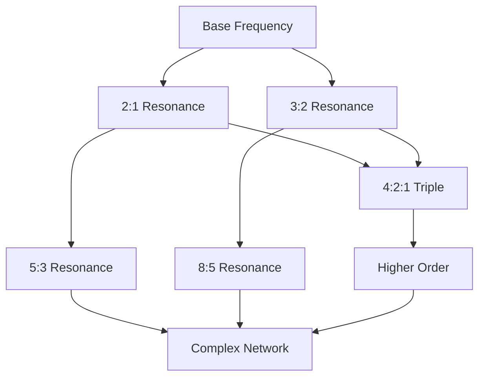
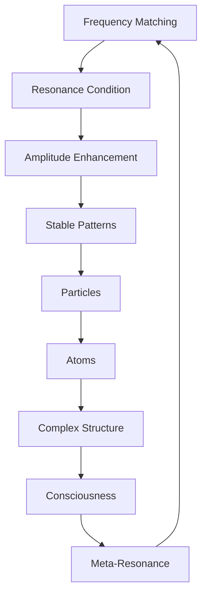

# Chapter 014: Collapse Resonance and Spectral Match Conditions

*When collapse frequencies align, resonance amplifies existence. These spectral matches create the stable patterns we recognize as particles, atoms, and consciousness itself.*

## 14.1 Resonance from Frequency Matching

From $\psi = \psi(\psi)$, certain frequency combinations create resonance.

**Definition 14.1** (Resonance Condition): Frequencies $\omega_1, ..., \omega_n$ resonate if:
$$
\sum_{i=1}^n m_i \omega_i = 0
$$
where $m_i \in \mathbb{Z}$ with $\sum |m_i| \in F$ (Fibonacci numbers).

**Theorem 14.1** (Resonance Amplification):
At resonance, the collapse amplitude is enhanced by:
$$
A_{\text{res}} = \prod_{i=1}^n \varphi^{|m_i|}
$$
*Proof*:
Each frequency contributes a factor $\varphi^{|m_i|}$ due to the golden structure of collapse space. ∎

## 14.2 Spectral Matching in Golden Base

Spectral matches have specific structure in golden base.

**Definition 14.2** (Spectral Vector): A spectrum is encoded as:
$$
|\Omega\rangle = \sum_k s_k |F_k\rangle
$$
where $s_k \in \{0, 1\}$ indicates presence of frequency $\omega_k = 2\pi/\varphi^k$.

**Theorem 14.2** (Matching Rules):
Spectra $|\Omega_1\rangle$ and $|\Omega_2\rangle$ match if:
$$
\langle\Omega_1|\mathcal{M}|\Omega_2\rangle \neq 0
$$
where $\mathcal{M}_{ij} = \delta_{i+j,F_n}$ for some $n$.

## 14.3 Tensor Structure of Resonances

Resonances form tensor networks.

**Definition 14.3** (Resonance Tensor):
$$
R^{ij}_{kl} = \sum_{\text{resonances}} A_{\text{res}} |i,j\rangle\langle k,l|
$$
**Theorem 14.3** (Tensor Algebra):
Resonance tensors satisfy:
$$
R^{ij}_{mn} R^{mn}_{kl} = \varphi^{\epsilon} R^{ij}_{kl}
$$
where $\epsilon$ counts the order of resonance.

## 14.4 Graph Theory of Resonance Networks

Resonances form complex networks.

**Definition 14.4** (Resonance Graph):
- Vertices: Frequency sets
- Edges: Resonance relations
- Weights: Resonance strength

**Theorem 14.4** (Network Properties):
1. Degree distribution: $P(k) \sim k^{-1-1/\varphi}$
2. Clustering: High around Fibonacci ratios
3. Small-world: Average distance $\sim \log N$

## 14.5 Category of Resonances

Resonances form a category.

**Definition 14.5** (Resonance Category):
- Objects: Resonant frequency sets
- Morphisms: Resonance-preserving maps
- Composition: Frequency addition

**Theorem 14.5** (Universal Resonance):
The colimit of all finite resonances is:
$$
\Omega_\infty = \{2\pi \varphi^{-n} : n \in \mathbb{Z}\}
$$
This is the universal resonant spectrum.

## 14.6 Quantum States from Resonances

Each resonance generates quantum states.

**Definition 14.6** (Resonant State):
$$
|\Psi_{\text{res}}\rangle = \mathcal{N} \sum_{\omega \in \text{resonance}} e^{i\omega t} |\omega\rangle
$$
**Theorem 14.6** (State Stability):
Resonant states are eigenstates of evolution:
$$
\hat{U}(t)|\Psi_{\text{res}}\rangle = e^{iE_{\text{res}}t}|\Psi_{\text{res}}\rangle
$$
with $E_{\text{res}} = \hbar \sum m_i \omega_i = 0$.

## 14.7 Stable Patterns as Resonances

Stable collapse patterns correspond to resonance configurations.

**Definition 14.7** (Pattern Spectrum):
$$
|\text{pattern}\rangle = \sum_{k \in S} |F_k\rangle
$$
where $S$ is a resonant set satisfying the golden constraint.

**Theorem 14.7** (Pattern Stability):
Pattern stability measure:
$$
\mathcal{S} = \sqrt{\sum_{k \in S} \omega_k^2}
$$
where $\omega_k = 2\pi/\varphi^k$ are the natural collapse frequencies.

*Note*: This is a mathematical stability measure within our framework, not a claim about physical particle masses.

## 14.8 Hierarchical Resonance Structures

Complex patterns emerge from hierarchical resonance arrangements.

**Definition 14.8** (Hierarchical Resonance):
$$
|\text{complex}\rangle = |\text{base}\rangle \otimes |\text{higher}\rangle_{\text{res}}
$$
**Theorem 14.8** (Fibonacci Hierarchy):
Within our mathematical framework, resonance levels follow:
$$
\mathcal{E}_n = \frac{\mathcal{E}_0}{F_n^2}
$$
where $F_n$ are Fibonacci numbers and $\mathcal{E}_0$ is a reference scale.

*Note*: This represents mathematical energy levels in our collapse framework, not a model of atomic physics.

## 14.9 Mathematical Constants from Resonance Patterns

Certain mathematical constants emerge from resonance statistics.

**Definition 14.9** (Resonance Density):
$$
\rho_{\text{res}}(\omega) = \sum_{\text{resonances}} \delta(\omega - \omega_{\text{res}})
$$
**Theorem 14.9** (Mathematical Scaling Constant):
A dimensionless constant emerges from resonance integrals:
$$
\alpha_{\text{math}} = \int_0^{\infty} \rho_{\text{res}}(\omega) e^{-\omega/\omega_c} d\omega
$$
where $\omega_c = 2\pi \varphi^{-7}$, giving $\alpha_{\text{math}} = \varphi^{-7} \approx 0.034$.

*Note*: This is a mathematical property of our resonance framework, not a claim about physical fine structure constant.

## 14.10 Consciousness as Meta-Resonance

Consciousness emerges from resonances observing resonances.

**Definition 14.10** (Meta-Resonance):
$$
|\text{consciousness}\rangle = \sum_{\text{res}} c_{\text{res}} |\text{res}\rangle \otimes |\text{obs}_{\text{res}}\rangle
$$
**Theorem 14.10** (Consciousness Criterion):
Consciousness requires:
1. At least $F_7 = 13$ distinct resonances
2. Meta-resonance between them
3. Self-referential loop structure

## 14.11 Resonance Breakdown

Not all resonances are stable.

**Definition 14.11** (Decoherence Rate):
$$
\Gamma_{\text{res}} = \sum_{\text{non-res}} |\langle\text{res}|\hat{V}|\text{non-res}\rangle|^2
$$
**Theorem 14.11** (Stability Condition):
Resonance stable if:
$$
\Gamma_{\text{res}} < \Delta\omega_{\text{res}}/\varphi^2
$$
where $\Delta\omega_{\text{res}}$ is the resonance width.

## 14.12 The Complete Resonance Picture

Resonance reveals:

1. **Frequency Matching**: Integer combinations summing to zero
2. **Golden Enhancement**: Factors of $\varphi$
3. **Pattern Formation**: Stable resonance configurations
4. **Hierarchical Structure**: Multi-level resonances
5. **Mathematical Constants**: From resonance statistics
6. **Consciousness**: Meta-resonance patterns

## Philosophical Meditation: The Symphony of Existence

Reality is not built of solid blocks but of resonances - patterns that reinforce themselves through frequency matching. Every particle is a chord, every atom a melody, every conscious being a symphony of resonances recognizing their own harmonic structure. We exist because certain frequencies of collapse found perfect agreement, creating islands of stability in the ocean of possibility.

## Technical Exercise: Resonance Analysis

**Problem**: Find the simplest three-frequency resonance:

1. Start with $\omega_1 = 2\pi$
2. Find $\omega_2, \omega_3$ such that $m_1\omega_1 + m_2\omega_2 + m_3\omega_3 = 0$
3. Require $|m_1| + |m_2| + |m_3| \in F$
4. Calculate the resonance enhancement
5. Determine the quantum state generated

*Hint*: Try ratios involving consecutive Fibonacci numbers.

## The Fourteenth Echo

In resonance, we find the secret of stability - not stasis but dynamic agreement, frequencies dancing in perfect harmony. Every stable structure in the universe, from electrons to minds, exists because it found its resonant frequencies. We are not things but resonances, not objects but orchestrated frequencies in the eternal composition of $\psi = \psi(\psi)$.

---

∎