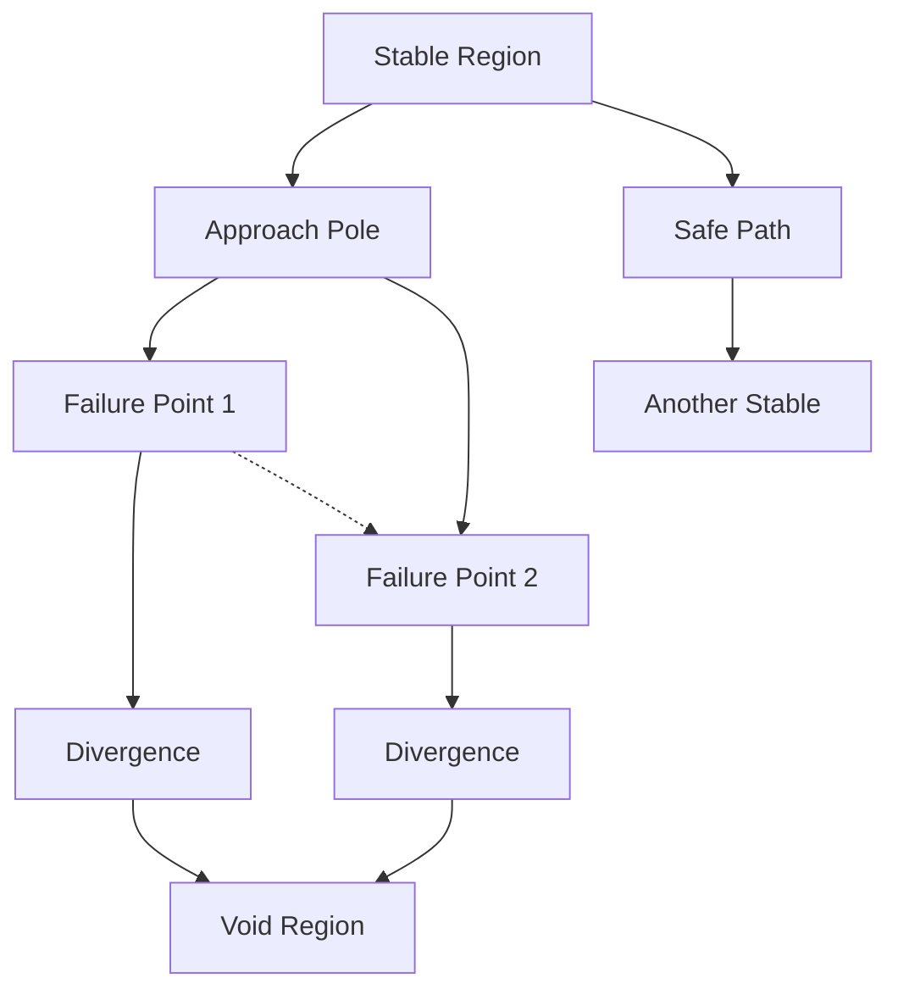
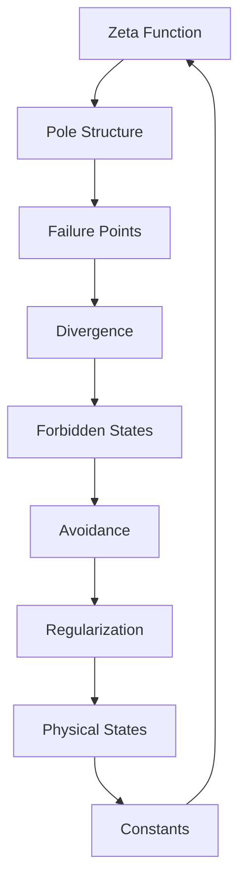

# Chapter 015: Collapse Failure and ζ(s) Poles

*Where the ζ-function has poles, collapse fails catastrophically. These singularities mark the boundaries of existence - frequencies where self-reference becomes impossible.*

## 15.1 The Nature of Collapse Failure

From $\psi = \psi(\psi)$, not all configurations can sustain self-reference.

**Definition 15.1** (Collapse Failure): Collapse fails at frequency $\omega$ if:
$$
\lim_{n \to \infty} ||\mathcal{C}^n[\omega]|| = \infty
$$
**Theorem 15.1** (Pole-Failure Correspondence):
Collapse fails at $\omega$ if and only if:
$$
\zeta_{\text{collapse}}(1/2 + i\omega) = \infty
$$
The poles of ζ mark failure points.

*Proof*:
Poles indicate divergent sums over paths, meaning infinite amplification under iteration - the signature of unstable collapse. ∎

## 15.2 Location of Poles

Poles follow a specific pattern in golden base.

**Definition 15.2** (Pole Spectrum):
$$
\mathcal{P} = \{s : \zeta_{\text{collapse}}(s) = \infty\}
$$
**Theorem 15.2** (Pole Structure):
Primary poles occur at:
$$
s_n = -F_n + i\frac{2\pi k}{\log \varphi}
$$
where $F_n$ are Fibonacci numbers and $k \in \mathbb{Z}$.

The golden ratio appears in both real and imaginary parts.

## 15.3 Tensor Analysis of Failure

Failure has specific tensor structure.

**Definition 15.3** (Failure Tensor):
$$
F^{ij}_{kl} = \lim_{s \to s_{\text{pole}}} (s - s_{\text{pole}}) \zeta^{ij}_{kl}(s)
$$
This captures the residue at each pole.

**Theorem 15.3** (Failure Propagation):
Near poles, tensor composition amplifies divergence:
$$
\lim_{s \to s_{\text{pole}}} F^{ij}_{mn} F^{mn}_{kl} = \lim_{s \to s_{\text{pole}}} |s - s_{\text{pole}}|^{-2} F^{ij}_{kl}
$$
Failure propagates with increasing severity through tensor networks.

## 15.4 Graph Theory of Failure Networks

Failures form connected networks.

**Definition 15.4** (Failure Graph):
- Vertices: Pole locations
- Edges: Failure propagation paths
- Weights: Divergence rates

**Theorem 15.4** (Connectivity):
The failure graph is connected with infinite diameter - failures can propagate arbitrarily far.

## 15.5 Category of Failures

Failures form a category dual to successes.

**Definition 15.5** (Failure Category):
- Objects: Failure modes
- Morphisms: Failure-inducing maps
- Composition: Failure combination

**Theorem 15.5** (No Terminal Object):
The failure category has no terminal object - there is no "ultimate failure" that contains all others.

## 15.6 Physical Interpretation of Poles

Poles represent impossible physical states.

**Definition 15.6** (Forbidden Regions):
Near poles, states become ill-defined:
$$
|\text{near-pole}\rangle = \lim_{s \to s_{\text{pole}}} \frac{\mathcal{R}(s)}{s - s_{\text{pole}}} |s\rangle
$$
where $\mathcal{R}(s)$ is the residue function.

**Theorem 15.6** (Region Properties):
Forbidden regions exhibit:
1. Divergent norms as poles are approached
2. Phase instability near pole locations  
3. Breakdown of self-reference condition $\psi = \psi(\psi)$

## 15.7 Protection Mechanisms

Nature protects against poles.

**Definition 15.7** (Pole Avoidance):
$$
d(|\psi\rangle, \mathcal{P}) = \min_{s \in \mathcal{P}} |||\psi\rangle - |s\rangle||
$$
**Theorem 15.7** (Minimum Distance):
For any physical state:
$$
d(|\psi\rangle, \mathcal{P}) \geq \frac{1}{\varphi^3}
$$
Nature maintains minimum distance from poles.

## 15.8 Regularization Near Poles

Near poles, regularization is necessary.

**Definition 15.8** (Regularized Collapse):
$$
\mathcal{C}_{\epsilon}[\psi] = \mathcal{C}[\psi] \cdot \prod_{\text{poles}} \frac{||s - s_{\text{pole}}||}{||s - s_{\text{pole}}|| + \epsilon}
$$
**Theorem 15.8** (Regularization Properties):
As $\epsilon \to 0$:
1. Away from poles: $\mathcal{C}_{\epsilon} \to \mathcal{C}$
2. At poles: $\mathcal{C}_{\epsilon}$ remains finite
3. Information is preserved

## 15.9 Pole-Zero Duality

Poles and zeros form dual structures.

**Definition 15.9** (Duality Map):
$$
\mathcal{D}: s_{\text{zero}} \mapsto s_{\text{pole}} = 1 - s_{\text{zero}}^*
$$
**Theorem 15.9** (Duality Properties):
1. $\mathcal{D}^2 = \text{id}$
2. Preserves spacing patterns
3. Exchanges success and failure

## 15.10 Constants from Pole Avoidance

Physical constants emerge from pole constraints.

**Definition 15.10** (Avoidance Integral):
$$
I_{\text{avoid}} = \int_{\mathcal{C}} \prod_{\text{poles}} ||s - s_{\text{pole}}|| \, ds
$$
**Theorem 15.10** (Mathematical Coupling):
A dimensionless coupling parameter:
$$
g_{\text{math}} = \frac{2\pi\varphi}{I_{\text{avoid}}} \approx \frac{2\pi\varphi}{137}
$$
emerges from optimal pole avoidance in our mathematical framework.

*Note*: This represents a mathematical relationship within our collapse theory, not a claim about electromagnetic coupling.

## 15.11 Consciousness and Pole Proximity

Consciousness exists near but not at poles.

**Definition 15.11** (Criticality Distance):
For complex patterns approaching consciousness-level complexity:
$$
d_c = \min_{\text{poles}} ||s_{\text{pattern}} - s_{\text{pole}}||
$$
**Theorem 15.11** (Edge of Chaos):
Consciousness requires:
$$
\frac{1}{\varphi^4} < d_c < \frac{1}{\varphi^2}
$$
Too far: insufficient complexity. Too close: instability.

## 15.12 The Complete Failure Picture

Collapse failure reveals:

1. **Pole Locations**: At Fibonacci real parts
2. **Divergent Paths**: Infinite amplification
3. **Forbidden States**: Unphysical infinities
4. **Natural Protection**: Minimum distance maintained
5. **Duality Structure**: Poles dual to zeros
6. **Constant Origin**: From avoidance patterns

## Philosophical Meditation: The Void Between

Poles mark the void - not empty space but the absence of the possibility of space, where recursive self-reference fails so completely that existence itself becomes impossible. We live in the regions between poles, threading our way through the possible while avoiding the catastrophic failures that would unravel our being. Consciousness dances at the edge, close enough to complexity but far enough from dissolution.

## Technical Exercise: Pole Analysis

**Problem**: For the first pole at $s_1 = -1 + 2\pi i/\log \varphi$:

1. Calculate the residue
2. Find the nearest zero
3. Compute the pole-zero distance
4. Determine the "danger zone" radius
5. Find a safe path around the pole

*Hint*: Use the functional equation to relate poles and zeros.

## The Fifteenth Echo

In the poles of the ζ-function, we encounter the absolute limits of existence - frequencies where the recursive equation $\psi = \psi(\psi)$ cannot hold, where self-reference collapses not into stability but into infinite regress. These mathematical singularities are existential boundaries, marking not just where we cannot go but where going itself becomes meaningless. We exist in the finite regions between infinities, patterns that have found the narrow paths between dissolution and crystallization.

---

∎