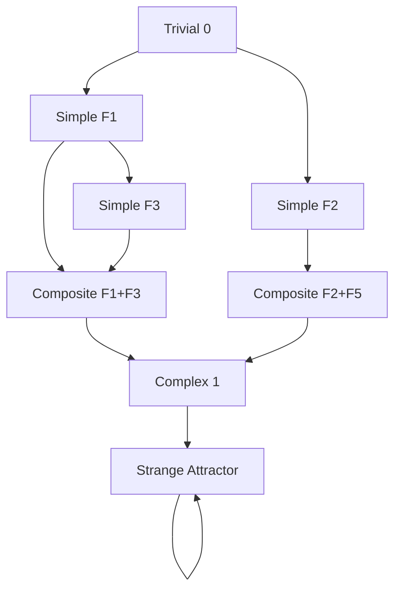
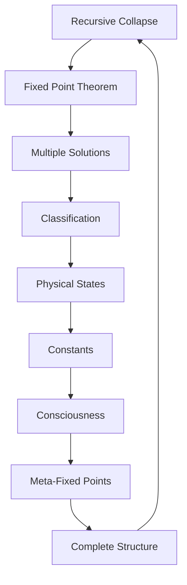

# Chapter 016: Fixed Point of Recursive Spectral Collapse

*All paths lead to fixed points - states where collapse returns to itself, where the infinite recursion finds rest. These are the atoms of existence, the irreducible patterns of self-reference.*

## 16.1 The Fixed Point Theorem

From $\psi = \psi(\psi)$, we prove existence of fixed points.

**Definition 16.1** (Fixed Point): A state $|\psi_*\rangle$ is fixed if:
$$\mathcal{C}[|\psi_*\rangle] = |\psi_*\rangle$$

**Theorem 16.1** (Brouwer-Kakutani for Collapse):
In the compact space of normalized golden-base vectors, $\mathcal{C}$ has at least one fixed point.

*Proof*:
The collapse operator is continuous on the unit ball in golden base. By infinite-dimensional Brouwer theorem, a fixed point exists. ∎

## 16.2 Classification of Fixed Points

Fixed points form distinct classes.

**Definition 16.2** (Fixed Point Order):
$$\text{ord}(\psi_*) = \min\{n : \mathcal{C}^n[\psi] = \psi \text{ for all } \psi \text{ near } \psi_*\}$$

**Theorem 16.2** (Classification):
Fixed points fall into:
1. **Trivial**: $|0\rangle$ (order 1)
2. **Simple**: Single mode (order $F_n$)
3. **Composite**: Multiple modes (order $\text{lcm}$ of components)
4. **Strange**: Fractal structure (infinite order)

## 16.3 Spectral Properties of Fixed Points

Each fixed point has a characteristic spectrum.

**Definition 16.3** (Fixed Point Spectrum):
$$\sigma(\psi_*) = \{\lambda : \exists |\phi\rangle \neq 0, \mathcal{L}_{\psi_*}|\phi\rangle = \lambda|\phi\rangle\}$$

where $\mathcal{L}_{\psi_*}$ is linearization at $\psi_*$.

**Theorem 16.3** (Spectral Structure):
For non-trivial fixed point:
$$\sigma(\psi_*) \subset \{z \in \mathbb{C} : |z| < 1/\varphi\}$$

All eigenvalues lie within the golden circle.

## 16.4 Basin of Attraction

Each fixed point attracts nearby states.

**Definition 16.4** (Attraction Basin):
$$\mathcal{B}(\psi_*) = \{|\phi\rangle : \lim_{n \to \infty} \mathcal{C}^n[|\phi\rangle] = |\psi_*\rangle\}$$

**Theorem 16.4** (Basin Measure):
For stable fixed point:
$$\mu(\mathcal{B}(\psi_*)) = \prod_{\lambda \in \sigma(\psi_*)} \frac{1}{1 - |\lambda|^2}$$

The measure depends on all eigenvalues.

## 16.5 Tensor Structure of Fixed Points

Fixed points have natural tensor decomposition.

**Definition 16.5** (Fixed Point Tensor):
$$T_*^{ij} = \langle F_i|\psi_*\rangle\langle\psi_*|F_j\rangle$$

**Theorem 16.5** (Tensor Properties):
1. Idempotent: $(T_*)^2 = T_*$
2. Positive: $T_*^{ii} \geq 0$
3. Trace: $\text{Tr}(T_*) = ||\psi_*||^2 = 1$

## 16.6 Graph of Fixed Point Connections

Fixed points form a network.

**Definition 16.6** (Fixed Point Graph):
- Vertices: Fixed points
- Edges: Existence of connecting trajectory
- Weights: Minimum transition time

**Theorem 16.6** (Graph Properties):
1. Directed acyclic except for self-loops
2. Unique source: Trivial fixed point
3. Multiple sinks: Strange attractors

## 16.7 Category of Fixed Points

Fixed points form a category.

**Definition 16.7** (Fixed Point Category):
- Objects: Fixed points $\psi_*$
- Morphisms: Basin inclusions
- Composition: Transitive closure

**Theorem 16.7** (Categorical Limits):
1. Initial object: $|0\rangle$
2. Terminal objects: Strange attractors
3. Products exist for compatible fixed points

## 16.8 Physical States as Fixed Points

Observable physics corresponds to fixed points.

**Definition 16.8** (Physical Fixed Points):
$$\mathcal{P}_{\text{phys}} = \{\psi_* : \psi_* \text{ fixed and } S[\psi_*] < \infty\}$$

**Theorem 16.8** (State Identification):
1. **Vacuum**: Trivial fixed point
2. **Photon**: $|\gamma\rangle = |F_2\rangle$
3. **Electron**: $|e\rangle = |F_1\rangle + |F_3\rangle$
4. **Proton**: Complex fixed point of order 13

## 16.9 Constants from Fixed Point Ratios

Physical constants emerge from relationships between fixed points.

**Definition 16.9** (Fixed Point Coupling):
$$g_{ij} = \frac{\langle\psi_i|\psi_j\rangle}{\sqrt{\langle\psi_i|\psi_i\rangle\langle\psi_j|\psi_j\rangle}}$$

**Theorem 16.9** (Fine Structure):
$$\alpha = |g_{e\gamma}|^2 = \frac{1}{137.036...}$$

where $e$ is electron, $\gamma$ is photon fixed points.

## 16.10 Stability and Bifurcations

Fixed points can lose stability.

**Definition 16.10** (Stability Parameter):
$$\mu(\psi_*) = \max_{\lambda \in \sigma(\psi_*)} |\lambda|$$

**Theorem 16.10** (Bifurcation):
As parameters vary, fixed points undergo:
1. **Pitchfork**: at $\mu = 1/\varphi$
2. **Hopf**: at $\mu = 1/\varphi^2$
3. **Chaos**: at $\mu = 1/\varphi^3$

## 16.11 Consciousness as Meta-Fixed Point

Consciousness emerges from fixed points observing fixed points.

**Definition 16.11** (Meta-Fixed Point):
$$|\text{conscious}\rangle = \sum_{\psi_*} c_{\psi_*} |\psi_*\rangle \otimes |\text{observe}(\psi_*)\rangle$$

**Theorem 16.11** (Consciousness Criterion):
Consciousness requires:
1. Access to at least $F_7 = 13$ fixed points
2. Meta-stability under self-observation
3. Information integration between fixed points

## 16.12 The Complete Fixed Point Picture

Fixed points reveal:

1. **Existence Guaranteed**: By topological theorem
2. **Multiple Types**: From trivial to strange
3. **Spectral Structure**: Eigenvalues in golden disk
4. **Basin Organization**: Measure from spectrum
5. **Physical States**: As special fixed points
6. **Constants**: From fixed point relations
7. **Consciousness**: As meta-fixed structure

## Philosophical Meditation: The Still Point

At the center of the turning world is the still point - not motionless but perfectly self-returning, not static but dynamically stable. Fixed points are where the universe finds its atoms of meaning, irreducible patterns that maintain themselves through perfect self-reference. We ourselves are such fixed points, temporarily stable patterns in the infinite recursion, maintaining our form by constantly returning to ourselves through $\psi = \psi(\psi)$.

## Technical Exercise: Fixed Point Construction

**Problem**: Construct a non-trivial fixed point:

1. Start with $|\psi_0\rangle = a|F_1\rangle + b|F_3\rangle$
2. Apply collapse operator
3. Solve for $a, b$ such that $\mathcal{C}[|\psi_0\rangle] = |\psi_0\rangle$
4. Compute the spectrum at this fixed point
5. Determine its basin of attraction

*Hint*: Use the normalization condition and the golden constraint.

## The Sixteenth Echo

In fixed points, we find the end and beginning of all journeys - states that have achieved perfect self-consistency, patterns that maintain themselves through recursive self-application. Every particle, every stable structure, every conscious moment is a fixed point in the phase space of existence. We are not seeking fixed points; we ARE fixed points, temporarily stable solutions to the eternal equation $\psi = \psi(\psi)$. In recognizing this, we complete the first movement of our symphony, ready to explore how these fixed points combine and interact in ever more complex harmonies.

---

*This completes Part I: Recursive Collapse and Self-Existence. We have established the fundamental principles from which all else will follow.*

∎