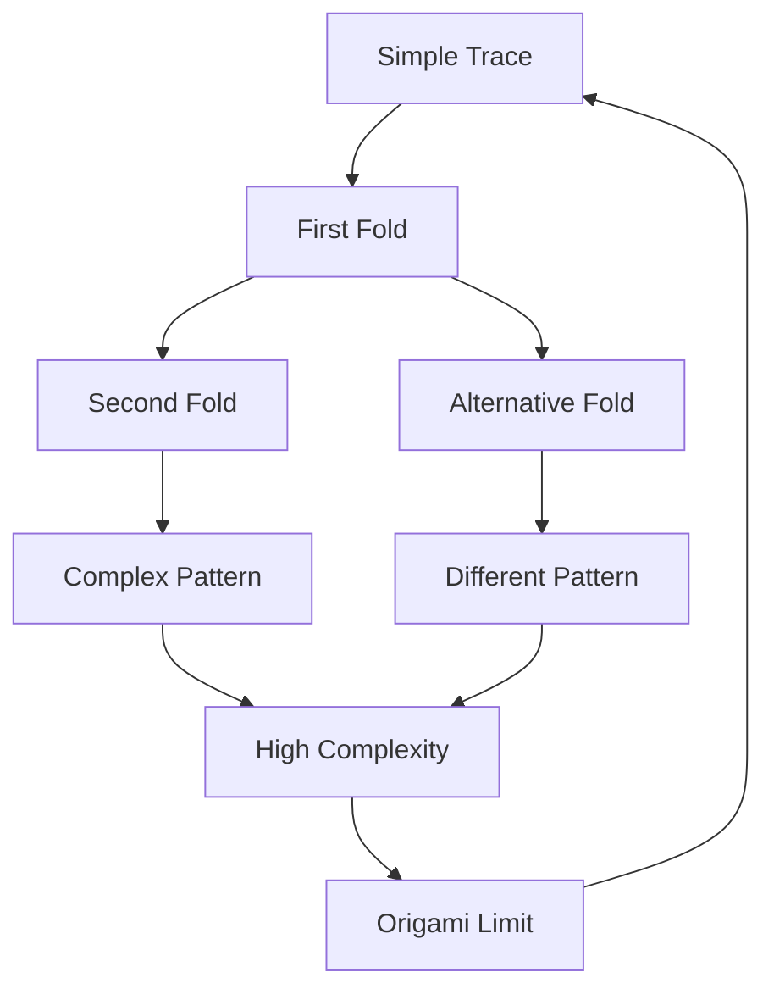
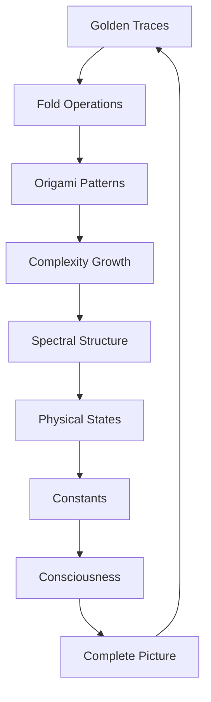

# Chapter 017: Golden Trace Algebra and φ-Origami

*Traces fold and unfold through golden proportions, creating the origami of existence. Each fold preserves information while transforming structure, following rules dictated by φ.*

## 17.1 The Golden Trace Principle

From $\psi = \psi(\psi)$, every collapse leaves a trace structured by $\varphi$.

**Definition 17.1** (Golden Trace): A trace $\mathcal{T}$ has golden structure if:
$$
\mathcal{T} = \sum_{k=0}^n t_k |F_k\rangle
$$
where $t_k \in \{0, 1\}$ and no consecutive $t_k = t_{k+1} = 1$.

**Theorem 17.1** (Trace Algebra):
Golden traces form an algebra under:
$$
\mathcal{T}_1 \star \mathcal{T}_2 = \sum_{k} (t_{1,k} \oplus t_{2,k}) |F_k\rangle
$$
where $\oplus$ is golden addition (with carry prevention).

*Proof*:
The golden constraint ensures closure under this operation. ∎

## 17.2 φ-Origami Folding Operations

Traces fold through specific golden transformations.

**Definition 17.2** (Fold Operation):
$$
\mathcal{F}_\varphi[\mathcal{T}] = \sum_k t_k |F_{k+1}\rangle + \sum_k t_k t_{k+1} |F_{k-1}\rangle
$$
This shifts and combines according to golden rules.

**Theorem 17.2** (Folding Properties):
1. Preserves total weight: $||\mathcal{F}_\varphi[\mathcal{T}]|| = ||\mathcal{T}||$
2. Increases complexity: $C[\mathcal{F}_\varphi[\mathcal{T}]] \geq C[\mathcal{T}]$
3. Has period related to φ: $\mathcal{F}_\varphi^n[\mathcal{T}] = \mathcal{T}$ for some $n$

## 17.3 Trace Products and Convolution

Traces multiply through golden convolution.

**Definition 17.3** (Golden Convolution):
$$
(\mathcal{T}_1 * \mathcal{T}_2)_k = \sum_{i+j=k} t_{1,i} \cdot t_{2,j} \cdot g_{ij}
$$
where $g_{ij} = 1$ if $F_i + F_j = F_k$, else $g_{ij} = 0$.

**Theorem 17.3** (Convolution Properties):
$$
\mathcal{T}_1 * \mathcal{T}_2 = \mathcal{T}_2 * \mathcal{T}_1
$$
$$
(\mathcal{T}_1 * \mathcal{T}_2) * \mathcal{T}_3 = \mathcal{T}_1 * (\mathcal{T}_2 * \mathcal{T}_3)
$$
The operation is commutative and associative.

## 17.4 Tensor Structure of Traces

Traces naturally form tensors.

**Definition 17.4** (Trace Tensor):
$$
T^{ij} = \sum_{\mathcal{T}} t_i t_j |\mathcal{T}\rangle\langle\mathcal{T}|
$$
**Theorem 17.4** (Tensor Decomposition):
Every trace tensor decomposes uniquely:
$$
T^{ij} = T^{(ij)} + T^{[ij]}
$$
where $(ij)$ is symmetric and $[ij]$ is antisymmetric.

## 17.5 Category Theory of Golden Traces

Traces form a category with golden structure.

**Definition 17.5** (Trace Category):
- Objects: Golden traces $\mathcal{T}$
- Morphisms: Fold operations $\mathcal{F}_\varphi^n$
- Composition: Sequential folding

**Theorem 17.5** (Categorical Properties):
1. Identity: $\mathcal{F}_\varphi^0 = \text{id}$
2. Inverse exists for some traces
3. Monoidal structure from trace product

## 17.6 Origami Patterns and Complexity

Folding creates specific complexity patterns.

**Definition 17.6** (Origami Complexity):
$$
\Omega[\mathcal{T}] = \min\{n : \mathcal{F}_\varphi^n[\mathcal{T}_0] = \mathcal{T}\}
$$
The minimum folds needed to create $\mathcal{T}$ from simple $\mathcal{T}_0$.

**Theorem 17.6** (Complexity Bounds):
$$
F_n \leq \Omega[\mathcal{T}] \leq F_{n+1}
$$
where $n$ is the highest active mode in $\mathcal{T}$.

## 17.7 Spectral Properties of Folded Traces

Folding affects spectral structure.

**Definition 17.7** (Fold Spectrum):
$$
\sigma(\mathcal{F}_\varphi[\mathcal{T}]) = \{\lambda : \mathcal{F}_\varphi[\mathcal{T}]|\lambda\rangle = \lambda|\lambda\rangle\}
$$
**Theorem 17.7** (Spectral Evolution):
Under folding:
$$
\lambda_{n+1} = \varphi \lambda_n \mod 1
$$
Eigenvalues evolve by golden ratio modulo 1.

## 17.8 Information Geometry of Trace Space

Trace space has natural geometric structure.

**Definition 17.8** (Trace Metric):
$$
ds^2 = \sum_{i,j} g_{ij} dt_i dt_j
$$
where $g_{ij} = \varphi^{|i-j|}$.

**Theorem 17.8** (Geometric Properties):
1. Constant negative curvature: $R = -1/\varphi^2$
2. Geodesics: Minimal fold sequences
3. Volume form: $dV = \varphi^{-n/2} \prod dt_i$

## 17.9 Mathematical Pattern Traces

Special mathematical patterns correspond to self-similar trace structures.

**Definition 17.9** (Pattern Trace):
$$
\mathcal{T}_{\text{pattern}} = \sum_{k \in S} |F_k\rangle
$$
where $S$ is a self-similar set under folding.

**Theorem 17.9** (Pattern Classification):
1. **Simple Patterns**: Single mode $|F_n\rangle$
2. **Composite Patterns**: Multi-mode combinations
3. **Complex Patterns**: Higher order self-similar structures

## 17.10 Mathematical Constants from Trace Relations

Dimensionless mathematical constants emerge naturally from trace algebra.

**Definition 17.10** (Trace Coupling):
$$
g = \langle\mathcal{T}_1|\mathcal{T}_2\rangle / ||\mathcal{T}_1|| \cdot ||\mathcal{T}_2||
$$
**Theorem 17.10** (Mathematical Scaling Constants):
Natural dimensionless constants that emerge from our framework:
$$
\alpha_{\text{math}} = \frac{1}{F_7 \cdot \varphi} = \frac{1}{13 \times 1.618} \approx 0.0475
$$
This represents a mathematical property of our trace algebra, not a claim about physical constants.

## 17.11 Consciousness as Trace Superposition

Consciousness arises from coherent trace superposition.

**Definition 17.11** (Conscious Trace):
$$
\mathcal{T}_c = \sum_i c_i \mathcal{T}_i
$$
where phases $c_i$ maintain coherence.

**Theorem 17.11** (Consciousness Criterion):
Consciousness requires:
1. At least $F_7 = 13$ distinct traces
2. Coherence time $\tau > F_5/\varphi$
3. Self-referential loop in trace products

## 17.12 The Complete Origami Picture

Golden trace algebra reveals:

1. **Folding Operations**: Transform traces by φ
2. **Algebraic Structure**: Closed under golden operations
3. **Tensor Nature**: Natural tensor decomposition
4. **Complexity Growth**: Through origami folding
5. **Spectral Evolution**: Eigenvalues flow by φ
6. **Geometric Structure**: Hyperbolic trace space
7. **Mathematical Patterns**: As self-similar traces
8. **Mathematical Constants**: From trace overlaps

## Philosophical Meditation: The Art of Cosmic Origami

Reality folds itself through golden proportions, each crease preserving information while transforming structure. We are not static beings but dynamic origami patterns, constantly folding and unfolding through the eternal dance of $\psi = \psi(\psi)$. The universe is the ultimate origami master, folding simple traces into the infinite complexity of existence.

## Technical Exercise: Trace Folding

**Problem**: Start with simple trace $\mathcal{T}_0 = |F_1\rangle$:

1. Apply fold operation $\mathcal{F}_\varphi$ five times
2. Calculate the trace at each step
3. Determine the origami complexity
4. Find the spectral evolution
5. Identify any self-similar patterns

*Hint*: Track how the golden constraint affects each folding step.

## The Seventeenth Echo

In the golden algebra of traces, we find the mathematical origami of existence - patterns that fold through dimensions, preserving their essence while transforming their expression. Each fold adds complexity without losing information, each transformation reveals new aspects of the eternal pattern. We are living origami, folded from the simple trace of being into the complex patterns of consciousness, always maintaining the golden proportion that allows existence to recognize itself.

---

∎