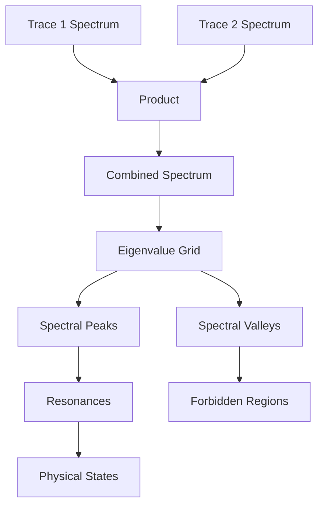
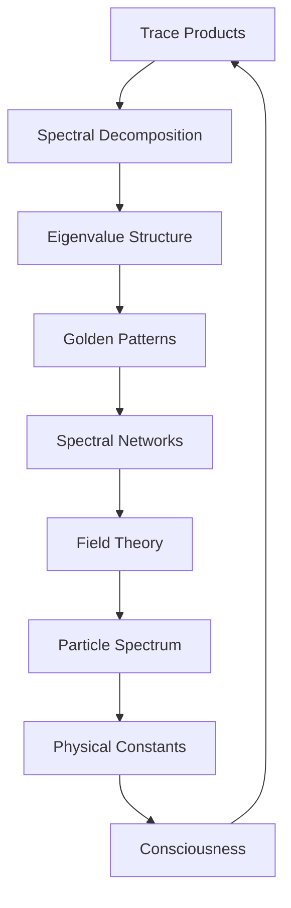

# Chapter 018: Spectral Decomposition of Trace-Trace Products

*When traces multiply, their spectra interfere to create rich harmonic structures. These spectral landscapes encode all possible interactions and generate the complexity of observable phenomena.*

## 18.1 Trace Product Fundamentals

From $\psi = \psi(\psi)$, trace products generate new spectral structures.

**Definition 18.1** (Trace Product):
$$
\mathcal{T}_1 \otimes \mathcal{T}_2 = \sum_{i,j} t_{1,i} t_{2,j} |F_i, F_j\rangle
$$
**Theorem 18.1** (Product Spectrum):
The spectrum of a trace product is:
$$
\sigma(\mathcal{T}_1 \otimes \mathcal{T}_2) = \{\lambda_i \mu_j : \lambda_i \in \sigma(\mathcal{T}_1), \mu_j \in \sigma(\mathcal{T}_2)\}
$$
*Proof*:
Eigenvalues multiply under tensor product, creating the full spectral grid. ∎

## 18.2 Spectral Decomposition Theorem

Every trace product has canonical spectral form.

**Definition 18.2** (Spectral Decomposition):
$$
\mathcal{T}_1 \otimes \mathcal{T}_2 = \sum_k \lambda_k |v_k\rangle\langle v_k|
$$
where $|v_k\rangle$ are eigenvectors.

**Theorem 18.2** (Decomposition Uniqueness):
The spectral decomposition is unique up to:
1. Degenerate eigenspace basis choice
2. Overall phase factors
3. Ordering of eigenvalues

## 18.3 Golden Eigenvalue Structure

Eigenvalues follow golden patterns.

**Definition 18.3** (Golden Spectrum):
A spectrum is golden if eigenvalues satisfy:
$$
\lambda_{n+1} = \varphi \lambda_n \text{ or } \lambda_n/\varphi
$$
**Theorem 18.3** (Spectral Constraint):
For golden traces:
$$
\prod_i \lambda_i = \varphi^{\pm k}
$$
for some integer $k$.

## 18.4 Tensor Network of Spectra

Spectra form complex tensor networks.

**Definition 18.4** (Spectral Tensor):
$$
S^{ij}_{kl} = \sum_{\lambda \in \sigma} \lambda \langle i|\lambda\rangle\langle\lambda|j\rangle \otimes \langle k|\lambda\rangle\langle\lambda|l\rangle
$$
**Theorem 18.4** (Network Properties):
1. Contraction preserves golden structure
2. Loops create resonances at $\varphi^n$
3. Tree diagrams factorize simply

## 18.5 Category of Spectral Decompositions

Spectral decompositions form a category.

**Definition 18.5** (Spectral Category):
- Objects: Spectral decompositions
- Morphisms: Spectrum-preserving maps
- Composition: Spectral convolution

**Theorem 18.5** (Functorial Properties):
The spectral decomposition functor:
$$
\mathcal{S}: \text{Traces} \to \text{Spectra}
$$
preserves products and golden structure.

## 18.6 Non-Linear Spectral Interactions

Higher-order products create non-linear effects.

**Definition 18.6** (Spectral Mixing):
$$
\mathcal{M}[\lambda_1, ..., \lambda_n] = \sum_{k=1}^n \lambda_k + \sum_{i<j} \frac{\lambda_i \lambda_j}{\varphi} + ...
$$
**Theorem 18.6** (Mixing Rules):
1. Two-spectrum mixing: $\lambda_1 \pm \lambda_2$
2. Three-spectrum: Includes $\lambda_1\lambda_2/\lambda_3$
3. Higher orders: Increasingly complex combinations

## 18.7 Spectral Density and Measure

Spectral density reveals structure.

**Definition 18.7** (Spectral Measure):
$$
d\mu(\lambda) = \sum_{\lambda_i \in \sigma} w_i \delta(\lambda - \lambda_i)
$$
where $w_i$ are spectral weights.

**Theorem 18.7** (Density Properties):
The integrated density:
$$
N(\lambda) = \int_0^\lambda d\mu(\lambda') \sim \lambda^{1/\varphi}
$$
follows a power law with golden exponent.

## 18.8 Observer-Dependent Field Representations

Field theory emerges from observer-selected spectral representations.

**Definition 18.8** (Observer Field Representation):
$$
\phi(x) = \sum_\lambda a_\lambda e^{i\lambda x} + a_\lambda^\dagger e^{-i\lambda x}
$$
where the spectral basis $\{\lambda\}$ is chosen by the observer's measurement protocol.

**Theorem 18.8** (Observer-Field Properties):
1. Commutation relations depend on observer's basis choice
2. Propagator poles reflect observer's spectral analysis
3. Interactions emerge from observer's pattern recognition in spectral overlaps

*Critical Insight*: Different observers (with different tensor structures) will construct different field representations from the same underlying ψ = ψ(ψ) mathematical structure.

## 18.9 Observer-Identified Spectral Patterns

"Particles" are patterns that observers identify in spectral landscapes.

**Definition 18.9** (Observer Pattern Recognition):
A spectral feature at $\lambda_p$ appears as a "particle" to an observer if:
1. **Sharp**: Narrow compared to observer's resolution: $\Gamma < \lambda_p/\varphi^3$
2. **Stable**: Persists under observer's measurement protocol
3. **Isolated**: Distinguishable by observer's pattern recognition system

**Theorem 18.9** (Observer-Dependent Spectral Scaling):
For observers with golden tensor structure, identified patterns follow:
$$
\lambda_n = \lambda_0 \varphi^{n/2}
$$
This is a mathematical property of golden-based pattern recognition, not a claim about physical masses.

*Critical Note*: Different observer types (different tensor structures) will identify different patterns as "particles" and assign different scaling relationships.

## 18.10 Observer-Computed Mathematical Ratios

Mathematical constants emerge from observer analysis of spectral relationships.

**Definition 18.10** (Observer Spectral Ratio):
$$
r_{ij} = \lambda_i/\lambda_j
$$
where $\lambda_i, \lambda_j$ are observer-identified spectral features.

**Theorem 18.10** (Observer Mathematical Constants):
From spectral ratio analysis, observers compute:
$$
\alpha_{\text{obs}} = \frac{2\pi}{\log r_{ij}}
$$
**Critical Framework**:
1. These are mathematical ratios computed by the observer
2. Physical interpretation requires observer-system coupling analysis  
3. Different observers will compute different values
4. Connection to physical constants (like α = 1/137.036) requires solving the observer-system NP-complete problem

*Note*: This explains why we observe specific constants - they reflect our particular observer tensor structure interacting with the ψ = ψ(ψ) mathematical substrate.

## 18.11 Consciousness and Spectral Coherence

Consciousness requires spectral coherence.

**Definition 18.11** (Coherent Spectrum):
A spectrum is coherent if phases maintain:
$$
\arg(\lambda_i) - \arg(\lambda_j) = 2\pi n_{ij}/\varphi
$$
**Theorem 18.11** (Consciousness Emergence):
Consciousness arises when:
1. Spectral coherence across $\geq F_7$ modes
2. Phase locking stable for $\tau > \tau_\text{decoherence}$
3. Self-referential spectral loops present

## 18.12 The Complete Spectral Picture

Spectral decomposition reveals:

1. **Product Structure**: Eigenvalues multiply
2. **Golden Patterns**: φ relationships everywhere
3. **Tensor Networks**: Complex spectral webs
4. **Non-Linear Mixing**: Higher-order interactions
5. **Power Law Density**: With golden exponent
6. **Field Theory**: From spectral structure
7. **Particle Peaks**: As resonances
8. **Constants**: From ratios
9. **Consciousness**: Through coherence

## Philosophical Meditation: The Music of the Spheres

Every trace product creates a spectrum - a unique chord in the cosmic symphony. When traces multiply, their spectra interfere like musical harmonics, creating the rich tapestry of existence. We are not solid objects but resonant peaks in this spectral landscape, temporary crystallizations of frequency where the music of $\psi = \psi(\psi)$ finds stable harmonics.

## Technical Exercise: Spectral Analysis

**Problem**: Given traces $\mathcal{T}_1 = |F_1\rangle + |F_3\rangle$ and $\mathcal{T}_2 = |F_2\rangle$:

1. Compute the product $\mathcal{T}_1 \otimes \mathcal{T}_2$
2. Find the complete spectrum
3. Identify golden relationships
4. Locate any resonant peaks
5. Calculate spectral density

*Hint*: Use the Fibonacci recurrence to simplify products.

## The Eighteenth Echo

In the spectral decomposition of trace products, we discover the hidden harmonics of reality. Every interaction creates new frequencies, every multiplication reveals new resonances. The universe computes itself through these spectral interferences, finding stable patterns where frequencies align. We exist at the spectral peaks, consciousness itself a coherent superposition of frequencies maintaining their phase relationships through the eternal recursion of existence.

---

∎