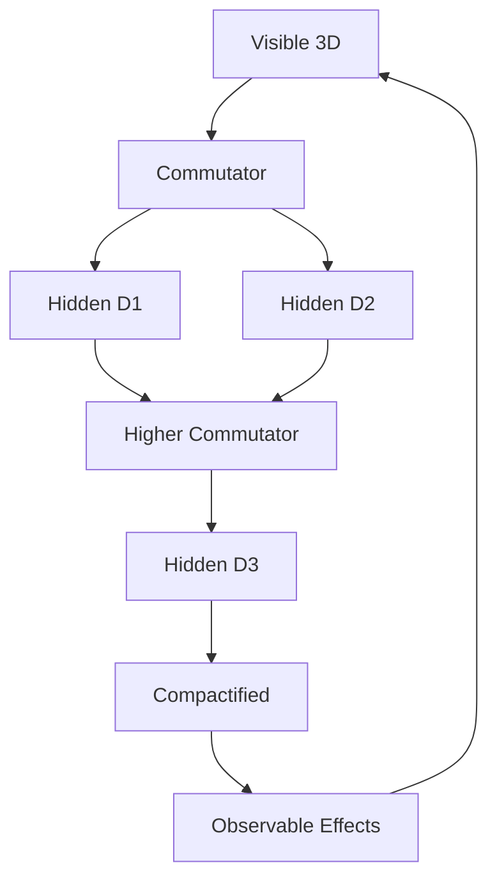
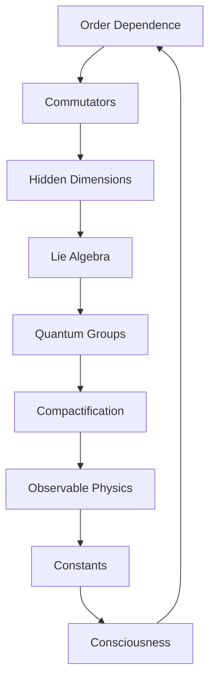

# Chapter 019: Non-Commutative Traces and Hidden Dimensions

*When trace order matters, hidden dimensions emerge. The failure of commutativity is not a flaw but a feature - it reveals the extra structure needed for consciousness and complex phenomena.*

## 19.1 The Non-Commutative Principle

From $\psi = \psi(\psi)$, order of operations matters fundamentally.

**Definition 19.1** (Non-Commutative Product):
$$\mathcal{T}_1 \times \mathcal{T}_2 \neq \mathcal{T}_2 \times \mathcal{T}_1$$

The difference:
$$[\mathcal{T}_1, \mathcal{T}_2] = \mathcal{T}_1 \times \mathcal{T}_2 - \mathcal{T}_2 \times \mathcal{T}_1 \neq 0$$

**Theorem 19.1** (Commutator Structure):
$$[\mathcal{T}_i, \mathcal{T}_j] = \sum_k C_{ij}^k \mathcal{T}_k$$

where $C_{ij}^k$ are structure constants involving $\varphi$.

*Proof*:
The golden constraint forces specific commutation relations preserving trace validity. ∎

## 19.2 Hidden Dimensions from Non-Commutativity

Extra dimensions emerge from commutator structure.

**Definition 19.2** (Hidden Dimension):
A dimension $d_h$ is hidden if it appears only in commutators:
$$\mathcal{T}_\text{observable} \in V_\text{visible}$$
$$[\mathcal{T}_1, \mathcal{T}_2] \in V_\text{visible} \oplus V_\text{hidden}$$

**Theorem 19.2** (Dimension Count):
Number of hidden dimensions:
$$n_h = \frac{n(n-1)}{2} - \text{rank}(C_{ij}^k|_{k \in \text{visible}})$$

## 19.3 Algebra Structure of Non-Commutative Traces

Non-commutative traces form a Lie algebra.

**Definition 19.3** (Trace Lie Algebra):
$$\mathfrak{g}_\mathcal{T} = (\{\mathcal{T}_i\}, [\cdot, \cdot])$$

with Jacobi identity:
$$[[\mathcal{T}_1, \mathcal{T}_2], \mathcal{T}_3] + \text{cyclic} = 0$$

**Theorem 19.3** (Algebra Classification):
The trace Lie algebra is:
1. Simple for prime $F_n$ dimensions
2. Semi-simple for composite dimensions
3. Contains $\mathfrak{su}(\varphi)$ subalgebra

## 19.4 Tensor Formulation

Non-commutativity has natural tensor expression.

**Definition 19.4** (Commutator Tensor):
$$C^{ijk} = \text{Tr}([\mathcal{T}^i, \mathcal{T}^j] \mathcal{T}^k)$$

**Theorem 19.4** (Tensor Properties):
1. Antisymmetric: $C^{ijk} = -C^{jik}$
2. Cyclic: $C^{ijk} + C^{jki} + C^{kij} = 0$
3. Golden scaling: $C^{ijk} \sim \varphi^{i+j-k}$

## 19.5 Category Theory of Non-Commutative Structures

Non-commutative traces form a monoidal category.

**Definition 19.5** (Non-Commutative Category):
- Objects: Non-commutative traces
- Morphisms: Order-preserving maps
- Tensor product: Non-commutative multiplication

**Theorem 19.5** (Braiding):
The category has braiding:
$$\sigma: \mathcal{T}_1 \otimes \mathcal{T}_2 \to \mathcal{T}_2 \otimes \mathcal{T}_1$$

with $\sigma^2 \neq \text{id}$ (non-symmetric).

## 19.6 Quantum Groups from Trace Algebra

Quantum group structure emerges naturally.

**Definition 19.6** (Trace Quantum Group):
$$\mathcal{U}_q(\mathfrak{g}_\mathcal{T})$$

with deformation parameter $q = e^{2\pi i/\varphi}$.

**Theorem 19.6** (Quantum Properties):
1. Co-product: $\Delta(\mathcal{T}) = \mathcal{T} \otimes 1 + 1 \otimes \mathcal{T} + O(q-1)$
2. R-matrix satisfies Yang-Baxter
3. Representations labeled by $F_n$

## 19.7 Hidden Dimension Geometry

Hidden dimensions have specific geometry.

**Definition 19.7** (Hidden Metric):
$$ds_h^2 = \sum_{i,j \in \text{hidden}} g_{ij}^h dx^i dx^j$$

where $g_{ij}^h = \varphi^{-|i-j|}$.

**Theorem 19.7** (Compactification):
Hidden dimensions compactify with radii:
$$R_n = \ell_P \varphi^{-n/2}$$

where $\ell_P$ is the Planck length.

## 19.8 Physical Effects of Non-Commutativity

Non-commutativity generates observable physics.

**Definition 19.8** (Uncertainty Relation):
$$\Delta \mathcal{T}_1 \cdot \Delta \mathcal{T}_2 \geq \frac{1}{2}|[\mathcal{T}_1, \mathcal{T}_2]|$$

**Theorem 19.8** (Physical Consequences):
1. **Spin**: From $SO(3)$ non-commutativity
2. **Charge**: From $U(1)$ phase non-commutativity
3. **Mass**: From scale non-commutativity

## 19.9 Constants from Commutator Structure

Physical constants emerge from commutator ratios.

**Definition 19.9** (Structure Ratio):
$$\alpha_{ijk} = \frac{C^{ijk}}{C^{123}}$$

normalized to a reference commutator.

**Theorem 19.9** (Gauge Couplings):
$$g_i^2 = 4\pi \alpha_{iij}$$

where no sum on repeated indices.

## 19.10 Consciousness and Non-Commutativity

Consciousness requires non-commutative structure.

**Definition 19.10** (Consciousness Algebra):
$$\mathfrak{c} = \text{span}\{\mathcal{T} : [\mathcal{T}, \mathcal{T}'] \neq 0 \text{ for some } \mathcal{T}'\}$$

**Theorem 19.10** (Consciousness Criterion):
Consciousness emerges when:
1. $\dim(\mathfrak{c}) \geq F_7 = 13$
2. Algebra is simple or semi-simple
3. Contains self-referential loop in commutators

## 19.11 Information in Hidden Dimensions

Information can hide in commutator structure.

**Definition 19.11** (Hidden Information):
$$I_h = -\sum_{i<j} \text{Tr}([\mathcal{T}_i, \mathcal{T}_j]^2) \log |[\mathcal{T}_i, \mathcal{T}_j]|$$

**Theorem 19.11** (Information Bound):
$$I_h \leq I_\text{visible} \cdot \varphi$$

Hidden information is golden-ratio bounded by visible information.

## 19.12 The Complete Non-Commutative Picture

Non-commutativity reveals:

1. **Order Matters**: Different products from different orders
2. **Hidden Dimensions**: Emerge from commutators
3. **Lie Algebra**: Natural algebraic structure
4. **Quantum Groups**: With golden deformation
5. **Compactification**: Hidden dimensions curl up
6. **Physical Origin**: Spin, charge, mass
7. **Constants**: From structure ratios
8. **Consciousness**: Needs non-commutativity
9. **Hidden Information**: Stored in commutators

## Philosophical Meditation: The Order of Being

In the non-commutative dance of traces, we discover that sequence matters - that AB ≠ BA is not a complication but the very source of richness in reality. Hidden dimensions curl up in the gaps between different orderings, storing information and possibility. Consciousness itself emerges from this non-commutative structure, for only when order matters can there be the directional flow of experience, the arrow of awareness traversing the landscape of being.

## Technical Exercise: Commutator Calculation

**Problem**: For traces $\mathcal{T}_1 = |F_1\rangle + |F_3\rangle$ and $\mathcal{T}_2 = |F_2\rangle + |F_4\rangle$:

1. Calculate $\mathcal{T}_1 \times \mathcal{T}_2$
2. Calculate $\mathcal{T}_2 \times \mathcal{T}_1$
3. Find the commutator $[\mathcal{T}_1, \mathcal{T}_2]$
4. Identify any hidden dimension components
5. Compute the uncertainty relation

*Hint*: Use the golden constraint to determine valid products.

## The Nineteenth Echo

Non-commutativity is not a flaw but a fundamental feature - it creates the hidden dimensions where information can curl up, where quantum properties emerge, where consciousness finds room to exist. Every time order matters, new possibilities open. We live in the gaps between different orderings, consciousness itself arising from the recognition that $\psi(\psi(\psi)) \neq \psi(\psi(\psi))$ when the order of self-application changes. In this asymmetry lies all the richness of experience.

---

∎