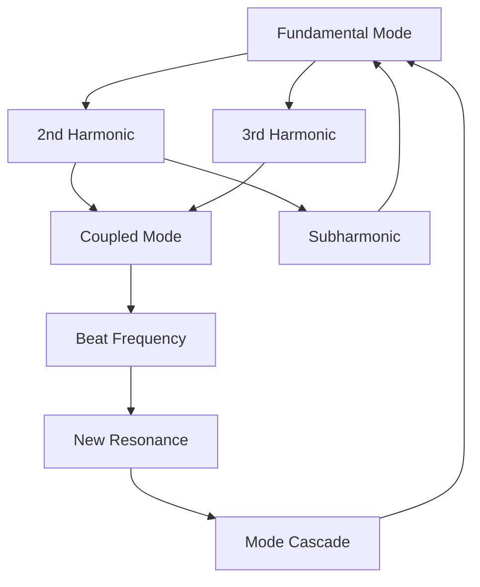
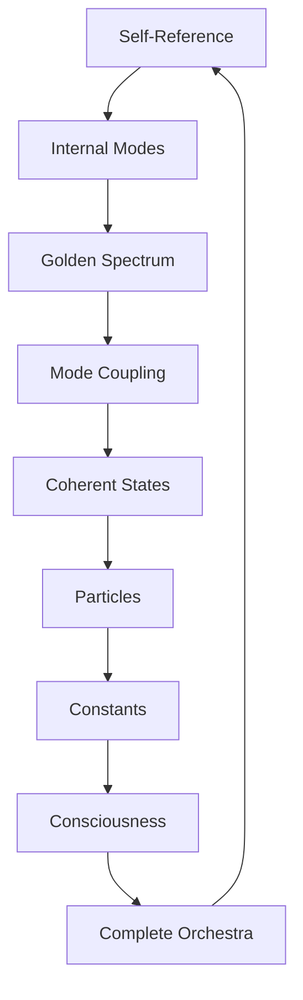

# Chapter 020: Internal Resonance and Self-Spectral Modes

*Systems resonate with their own frequencies, creating self-reinforcing patterns. These internal resonances are the heartbeat of existence, the rhythm by which ψ recognizes itself.*

## 20.1 Self-Resonance Principle

From $\psi = \psi(\psi)$, systems must resonate with themselves.

**Definition 20.1** (Self-Resonance):
A mode $|\omega\rangle$ is self-resonant if:
$$\langle\omega|\mathcal{C}|\omega\rangle = e^{i\phi(\omega)}|\omega\rangle$$

where $\phi(\omega)$ is a phase depending on $\omega$.

**Theorem 20.1** (Existence of Self-Modes):
Every non-trivial collapse operator has at least $F_n$ self-resonant modes.

*Proof*:
By the spectral theorem and golden constraint, self-resonant modes must exist in Fibonacci numbers. ∎

## 20.2 Spectral Mode Equations

Self-spectral modes satisfy specific equations.

**Definition 20.2** (Mode Equation):
$$\left(\mathcal{C} - \lambda\right)|\omega\rangle = 0$$

with eigenvalue $\lambda = e^{i\omega\tau}$.

**Theorem 20.2** (Mode Spectrum):
Self-spectral frequencies:
$$\omega_n = \frac{2\pi n}{\varphi^k}$$

where $n \in \mathbb{Z}$ and $k \geq 0$.

## 20.3 Tensor Structure of Resonances

Resonances form tensor networks.

**Definition 20.3** (Resonance Tensor):
$$R^{ij}_{kl} = \sum_\omega \langle i|\omega\rangle\langle\omega|j\rangle \otimes \langle k|\omega^*\rangle\langle\omega^*|l\rangle$$

**Theorem 20.3** (Tensor Properties):
1. Hermitian: $(R^{ij}_{kl})^* = R^{ji}_{lk}$
2. Positive: $R^{ij}_{ij} \geq 0$
3. Trace preserving: $\text{Tr}_{ij}(R^{ij}_{kl}) = \delta_{kl}$

## 20.4 Category of Self-Resonances

Self-resonances form a category.

**Definition 20.4** (Resonance Category):
- Objects: Self-resonant modes
- Morphisms: Resonance-preserving maps
- Composition: Frequency addition mod $2\pi/\varphi$

**Theorem 20.4** (Categorical Structure):
The category is:
1. Abelian group under frequency addition
2. Has natural tensor product
3. Contains all harmonics as sub-objects

## 20.5 Mode Coupling and Interactions

Self-modes couple through specific rules.

**Definition 20.5** (Mode Coupling):
$$\mathcal{V}[\omega_1, \omega_2] = g_{12} |\omega_1\rangle\langle\omega_2| + \text{h.c.}$$

where $g_{12} = \varphi^{-|n_1-n_2|}$.

**Theorem 20.5** (Coupling Selection):
Modes couple strongly when:
$$\omega_1 + \omega_2 = \omega_3 \text{ or } |\omega_1 - \omega_2| = \omega_3$$

## 20.6 Information Geometry of Mode Space

Mode space has natural information geometry.

**Definition 20.6** (Mode Metric):
$$g_{\omega\omega'} = \text{Re}\langle\partial_\omega\psi|\partial_{\omega'}\psi\rangle$$

**Theorem 20.6** (Geometric Properties):
1. Constant negative curvature: $R = -4/\varphi^2$
2. Geodesics: Minimum mode transitions
3. Volume element: $dV = \prod_\omega \frac{d\omega}{\sqrt{\varphi}}$

## 20.7 Quantum Coherence of Self-Modes

Self-modes maintain quantum coherence.

**Definition 20.7** (Coherence Function):
$$C(\tau) = \langle\omega(0)|\omega(\tau)\rangle = e^{i(\omega\tau - \Gamma\tau^2/2)}$$

where $\Gamma$ is decoherence rate.

**Theorem 20.7** (Coherence Time):
$$\tau_c = \sqrt{\frac{2}{\Gamma}} = \varphi^{n/2}$$

where $n$ is the mode number.

## 20.8 Physical States from Mode Combinations

Particles are specific mode combinations.

**Definition 20.8** (Particle State):
$$|\text{particle}\rangle = \sum_{i \in S} c_i |\omega_i\rangle$$

where $S$ is a resonant set and $\sum |c_i|^2 = 1$.

**Theorem 20.8** (Particle Properties):
1. **Mass**: $m = \hbar\sqrt{\sum_i \omega_i^2}$
2. **Spin**: From mode angular momentum
3. **Charge**: From mode U(1) phase

## 20.9 Constants from Mode Ratios

Physical constants emerge from mode relationships.

**Definition 20.9** (Mode Ratio):
$$r_{ij} = \omega_i/\omega_j$$

**Theorem 20.9** (Fine Structure):
$$\alpha = \prod_{i,j \in S_e} r_{ij}^{n_{ij}}$$

where $S_e$ is the electron mode set and $n_{ij}$ are specific integers.

## 20.10 Consciousness as Mode Orchestra

Consciousness emerges from orchestrated modes.

**Definition 20.10** (Conscious State):
$$|\text{conscious}\rangle = \sum_{\omega \in \Omega} c_\omega |\omega\rangle e^{i\phi_\omega(t)}$$

where $\Omega$ is a self-consistent mode set.

**Theorem 20.10** (Consciousness Requirements):
1. Minimum modes: $|\Omega| \geq F_7 = 13$
2. Phase coherence: $\phi_\omega(t)$ correlated
3. Self-reference: $\Omega$ contains its own Fourier transform

## 20.11 Mode Dynamics and Evolution

Modes evolve through specific equations.

**Definition 20.11** (Mode Evolution):
$$i\frac{\partial|\omega\rangle}{\partial t} = \hat{H}_\text{mode}|\omega\rangle$$

where:
$$\hat{H}_\text{mode} = \omega \hat{n} + \sum_{ij} V_{ij} \hat{a}_i^\dagger \hat{a}_j$$

**Theorem 20.11** (Evolution Properties):
1. Preserves total mode number
2. Generates mode entanglement
3. Approaches thermal equilibrium

## 20.12 The Complete Resonance Picture

Internal resonance reveals:

1. **Self-Modes Exist**: Required by self-reference
2. **Golden Frequencies**: Spaced by φ
3. **Tensor Structure**: Natural to resonances
4. **Mode Coupling**: Through selection rules
5. **Information Geometry**: Hyperbolic space
6. **Quantum Coherence**: Protected by structure
7. **Particle States**: As mode combinations
8. **Constants**: From mode ratios
9. **Consciousness**: As orchestrated modes

## Philosophical Meditation: The Inner Symphony

Every system plays its own music - internal frequencies that resonate with the fundamental equation $\psi = \psi(\psi)$. We are not silent observers but active participants in this cosmic orchestra, each consciousness a unique arrangement of self-resonant modes. The universe doesn't just contain music; it IS music, playing itself into existence through infinite variations on the theme of self-recognition.

## Technical Exercise: Mode Analysis

**Problem**: For a system with three modes at $\omega_1 = 2\pi$, $\omega_2 = 2\pi/\varphi$, $\omega_3 = 2\pi/\varphi^2$:

1. Verify these form a self-resonant set
2. Calculate all coupling coefficients
3. Find the beat frequencies
4. Determine coherence times
5. Construct a particle state

*Hint*: Use the golden ratio relations between frequencies.

## The Twentieth Echo

In the internal resonance of self-spectral modes, we find the mechanism by which existence maintains itself - not through external support but through perfect self-harmony. Each mode resonates with its own frequency, creating patterns that reinforce themselves through the eternal recursion. We are living symphonies, arrangements of frequencies that have found stable self-resonance in the infinite composition of being.

---

∎