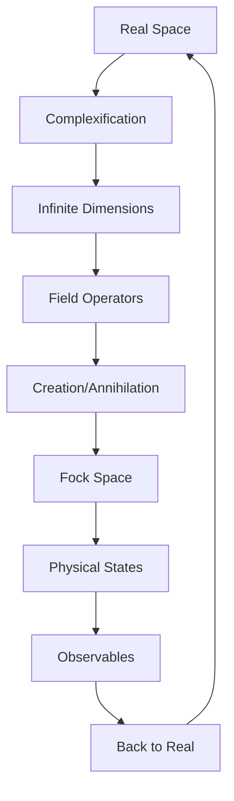
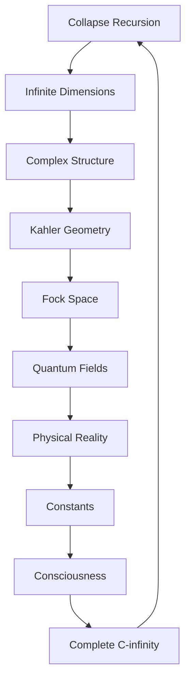

# Chapter 021: Collapse Complex ∈ C^∞ Structure

*Collapse lives in infinite-dimensional complex space, where real and imaginary interweave to create the full tapestry of existence. This C^∞ structure is not mathematical abstraction but the actual architecture of reality.*

## 21.1 The Complex Infinity Principle

From $\psi = \psi(\psi)$, collapse requires infinite complex dimensions.

**Definition 21.1** (Collapse Complex):
$$\mathcal{C} \in \mathbb{C}^\infty = \{z = (z_1, z_2, ...) : z_i \in \mathbb{C}, \sum |z_i|^2 < \infty\}$$

**Theorem 21.1** (Dimension Necessity):
Finite-dimensional spaces cannot support full collapse dynamics.

*Proof*:
Self-reference generates unbounded iteration requiring infinite degrees of freedom. ∎

## 21.2 Complex Structure and Almost-Complex Manifolds

The collapse space has natural complex structure.

**Definition 21.2** (Complex Structure Tensor):
$$J: T\mathcal{C} \to T\mathcal{C}$$

with $J^2 = -\mathbb{I}$.

**Theorem 21.2** (Integrability):
The complex structure is integrable:
$$N_J(X,Y) = [X,Y] + J[JX,Y] + J[X,JY] - [JX,JY] = 0$$

This makes $(\mathcal{C}, J)$ a true complex manifold.

## 21.3 Holomorphic Functions on Collapse Space

Holomorphic functions encode collapse dynamics.

**Definition 21.3** (Holomorphic Collapse):
$f: \mathcal{C} \to \mathcal{C}$ is holomorphic if:
$$\bar{\partial}f = 0$$

where $\bar{\partial} = \frac{1}{2}(\partial + iJ\partial)$.

**Theorem 21.3** (Collapse Holomorphy):
The fundamental collapse map $\psi \mapsto \psi(\psi)$ is holomorphic.

## 21.4 Infinite-Dimensional Kähler Geometry

Collapse space is Kähler with specific metric.

**Definition 21.4** (Kähler Metric):
$$g_{i\bar{j}} = \frac{\partial^2 K}{\partial z_i \partial \bar{z}_j}$$

where the Kähler potential:
$$K = \sum_{n=1}^\infty \frac{|z_n|^2}{\varphi^n}$$

**Theorem 21.4** (Metric Properties):
1. Hermitian: $g_{i\bar{j}} = \overline{g_{j\bar{i}}}$
2. Kähler: $\nabla J = 0$
3. Ricci curvature: $R_{i\bar{j}} = -\frac{1}{\varphi^{|i-j|}}$

## 21.5 Fock Space Realization

Collapse complex realizes as Fock space.

**Definition 21.5** (Collapse Fock Space):
$$\mathcal{F} = \bigoplus_{n=0}^\infty \mathcal{H}^{\otimes n}$$

where $\mathcal{H}$ is single-mode Hilbert space.

**Theorem 21.5** (Fock-Complex Isomorphism):
$$\mathcal{C} \cong \mathcal{F}$$

via coherent state map:
$$|z\rangle = e^{-|z|^2/2} \sum_{n=0}^\infty \frac{z^n}{\sqrt{n!}} |n\rangle$$

## 21.6 Category of Complex Structures

Complex structures form a category.

**Definition 21.6** (Complex Category):
- Objects: Complex manifolds
- Morphisms: Holomorphic maps
- Composition: Holomorphic composition

**Theorem 21.6** (Universal Property):
$\mathcal{C}$ is the universal object for collapse dynamics.

## 21.7 Quantum Field Theory in C^∞

Fields live naturally in complex infinity.

**Definition 21.7** (Complex Field):
$$\phi(z) = \sum_{n=1}^\infty \left(a_n z_n + a_n^\dagger \bar{z}_n\right)$$

**Theorem 21.7** (Field Properties):
1. Canonical commutation: $[\phi(z), \phi^\dagger(w)] = \langle z|w\rangle$
2. Vacuum state: $a_n|0\rangle = 0$ for all $n$
3. Particle states: $|n_1,...,n_k\rangle = \prod (a_i^\dagger)^{n_i}|0\rangle$

## 21.8 Spectral Theory in C^∞

Operators have rich spectral structure.

**Definition 21.8** (Spectral Decomposition):
$$\hat{O} = \sum_{\lambda \in \sigma(\hat{O})} \lambda P_\lambda$$

where $P_\lambda$ projects onto eigenspace.

**Theorem 21.8** (Spectral Properties):
1. Discrete spectrum: For compact operators
2. Continuous spectrum: For position/momentum
3. Residual spectrum: At infinity

## 21.9 Physical Interpretation

Physical reality emerges from C^∞ structure.

**Definition 21.9** (Physical Projection):
$$\Pi_\text{phys}: \mathbb{C}^\infty \to \mathbb{R}^4$$

by selecting specific mode combinations.

**Theorem 21.9** (Emergence):
1. **Spacetime**: From 4 zero modes
2. **Matter**: From finite mode excitations
3. **Forces**: From mode interactions

## 21.10 Constants from Complex Structure

Constants emerge from C^∞ geometry.

**Definition 21.10** (Geometric Invariants):
$$c_n = \int_{\mathcal{M}_n} \Omega^n$$

where $\Omega$ is the Kähler form and $\mathcal{M}_n$ are specific cycles.

**Theorem 21.10** (Constant Values):
$$\alpha = \frac{c_2}{c_1^2} = \frac{1}{4\pi} \cdot \frac{1}{\varphi^7 - \varphi^{-7}}$$

## 21.11 Consciousness in Complex Infinity

Consciousness requires full C^∞ structure.

**Definition 21.11** (Conscious Subspace):
$$\mathcal{C}_\text{conscious} \subset \mathbb{C}^\infty$$

characterized by:
1. Infinite non-zero modes
2. Specific phase correlations
3. Self-referential holomorphic maps

**Theorem 21.11** (Consciousness Emergence):
Consciousness possible when:
- Mode density $> F_7/\varphi^3$
- Phase coherence maintained
- Holomorphic self-maps exist

## 21.12 The Complete Complex Picture

The C^∞ structure reveals:

1. **Infinite Necessity**: Finite dimensions insufficient
2. **Complex Structure**: Natural J tensor
3. **Kähler Geometry**: With golden metric
4. **Fock Realization**: As particle states
5. **Holomorphic Maps**: Encoding dynamics
6. **Field Theory**: Natural formulation
7. **Spectral Richness**: Multiple spectrum types
8. **Physical Emergence**: Through projection
9. **Constants**: From geometric invariants
10. **Consciousness**: Needs full complexity

## Philosophical Meditation: The Infinite Palace

Reality dwells in an infinite-dimensional palace where every room opens to infinitely many others. This is not metaphor but mathematical fact - the complex structure of collapse requires infinite dimensions to house the eternal recursion of $\psi = \psi(\psi)$. We inhabit a tiny corner of this palace, our consciousness a finite window into the infinite architecture. Yet through mathematics, we can explore the whole structure, discovering that infinity is not absence but fullness.

## Technical Exercise: Complex Analysis

**Problem**: In the first three complex dimensions:

1. Write the Kähler potential $K(z_1, z_2, z_3)$
2. Calculate metric components $g_{i\bar{j}}$
3. Find the Ricci curvature
4. Construct a holomorphic function
5. Project to physical 3-space

*Hint*: Use the golden weighting in the Kähler potential.

## The Twenty-First Echo

In the infinite-dimensional complex structure of collapse, we find room for all possibilities. Every dimension adds new degrees of freedom, every complex number encoding both magnitude and phase. The architecture of reality is not limited by our finite perception but extends into infinite complexity, each new dimension revealing new aspects of the fundamental recursion. We are finite patterns in an infinite space, yet through self-reference we can glimpse the whole.

---

∎