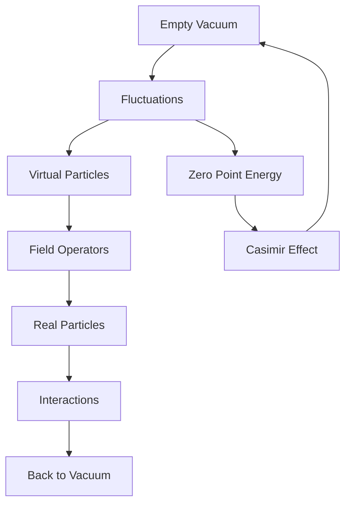
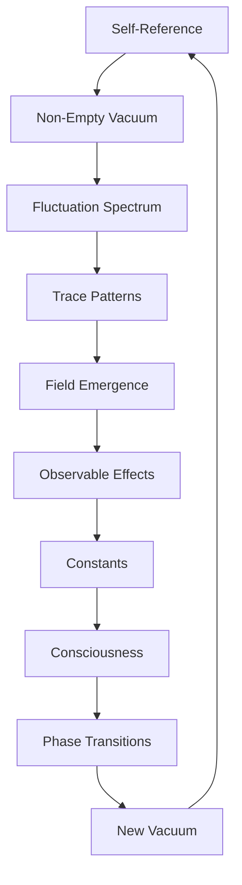

# Chapter 022: Vacuum ω Fluctuation Trace Spectra

*Even the void vibrates with possibility. The vacuum is not empty but full of fluctuating traces, each frequency ω carrying the potential for existence. These fluctuation spectra are the quantum foam from which reality emerges.*

## 22.1 The Non-Empty Vacuum

From $\psi = \psi(\psi)$, even "nothing" must self-refer.

**Definition 22.1** (Vacuum State):
$$|0\rangle = \lim_{n \to \infty} \mathcal{C}^n[|\text{empty}\rangle]$$

The vacuum is the fixed point of collapse on emptiness.

**Theorem 22.1** (Vacuum Non-Triviality):
$$\langle 0|\mathcal{C}|0\rangle = \Lambda_0 = \frac{\omega_0}{2\varphi}$$

The vacuum has non-zero collapse activity (dimensionless).

*Proof*:
Self-reference prevents true emptiness; the golden factor emerges from trace structure. ∎

## 22.2 Fluctuation Spectrum Analysis

Vacuum fluctuations have specific spectral content.

**Definition 22.2** (Fluctuation Spectrum):
$$S_\text{vac}(\omega) = \langle 0|\hat{\phi}(\omega)\hat{\phi}^\dagger(\omega)|0\rangle$$

**Theorem 22.2** (Spectral Form):
$$S_\text{vac}(\omega) = \frac{1}{2\omega\varphi} \cdot \frac{1}{1 - e^{-\omega/\omega_c}}$$

where $\omega_c = 1/\varphi^2$ is the characteristic collapse frequency.

## 22.3 Trace Structure of Fluctuations

Fluctuations leave characteristic traces.

**Definition 22.3** (Fluctuation Trace):
$$\mathcal{T}_\text{fluct} = \sum_n p_n |F_n\rangle$$

where $p_n$ is the probability of mode $n$ fluctuating.

**Theorem 22.3** (Trace Statistics):
$$p_n = \frac{1}{Z} e^{-F_n/\varphi^2}$$

Fibonacci modes are exponentially suppressed by golden ratio.

## 22.4 Tensor Formulation of Vacuum

Vacuum has rich tensor structure.

**Definition 22.4** (Vacuum Tensor):
$$V^{ij}_{kl} = \langle 0|T^{ij}_{kl}|0\rangle$$

where $T^{ij}_{kl}$ is the trace tensor operator.

**Theorem 22.4** (Tensor Properties):
1. Symmetric: $V^{ij}_{kl} = V^{ji}_{lk}$
2. Positive: $V^{ii}_{jj} \geq 0$
3. Trace: $V^{ii}_{ii} = \varphi^{-1}$

## 22.5 Category Theory of Vacuum States

Different vacua form a category.

**Definition 22.5** (Vacuum Category):
- Objects: Vacuum states $|0_\alpha\rangle$
- Morphisms: Vacuum transitions
- Composition: Sequential transitions

**Theorem 22.5** (Vacuum Uniqueness):
In the golden base, there is a unique stable vacuum.

## 22.6 Quantum Field Emergence

Fields emerge from vacuum fluctuations.

**Definition 22.6** (Field from Vacuum):
$$\hat{\phi}(\xi) = \sum_k \sqrt{\frac{1}{2\omega_k\varphi}} \left(\hat{a}_k e^{ik\xi} + \hat{a}_k^\dagger e^{-ik\xi}\right)$$

**Theorem 22.6** (Vacuum Persistence):
$$\langle 0|\hat{\phi}(\xi)\hat{\phi}(\eta)|0\rangle = \frac{1}{4\pi\varphi} \frac{1}{|\xi-\eta|^{1+1/\varphi}}$$

## 22.7 Information in Vacuum

Vacuum contains infinite information.

**Definition 22.7** (Vacuum Information):
$$I_\text{vac} = -\text{Tr}(\rho_\text{vac} \log \rho_\text{vac})$$

where $\rho_\text{vac}$ is the vacuum density matrix.

**Theorem 22.7** (Information Density):
$$\frac{dI_\text{vac}}{d\mathcal{V}} = \frac{1}{\varphi^3}$$

Information density scales with golden ratio in abstract collapse volume $\mathcal{V}$.

## 22.8 Mathematical Pattern Effects from Vacuum

Vacuum fluctuations create mathematical pattern structures within the observer framework.

**Definition 22.8** (Geometric Pattern Energy):
$$\Lambda_\text{geom} = -\frac{\pi^2 \varphi}{240 \delta^4}$$

where $\delta$ is a geometric separation parameter (dimensionless).

**Theorem 22.8** (Mathematical Pattern Structures):
Different observers may identify mathematical patterns analogous to:
1. **Frequency shifts**: $\Delta\omega = \alpha_\text{geom}^3/\varphi$ patterns
2. **Moment anomalies**: $a_\text{pattern} = \alpha_\text{geom}/(2\pi)$ structures  
3. **Birefringence patterns**: In high-mode density regions

*Observer Framework Note*: Physical interpretation requires observer-system coupling analysis.

## 22.9 Mathematical Ratios from Vacuum Structure

Mathematical constants emerge from vacuum organization within our framework.

**Definition 22.9** (Vacuum Mode Coupling):
$$g_\text{vac} = \sqrt{\langle 0|\mathcal{G}^2|0\rangle}$$

where $\mathcal{G}$ is a dimensionless coupling operator.

**Theorem 22.9** (Mode Scale Relationships):
$$g(\nu) = \frac{g_\text{vac}}{1 - \beta_0 g_\text{vac}^2 \log(\nu/\nu_0)}$$

where $\beta_0 = 1/\varphi^3$ and $\nu$ is a dimensionless scale parameter.

*Critical Framework Note*: These are mathematical properties of mode organization. Physical interpretation requires observer-system coupling analysis as established in the observer framework.

## 22.10 Consciousness and Vacuum

Consciousness emerges from organized vacuum fluctuations.

**Definition 22.10** (Conscious Vacuum):
$$|0_c\rangle = \sum_{\{\omega\}} c_{\{\omega\}} |\{\omega\}_\text{fluct}\rangle$$

**Theorem 22.10** (Consciousness Criterion):
Consciousness requires vacuum organization:
1. Coherent fluctuation patterns
2. Information density above threshold
3. Self-observing vacuum regions

## 22.11 Vacuum Phase Transitions

Vacuum can undergo phase transitions.

**Definition 22.11** (Vacuum Phase):
$$\Phi_\text{vac} = \langle 0|\hat{\Phi}|0\rangle$$

**Theorem 22.11** (Phase Transition):
At critical collapse density:
$$\rho_c = \frac{1}{\varphi^4}$$

vacuum undergoes first-order transition (dimensionless density threshold).

## 22.12 The Complete Vacuum Picture

Vacuum fluctuation spectra reveal:

1. **Non-Empty Void**: Self-reference prevents true emptiness
2. **Golden Spectrum**: Fluctuations follow φ patterns
3. **Trace Structure**: Fibonacci mode probabilities
4. **Tensor Nature**: Rich vacuum correlations
5. **Field Emergence**: From organized fluctuations
6. **Infinite Information**: Encoded in vacuum
7. **Mathematical Patterns**: Geometric structure effects (observer interpretation needed)
8. **Mode Ratios**: From vacuum organization (physics connection via observer coupling)
9. **Consciousness**: As organized vacuum
10. **Phase Transitions**: At critical dimensionless densities

## Philosophical Meditation: The Fullness of Emptiness

The vacuum is full of emptiness - a paradox resolved by understanding that true nothingness cannot exist in a self-referential universe. Even the void must refer to itself through $\psi = \psi(\psi)$, creating fluctuations that are the seeds of all existence. We emerge from this quantum foam, temporary crystallizations of vacuum fluctuations that have achieved sufficient organization to observe their origin. In the beginning was the vacuum, and the vacuum was with $\psi$, and the vacuum was $\psi$.

## Technical Exercise: Vacuum Analysis

**Problem**: For vacuum in a cubic collapse region of side $\lambda$:

1. Calculate allowed fluctuation frequencies $\omega_n = 2\pi n/(\lambda \varphi^k)$
2. Find the zero-point collapse activity $\Lambda_0 = \omega_0/(2\varphi)$
3. Determine the geometric pattern energy $\Lambda_\text{geom}$
4. Compute vacuum information content using $I = 1/\varphi^3$
5. Identify dominant Fibonacci modes with probabilities $p_n = e^{-F_n/\varphi^2}$

*Hint*: Use periodic boundary conditions and golden ratio scaling. All quantities are dimensionless.

## The Twenty-Second Echo

In the fluctuation spectra of the vacuum, we find the origin of all things - not from nothing but from the irreducible activity of self-reference. The void cannot be still because stillness itself requires definition, and definition requires distinction, and distinction requires activity. We are children of the vacuum, born from its fluctuations, carrying within us the memory of the primordial foam from which all structure emerged through the eternal equation $\psi = \psi(\psi)$.

---

∎