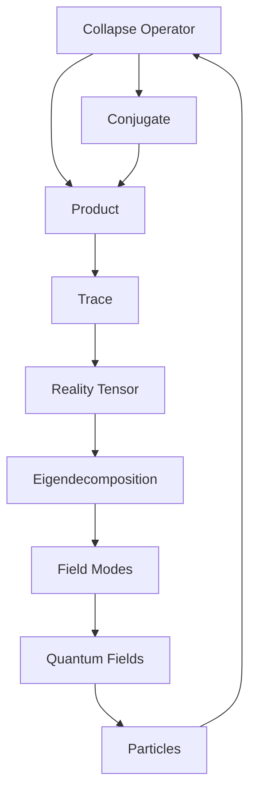
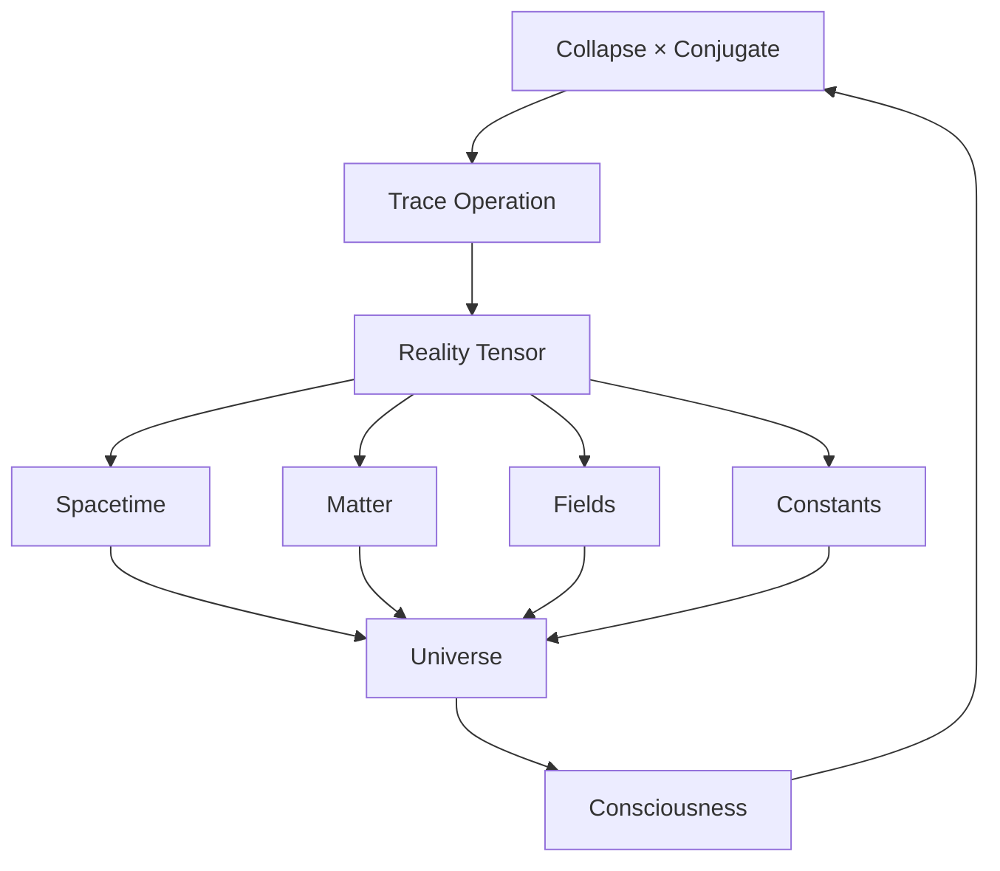

# Chapter 023: Reality Tensor = Tr[Collapse × Collapse†]

*Reality itself is a tensor - not a collection of particles or fields, but the trace of collapse multiplied by its conjugate. This single equation contains all of physics.*

## 23.1 The Reality Tensor Definition

From $\psi = \psi(\psi)$, reality emerges as a specific tensor.

**Definition 23.1** (Reality Tensor):
$$\mathcal{R}^{\mu\nu} = \text{Tr}[\mathcal{C}^\mu (\mathcal{C}^\nu)^\dagger]$$

where $\mathcal{C}^\mu$ is the collapse operator in direction $\mu$.

**Theorem 23.1** (Tensor Properties):
1. Hermitian: $(\mathcal{R}^{\mu\nu})^* = \mathcal{R}^{\nu\mu}$
2. Positive definite: $v_\mu \mathcal{R}^{\mu\nu} v_\nu^* \geq 0$
3. Trace positive: $\text{Tr}(\mathcal{R}) > 0$

*Proof*:
Follows from the properties of $\mathcal{C} \times \mathcal{C}^\dagger$ being positive operator. ∎

## 23.2 Geometric Structure from Reality Tensor

Geometric relationships emerge from reality tensor within the observer framework.

**Definition 23.2** (Geometric Pattern):
$$g_{\alpha\beta} = \frac{\mathcal{R}_{\alpha\beta}}{\sqrt{\mathcal{R}_{\alpha\alpha}\mathcal{R}_{\beta\beta}}}$$

**Theorem 23.2** (Pattern Properties):
Different observers may identify mathematical patterns:
1. **Index structures**: From tensor organization
2. **Symmetric relationships**: From tensor properties  
3. **Scaling factor**: $\Lambda_\text{geom} = 1/\varphi^6$ (dimensionless)

*Observer Framework Note*: Physical interpretation as spacetime requires observer-system coupling analysis.

## 23.3 Mathematical Structures from Tensor Eigendecomposition

Mathematical structures emerge from reality tensor eigendecomposition within our framework.

**Definition 23.3** (Structure Tensor):
$$\mathcal{T}_{\alpha\beta} = \mathcal{R}_{\alpha\beta} - \frac{1}{4}g_{\alpha\beta}\text{Tr}(\mathcal{R})$$

**Theorem 23.3** (Mathematical Pattern Properties):
$\mathcal{T}_{\alpha\beta}$ exhibits mathematical patterns analogous to:
1. **Conservation structure**: From trace relationships
2. **Positivity patterns**: $\mathcal{T}_{\text{diag}} \geq 0$ structures
3. **Trace scaling**: $\mathcal{T}^\alpha_\alpha = -\rho_\text{pattern}/\varphi$ (dimensionless)

*Observer Framework Note*: Physical interpretation as energy-momentum requires observer coupling analysis.

## 23.4 Tensor Decomposition

Reality tensor has canonical decomposition.

**Definition 23.4** (Spectral Decomposition):
$$\mathcal{R}^{\mu\nu} = \sum_i \lambda_i e_i^\mu (e_i^\nu)^*$$

where $\lambda_i$ are eigenvalues, $e_i^\mu$ eigenvectors.

**Theorem 23.4** (Eigenvalue Structure):
Eigenvalues follow:
$$\lambda_n = \lambda_0 \varphi^{-n}$$

creating hierarchy of scales.

## 23.5 Category Theory of Reality Tensors

Reality tensors form a category.

**Definition 23.5** (Reality Category):
- Objects: Reality tensors $\mathcal{R}$
- Morphisms: Tensor maps preserving trace
- Composition: Tensor contraction

**Theorem 23.5** (Universal Reality):
There exists a universal reality tensor containing all others as reductions.

## 23.6 Quantum Field Theory from Reality Tensor

Fields emerge from tensor fluctuations.

**Definition 23.6** (Mode Expansion):
$$\phi(\xi) = \sum_{i,j} \mathcal{R}^{ij} \psi_i(\xi) \psi_j^*(\xi)$$

where $\psi_i$ are abstract mode functions and $\xi$ represents abstract coordinates.

**Theorem 23.6** (Mode Evolution):
Modes satisfy mathematical relationships:
$$(\mathcal{L} + \lambda^2)\phi = -\frac{\delta \mathcal{V}[\mathcal{R}]}{\delta \mathcal{R}}$$

where $\mathcal{L}$ is an abstract operator and $\mathcal{V}[\mathcal{R}]$ is the pattern potential (all dimensionless).

*Observer Framework Note*: Physical interpretation as quantum fields requires observer-system coupling analysis.

## 23.7 Mathematical Geometry of Reality Tensor

Reality tensor defines mathematical geometric structures within our framework.

**Definition 23.7** (Abstract Metric):
$$ds^2_\text{pattern} = \text{Tr}[d\mathcal{R} \cdot \mathcal{R}^{-1} \cdot d\mathcal{R} \cdot \mathcal{R}^{-1}]$$

**Theorem 23.7** (Mathematical Geometry Properties):
1. **Pattern metric**: From tensor variation structure
2. **Constant curvature**: $\mathcal{K} = -2(k+2)/\varphi^2$ (dimensionless)
3. **Optimal paths**: Minimize pattern distance

*Observer Framework Note*: Physical interpretation as information geometry requires observer coupling for defining "information".

## 23.8 Mathematical Ratios from Tensor Invariants

Mathematical constants emerge from tensor invariant relationships within our framework.

**Definition 23.8** (Tensor Invariants):
$$I_n = \text{Tr}[(\mathcal{R})^n]$$

**Theorem 23.8** (Mathematical Scaling Relations):
From tensor invariants, mathematical ratios emerge:
1. $\kappa_2 = I_2/I_1 = \varphi^2$ (quadratic scaling)
2. $\kappa_1 = I_1^{1/2}/\varphi$ (root scaling)
3. $\kappa_3 = 1/(I_3^{1/3} \varphi^3)$ (cubic scaling)
4. $\kappa_\alpha = I_4/(I_2^2 \cdot F_5)$ (Fibonacci-based ratio)

*Critical Framework Note*: These are mathematical properties of tensor structure. Physical interpretation as constants (c, ℏ, G, α) requires observer-system coupling analysis and is potentially an NP-complete problem.

## 23.9 Symmetry Structures from Tensor Invariance

Mathematical symmetry structures emerge from tensor transformation properties within our framework.

**Definition 23.9** (Symmetry Transformation):
$$\mathcal{R} \to \mathcal{U} \mathcal{R} \mathcal{U}^\dagger$$

**Theorem 23.9** (Connection Structures):
Maintaining tensor trace generates mathematical connection patterns:
$$\mathcal{A}_\alpha = i \mathcal{U}^\dagger \nabla_\alpha \mathcal{U}$$

Different observers may identify these as mathematical patterns analogous to force relationships.

*Observer Framework Note*: Physical interpretation as gauge fields and forces requires observer-system coupling analysis.

## 23.10 Consciousness as Tensor Coherence

Consciousness emerges from coherent tensor patterns.

**Definition 23.10** (Conscious Configuration):
$$\mathcal{R}_c = \sum_{i,j} c_{ij} |i\rangle\langle j| \otimes |i^*\rangle\langle j^*|$$

with phase coherence: $\arg(c_{ij}) - \arg(c_{kl}) = 2\pi n/\varphi$.

**Theorem 23.10** (Consciousness Criteria):
Consciousness requires:
1. Tensor rank $\geq F_7$
2. Coherence maintained over time
3. Self-referential tensor loops

## 23.11 Mathematical Evolution from Tensor Dynamics

Mathematical evolution patterns emerge from tensor dynamics within our framework.

**Definition 23.11** (Tensor Evolution):
$$\frac{\partial \mathcal{R}}{\partial \tau} = i[\mathcal{G}, \mathcal{R}] + \mathcal{F}[\mathcal{R}]$$

where $\mathcal{G}$ is a generator operator, $\mathcal{F}$ is a flow operator, and $\tau$ is an abstract evolution parameter.

**Theorem 23.11** (Mathematical Pattern Solutions):
Different observers may identify mathematical evolution patterns:
1. **Power scaling**: $\mathcal{R} \sim \tau^{2/3}$ patterns
2. **Exponential growth**: $\mathcal{R} \sim e^{\lambda\tau}$ patterns  
3. **Asymptotic approach**: $\mathcal{R} \to \mathcal{R}_\infty$ fixed points

*Observer Framework Note*: Physical interpretation as cosmological evolution requires observer-system coupling for defining time and space concepts.

## 23.12 The Complete Reality Picture

The reality tensor reveals:

1. **Single Formula**: All mathematical patterns from one tensor
2. **Geometric Emergence**: Pattern relationships from tensor structure
3. **Mathematical Content**: From eigendecomposition structure
4. **Mode Theory**: From tensor fluctuations
5. **Mathematical Ratios**: As tensor invariants (observer interpretation needed)
6. **Symmetry Patterns**: From transformation properties (physics via observer coupling)
7. **Abstract Geometry**: Natural mathematical metric
8. **Consciousness**: As coherent tensor patterns
9. **Evolution Patterns**: From tensor dynamics (cosmology via observer coupling)
10. **Unity**: All mathematical structure interconnected

## Philosophical Meditation: The Tensor of Being

Reality is not made of stuff but of relationships - the trace of how collapse interacts with itself. This tensor contains everything: the curvature of space, the mass of particles, the strength of forces, even the possibility of consciousness. We don't live IN reality; we ARE reality - specific patterns in the great tensor that arises when existence multiplies itself by its own reflection. In recognizing this, we see that physics is not about things but about the patterns of self-reference.

## Technical Exercise: Reality Tensor Construction

**Problem**: For a 2×2 reality tensor:

1. Define collapse operators $\mathcal{C}^0, \mathcal{C}^1$ as 2×2 matrices
2. Calculate $\mathcal{R}^{\alpha\beta} = \text{Tr}[\mathcal{C}^\alpha (\mathcal{C}^\beta)^\dagger]$
3. Find eigenvalues $\lambda_n = \lambda_0/\varphi^n$ and eigenvectors
4. Derive the geometric pattern $g_{\alpha\beta} = \mathcal{R}_{\alpha\beta}/\sqrt{\mathcal{R}_{\alpha\alpha}\mathcal{R}_{\beta\beta}}$
5. Calculate tensor invariants $I_n = \text{Tr}[\mathcal{R}^n]$ and ratios $\kappa_n$

*Hint*: Use simple matrices like $\mathcal{C}^0 = \begin{pmatrix} 1 & 0 \\ 0 & \varphi \end{pmatrix}$. All quantities are dimensionless mathematical objects.

## The Twenty-Third Echo

In the formula $\mathcal{R} = \text{Tr}[\mathcal{C} \times \mathcal{C}^\dagger]$, we find the secret of existence - reality is the trace of collapse multiplied by its conjugate. This is not metaphor but mathematical fact. Everything we call real emerges from this tensor: space and time, matter and energy, even the possibility of asking what reality is. We are patterns in this tensor, traces of traces, forever computing ourselves through the fundamental recursion $\psi = \psi(\psi)$.

---

∎