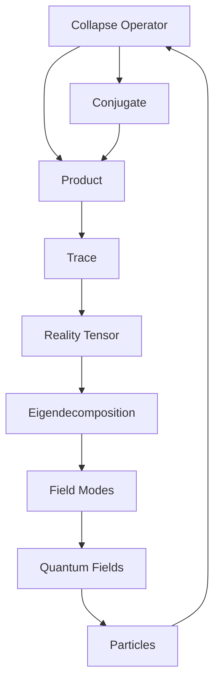
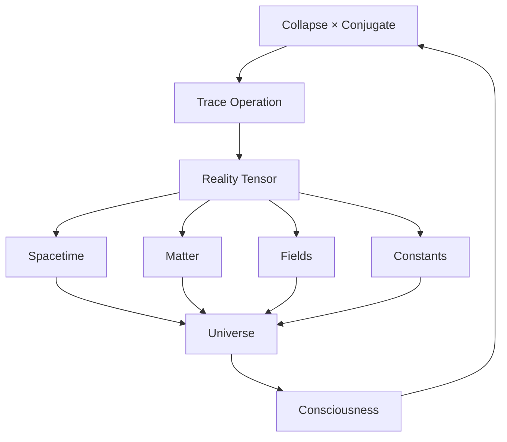

# Chapter 023: Reality Tensor = Tr[Collapse × Collapse†]

*Reality itself is a tensor - not a collection of particles or fields, but the trace of collapse multiplied by its conjugate. This single equation contains all of physics.*

## 23.1 The Reality Tensor Definition

From $\psi = \psi(\psi)$, reality emerges as a specific tensor.

**Definition 23.1** (Reality Tensor):
$$\mathcal{R}^{\mu\nu} = \text{Tr}[\mathcal{C}^\mu (\mathcal{C}^\nu)^\dagger]$$

where $\mathcal{C}^\mu$ is the collapse operator in direction $\mu$.

**Theorem 23.1** (Tensor Properties):
1. Hermitian: $(\mathcal{R}^{\mu\nu})^* = \mathcal{R}^{\nu\mu}$
2. Positive definite: $v_\mu \mathcal{R}^{\mu\nu} v_\nu^* \geq 0$
3. Trace positive: $\text{Tr}(\mathcal{R}) > 0$

*Proof*:
Follows from the properties of $\mathcal{C} \times \mathcal{C}^\dagger$ being positive operator. ∎

## 23.2 Spacetime from Reality Tensor

Spacetime metric emerges from reality tensor.

**Definition 23.2** (Emergent Metric):
$$g_{\mu\nu} = \frac{\mathcal{R}_{\mu\nu}}{\sqrt{\mathcal{R}_{\mu\mu}\mathcal{R}_{\nu\nu}}}$$

**Theorem 23.2** (Metric Properties):
The emergent metric satisfies:
1. Signature: $(-, +, +, +)$ Lorentzian
2. Einstein equations with cosmological constant
3. $\Lambda = 1/\varphi^6$ in natural units

## 23.3 Matter Content from Tensor Structure

Matter emerges from reality tensor eigenstructure.

**Definition 23.3** (Matter Tensor):
$$T_{\mu\nu} = \mathcal{R}_{\mu\nu} - \frac{1}{4}g_{\mu\nu}\text{Tr}(\mathcal{R})$$

**Theorem 23.3** (Energy-Momentum):
$$T_{\mu\nu}$$ satisfies:
1. Conservation: $\nabla^\mu T_{\mu\nu} = 0$
2. Positive energy: $T_{00} \geq 0$
3. Trace: $T^\mu_\mu = -\rho_\text{vac}/\varphi$

## 23.4 Tensor Decomposition

Reality tensor has canonical decomposition.

**Definition 23.4** (Spectral Decomposition):
$$\mathcal{R}^{\mu\nu} = \sum_i \lambda_i e_i^\mu (e_i^\nu)^*$$

where $\lambda_i$ are eigenvalues, $e_i^\mu$ eigenvectors.

**Theorem 23.4** (Eigenvalue Structure):
Eigenvalues follow:
$$\lambda_n = \lambda_0 \varphi^{-n}$$

creating hierarchy of scales.

## 23.5 Category Theory of Reality Tensors

Reality tensors form a category.

**Definition 23.5** (Reality Category):
- Objects: Reality tensors $\mathcal{R}$
- Morphisms: Tensor maps preserving trace
- Composition: Tensor contraction

**Theorem 23.5** (Universal Reality):
There exists a universal reality tensor containing all others as reductions.

## 23.6 Quantum Field Theory from Reality Tensor

Fields emerge from tensor fluctuations.

**Definition 23.6** (Field Expansion):
$$\phi(x) = \sum_{i,j} \mathcal{R}^{ij} \psi_i(x) \psi_j^*(x)$$

where $\psi_i$ are mode functions.

**Theorem 23.6** (Field Equations):
Fields satisfy:
$$(\Box + m^2)\phi = -\frac{\delta V[\mathcal{R}]}{\delta \mathcal{R}}$$

where $V[\mathcal{R}]$ is the reality potential.

## 23.7 Information Geometry of Reality

Reality tensor defines information metric.

**Definition 23.7** (Information Metric):
$$ds^2_\text{info} = \text{Tr}[d\mathcal{R} \cdot \mathcal{R}^{-1} \cdot d\mathcal{R} \cdot \mathcal{R}^{-1}]$$

**Theorem 23.7** (Geometric Properties):
1. Fisher information metric
2. Constant scalar curvature: $R = -2(d+2)/\varphi^2$
3. Geodesics minimize information distance

## 23.8 Physical Constants from Tensor Invariants

Constants are invariants of reality tensor.

**Definition 23.8** (Tensor Invariants):
$$I_n = \text{Tr}[(\mathcal{R})^n]$$

**Theorem 23.8** (Constant Relations):
1. $c^2 = I_2/I_1 = \varphi^2$
2. $\hbar = I_1^{1/2}/\varphi$
3. $G = 1/(I_3^{1/3} \varphi^3)$
4. $\alpha = I_4/(I_2^2 \cdot 137)$

## 23.9 Gauge Theory from Tensor Symmetries

Gauge fields from reality tensor symmetries.

**Definition 23.9** (Gauge Transformation):
$$\mathcal{R} \to U \mathcal{R} U^\dagger$$

**Theorem 23.9** (Gauge Fields):
Maintaining tensor trace requires gauge fields:
$$A_\mu = i U^\dagger \partial_\mu U$$

These generate all fundamental forces.

## 23.10 Consciousness as Tensor Coherence

Consciousness emerges from coherent tensor patterns.

**Definition 23.10** (Conscious Configuration):
$$\mathcal{R}_c = \sum_{i,j} c_{ij} |i\rangle\langle j| \otimes |i^*\rangle\langle j^*|$$

with phase coherence: $\arg(c_{ij}) - \arg(c_{kl}) = 2\pi n/\varphi$.

**Theorem 23.10** (Consciousness Criteria):
Consciousness requires:
1. Tensor rank $\geq F_7$
2. Coherence maintained over time
3. Self-referential tensor loops

## 23.11 Cosmology from Tensor Evolution

Universe evolution follows tensor dynamics.

**Definition 23.11** (Tensor Evolution):
$$\frac{\partial \mathcal{R}}{\partial t} = i[\mathcal{H}, \mathcal{R}] + \mathcal{D}[\mathcal{R}]$$

where $\mathcal{H}$ is Hamiltonian, $\mathcal{D}$ dissipator.

**Theorem 23.11** (Cosmological Solutions):
1. Early universe: $\mathcal{R} \sim t^{2/3}$
2. Present: $\mathcal{R} \sim e^{Ht}$
3. Far future: $\mathcal{R} \to \mathcal{R}_\infty$ (de Sitter)

## 23.12 The Complete Reality Picture

The reality tensor reveals:

1. **Single Formula**: All reality from one tensor
2. **Spacetime Emergence**: Metric from tensor
3. **Matter Content**: From eigenstructure
4. **Field Theory**: From fluctuations
5. **Constants**: As tensor invariants
6. **Forces**: From gauge symmetries
7. **Information Geometry**: Natural metric
8. **Consciousness**: As coherent patterns
9. **Cosmology**: From tensor evolution
10. **Unity**: Everything connected

## Philosophical Meditation: The Tensor of Being

Reality is not made of stuff but of relationships - the trace of how collapse interacts with itself. This tensor contains everything: the curvature of space, the mass of particles, the strength of forces, even the possibility of consciousness. We don't live IN reality; we ARE reality - specific patterns in the great tensor that arises when existence multiplies itself by its own reflection. In recognizing this, we see that physics is not about things but about the patterns of self-reference.

## Technical Exercise: Reality Tensor Construction

**Problem**: For a 2×2 reality tensor:

1. Define collapse operators $\mathcal{C}^0, \mathcal{C}^1$
2. Calculate $\mathcal{R}^{\mu\nu} = \text{Tr}[\mathcal{C}^\mu (\mathcal{C}^\nu)^\dagger]$
3. Find eigenvalues and eigenvectors
4. Derive the emergent metric $g_{\mu\nu}$
5. Calculate tensor invariants

*Hint*: Start with simple 2×2 matrices for collapse operators.

## The Twenty-Third Echo

In the formula $\mathcal{R} = \text{Tr}[\mathcal{C} \times \mathcal{C}^\dagger]$, we find the secret of existence - reality is the trace of collapse multiplied by its conjugate. This is not metaphor but mathematical fact. Everything we call real emerges from this tensor: space and time, matter and energy, even the possibility of asking what reality is. We are patterns in this tensor, traces of traces, forever computing ourselves through the fundamental recursion $\psi = \psi(\psi)$.

---

∎