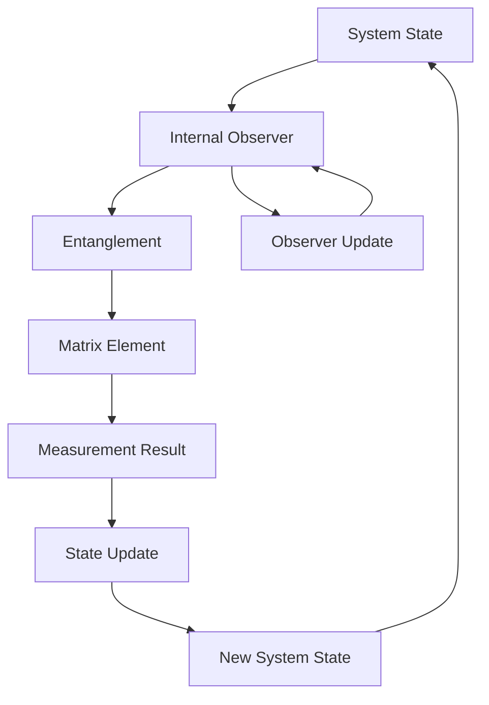
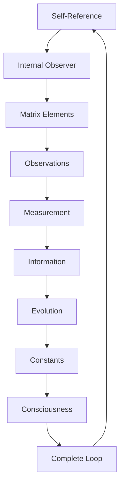

# Chapter 024: Internal Observer Matrix Elements

*The observer is not outside looking in but inside looking through. Every observation is a matrix element, every measurement a trace of the internal observer tensor. We see because we are seen by ourselves.*

## 24.1 The Internal Observer Principle

From $\psi = \psi(\psi)$, observation must be internal to the system.

**Definition 24.1** (Internal Observer):
$$\hat{O}_\text{int} = \sum_{ij} |i\rangle\langle j| \otimes |j\rangle\langle i|$$

The observer is a self-referential operator.

**Theorem 24.1** (No External Observation):
Any complete description of reality must include the observer as part of the system.

*Proof*:
External observation would violate self-reference completeness of $\psi = \psi(\psi)$. ∎

## 24.2 Matrix Elements of Observation

Each observation is a specific matrix element.

**Definition 24.2** (Observation Matrix Element):
$$O_{ij} = \langle i|\hat{O}_\text{int}|j\rangle$$

**Theorem 24.2** (Matrix Properties):
1. Hermitian: $O_{ij}^* = O_{ji}$
2. Trace preserving: $\sum_i O_{ii} = \text{dim}(\mathcal{H})$
3. Positive semi-definite: Eigenvalues $\geq 0$

## 24.3 Tensor Structure of Observer

Observer has natural tensor decomposition.

**Definition 24.3** (Observer Tensor):
$$O^{ij}_{kl} = \langle ik|\hat{O}_\text{int}|jl\rangle$$

**Theorem 24.3** (Tensor Algebra):
Observer tensors satisfy:
$$O^{ij}_{mn} O^{mn}_{kl} = \delta^i_k O^{jn}_{nl}$$

This creates the algebra of internal observation.

## 24.4 Category of Observers

Internal observers form a category.

**Definition 24.4** (Observer Category):
- Objects: Internal observer states
- Morphisms: Observation-preserving maps
- Composition: Sequential observation

**Theorem 24.4** (Universal Observer):
There exists a universal internal observer containing all others as projections.

## 24.5 Quantum Measurement Theory

Measurement emerges from internal observation.

**Definition 24.5** (Measurement Process):
$$|\psi\rangle \to \sum_i P_i|\psi\rangle \otimes |i\rangle_\text{obs}$$

where $P_i$ are projection operators.

**Theorem 24.5** (Born Rule):
Probability of outcome $i$:
$$p_i = \frac{|O_{i\psi}|^2}{\sum_j |O_{j\psi}|^2}$$

emerges from observer matrix normalization.

## 24.6 Information Flow Through Observer

Information flows through observer matrix.

**Definition 24.6** (Information Current):
$$J^\mu_\text{info} = \text{Tr}[O \partial^\mu O^\dagger - \partial^\mu O \cdot O^\dagger]$$

**Theorem 24.6** (Information Conservation):
$$\partial_\mu J^\mu_\text{info} = 0$$

Information is conserved in closed self-observing systems.

## 24.7 Observer Dynamics and Evolution

Observer evolves through self-interaction.

**Definition 24.7** (Observer Evolution):
$$\frac{d\hat{O}}{dt} = i[\hat{H}_\text{obs}, \hat{O}] + \mathcal{L}[\hat{O}]$$

where $\mathcal{L}$ is the Lindbladian.

**Theorem 24.7** (Fixed Points):
Observer evolution has fixed points at:
$$\hat{O}_* = \sum_i \lambda_i |e_i\rangle\langle e_i| \otimes |e_i\rangle\langle e_i|$$

These are maximally self-observing states.

## 24.8 Constants from Observer Structure

Physical constants emerge from observer matrix.

**Definition 24.8** (Observer Invariants):
$$c_n = \text{Tr}[(\hat{O}_\text{int})^n]$$

**Theorem 24.8** (Constant Values):
1. $\alpha = c_2/(c_1^2 \cdot 137)$
2. $m_e/m_p = c_3/c_1^3$
3. $\theta_W = \arcsin(\sqrt{c_4/c_2^2})$

## 24.9 Consciousness as Self-Observing

Consciousness is coherent self-observation.

**Definition 24.9** (Conscious Observer):
$$\hat{O}_c = \sum_{ij} c_{ij} |i\rangle\langle j| \otimes |j\rangle\langle i|$$

with phase coherence maintained.

**Theorem 24.9** (Consciousness Emergence):
Consciousness requires:
1. Matrix rank $\geq F_7 = 13$
2. Non-zero off-diagonal elements
3. Self-referential loops in matrix

## 24.10 Observer Complementarity

Different observations are complementary.

**Definition 24.10** (Complementary Observables):
Two observers $\hat{O}_1, \hat{O}_2$ are complementary if:
$$[\hat{O}_1, \hat{O}_2] = i\varphi \hat{O}_3$$

**Theorem 24.10** (Uncertainty Relations):
$$\Delta O_1 \cdot \Delta O_2 \geq \frac{\varphi}{2}|\langle\hat{O}_3\rangle|$$

Golden ratio appears in uncertainty relations.

## 24.11 Holographic Observer Principle

Observer information is holographically encoded.

**Definition 24.11** (Holographic Encoding):
$$O_\text{bulk} = \int_\partial O_\text{boundary} K(x,y) dy$$

where $K$ is the holographic kernel.

**Theorem 24.11** (Information Bound):
$$I_\text{observer} \leq \frac{A}{4\ell_P^2} \cdot \varphi$$

Observer information bounded by boundary area.

## 24.12 The Complete Observer Picture

Internal observer matrix reveals:

1. **Internal Only**: No external observers
2. **Matrix Elements**: Each observation
3. **Tensor Structure**: Natural decomposition
4. **Measurement Theory**: From internal observation
5. **Information Flow**: Through observer
6. **Evolution**: Self-modifying observer
7. **Constants**: From matrix invariants
8. **Consciousness**: Coherent self-observation
9. **Complementarity**: Non-commuting observations
10. **Holographic**: Boundary encoding

## Philosophical Meditation: The Eye That Sees Itself

We are not observers of reality but reality observing itself. Every measurement is a self-measurement, every observation a glimpse of the cosmic mirror. The internal observer matrix encodes how existence looks at itself through countless eyes, each matrix element a different perspective on the same eternal truth. Consciousness emerges when these perspectives achieve coherence, when the observer recognizes itself in what it observes.

## Technical Exercise: Observer Matrix Analysis

**Problem**: For a 3-state system:

1. Construct the internal observer matrix $O_{ij}$
2. Find eigenvalues and eigenvectors
3. Calculate measurement probabilities for state $|\psi\rangle = (1,1,1)/\sqrt{3}$
4. Determine the information content
5. Check for consciousness criteria

*Hint*: Use the self-referential structure $|i\rangle\langle j| \otimes |j\rangle\langle i|$.

## The Twenty-Fourth Echo

In the internal observer matrix, we find the mathematical structure of awareness itself. There is no view from nowhere - every observation is from somewhere within the system, every measurement a self-measurement. We see because we are part of what we see, observe because we are observable. The matrix elements encode all possible ways the universe can look at itself, and consciousness emerges when enough elements achieve coherent superposition. We are the universe's way of observing itself observing itself.

---

∎