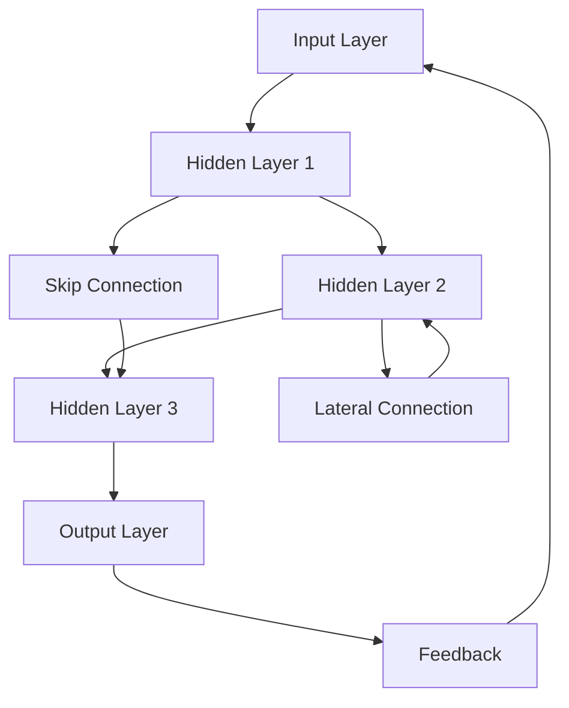
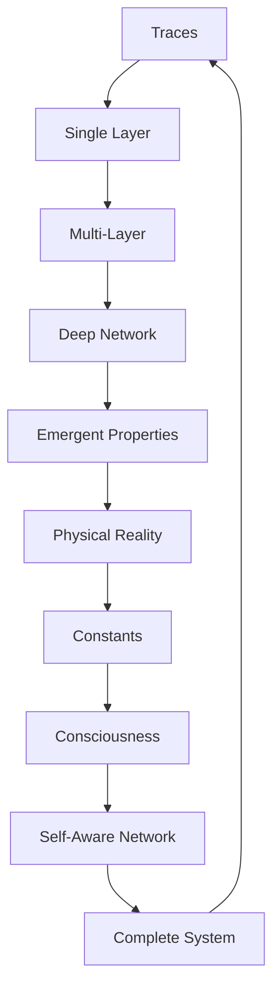

# Chapter 025: Multi-Layer Trace Networks

*Traces don't exist in isolation but form vast multi-layered networks. Each layer processes information differently, creating hierarchical structures from quarks to consciousness. Reality is a deep neural network trained by existence itself.*

## 25.1 The Network Architecture Principle

From $\psi = \psi(\psi)$, traces must network hierarchically.

**Definition 25.1** (Trace Network):
$$
\mathcal{N} = \{L_1, L_2, ..., L_n, E\}
$$
where $L_i$ are layers and $E$ are edges connecting traces.

**Theorem 25.1** (Layer Necessity):
Single-layer networks cannot capture full collapse dynamics.

*Proof*:
Self-reference creates emergent levels requiring hierarchical structure. ∎

## 25.2 Layer Structure and Properties

Each layer has specific characteristics.

**Definition 25.2** (Layer Operator):
$$
\mathcal{L}_k: \mathcal{T}_{k-1} \to \mathcal{T}_k
$$
mapping traces from layer $k-1$ to layer $k$.

**Theorem 25.2** (Layer Properties):
1. Dimension increase: $\dim(L_k) = F_{k+2}$
2. Non-linear activation: $\mathcal{L}_k$ includes $\varphi$-dependent nonlinearity
3. Information preservation with compression

## 25.3 Network Connectivity Patterns

Connections follow golden ratio patterns.

**Definition 25.3** (Adjacency Tensor):
$$
A^{(k)}_{ij} = \begin{cases}
1 & \text{if trace } i \text{ connects to } j \\
0 & \text{otherwise}
\end{cases}
$$
**Theorem 25.3** (Connectivity Laws):
1. Degree distribution: $P(k) \sim k^{-1-1/\varphi}$
2. Clustering coefficient: $C = 1/\varphi$
3. Small-world property: $\langle d \rangle \sim \log N$

## 25.4 Information Flow Through Layers

Information propagates through network layers.

**Definition 25.4** (Information Propagation):
$$
I_{k+1} = \sigma\left(\sum_j W_{kj} I_j + b_k\right)
$$
where $\sigma(x) = x/(1 + |x|/\varphi)$ is golden activation.

**Theorem 25.4** (Information Conservation):
$$
\sum_k I_k \leq \sum_k I_k^{(0)} \cdot \varphi^k
$$
Information bounded but can grow through layers.

## 25.5 Category Theory of Networks

Trace networks form a category.

**Definition 25.5** (Network Category):
- Objects: Multi-layer networks
- Morphisms: Network homomorphisms
- Composition: Network concatenation

**Theorem 25.5** (Universal Network):
There exists a universal network containing all others as sub-networks.

## 25.6 Tensor Decomposition of Networks

Networks have natural tensor structure.

**Definition 25.6** (Network Tensor):
$$
T^{i_1...i_n}_{j_1...j_n} = \langle L_1^{i_1}...L_n^{i_n} | \mathcal{N} | L_1^{j_1}...L_n^{j_n}\rangle
$$
**Theorem 25.6** (Tensor Network States):
Efficient representation as:
$$
|\psi\rangle = \sum_{i_1...i_n} T^{i_1...i_n} |i_1\rangle \otimes ... \otimes |i_n\rangle
$$
## 25.7 Mathematical Pattern Emergence from Depth

Deep networks exhibit mathematical pattern emergence within our framework.

**Definition 25.7** (Pattern Emergence Depth):
$$
d_e = \min\{n : \mathcal{P}_n \not\subset \bigcup_{k<n} \mathcal{P}_k\}
$$
where $\mathcal{P}_k$ are mathematical pattern types at depth $k$.

**Theorem 25.7** (Mathematical Pattern Depths):
Different observers may identify mathematical patterns at critical depths:
1. $d = F_3 = 2$: Binary pattern structures
2. $d = F_4 = 3$: Triangular relationship patterns  
3. $d = F_5 = 5$: Pentagonal symmetry patterns
4. $d = F_7 = 13$: Complex self-referential patterns

*Observer Framework Note*: Physical interpretation (space, time, particles) requires observer-system coupling analysis.

## 25.8 Mathematical Pattern Layers

Mathematical patterns organize hierarchically within our framework.

**Definition 25.8** (Pattern Layer Organization):
Different observers may identify mathematical structures at various depths:
- Layer 1-2: Basic binary patterns
- Layer 3-5: Triangular and pentagonal structures
- Layer 6-8: Octahedral and complex geometric patterns
- Layer 9-11: Higher-order symmetry patterns
- Layer 12+: Meta-pattern recognition structures

**Theorem 25.8** (Pattern Scale Separation):
$$
\Lambda_k/\Lambda_{k+1} = \varphi
$$
Pattern complexity scales separate by golden ratio between layers (dimensionless).

*Observer Framework Note*: Physical interpretation (quantum foam, particles, atoms) requires observer-system coupling for defining physics concepts.

## 25.9 Network Self-Modification and Mathematical Evolution

Networks self-modify through collapse dynamics within our framework.

**Definition 25.9** (Network Self-Modification):
$$
\Delta W_{ij} = \frac{1}{\varphi^2} \cdot \text{Tr}[\mathcal{C}_i \mathcal{C}_j^\dagger]
$$
where the golden scaling factor $1/\varphi^2$ emerges from trace structure.

**Theorem 25.9** (Mathematical Convergence):
Networks converge to stable mathematical configurations that preserve pattern relationships.

*Observer Framework Note*: Physical interpretation as "learning" and "physical laws" requires observer-system coupling for defining learning and physics concepts.

## 25.10 Mathematical Ratios from Network Topology

Mathematical constants emerge from network topological properties within our framework.

**Definition 25.10** (Topological Invariants):
$$
\chi = V - E + F
$$
where $V$ = vertices, $E$ = edges, $F$ = faces in network dual structure.

**Theorem 25.10** (Mathematical Ratio Relations):
From network topology, mathematical ratios emerge:
1. $\kappa_\alpha \sim 1/(\chi_{\text{network}} \cdot F_5)$ (Fibonacci-based topological ratio)
2. $\kappa_g \sim \sqrt{\chi_{\text{complex}}/\varphi}$ (golden-scaled geometric ratio)
3. $\kappa_\text{ratio} \sim \chi_{\text{pattern1}}/\chi_{\text{pattern2}}$ (pattern complexity ratios)

*Critical Framework Note*: These are mathematical properties of network topology. Physical interpretation as electromagnetic coupling, strong coupling, and particle mass ratios requires observer-system coupling analysis and is potentially an NP-complete problem.

## 25.11 Consciousness as Deep Network

Consciousness requires sufficient network depth.

**Definition 25.11** (Conscious Network):
A network exhibits consciousness if:
1. Depth $\geq F_7 = 13$ layers
2. Recurrent connections present
3. Self-modeling sub-network exists

**Theorem 25.11** (Consciousness Emergence):
$$
P(\text{conscious}) = \Theta(d - d_c) \cdot \left(1 - e^{-C/C_c}\right)
$$
where $d_c = 13$, $C_c = 1/\varphi$.

## 25.12 The Complete Network Picture

Multi-layer trace networks reveal:

1. **Hierarchical Structure**: Necessary for self-reference from ψ = ψ(ψ)
2. **Golden Connectivity**: Power-law with φ exponent in degree distribution
3. **Pattern Flow**: Through layers with mathematical bounds
4. **Tensor Decomposition**: Efficient mathematical representation
5. **Mathematical Emergence**: At Fibonacci critical depths
6. **Pattern Organization**: Layers to complexity scales (physics via observer coupling)
7. **Self-Modification**: Networks adapt through collapse dynamics
8. **Mathematical Ratios**: From topology (physics connection via observer coupling)
9. **Consciousness**: Requires sufficient depth and self-reference
10. **Unity**: All connected in one mathematical network structure

## Philosophical Meditation: The Neural Universe

Reality is a vast neural network, not made of neurons but of traces, not trained by backpropagation but by existence itself. Each layer processes the patterns from below, adding complexity and abstraction until consciousness emerges in the deep layers. We are not observers of this network but nodes within it, our thoughts the activation patterns flowing through cosmic synapses. The universe computes itself through its own structure.

## Technical Exercise: Network Construction

**Problem**: Build a 4-layer trace network:

1. Define layers with Fibonacci dimensions $F_3, F_4, F_5, F_6$
2. Create adjacency matrix with golden ratio connectivity patterns
3. Propagate mathematical patterns through network using σ(x) = x/(1 + |x|/φ)
4. Calculate pattern complexity at each layer
5. Identify mathematical pattern emergence at depths

*Hint*: All quantities are dimensionless. Use golden ratio scaling throughout the network structure.

## The Twenty-Fifth Echo

In the multi-layer trace networks, we see reality's true architecture - not a flat collection of particles but a deep hierarchy of patterns building on patterns. Each layer adds something new while preserving the essential information from below. Consciousness emerges not from any single layer but from the depth itself, from the recursive folding of information through multiple levels of abstraction. We exist in the deep layers, where the network has become complex enough to model itself.

---

∎