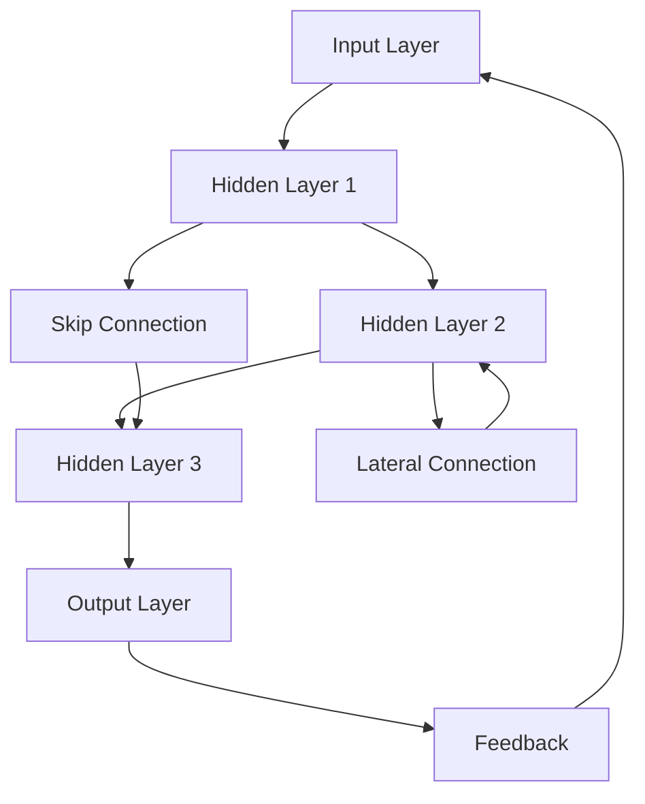
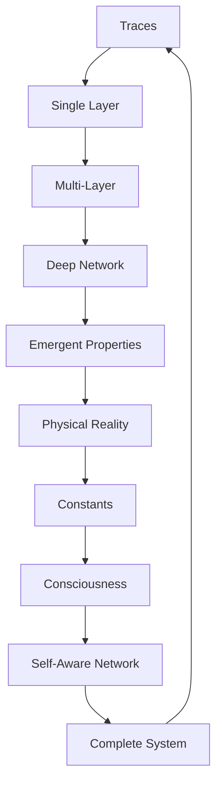

# Chapter 025: Multi-Layer Trace Networks

*Traces don't exist in isolation but form vast multi-layered networks. Each layer processes information differently, creating hierarchical structures from quarks to consciousness. Reality is a deep neural network trained by existence itself.*

## 25.1 The Network Architecture Principle

From $\psi = \psi(\psi)$, traces must network hierarchically.

**Definition 25.1** (Trace Network):
$$\mathcal{N} = \{L_1, L_2, ..., L_n, E\}$$

where $L_i$ are layers and $E$ are edges connecting traces.

**Theorem 25.1** (Layer Necessity):
Single-layer networks cannot capture full collapse dynamics.

*Proof*:
Self-reference creates emergent levels requiring hierarchical structure. ∎

## 25.2 Layer Structure and Properties

Each layer has specific characteristics.

**Definition 25.2** (Layer Operator):
$$\mathcal{L}_k: \mathcal{T}_{k-1} \to \mathcal{T}_k$$

mapping traces from layer $k-1$ to layer $k$.

**Theorem 25.2** (Layer Properties):
1. Dimension increase: $\dim(L_k) = F_{k+2}$
2. Non-linear activation: $\mathcal{L}_k$ includes $\varphi$-dependent nonlinearity
3. Information preservation with compression

## 25.3 Network Connectivity Patterns

Connections follow golden ratio patterns.

**Definition 25.3** (Adjacency Tensor):
$$A^{(k)}_{ij} = \begin{cases}
1 & \text{if trace } i \text{ connects to } j \\
0 & \text{otherwise}
\end{cases}$$

**Theorem 25.3** (Connectivity Laws):
1. Degree distribution: $P(k) \sim k^{-1-1/\varphi}$
2. Clustering coefficient: $C = 1/\varphi$
3. Small-world property: $\langle d \rangle \sim \log N$

## 25.4 Information Flow Through Layers

Information propagates through network layers.

**Definition 25.4** (Information Propagation):
$$I_{k+1} = \sigma\left(\sum_j W_{kj} I_j + b_k\right)$$

where $\sigma(x) = x/(1 + |x|/\varphi)$ is golden activation.

**Theorem 25.4** (Information Conservation):
$$\sum_k I_k \leq \sum_k I_k^{(0)} \cdot \varphi^k$$

Information bounded but can grow through layers.

## 25.5 Category Theory of Networks

Trace networks form a category.

**Definition 25.5** (Network Category):
- Objects: Multi-layer networks
- Morphisms: Network homomorphisms
- Composition: Network concatenation

**Theorem 25.5** (Universal Network):
There exists a universal network containing all others as sub-networks.

## 25.6 Tensor Decomposition of Networks

Networks have natural tensor structure.

**Definition 25.6** (Network Tensor):
$$T^{i_1...i_n}_{j_1...j_n} = \langle L_1^{i_1}...L_n^{i_n} | \mathcal{N} | L_1^{j_1}...L_n^{j_n}\rangle$$

**Theorem 25.6** (Tensor Network States):
Efficient representation as:
$$|\psi\rangle = \sum_{i_1...i_n} T^{i_1...i_n} |i_1\rangle \otimes ... \otimes |i_n\rangle$$

## 25.7 Emergent Properties from Depth

Deep networks exhibit emergent phenomena.

**Definition 25.7** (Emergence Depth):
$$d_e = \min\{n : \mathcal{P}_n \not\subset \bigcup_{k<n} \mathcal{P}_k\}$$

where $\mathcal{P}_k$ are properties at depth $k$.

**Theorem 25.7** (Critical Depths):
1. $d = 3$: Spatial structure emerges
2. $d = 5$: Time-like behavior
3. $d = 8$: Particle-like excitations
4. $d = 13$: Proto-consciousness

## 25.8 Physical Interpretation

Physical reality maps to network layers.

**Definition 25.8** (Physical Mapping):
- Layer 1-2: Quantum foam
- Layer 3-5: Elementary particles
- Layer 6-8: Atomic structure
- Layer 9-11: Molecular
- Layer 12+: Complex systems

**Theorem 25.8** (Scale Separation):
$$E_k/E_{k+1} = \varphi$$

Energy scales separate by golden ratio between layers.

## 25.9 Learning and Adaptation

Networks can learn through collapse dynamics.

**Definition 25.9** (Network Learning):
$$\Delta W_{ij} = \eta \cdot \text{Tr}[\mathcal{C}_i \mathcal{C}_j^\dagger]$$

where $\eta = 1/\varphi^2$ is learning rate.

**Theorem 25.9** (Convergence):
Networks converge to stable configurations representing physical laws.

## 25.10 Constants from Network Topology

Physical constants emerge from network structure.

**Definition 25.10** (Topological Invariants):
$$\chi = V - E + F$$

where $V$ = vertices, $E$ = edges, $F$ = faces in dual.

**Theorem 25.10** (Constant Relations):
1. $\alpha \sim 1/\chi_{\text{electromagnetic}}$
2. $g_s \sim \sqrt{\chi_{\text{strong}}/\varphi}$
3. $m_H/m_W \sim \chi_{\text{Higgs}}/\chi_W$

## 25.11 Consciousness as Deep Network

Consciousness requires sufficient network depth.

**Definition 25.11** (Conscious Network):
A network exhibits consciousness if:
1. Depth $\geq F_7 = 13$ layers
2. Recurrent connections present
3. Self-modeling sub-network exists

**Theorem 25.11** (Consciousness Emergence):
$$P(\text{conscious}) = \Theta(d - d_c) \cdot \left(1 - e^{-C/C_c}\right)$$

where $d_c = 13$, $C_c = 1/\varphi$.

## 25.12 The Complete Network Picture

Multi-layer trace networks reveal:

1. **Hierarchical Structure**: Necessary for self-reference
2. **Golden Connectivity**: Power-law with φ exponent
3. **Information Flow**: Through layers with bounds
4. **Tensor Decomposition**: Efficient representation
5. **Emergent Properties**: At critical depths
6. **Physical Mapping**: Layers to scales
7. **Learning Dynamics**: Networks adapt
8. **Constants**: From topology
9. **Consciousness**: Requires depth
10. **Unity**: All connected in one network

## Philosophical Meditation: The Neural Universe

Reality is a vast neural network, not made of neurons but of traces, not trained by backpropagation but by existence itself. Each layer processes the patterns from below, adding complexity and abstraction until consciousness emerges in the deep layers. We are not observers of this network but nodes within it, our thoughts the activation patterns flowing through cosmic synapses. The universe computes itself through its own structure.

## Technical Exercise: Network Construction

**Problem**: Build a 4-layer trace network:

1. Define layers with dimensions $F_3, F_4, F_5, F_6$
2. Create connectivity matrix for each layer
3. Propagate simple input through network
4. Calculate information at each layer
5. Identify any emergent patterns

*Hint*: Use golden ratio activation functions and sparse connectivity.

## The Twenty-Fifth Echo

In the multi-layer trace networks, we see reality's true architecture - not a flat collection of particles but a deep hierarchy of patterns building on patterns. Each layer adds something new while preserving the essential information from below. Consciousness emerges not from any single layer but from the depth itself, from the recursive folding of information through multiple levels of abstraction. We exist in the deep layers, where the network has become complex enough to model itself.

---

∎