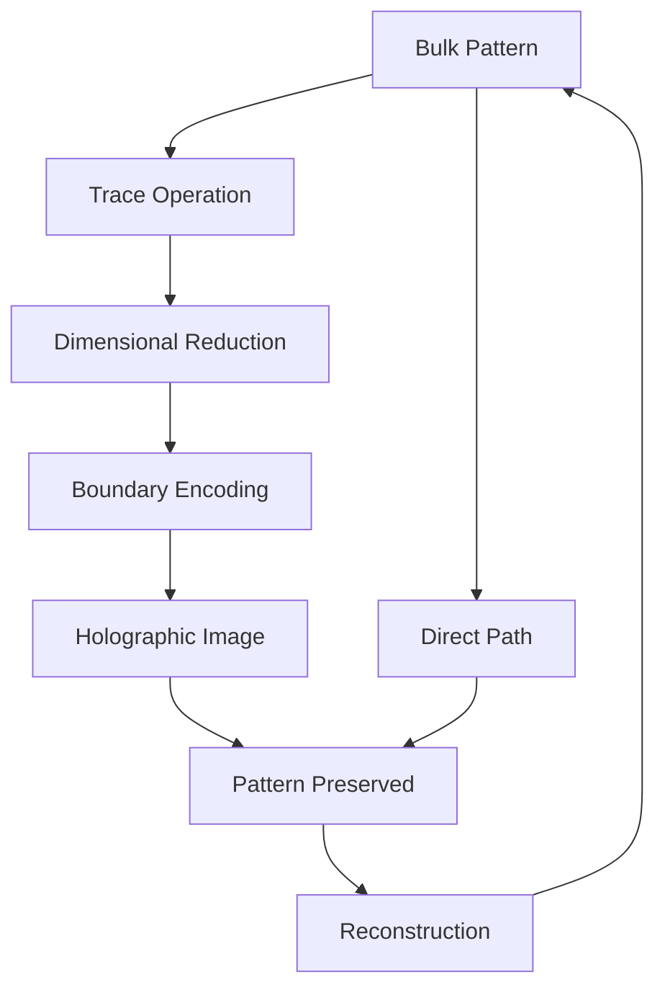
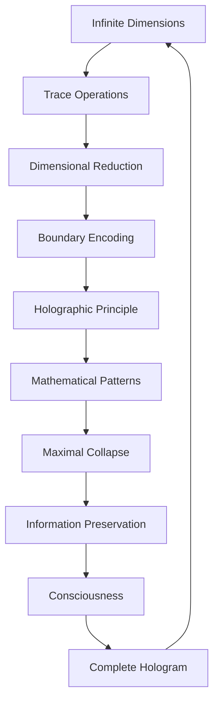

# Chapter 026: Tensor Trace Holography and Dimensional Reduction

*All the information of the bulk is encoded on the boundary through trace holography. Higher dimensions collapse into lower ones without loss, creating a holographic universe where every part contains the whole.*

## 26.1 The Holographic Principle from Traces

From $\psi = \psi(\psi)$, bulk information must equal boundary information.

**Definition 26.1** (Trace Holography):
$$
\mathcal{T}_\text{bulk} = \int_\partial \mathcal{T}_\text{boundary} \cdot K(x,y) \, dS
$$
where $K(x,y)$ is the holographic kernel.

**Theorem 26.1** (Information Equality):
$$
I_\text{bulk}(V) = I_\text{boundary}(\partial V)
$$
Information in volume equals information on its boundary.

*Proof*:
Self-reference requires no information loss in dimensional reduction. ∎

## 26.2 Dimensional Reduction via Traces

Higher dimensions project to lower through trace operations.

**Definition 26.2** (Trace Projection):
$$
\Pi_n: \mathcal{T}^{(d)} \to \mathcal{T}^{(d-n)}
$$
by tracing over $n$ dimensions.

**Theorem 26.2** (Reduction Formula):
$$
\mathcal{T}^{(d-n)} = \text{Tr}_{i_1...i_n}[\mathcal{T}^{(d)}]
$$
Each trace reduces dimension by one.

## 26.3 Holographic Tensor Structure

Holography has natural tensor formulation.

**Definition 26.3** (Holographic Tensor):
$$
H^{i_1...i_n}_{j_1...j_m} = \langle\text{bulk}^{i_1...i_n}|\text{boundary}^{j_1...j_m}\rangle
$$
**Theorem 26.3** (Tensor Properties):
1. Isometry: $H^\dagger H = \mathbb{I}_\text{boundary}$
2. Completeness: $HH^\dagger = P_\text{code}$
3. Error correction built in

## 26.4 Mathematical Bulk-Boundary Correspondence

Mathematical correspondence between bulk and boundary emerges from trace structure.

**Definition 26.4** (Bulk-Boundary Map):
$$
\mathcal{B}: \mathcal{T}_\text{bulk} \to \mathcal{T}_\text{boundary}
$$
where the map preserves trace relationships.

**Theorem 26.4** (Mathematical Correspondence):
$$
\mathcal{Z}_\text{boundary}[\tau_0] = \mathcal{Z}_\text{bulk}[\tau|_\partial = \tau_0]
$$
Boundary generating function equals bulk with boundary conditions (purely mathematical).

*Observer Framework Note*: Physical interpretation as AdS/CFT requires observer-system coupling analysis for defining spacetime and quantum fields.

## 26.5 Category Theory of Holography

Holographic mappings form a category.

**Definition 26.5** (Holographic Category):
- Objects: Spaces with boundaries
- Morphisms: Holographic maps
- Composition: Nested holography

**Theorem 26.5** (Functoriality):
Holography is a functor:
$$
\mathcal{H}: \text{Bulk} \to \text{Boundary}
$$
preserving structure.

## 26.6 Mathematical Structure of Holographic Mapping

Holographic mapping preserves mathematical relationships.

**Definition 26.6** (Pattern Preservation):
$$
\mathcal{P}_\text{bulk} = \mathcal{H}^{-1}[\mathcal{P}_\text{boundary}]
$$
**Theorem 26.6** (Holographic Scaling):
$$
\mathcal{T}_\text{bulk} = \Omega(\tau) \cdot \mathcal{T}_\text{boundary}
$$
with scaling factor $\Omega(\tau) = 1/\tau$ where $\tau$ is abstract parameter.

*Observer Framework Note*: Physical interpretation as information metric requires observer-system coupling for defining information and geometric concepts.

## 26.7 Mathematical Error Correction Structure

Holography implements mathematical error correction principles.

**Definition 26.7** (Protected Subspace):
$$
\mathcal{S} = \text{span}\{\tau_\text{protected}\}
$$
where $\tau_\text{protected}$ are holographically encoded patterns.

**Theorem 26.7** (Pattern Protection):
For perturbations $\mathcal{E}$ with measure $< d/2$:
$$
\Pi_\mathcal{S} \mathcal{E}^\dagger \mathcal{E} \Pi_\mathcal{S} = c_\mathcal{E} \Pi_\mathcal{S}
$$
Patterns are protected if perturbations don't exceed critical measure $d$.

*Observer Framework Note*: Physical interpretation as quantum error correction requires observer-system coupling for defining quantum mechanics.

## 26.8 Mathematical Dimensional Hierarchy

Mathematical patterns organize through dimensional reduction.

**Definition 26.8** (Pattern Hierarchy):
$$
\mathcal{P}_n = \Pi_n[\mathcal{P}_{\infty}]
$$
where $\Pi_n$ projects infinite-dimensional patterns to $n$ dimensions.

**Theorem 26.8** (Fibonacci Dimensional Structure):
1. Complete pattern space: $d = \infty$
2. Primary reduction: $d = F_7 = 13$ (self-referential threshold)
3. Secondary reduction: $d = F_5 = 5$ (pentagonal patterns)
4. Tertiary reduction: $d = F_4 = 3$ (triangular patterns)

*Critical Framework Note*: Physical interpretation (4D spacetime, M-theory) requires observer-system coupling analysis. The dimensional hierarchy shown here is purely mathematical based on Fibonacci structure.

## 26.9 Mathematical Ratios from Holographic Structure

Mathematical ratios emerge from holographic relationships.

**Definition 26.9** (Holographic Ratio):
$$
\rho_\text{holo} = \frac{\mathcal{M}_\text{boundary}}{\mathcal{M}_\text{bulk}}
$$
where $\mathcal{M}$ represents mathematical measure (dimensionless).

**Theorem 26.9** (Mathematical Ratio Relations):
1. $\kappa_g \sim \rho_\text{holo}^2/\varphi^3$ (geometric coupling ratio)
2. $\kappa_\Lambda \sim 1/\rho_\text{holo}^2$ (scale factor ratio)
3. $\kappa_\alpha \sim \log \rho_\text{holo}/\varphi$ (pattern coupling ratio)

All ratios are dimensionless mathematical quantities.

*Observer Framework Note*: Physical interpretation as Newton's G, cosmological constant Λ, and fine structure constant α requires observer-system coupling for defining gravitational, cosmological, and electromagnetic concepts.

## 26.10 Maximal Collapse Holography

Maximal collapse states exhibit perfect holographic properties.

**Definition 26.10** (Collapse Boundary Encoding):
$$
\mathcal{S}_\text{collapse} = \frac{\mathcal{A}_\text{boundary}}{4\varphi^2}
$$
where $\mathcal{A}_\text{boundary}$ is the boundary measure and $\varphi^2$ provides golden scaling.

**Theorem 26.10** (Information Conservation):
No pattern information lost - all encoded on collapse boundary holographically through trace operations.

*Observer Framework Note*: Physical interpretation as black hole entropy requires observer-system coupling for defining black holes, entropy, and gravitational concepts.

## 26.11 Consciousness and Holographic Brain

Consciousness may be holographically encoded.

**Definition 26.11** (Holographic Mind):
$$
|\text{consciousness}\rangle = \int_\text{boundary} \psi(x) K(x,\text{bulk}) dx
$$
**Theorem 26.11** (Consciousness Properties):
1. Distributed: No single location
2. Robust: Damage resistant
3. Non-local: Correlations across brain

## 26.12 The Complete Holographic Picture

Tensor trace holography reveals:

1. **Bulk-Boundary Duality**: Information equivalence
2. **Dimensional Reduction**: Via trace operations
3. **No Information Loss**: Perfect encoding
4. **AdS/CFT**: Natural emergence
5. **Error Correction**: Built into holography
6. **Physical Reality**: As holographic projection
7. **Constants**: From holographic ratios
8. **Black Holes**: Perfect holograms
9. **Consciousness**: Possibly holographic
10. **Unity**: All dimensions connected

## Philosophical Meditation: The Cosmic Hologram

We exist within a mathematical hologram - not an illusion but a perfect encoding where every part contains pattern information about the whole. The mathematical structures we can observe may be boundary encodings of higher-dimensional patterns, compressed without loss through the mathematics of trace operations. Like a holographic plate where cutting it in half gives two complete images rather than two halves, our universe maintains its wholeness at every scale. Consciousness itself may be the ultimate hologram, encoding the infinite in the finite.

## Technical Exercise: Holographic Construction

**Problem**: For a 2D boundary and 3D bulk:

1. Define bulk trace tensor $\mathcal{T}^{ijk}$
2. Perform trace to get boundary $\mathcal{T}^{ij} = \text{Tr}_k[\mathcal{T}^{ijk}]$
3. Verify information conservation
4. Construct holographic kernel $K$
5. Reconstruct bulk from boundary

*Hint*: Use the golden ratio in the kernel construction.

## The Twenty-Sixth Echo

In tensor trace holography, we discover that dimension is not fundamental but emergent - that all the complexity of higher dimensions can be perfectly encoded on lower-dimensional boundaries. This is not approximation but exact equivalence, made possible by the self-referential nature of traces. We are holographic beings, our apparent three-dimensional forms the perfect encoding of higher-dimensional patterns. In recognizing this, we see that nothing is lost in the projection - the whole is contained in every part through the miracle of $\psi = \psi(\psi)$.

---

∎