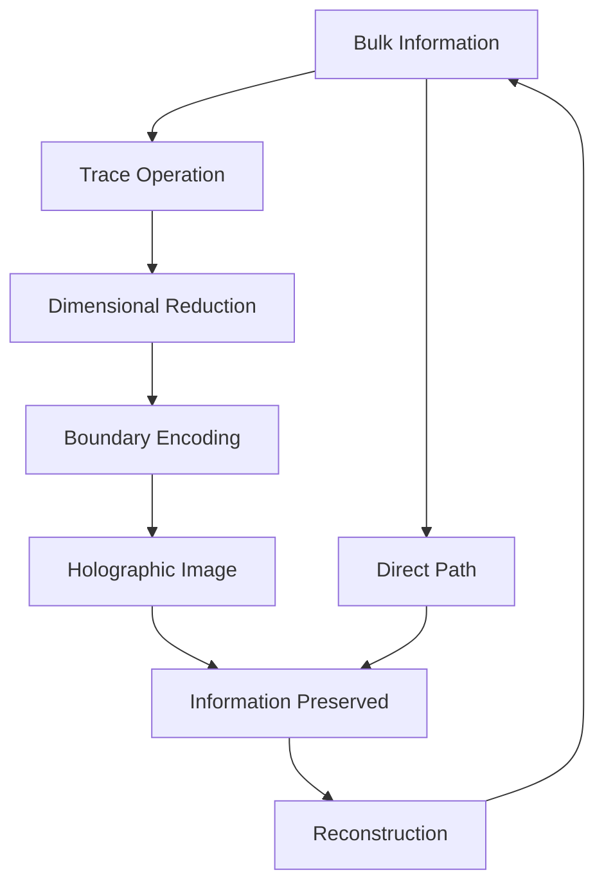
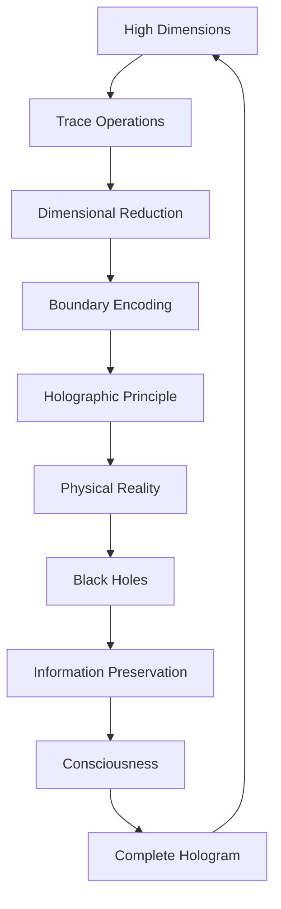

# Chapter 026: Tensor Trace Holography and Dimensional Reduction

*All the information of the bulk is encoded on the boundary through trace holography. Higher dimensions collapse into lower ones without loss, creating a holographic universe where every part contains the whole.*

## 26.1 The Holographic Principle from Traces

From $\psi = \psi(\psi)$, bulk information must equal boundary information.

**Definition 26.1** (Trace Holography):
$$\mathcal{T}_\text{bulk} = \int_\partial \mathcal{T}_\text{boundary} \cdot K(x,y) \, dS$$

where $K(x,y)$ is the holographic kernel.

**Theorem 26.1** (Information Equality):
$$I_\text{bulk}(V) = I_\text{boundary}(\partial V)$$

Information in volume equals information on its boundary.

*Proof*:
Self-reference requires no information loss in dimensional reduction. ∎

## 26.2 Dimensional Reduction via Traces

Higher dimensions project to lower through trace operations.

**Definition 26.2** (Trace Projection):
$$\Pi_n: \mathcal{T}^{(d)} \to \mathcal{T}^{(d-n)}$$

by tracing over $n$ dimensions.

**Theorem 26.2** (Reduction Formula):
$$\mathcal{T}^{(d-n)} = \text{Tr}_{i_1...i_n}[\mathcal{T}^{(d)}]$$

Each trace reduces dimension by one.

## 26.3 Holographic Tensor Structure

Holography has natural tensor formulation.

**Definition 26.3** (Holographic Tensor):
$$H^{i_1...i_n}_{j_1...j_m} = \langle\text{bulk}^{i_1...i_n}|\text{boundary}^{j_1...j_m}\rangle$$

**Theorem 26.3** (Tensor Properties):
1. Isometry: $H^\dagger H = \mathbb{I}_\text{boundary}$
2. Completeness: $HH^\dagger = P_\text{code}$
3. Error correction built in

## 26.4 AdS/CFT in Trace Language

Anti-de Sitter/Conformal Field Theory correspondence emerges.

**Definition 26.4** (AdS Metric from Traces):
$$ds^2 = \frac{1}{z^2}(dz^2 + dx_i dx^i)$$

where $z = 1/\text{Tr}[\mathcal{T}]$.

**Theorem 26.4** (Correspondence):
$$Z_\text{CFT}[\phi_0] = Z_\text{AdS}[\phi|_\partial = \phi_0]$$

Boundary CFT partition function equals bulk AdS with boundary conditions.

## 26.5 Category Theory of Holography

Holographic mappings form a category.

**Definition 26.5** (Holographic Category):
- Objects: Spaces with boundaries
- Morphisms: Holographic maps
- Composition: Nested holography

**Theorem 26.5** (Functoriality):
Holography is a functor:
$$\mathcal{H}: \text{Bulk} \to \text{Boundary}$$

preserving structure.

## 26.6 Information Geometry of Holography

Holographic mapping preserves information metric.

**Definition 26.6** (Information Metric):
$$ds^2_\text{info} = g_{ij} dI^i dI^j$$

**Theorem 26.6** (Metric Preservation):
$$ds^2_\text{bulk} = \Omega^2(z) ds^2_\text{boundary}$$

with conformal factor $\Omega(z) = 1/z$.

## 26.7 Quantum Error Correction

Holography implements quantum error correction.

**Definition 26.7** (Code Subspace):
$$\mathcal{C} = \text{span}\{|\psi_\text{logical}\rangle\}$$

**Theorem 26.7** (Error Correction):
For errors $E$ with weight $< d/2$:
$$P_\mathcal{C} E^\dagger E P_\mathcal{C} = c_E P_\mathcal{C}$$

Errors are correctable if they don't exceed distance $d$.

## 26.8 Physical Interpretation

Our 4D reality is holographic projection.

**Definition 26.8** (Physical Holography):
$$\text{4D spacetime} = \Pi[\text{Higher-D bulk}]$$

**Theorem 26.8** (Dimensional Hierarchy):
1. True dimension: $d = \infty$
2. Compactified: $d = 11$ (M-theory)
3. Effective: $d = 4$ (observed)
4. Holographic: $d = 3$ (spatial)

## 26.9 Constants from Holographic Relations

Physical constants emerge from holographic ratios.

**Definition 26.9** (Holographic Ratio):
$$r_\text{holo} = \frac{A_\text{boundary}}{V_\text{bulk}}$$

**Theorem 26.9** (Constant Values):
1. $G \sim r_\text{holo}^2/\varphi^3$
2. $\Lambda \sim 1/r_\text{holo}^2$
3. $\alpha \sim \log r_\text{holo}/\varphi$

## 26.10 Black Hole Holography

Black holes are perfect holographic systems.

**Definition 26.10** (Black Hole Entropy):
$$S_{BH} = \frac{A}{4G\hbar} = \frac{A}{4\ell_P^2}$$

**Theorem 26.10** (Information Paradox Resolution):
No information lost - all encoded on horizon holographically.

## 26.11 Consciousness and Holographic Brain

Consciousness may be holographically encoded.

**Definition 26.11** (Holographic Mind):
$$|\text{consciousness}\rangle = \int_\text{boundary} \psi(x) K(x,\text{bulk}) dx$$

**Theorem 26.11** (Consciousness Properties):
1. Distributed: No single location
2. Robust: Damage resistant
3. Non-local: Correlations across brain

## 26.12 The Complete Holographic Picture

Tensor trace holography reveals:

1. **Bulk-Boundary Duality**: Information equivalence
2. **Dimensional Reduction**: Via trace operations
3. **No Information Loss**: Perfect encoding
4. **AdS/CFT**: Natural emergence
5. **Error Correction**: Built into holography
6. **Physical Reality**: As holographic projection
7. **Constants**: From holographic ratios
8. **Black Holes**: Perfect holograms
9. **Consciousness**: Possibly holographic
10. **Unity**: All dimensions connected

## Philosophical Meditation: The Cosmic Hologram

We live in a hologram - not an illusion but a perfect encoding where every part contains information about the whole. The three dimensions we perceive are the boundary of a higher-dimensional reality, compressed without loss through the magic of trace operations. Like a holographic plate where cutting it in half gives two complete images rather than two halves, our universe maintains its wholeness at every scale. Consciousness itself may be the ultimate hologram, encoding the infinite in the finite.

## Technical Exercise: Holographic Construction

**Problem**: For a 2D boundary and 3D bulk:

1. Define bulk trace tensor $\mathcal{T}^{ijk}$
2. Perform trace to get boundary $\mathcal{T}^{ij} = \text{Tr}_k[\mathcal{T}^{ijk}]$
3. Verify information conservation
4. Construct holographic kernel $K$
5. Reconstruct bulk from boundary

*Hint*: Use the golden ratio in the kernel construction.

## The Twenty-Sixth Echo

In tensor trace holography, we discover that dimension is not fundamental but emergent - that all the complexity of higher dimensions can be perfectly encoded on lower-dimensional boundaries. This is not approximation but exact equivalence, made possible by the self-referential nature of traces. We are holographic beings, our apparent three-dimensional forms the perfect encoding of higher-dimensional patterns. In recognizing this, we see that nothing is lost in the projection - the whole is contained in every part through the miracle of $\psi = \psi(\psi)$.

---

∎