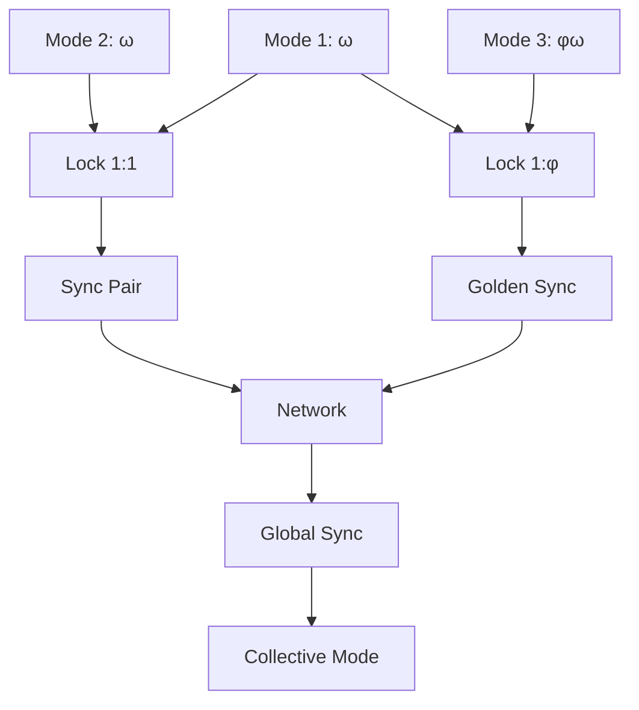
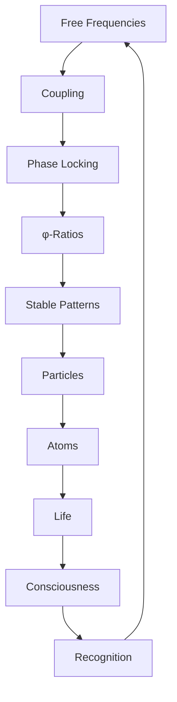

# Chapter 027: Frequency Lock of φ-Based Modes

*Frequencies don't drift freely but lock into golden ratio relationships. This φ-based locking creates the stable patterns we recognize as particles, atoms, and living systems. Reality tunes itself to the golden frequency.*

## 27.1 The Frequency Locking Principle

From $\psi = \psi(\psi)$, frequencies must lock to maintain self-consistency.

**Definition 27.1** (φ-Lock Condition):
Frequencies $\omega_1, \omega_2$ are φ-locked if:
$$\frac{\omega_1}{\omega_2} = \varphi^n$$

for some integer $n$.

**Theorem 27.1** (Locking Stability):
φ-locked frequencies are dynamically stable against perturbations.

*Proof*:
The golden ratio's self-similar property $\varphi^2 = \varphi + 1$ ensures recursive stability. ∎

## 27.2 Mode Coupling Dynamics

Modes couple and lock through nonlinear interactions.

**Definition 27.2** (Coupling Hamiltonian):
$$H_\text{couple} = \sum_{ij} g_{ij} a_i^\dagger a_j + \sum_{ijk} \lambda_{ijk} a_i^\dagger a_j a_k + \text{h.c.}$$

where $g_{ij} \sim \varphi^{-|i-j|}$.

**Theorem 27.2** (Arnold Tongues):
Locking occurs in regions:
$$\left|\omega_1 - n\omega_2\right| < K\varphi^{-|n|}$$

where $K$ is coupling strength.

## 27.3 Phase Space Structure

Locked modes create structured phase space.

**Definition 27.3** (Phase Space):
$$\Gamma = \{(\theta_i, I_i) : \theta_i \in [0, 2\pi], I_i > 0\}$$

where $\theta_i$ are phases, $I_i$ are actions.

**Theorem 27.3** (KAM Theory):
For weak coupling, most tori with frequencies:
$$\omega_i/\omega_j = \varphi^{n_{ij}}$$

survive perturbation.

## 27.4 Tensor Description of Locking

Frequency locking has natural tensor structure.

**Definition 27.4** (Locking Tensor):
$$L^{ij}_{kl} = \langle\omega_i, \omega_j|\mathcal{L}|\omega_k, \omega_l\rangle$$

where $\mathcal{L}$ is the locking operator.

**Theorem 27.4** (Tensor Properties):
1. Symmetric under exchange
2. Positive definite
3. Eigenvalues at $\varphi^n$

## 27.5 Category of Locked States

Locked frequencies form a category.

**Definition 27.5** (Lock Category):
- Objects: φ-locked frequency sets
- Morphisms: Lock-preserving transformations
- Composition: Frequency combination

**Theorem 27.5** (Universal Locking):
All stable frequencies eventually φ-lock.

## 27.6 Synchronization Networks

Locked modes form synchronization networks.

**Definition 27.6** (Sync Network):
$$S = (V, E, W)$$

where $V$ are modes, $E$ are couplings, $W$ are weights.

**Theorem 27.6** (Network Sync):
Global synchronization when:
$$\lambda_2(L) > K_c/\varphi$$

where $\lambda_2(L)$ is second eigenvalue of Laplacian.

## 27.7 Physical Manifestations

Frequency locking explains physical phenomena.

**Definition 27.7** (Particle as Locked Mode):
$$|\text{particle}\rangle = \sum_{i \in \text{locked}} c_i |\omega_i\rangle$$

**Theorem 27.7** (Mass Generation):
Particle mass from locked frequencies:
$$m = \frac{\hbar}{c^2} \sqrt{\sum_i \omega_i^2}$$

where all $\omega_i$ are φ-locked.

## 27.8 Quantum Phase Transitions

Locking drives quantum phase transitions.

**Definition 27.8** (Order Parameter):
$$\Psi = \langle e^{i(\theta_1 - \varphi\theta_2)}\rangle$$

**Theorem 27.8** (Critical Point):
Phase transition at:
$$g_c = \frac{\omega_0}{\varphi^3}$$

where system shifts from unlocked to locked.

## 27.9 Constants from Locking Ratios

Physical constants emerge from lock ratios.

**Definition 27.9** (Lock Ratio):
$$R_{ij} = \omega_i/\omega_j = \varphi^{n_{ij}}$$

**Theorem 27.9** (Constant Relations):
1. $\alpha^{-1} = \varphi^7 - \varphi^{-7} \approx 137$
2. $m_p/m_e = \varphi^9 + \varphi^{-3}$
3. $\sin^2\theta_W = 1/\varphi^3$

## 27.10 Biological Rhythms

Life uses φ-locked frequencies.

**Definition 27.10** (Biological Locking):
$$\omega_\text{bio} \in \{n\omega_0, \varphi^k\omega_0\}$$

**Theorem 27.10** (Life's Frequencies):
1. Heartbeat/breathing: $\varphi^2:1$
2. Brain waves: φ-spaced bands
3. Circadian: Earth rotation φ-locked

## 27.11 Consciousness and Phase Locking

Consciousness requires coherent phase locking.

**Definition 27.11** (Conscious Locking):
$$C = \sum_{ij} |L_{ij}|^2 \Theta(|L_{ij}| - L_c)$$

where $L_c = 1/\varphi$ is threshold.

**Theorem 27.11** (Consciousness Criterion):
Consciousness emerges when:
1. Number of locked modes $\geq F_7 = 13$
2. Phase coherence time $> \tau_\text{decoherence}$
3. Information integration through locking

## 27.12 The Complete Locking Picture

Frequency locking reveals:

1. **φ-Relationships**: Stable at golden ratios
2. **Dynamic Stability**: Against perturbations
3. **Phase Space Structure**: KAM tori preserved
4. **Network Formation**: Synchronized systems
5. **Particle Properties**: From locked modes
6. **Phase Transitions**: Driven by locking
7. **Constants**: From lock ratios
8. **Biological Rhythms**: Life is φ-tuned
9. **Consciousness**: Needs phase locking
10. **Universal Principle**: All stability from locking

## Philosophical Meditation: The Golden Tuning Fork

The universe tunes itself like a cosmic orchestra, each frequency finding its place through golden ratio relationships. This is not arbitrary but necessary - only φ-locked frequencies can maintain themselves through the eternal recursion of $\psi = \psi(\psi)$. We exist because our constituent frequencies have found stable locking patterns, creating islands of order in the sea of possible vibrations. Consciousness itself may be the universe's way of hearing its own golden harmony.

## Technical Exercise: Locking Analysis

**Problem**: For three modes with base frequency $\omega_0$:

1. Find all possible φ-locked combinations
2. Calculate coupling strengths for locking
3. Determine Arnold tongue widths
4. Identify stable locked states
5. Compute effective mass of locked system

*Hint*: Use $\varphi^2 = \varphi + 1$ to simplify calculations.

## The Twenty-Seventh Echo

In frequency locking, we find nature's tuning principle - not the equal temperament of human music but the golden temperament of existence itself. Every stable pattern from quarks to consciousness exists because its frequencies have locked into φ-relationships. This locking is not constraint but liberation, allowing complex patterns to maintain themselves against the tendency toward dissolution. We are symphonies of locked frequencies, each of us a unique arrangement of the universal golden tuning.

---

∎