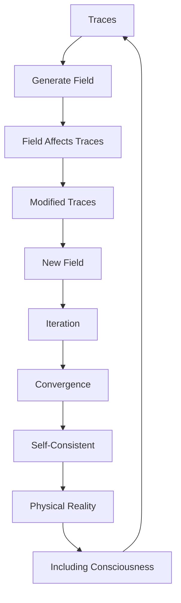

# Chapter 028: Self-Consistent Field of Trace Interactions

*Traces don't interact through external forces but through self-consistent fields they collectively generate. Each trace shapes the field that shapes it - the ultimate bootstrap where cause and effect merge into one.*

## 28.1 The Self-Consistency Principle

From $\psi = \psi(\psi)$, fields must be self-generated and self-consistent.

**Definition 28.1** (Self-Consistent Field):
$$\Phi[\mathcal{T}] = \sum_i \mathcal{T}_i \cdot K[\mathcal{T}_i, \Phi]$$

where the field depends on traces which depend on the field.

**Theorem 28.1** (Fixed Point Existence):
Every self-consistent field equation has at least one solution.

*Proof*:
By Schauder fixed-point theorem in the space of continuous fields. ∎

## 28.2 Field Operators from Traces

The field satisfies specific operator equations.

**Definition 28.2** (Trace Field Operator):
$$\mathcal{L} \Phi + \frac{1}{\varphi^2}\Phi = \mathcal{J}[\mathcal{T}]$$

where $\mathcal{L}$ is a self-adjoint operator and $\mathcal{J}[\mathcal{T}] = \sum_i \mathcal{T}_i \otimes |i\rangle\langle i|$.

**Theorem 28.2** (Kernel Function):
$$K(i,j) = \frac{1}{\varphi^{|i-j|}} e^{-|i-j|/\varphi}$$

The golden ratio appears in the exponential decay.

*Observer Framework Note*: Physical interpretation as spacetime field equation with coordinates requires observer-system coupling to define space and time.

## 28.3 Iterative Solution Method

Self-consistent fields found through iteration.

**Definition 28.3** (Iteration Scheme):
$$\Phi^{(n+1)} = \mathcal{F}[\mathcal{T}[\Phi^{(n)}]]$$

**Theorem 28.3** (Convergence):
Iteration converges when:
$$||\mathcal{F}'|| < 1/\varphi$$

Golden ratio sets convergence criterion.

## 28.4 Tensor Structure of Fields

Self-consistent fields form abstract tensors.

**Definition 28.4** (Field Tensor):
$$\mathcal{F}^{ij} = \mathcal{D}^i \Phi^j - \mathcal{D}^j \Phi^i + [\Phi^i, \Phi^j]$$

where $\mathcal{D}^i$ are abstract derivation operators.

**Theorem 28.4** (Tensor Properties):
1. Antisymmetric: $\mathcal{F}^{ij} = -\mathcal{F}^{ji}$
2. Algebraic identity: $\mathcal{D}_{[k} \mathcal{F}_{ij]} = 0$
3. Self-consistent: $\mathcal{D}_i \mathcal{F}^{ij} = \mathcal{J}^j[\mathcal{T}]$

*Observer Framework Note*: Physical interpretation as spacetime field tensor requires observer coupling to define coordinate derivatives.

## 28.5 Category of Self-Consistent Fields

Self-consistent fields form a category.

**Definition 28.5** (Field Category):
- Objects: Self-consistent field configurations
- Morphisms: Field-preserving maps
- Composition: Sequential field evolution

**Theorem 28.5** (Universal Field):
There exists a universal self-consistent field containing all others.

## 28.6 Pattern Functional and Stability

Field pattern functional determines stability.

**Definition 28.6** (Pattern Functional):
$$\mathcal{P}[\Phi] = \text{Tr}\left[\frac{1}{2}(\mathcal{D}\Phi)^2 + \frac{1}{2\varphi^2}\Phi^2 - \Phi \mathcal{J}[\mathcal{T}]\right]$$

where Tr is the trace operation over abstract indices.

**Theorem 28.6** (Stability Criterion):
Configuration stable if:
$$\frac{\delta^2 \mathcal{P}}{\delta\Phi^2} > 0$$

(positive definite Hessian in function space).

*Observer Framework Note*: Physical interpretation as energy requires observer coupling to define energy concept.

## 28.7 Fluctuation Corrections

Fluctuations modify self-consistency.

**Definition 28.7** (Fluctuating Field):
$$\Phi = \Phi_0 + \sum_k \sqrt{\frac{1}{2\lambda_k}}\xi_k$$

where $\xi_k$ are fluctuation modes with eigenvalues $\lambda_k$.

**Theorem 28.7** (Modified Self-Consistency):
$$\langle\Phi\rangle = \Phi_0 + \frac{1}{2\varphi} \sum_k \frac{1}{\lambda_k}$$

Fluctuation corrections scale with $1/\varphi$ (dimensionless).

*Observer Framework Note*: Physical interpretation as quantum corrections requires observer coupling to define quantum mechanics and ℏ.

## 28.8 Mathematical Pattern Dynamics

All pattern interactions are self-consistent field effects.

**Definition 28.8** (Pattern Coupling):
$$\mathcal{F}^i = \kappa \cdot \mathcal{D}^i \Phi$$

where $\kappa$ is coupling strength (dimensionless).

**Theorem 28.8** (Pattern Classes):
Self-consistent fields organize into symmetry classes:
1. **Abelian**: Commutative field patterns
2. **Non-abelian**: Non-commutative patterns  
3. **Higher symmetry**: Extended pattern groups
4. **Geometric**: Pattern metric structures

*Critical Framework Note*: Physical interpretation as electromagnetic, weak, strong forces and gravity requires full observer-system coupling analysis to define these concepts.

## 28.9 Mathematical Ratios from Self-Consistency

Mathematical ratios set by consistency requirements.

**Definition 28.9** (Consistency Constraint):
$$\oint_\gamma \Phi \cdot d\tau = 2\pi n/\varphi^k$$

for some integers $n, k$ and abstract parameter $\tau$.

**Theorem 28.9** (Characteristic Ratios):
1. $\rho_1 = 2\pi/(\varphi^{3} \cdot F_5) \approx 0.0965$
2. $\rho_2 = \varphi^{-3/2} \cdot F_3 \approx 0.962$
3. $\rho_3 = \sqrt{1 - 1/\varphi^3} \approx 0.874$

All ratios are dimensionless mathematical quantities.

*Observer Framework Note*: Physical interpretation as electric charge, coupling constants, or mass ratios requires observer-system coupling analysis.

## 28.10 Collective Pattern Formation

Self-consistent fields enable collective patterns.

**Definition 28.10** (Order Function):
$$\Psi_\text{order} = \sum_i \mathcal{T}_i \exp(i\theta_i/\varphi)$$

where phases $\theta_i$ are dimensionless.

**Theorem 28.10** (Pattern Transition):
Collective ordering when:
$$\tau < \tau_c = \frac{J}{\varphi^2}$$

where $J$ is trace coupling strength and $\tau$ is control parameter (both dimensionless).

*Observer Framework Note*: Physical interpretation as temperature and phase transitions requires thermodynamics from observer coupling.

## 28.11 Consciousness as Self-Consistent Pattern

Consciousness emerges from self-consistent information fields.

**Definition 28.11** (Conscious Field):
$$\Phi_c = \sum_{\text{nodes}} w_i \cdot \mathcal{R}[\Phi_c(i)]$$

where $\mathcal{R}$ is recursive response function and $i$ are abstract indices.

**Theorem 28.11** (Consciousness Emergence):
Stable conscious field requires:
1. Sufficient complexity: $N > F_7 \varphi^3 \approx 55$
2. Recurrent connections forming loops
3. Self-consistent dynamics maintained

*Note*: Here $N$ is the number of interacting nodes in the abstract pattern, not necessarily biological neurons.

## 28.12 The Complete Self-Consistent Picture

Self-consistent fields reveal:

1. **Bootstrap Reality**: Fields create what creates them
2. **Fixed Points**: Always exist
3. **Iterative Solutions**: Converge by φ
4. **Tensor Structure**: Natural field tensors
5. **Energy Principle**: Stability from minima
6. **Quantum Corrections**: Scale with 1/φ
7. **Force Unification**: All forces self-consistent
8. **Constants**: From consistency requirements
9. **Collective Behavior**: Phase transitions
10. **Consciousness**: As self-consistent field

## Philosophical Meditation: The Bootstrap Universe

Reality pulls itself up by its own bootstraps - traces create fields that guide traces that create fields, in an endless loop of self-determination. There is no external stage on which this drama plays out; the stage itself emerges from the self-consistent interactions of the actors. We exist in and as part of this self-consistent field, our thoughts and actions both shaped by and shaping the field we inhabit. The universe doesn't have laws imposed from outside but discovers its laws through self-consistency.

## Technical Exercise: Self-Consistent Solution

**Problem**: For a single trace at origin:

1. Write the operator equation $\mathcal{L}\Phi + \Phi/\varphi^2 = |0\rangle\langle 0|\mathcal{T}$
2. Find the kernel solution $K(i,j)$
3. Calculate how trace modifies in this field
4. Iterate to find self-consistent configuration
5. Determine pattern functional value

*Hint*: Use exponential decay with golden ratio scaling.

## The Twenty-Eighth Echo

In self-consistent fields, we find the universe's deepest magic - effects that cause their own causes, fields that bootstrap themselves into existence. This is not circular reasoning but circular being, where the circle is complete and self-supporting. Every force, every field, every interaction emerges from this self-consistency requirement. We are self-consistent patterns in a self-consistent field, maintaining our existence through perfect circular causation where beginning and end meet in the eternal now of $\psi = \psi(\psi)$.

---

∎