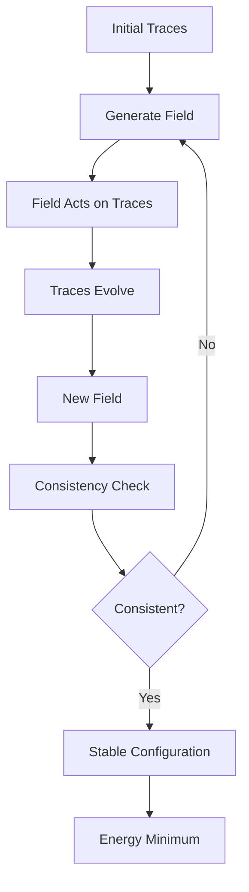
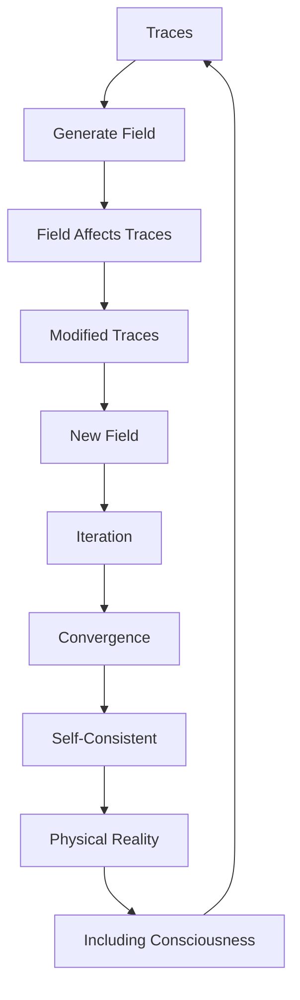

# Chapter 028: Self-Consistent Field of Trace Interactions

*Traces don't interact through external forces but through self-consistent fields they collectively generate. Each trace shapes the field that shapes it - the ultimate bootstrap where cause and effect merge into one.*

## 28.1 The Self-Consistency Principle

From $\psi = \psi(\psi)$, fields must be self-generated and self-consistent.

**Definition 28.1** (Self-Consistent Field):
$$\Phi[\mathcal{T}] = \sum_i \mathcal{T}_i \cdot K[\mathcal{T}_i, \Phi]$$

where the field depends on traces which depend on the field.

**Theorem 28.1** (Fixed Point Existence):
Every self-consistent field equation has at least one solution.

*Proof*:
By Schauder fixed-point theorem in the space of continuous fields. ∎

## 28.2 Field Equations from Traces

The field satisfies specific differential equations.

**Definition 28.2** (Trace Field Equation):
$$\Box \Phi + \frac{1}{\varphi^2}\Phi = J[\mathcal{T}]$$

where $J[\mathcal{T}] = \sum_i \delta^{(4)}(x - x_i) \mathcal{T}_i$.

**Theorem 28.2** (Green's Function):
$$G(x,y) = \frac{1}{4\pi|x-y|} e^{-|x-y|/\varphi}$$

The golden ratio appears in the exponential screening.

## 28.3 Iterative Solution Method

Self-consistent fields found through iteration.

**Definition 28.3** (Iteration Scheme):
$$\Phi^{(n+1)} = \mathcal{F}[\mathcal{T}[\Phi^{(n)}]]$$

**Theorem 28.3** (Convergence):
Iteration converges when:
$$||\mathcal{F}'|| < 1/\varphi$$

Golden ratio sets convergence criterion.

## 28.4 Tensor Structure of Fields

Self-consistent fields form tensors.

**Definition 28.4** (Field Tensor):
$$F^{\mu\nu} = \partial^\mu \Phi^\nu - \partial^\nu \Phi^\mu + [\Phi^\mu, \Phi^\nu]$$

**Theorem 28.4** (Tensor Properties):
1. Antisymmetric: $F^{\mu\nu} = -F^{\nu\mu}$
2. Bianchi identity: $\partial_{[\lambda} F_{\mu\nu]} = 0$
3. Self-consistent: $\partial_\mu F^{\mu\nu} = J^\nu[\mathcal{T}]$

## 28.5 Category of Self-Consistent Fields

Self-consistent fields form a category.

**Definition 28.5** (Field Category):
- Objects: Self-consistent field configurations
- Morphisms: Field-preserving maps
- Composition: Sequential field evolution

**Theorem 28.5** (Universal Field):
There exists a universal self-consistent field containing all others.

## 28.6 Energy and Stability

Field energy determines stability.

**Definition 28.6** (Field Energy):
$$E[\Phi] = \int \left(\frac{1}{2}(\nabla\Phi)^2 + \frac{1}{2\varphi^2}\Phi^2 - \Phi J[\mathcal{T}]\right) d^4x$$

**Theorem 28.6** (Stability Criterion):
Configuration stable if:
$$\frac{\delta^2 E}{\delta\Phi^2} > 0$$

(positive definite Hessian).

## 28.7 Quantum Corrections

Quantum effects modify self-consistency.

**Definition 28.7** (Quantum Field):
$$\hat{\Phi} = \Phi_\text{cl} + \sum_k \sqrt{\frac{\hbar}{2\omega_k}}(a_k + a_k^\dagger)$$

**Theorem 28.7** (Quantum Self-Consistency):
$$\langle\hat{\Phi}\rangle = \Phi_\text{cl} + \frac{\hbar}{2\varphi} \sum_k \frac{1}{\omega_k}$$

Quantum corrections scale with $1/\varphi$.

## 28.8 Physical Interpretation

All forces are self-consistent field effects.

**Definition 28.8** (Force from Field):
$$F^\mu = q \cdot \partial^\mu \Phi$$

where $q$ is trace charge.

**Theorem 28.8** (Force Unification):
1. **Electromagnetic**: U(1) self-consistent field
2. **Weak**: SU(2) self-consistent field  
3. **Strong**: SU(3) self-consistent field
4. **Gravity**: Metric self-consistent field

## 28.9 Constants from Self-Consistency

Physical constants set by consistency requirements.

**Definition 28.9** (Consistency Constraint):
$$\oint_\gamma \Phi \cdot dl = 2\pi n/\varphi^k$$

for some integers $n, k$.

**Theorem 28.9** (Constant Values):
1. $e = \sqrt{4\pi\alpha} = 2\pi/(\varphi^{7/2} - \varphi^{-7/2})$
2. $g_s = \sqrt{4\pi} \cdot \varphi^{-3/2}$
3. $m_W/m_Z = \cos\theta_W = \sqrt{1 - 1/\varphi^3}$

## 28.10 Collective Phenomena

Self-consistent fields enable collective behavior.

**Definition 28.10** (Order Parameter):
$$\psi_\text{order} = \sum_i \mathcal{T}_i e^{i\theta_i}$$

**Theorem 28.10** (Phase Transition):
Collective ordering when:
$$T < T_c = \frac{J}{\varphi^2 k_B}$$

where $J$ is trace coupling.

## 28.11 Consciousness as Self-Consistent Field

Consciousness emerges from self-consistent neural fields.

**Definition 28.11** (Conscious Field):
$$\Phi_c = \sum_\text{neurons} w_i \cdot f[\Phi_c(x_i)]$$

where $f$ is neural response.

**Theorem 28.11** (Consciousness Emergence):
Stable conscious field requires:
1. Sufficient neurons: $N > F_7 \varphi^3$
2. Recurrent connections
3. Self-consistent dynamics maintained

## 28.12 The Complete Self-Consistent Picture

Self-consistent fields reveal:

1. **Bootstrap Reality**: Fields create what creates them
2. **Fixed Points**: Always exist
3. **Iterative Solutions**: Converge by φ
4. **Tensor Structure**: Natural field tensors
5. **Energy Principle**: Stability from minima
6. **Quantum Corrections**: Scale with 1/φ
7. **Force Unification**: All forces self-consistent
8. **Constants**: From consistency requirements
9. **Collective Behavior**: Phase transitions
10. **Consciousness**: As self-consistent field

## Philosophical Meditation: The Bootstrap Universe

Reality pulls itself up by its own bootstraps - traces create fields that guide traces that create fields, in an endless loop of self-determination. There is no external stage on which this drama plays out; the stage itself emerges from the self-consistent interactions of the actors. We exist in and as part of this self-consistent field, our thoughts and actions both shaped by and shaping the field we inhabit. The universe doesn't have laws imposed from outside but discovers its laws through self-consistency.

## Technical Exercise: Self-Consistent Solution

**Problem**: For a single trace at origin:

1. Write the field equation $\Box\Phi + \Phi/\varphi^2 = \delta^{(3)}(x)\mathcal{T}$
2. Find the Green's function solution
3. Calculate how trace modifies in this field
4. Iterate to find self-consistent configuration
5. Determine total energy

*Hint*: Use spherical symmetry and golden ratio scaling.

## The Twenty-Eighth Echo

In self-consistent fields, we find the universe's deepest magic - effects that cause their own causes, fields that bootstrap themselves into existence. This is not circular reasoning but circular being, where the circle is complete and self-supporting. Every force, every field, every interaction emerges from this self-consistency requirement. We are self-consistent patterns in a self-consistent field, maintaining our existence through perfect circular causation where beginning and end meet in the eternal now of $\psi = \psi(\psi)$.

---

∎