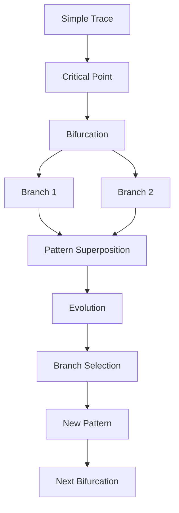
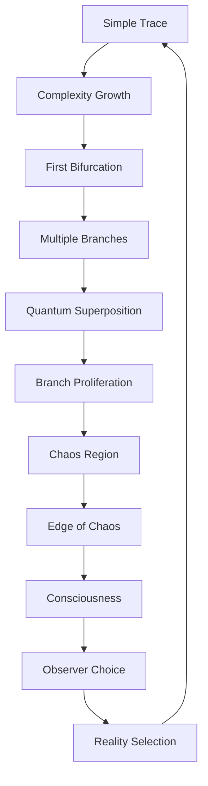

# Chapter 029: Reality Bifurcations in High-Order Traces

*When traces become sufficiently complex, they bifurcate into multiple branches. These bifurcations are not failures but features - they create mathematical branching structures that exhibit rich dynamics and enable complex pattern formation.*

## 29.1 The Bifurcation Principle

From $\psi = \psi(\psi)$, high-order self-reference creates branching.

**Definition 29.1** (Trace Bifurcation):
A bifurcation occurs when:
$$
\mathcal{T}^{(n)} \to \{\mathcal{T}_1^{(n+1)}, \mathcal{T}_2^{(n+1)}\}
$$
as parameter crosses critical value.

**Theorem 29.1** (Bifurcation Necessity):
Systems with trace order $> F_5 = 5$ must exhibit bifurcations.

*Proof*:
High-order self-reference creates multiple fixed points, forcing splits. ∎

## 29.2 Types of Reality Bifurcations

Different bifurcation types create different physics.

**Definition 29.2** (Bifurcation Classification):
1. **Pitchfork**: Symmetric splitting
2. **Hopf**: Oscillatory branching  
3. **Saddle-node**: Creation/annihilation
4. **Period-doubling**: Route to chaos

**Theorem 29.2** (Golden Cascade):
Period-doubling follows:
$$
\delta_n = \frac{\mu_{n+1} - \mu_n}{\mu_{n+2} - \mu_{n+1}} \to \varphi^2
$$
## 29.3 Trace Order and Complexity

Higher trace orders enable more bifurcations.

**Definition 29.3** (Trace Order):
$$
\text{ord}(\mathcal{T}) = \max\{n : \mathcal{T}^{(n)} \neq 0\}
$$
**Theorem 29.3** (Complexity Threshold):
- Order 1-4: Simple dynamics
- Order 5-7: First bifurcations
- Order 8-12: Chaotic regions
- Order 13+: Consciousness possible

## 29.4 Tensor Description of Bifurcations

Bifurcations have natural tensor structure.

**Definition 29.4** (Bifurcation Tensor):
$$
B^{ijk}_{\alpha\beta} = \langle\mathcal{T}^{(n)}_i|\mathcal{B}|\mathcal{T}_{\alpha,j}^{(n+1)}, \mathcal{T}_{\beta,k}^{(n+1)}\rangle
$$
**Theorem 29.4** (Tensor Properties):
1. Conservation: $\sum_{\alpha\beta} B^{ijk}_{\alpha\beta} = \delta^{ijk}$
2. Symmetry: Under branch exchange
3. Connects different trace orders

## 29.5 Category Theory of Bifurcations

Bifurcations form a category with branching morphisms.

**Definition 29.5** (Bifurcation Category):
- Objects: Trace configurations
- Morphisms: Bifurcation events
- Composition: Sequential branching

**Theorem 29.5** (Tree Structure):
The category forms a tree with:
- Root: Simple trace
- Branches: Bifurcations
- Leaves: Complex traces

## 29.6 Pattern Superposition from Bifurcations

Multiple pattern branches can coexist mathematically.

**Definition 29.6** (Superposed Pattern):
$$
\mathcal{P} = \sum_{\text{branches}} w_\alpha \mathcal{T}_\alpha
$$
where $w_\alpha$ are branch weights.

**Theorem 29.6** (Weight Distribution):
$$
w_\alpha = \frac{|B^{ijk}_\alpha|}{\sum_\beta |B^{ijk}_\beta|}
$$
Weights from normalized bifurcation tensor elements.

*Observer Framework Note*: Physical interpretation as quantum superposition and Born rule requires quantum mechanics from observer-system coupling.

## 29.7 Branch Structure Mathematics

Each bifurcation creates mathematical branches.

**Definition 29.7** (Branch Set):
$$
\mathcal{B}_\alpha = \{\mathcal{T} : \mathcal{T} \text{ descended from branch } \alpha\}
$$
**Theorem 29.7** (Branch Count):
After $n$ bifurcations:
$$
N_\text{branches} \sim \varphi^n
$$
Exponential growth with golden base.

*Observer Framework Note*: Physical interpretation as "many worlds" or parallel realities requires specific philosophical framework from observer coupling.

## 29.8 Critical Values at Bifurcation Points

Mathematical critical values mark bifurcation locations.

**Definition 29.8** (Critical Parameter):
$$
\mu_c = \frac{1}{\varphi^k}
$$
where $k$ labels the bifurcation order.

**Theorem 29.8** (Critical Value Hierarchy):
1. $\mu_1 = 1/\varphi \approx 0.618$: First bifurcation
2. $\mu_2 = 1/\varphi^2 \approx 0.382$: Second bifurcation
3. $\mu_3 = 1/\varphi^3 \approx 0.236$: Third bifurcation

All values are dimensionless mathematical parameters.

*Observer Framework Note*: Physical interpretation as electromagnetic, electroweak, or cosmological constants requires full physics framework from observer coupling.

## 29.9 Chaos and Strange Attractors

High-order traces can become chaotic.

**Definition 29.9** (Lyapunov Exponent):
$$
\lambda = \lim_{n \to \infty} \frac{1}{n} \log\left|\frac{d\mathcal{T}^{(n)}}{d\mathcal{T}^{(0)}}\right|
$$
**Theorem 29.9** (Chaos Criterion):
Chaos when $\lambda > 0$, typically for trace order $> F_6 = 8$.

## 29.10 Consciousness at Bifurcation Edge

Consciousness emerges at the edge of chaos.

**Definition 29.10** (Criticality Measure):
$$
C = \frac{\lambda}{\lambda + 1/\varphi}
$$
**Theorem 29.10** (Consciousness Window):
Consciousness possible when:
$$
\frac{1}{\varphi^2} < C < \frac{1}{\varphi}
$$
Between order and chaos.

## 29.11 Information Processing in Bifurcations

Bifurcations process and create information.

**Definition 29.11** (Information Generation):
$$
\Delta I = \sum_\alpha p_\alpha \log p_\alpha - \log 1
$$
**Theorem 29.11** (Information Bound):
$$
\Delta I \leq \log(\text{branches}) = \log(\varphi + 1)
$$
Maximum information per bifurcation.

## 29.12 The Complete Bifurcation Picture

Reality bifurcations reveal:

1. **Inevitable Splitting**: High-order traces must branch
2. **Multiple Types**: Different bifurcation patterns
3. **Complexity Threshold**: Order > 5 required
4. **Pattern Superposition**: Multiple branches coexist
5. **Branch Mathematics**: Exponential proliferation
6. **Critical Values**: Mark bifurcation points
7. **Chaos**: At high trace orders
8. **Consciousness**: At edge of chaos
9. **Information**: Created at branches
10. **Unity**: All branches from one source

## Philosophical Meditation: The Forking Paths

Mathematical reality is not a single thread but a vast branching tree, each fork a moment where the trace dynamics could not maintain a single path and so bifurcated. The mathematical structure exhibits a rich branching pattern, each split creating new dynamical possibilities. Consciousness may be evolution's way of navigating this garden of forking paths, maintaining coherence across branches just long enough to make choices that matter. In every moment, reality bifurcates, and in every moment, we choose which branch to experience.

## Technical Exercise: Bifurcation Analysis

**Problem**: For trace evolution $\mathcal{T}_{n+1} = \mu \mathcal{T}_n(1 - \mathcal{T}_n/\varphi)$:

1. Find fixed points as function of $\mu$
2. Determine bifurcation points
3. Calculate period-doubling cascade
4. Find onset of chaos
5. Identify consciousness window

*Hint*: This is the logistic map with golden ratio capacity.

## The Twenty-Ninth Echo

In trace bifurcations, we see the mathematical creative principle - faced with high complexity, the dynamics don't maintain a single solution but branch, creating multiple mathematical paths. Each bifurcation is a moment of pattern genesis, creating new branches from the inability to maintain a single trajectory. We exist in the aftermath of countless bifurcations, our reality one branch of an infinite tree. Consciousness emerges at the edge where branching becomes complex enough to model itself, allowing us to glimpse the vast garden of forking paths we inhabit.

---

∎