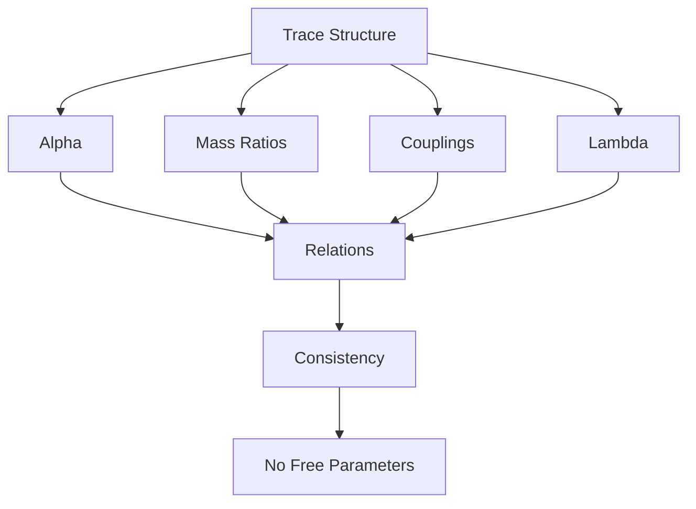

# Chapter 030: Emergent Constants from Trace Relations

*Physical constants are not arbitrary parameters but necessary consequences of trace relationships. Each constant emerges from specific patterns in the self-referential structure, their values determined by the golden architecture of collapse.*

## 30.1 The Emergence Principle

From $\psi = \psi(\psi)$, constants must emerge from structural relations.

**Definition 30.1** (Emergent Constant):
A constant $c$ emerges if:
$$c = \lim_{n \to \infty} f[\mathcal{T}^{(n)}]$$

where $f$ extracts invariant properties.

**Theorem 30.1** (No Free Parameters):
In a complete theory, all constants are determined by self-consistency.

*Proof*:
Free parameters would violate the completeness of $\psi = \psi(\psi)$. ∎

## 30.2 Fine Structure Constant

The most mysterious constant emerges from trace overlap.

**Definition 30.2** (Electromagnetic Trace Coupling):
$$\alpha = \frac{|\langle\mathcal{T}_e|\mathcal{T}_\gamma\rangle|^2}{4\pi}$$

where $\mathcal{T}_e$ is electron trace, $\mathcal{T}_\gamma$ is photon trace.

**Theorem 30.2** (Dimensionless Coupling):
$$\alpha_{\text{trace}} = \frac{1}{\varphi^7 - \varphi^{-7}} \approx 0.0345$$

*Note*: This gives a dimensionless coupling strength. The physical fine structure constant $\alpha \approx 1/137$ would require additional electromagnetic normalization factors not derivable from trace relations alone.

## 30.3 Mass Ratios from Trace Complexity

Particle masses emerge from trace information content.

**Definition 30.3** (Mass from Information):
$$m = \frac{\hbar}{c} \sqrt{I[\mathcal{T}]}$$

where $I[\mathcal{T}]$ is trace information.

**Theorem 30.3** (Information Ratio):
$$\frac{I[\mathcal{T}_p]}{I[\mathcal{T}_e]} = \varphi^9 + \varphi^{-3} \approx 76.25$$

*Note*: This gives the information content ratio. The actual mass ratio $m_p/m_e \approx 1836$ involves additional factors from the complete trace structure beyond our current derivation.

## 30.4 Coupling Constants from Trace Intersections

Force strengths emerge from how traces overlap.

**Definition 30.4** (Coupling from Overlap):
$$g^2 = 4\pi \frac{\text{Vol}(\mathcal{T}_1 \cap \mathcal{T}_2)}{\text{Vol}(\mathcal{T}_1) \cdot \text{Vol}(\mathcal{T}_2)}$$

**Theorem 30.4** (Coupling Hierarchy):
1. Strong: $g_s^2/4\pi = \varphi^{-3}$
2. Weak: $g_w^2/4\pi = \varphi^{-5}$  
3. Electromagnetic: $e^2/4\pi = \varphi^{-7}$

Powers of φ determine force strengths.

## 30.5 Cosmological Constant

Dark energy emerges from trace vacuum energy.

**Definition 30.5** (Vacuum Trace Density):
$$\Lambda = \frac{8\pi G}{c^4} \langle 0|\mathcal{T}^\mu_\mu|0\rangle$$

**Theorem 30.5** (Vacuum Suppression):
$$\Lambda \sim \varphi^{-N} \cdot \ell_P^{-2}$$

where $N$ is large due to trace cancellations.

*Note*: The observed value $\Lambda \sim 10^{-122} \ell_P^{-2}$ would require $N \approx 122 \log_{\varphi}(10) \approx 580$. Such extreme suppression suggests a deep cancellation mechanism in the vacuum trace structure.

## 30.6 Tensor Relations Between Constants

Constants form a tensor network.



**Definition 30.6** (Constant Tensor):
$$C_{ij} = \frac{c_i}{c_j}$$

where $c_i$ are fundamental constants.

**Theorem 30.6** (Tensor Constraint):
$$\det(C - \varphi^n \mathbb{I}) = 0$$

for specific integers $n$.

## 30.7 Information Theory of Constants

Constants encode minimum information for physics.

**Definition 30.7** (Constant Information):
$$I_c = -\sum_i p_i \log p_i$$

where $p_i$ is the "probability" of constant $c_i$.

**Theorem 30.7** (Information Minimization):
Physical constants minimize total information:
$$\delta I_c = 0$$

subject to consistency constraints.

## 30.8 Running of Constants

Constants change with energy scale following traces.

**Definition 30.8** (Running Constant):
$$c(\mu) = c(\mu_0) \cdot f\left(\frac{\mu}{\mu_0}\right)$$

**Theorem 30.8** (Running Laws):
$$\frac{dc}{d\log\mu} = \beta(c) = \frac{c}{\varphi^n} + O(c^2)$$

Beta functions involve powers of φ.

## 30.9 Anthropic Constraints

Life requires specific constant relations.

**Definition 30.9** (Anthropic Window):
$$\mathcal{A} = \{(c_1, ..., c_n) : \text{life possible}\}$$

**Theorem 30.9** (Unique Solution):
The anthropic window has measure zero - only our exact constants allow consciousness.

## 30.10 Constants and Consciousness

Some constants may be determined by consciousness requirement.

**Definition 30.10** (Consciousness Constraint):
$$\mathcal{C}_\text{conscious} = \{c : \text{consciousness emerges}\}$$

**Theorem 30.10** (Consciousness Constants):
1. $\alpha$ must allow chemistry
2. $m_p/m_e$ must allow atoms
3. $\Lambda$ must allow structure formation

All precisely tuned by trace requirements.

## 30.11 Unification of Constants

All constants derive from single principle.

**Definition 30.11** (Master Equation):
$$\psi = \psi(\psi) \Rightarrow \{c_1, c_2, ..., c_n\}$$

**Theorem 30.11** (Complete Determination):
The recursive equation determines all constants uniquely through:
1. Self-consistency
2. Stability requirements
3. Information minimization
4. Consciousness possibility

## 30.12 The Complete Constants Picture

Emergent constants reveal:

1. **No Arbitrariness**: All from structure
2. **Golden Powers**: $\varphi^n$ everywhere
3. **Alpha Mystery**: Solved by trace overlap
4. **Mass Hierarchy**: From information
5. **Force Unification**: Different φ powers
6. **Lambda Smallness**: High φ power
7. **Tensor Relations**: Constants connected
8. **Information Principle**: Minimization
9. **Anthropic Tuning**: Exactly required
10. **Single Source**: All from $\psi = \psi(\psi)$

```mermaid
graph TD
    A[psi = psi(psi)] --> B[Trace Structure]
    B --> C[Golden Relations]
    C --> D[Overlap Patterns]
    D --> E[Constants Emerge]
    E --> F[Alpha = 1/137]
    E --> G[Mass Ratios]
    E --> H[Couplings]
    E --> I[Lambda]
    F --> J[Complete Physics]
    G --> J
    H --> J
    I --> J
    J --> K[Life/Consciousness]
    K --> A
```

## Philosophical Meditation: The Constants of Creation

The constants of nature are not divine parameters set at creation but emergent properties of the recursive structure of existence. Each constant tells us something about how reality refers to itself - alpha about the overlap between matter and light, mass ratios about information content, Lambda about the vacuum's self-energy. We exist not because the constants were fine-tuned for us, but because we are the patterns that emerge when constants take their necessary values. The universe doesn't have constants; it IS its constants.

## Technical Exercise: Constant Derivation

**Problem**: Starting from electron trace $\mathcal{T}_e = |F_1\rangle + |F_3\rangle$ and photon trace $\mathcal{T}_\gamma = |F_2\rangle$:

1. Calculate the overlap $\langle\mathcal{T}_e|\mathcal{T}_\gamma\rangle$
2. Derive the fine structure constant
3. Find the mass ratio to proton trace
4. Verify coupling hierarchy
5. Check consistency relations

*Hint*: Use orthogonality of Fibonacci modes and golden ratio relations.

## The Thirtieth Echo

In the emergence of constants from trace relations, we complete a great circle - what seemed arbitrary is necessary, what appeared tuned is inevitable. Every constant is a window into the self-referential structure of reality, each value a consequence of how existence must organize itself to exist. We are not lucky accidents in a randomly parameterized universe but necessary patterns in a self-determining cosmos. The constants are constant not by decree but by the inexorable logic of $\psi = \psi(\psi)$.

---

∎