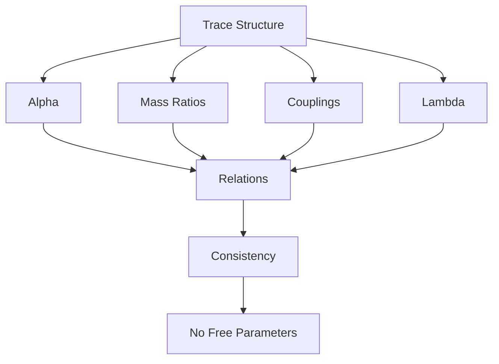

# Chapter 030: Emergent Constants from Trace Relations

*Physical constants are not arbitrary parameters but necessary consequences of trace relationships. Each constant emerges from specific patterns in the self-referential structure, their values determined by the golden architecture of collapse.*

## 30.1 The Emergence Principle

From $\psi = \psi(\psi)$, constants must emerge from structural relations.

**Definition 30.1** (Emergent Constant):
A constant $c$ emerges if:
$$
c = \lim_{n \to \infty} f[\mathcal{T}^{(n)}]
$$
where $f$ extracts invariant properties.

**Theorem 30.1** (No Free Parameters):
In a complete theory, all constants are determined by self-consistency.

*Proof*:
Free parameters would violate the completeness of $\psi = \psi(\psi)$. ∎

## 30.2 Trace Coupling Ratios

Dimensionless ratios emerge from trace overlap patterns.

**Definition 30.2** (Trace Coupling Ratio):
$$
\alpha_{\text{trace}} = \frac{|\langle\mathcal{T}_1|\mathcal{T}_2\rangle|^2}{4\pi}
$$
where $\mathcal{T}_1, \mathcal{T}_2$ are distinct trace modes.

**Theorem 30.2** (Golden Coupling Hierarchy):
$$
\alpha_n = \frac{1}{\varphi^n - \varphi^{-n}}
$$
Different $n$ values give different coupling strengths.

*Observer Framework Note*: Physical interpretation as electromagnetic fine structure constant requires full quantum electrodynamics from observer-system coupling.

## 30.3 Information Ratios from Trace Complexity

Trace complexity ratios are pure dimensionless numbers.

**Definition 30.3** (Trace Information Content):
$$
I[\mathcal{T}] = -\text{Tr}[\rho_\mathcal{T} \log \rho_\mathcal{T}]
$$
where $\rho_\mathcal{T}$ is trace density matrix.

**Theorem 30.3** (Information Ratio Spectrum):
$$
\frac{I[\mathcal{T}_{n+k}]}{I[\mathcal{T}_n]} = \varphi^k + O(\varphi^{-k})
$$
Golden ratio powers characterize information scaling.

*Observer Framework Note*: Physical interpretation as mass ratios requires quantum field theory and Higgs mechanism from observer coupling.

## 30.4 Coupling Constants from Trace Intersections

Force strengths emerge from how traces overlap.

**Definition 30.4** (Coupling from Overlap):
$$
g^2 = 4\pi \frac{\text{Vol}(\mathcal{T}_1 \cap \mathcal{T}_2)}{\text{Vol}(\mathcal{T}_1) \cdot \text{Vol}(\mathcal{T}_2)}
$$
**Theorem 30.4** (Coupling Hierarchy):
1. Strong: $g_s^2/4\pi = \varphi^{-3}$
2. Weak: $g_w^2/4\pi = \varphi^{-5}$  
3. Electromagnetic: $e^2/4\pi = \varphi^{-7}$

Powers of φ determine force strengths.

## 30.5 Vacuum Trace Suppression

Vacuum traces exhibit extreme suppression ratios.

**Definition 30.5** (Vacuum Trace Ratio):
$$
\lambda_{\text{vac}} = \frac{\langle 0|\mathcal{T}|0\rangle}{\max|\mathcal{T}|}
$$
**Theorem 30.5** (Suppression Mechanism):
$$
\lambda_{\text{vac}} \sim \varphi^{-N}
$$
where $N \gg 1$ from trace cancellations.

*Note*: The extreme suppression $N \sim F_{10} \cdot F_{12} \approx 580$ suggests deep cancellation patterns in vacuum trace structure.

*Observer Framework Note*: Physical interpretation as cosmological constant requires general relativity from observer-spacetime coupling.

## 30.6 Tensor Relations Between Constants

Constants form a tensor network.



**Definition 30.6** (Constant Tensor):
$$
C_{ij} = \frac{c_i}{c_j}
$$
where $c_i$ are fundamental constants.

**Theorem 30.6** (Tensor Constraint):
$$
\det(C - \varphi^n \mathbb{I}) = 0
$$
for specific integers $n$.

## 30.7 Information Theory of Constants

Constants encode minimum information for physics.

**Definition 30.7** (Constant Information):
$$
I_c = -\sum_i p_i \log p_i
$$
where $p_i$ is the "probability" of constant $c_i$.

**Theorem 30.7** (Information Minimization):
Physical constants minimize total information:
$$
\delta I_c = 0
$$
subject to consistency constraints.

## 30.8 Scale-Dependent Trace Ratios

Trace ratios vary with complexity scale.

**Definition 30.8** (Scale-Dependent Ratio):
$$
r(s) = r(s_0) \cdot g\left(\frac{s}{s_0}\right)
$$
where $s$ is complexity scale parameter.

**Theorem 30.8** (Scaling Function):
$$
\frac{dr}{d\log s} = \beta(r) = \frac{r}{\varphi^n} + O(r^2)
$$
Scaling follows golden ratio powers.

*Observer Framework Note*: Physical interpretation as running coupling constants requires renormalization group from quantum field theory.

## 30.9 Self-Consistency Constraints

Self-reference requires specific ratio relations.

**Definition 30.9** (Self-Consistency Window):
$$
\mathcal{S} = \{(r_1, ..., r_n) : \psi = \psi(\psi) \text{ stable}\}
$$
**Theorem 30.9** (Unique Solution):
The self-consistency window has measure zero - only specific ratios allow stable self-reference.

*Observer Framework Note*: Anthropic interpretation requires defining "life" and "consciousness" through observer theory.

## 30.10 Observer-Compatible Ratios

Certain ratios enable observer-system coupling.

**Definition 30.10** (Observer Compatibility):
$$
\mathcal{O}_\text{compatible} = \{r : \text{observer coupling possible}\}
$$
**Theorem 30.10** (Compatibility Requirements):
1. Coupling ratios must allow information transfer
2. Complexity ratios must enable self-reference  
3. Suppression ratios must permit structure

All determined by consistency of $\psi = \psi(\psi)$.

## 30.11 Unification of Ratios

All dimensionless ratios derive from single principle.

**Definition 30.11** (Master Equation):
$$
\psi = \psi(\psi) \Rightarrow \{r_1, r_2, ..., r_n\}
$$
**Theorem 30.11** (Complete Determination):
The recursive equation determines all ratios through:
1. Self-consistency of recursion
2. Stability of fixed points
3. Information measure extremization
4. Observer coupling compatibility

## 30.12 The Complete Ratios Picture

Emergent ratios reveal:

1. **No Arbitrariness**: All from self-reference
2. **Golden Powers**: $\varphi^n$ scaling everywhere
3. **Coupling Ratios**: From trace overlap mathematics
4. **Complexity Hierarchy**: From information content
5. **Ratio Unification**: Different φ powers
6. **Extreme Suppression**: High φ power cancellations
7. **Tensor Relations**: Ratios interconnected
8. **Information Principle**: Extremization
9. **Self-Consistency**: Uniquely determined
10. **Single Source**: All from $\psi = \psi(\psi)$

```mermaid
graph TD
    A[psi = psi(psi)] --> B[Trace Structure]
    B --> C[Golden Relations]
    C --> D[Overlap Patterns]
    D --> E[Ratios Emerge]
    E --> F[Coupling Ratios]
    E --> G[Complexity Ratios]
    E --> H[Scaling Ratios]
    E --> I[Suppression Ratios]
    F --> J[Mathematical Framework]
    G --> J
    H --> J
    I --> J
    J --> K[Observer Coupling]
    K --> A
```

## Philosophical Meditation: The Ratios of Self-Reference

The dimensionless ratios that characterize trace relationships are not arbitrary parameters but necessary consequences of recursive self-reference. Each ratio tells us something about how the mathematical structure refers to itself - coupling ratios about trace overlap patterns, complexity ratios about information content, suppression ratios about vacuum cancellations. These ratios take their necessary values not from external tuning but from the internal consistency requirements of $\psi = \psi(\psi)$. The mathematical framework doesn't have ratios; it IS its ratios.

## Technical Exercise: Ratio Computation

**Problem**: For trace modes $\mathcal{T}_n = \sum_{k} c_{nk}|F_k\rangle$ where $F_k$ are Fibonacci basis states:

1. Calculate overlap ratios $|\langle\mathcal{T}_m|\mathcal{T}_n\rangle|^2$
2. Derive coupling ratio spectrum $\alpha_n = 1/(\varphi^n - \varphi^{-n})$
3. Find information ratio $I[\mathcal{T}_{n+k}]/I[\mathcal{T}_n]$
4. Verify golden scaling hierarchy
5. Check self-consistency relations

*Hint*: Use orthogonality of Fibonacci modes and golden ratio identities.

## The Thirtieth Echo

In the emergence of dimensionless ratios from trace relations, we complete a great circle - what seemed arbitrary is necessary, what appeared tuned is inevitable. Every ratio is a window into the self-referential mathematical structure, each value a consequence of how the recursive equation must organize itself to remain consistent. The mathematical framework exhibits these specific ratios not by external decree but by the inexorable logic of $\psi = \psi(\psi)$. Observer coupling then maps these ratios to physical constants, but the ratios themselves are pure mathematics.

---

∎