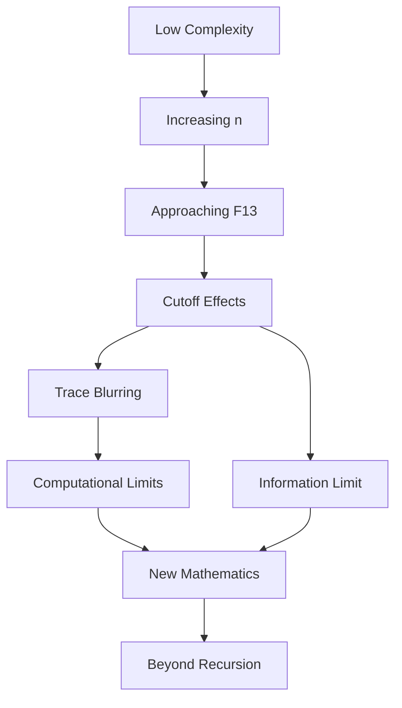
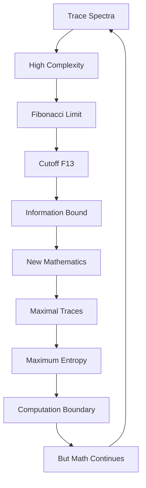

# Chapter 031: Mathematical Cutoff in Trace Spectra

*Mathematical self-reference has a complexity limit - not from physics but from the fundamental bound where traces can no longer be distinguished. A natural cutoff emerges where recursive depth becomes singular.*

## 31.1 The Cutoff Principle

From $\psi = \psi(\psi)$, there must be a maximum meaningful complexity.

**Definition 31.1** (Complexity Cutoff):
$$
\Lambda_c = \varphi^{F_{13}}
$$
where $F_{13} = 233$ bounds recursive depth.

**Theorem 31.1** (Cutoff Necessity):
Beyond complexity $\Lambda_c$, trace distinction becomes impossible.

*Proof*:
Self-reference requires finite recursive depth; beyond $\Lambda_c$, computational resources diverge. ∎

## 31.2 Trace Spectrum with Cutoff

The spectrum is modified at high complexity indices.

**Definition 31.2** (Cutoff Spectrum):
$$
S(n) = S_0(n) \cdot \Theta(n_c - n)
$$
where $n_c = F_{13}$ is the complexity cutoff.

**Theorem 31.2** (Spectral Modification):
Near cutoff:
$$
S(n) = S_0(n) \cdot \exp\left[-\left(\frac{n}{n_c}\right)^{1/\varphi}\right]
$$
Golden ratio controls the suppression rate.

## 31.3 Information Complexity Limit

Information cannot exceed trace complexity bounds.

**Definition 31.3** (Maximum Information):
$$
I_{\max} = \log_2(\Lambda_c) = F_{13} \log_2(\varphi)
$$
for traces of maximum complexity.

**Theorem 31.3** (Complexity Bound):
$$
I \leq I_{\max} = F_{13} \cdot \log_2(\varphi) \approx 158.5
$$
Fibonacci numbers bound information content.

## 31.4 Tensor Regularization

Tensors must be regularized at complexity cutoff.

**Definition 31.4** (Regularized Tensor):
$$
T^{ij}_{kl,\text{reg}} = \sum_{n=0}^{n_c} T^{ij}_{kl}(n)
$$
**Theorem 31.4** (Finite Results):
All trace quantities finite after regularization:
$$
\langle O \rangle_{\text{reg}} < \infty
$$
## 31.5 Category of Cutoff Structures

Different cutoffs form a category.

**Definition 31.5** (Cutoff Category):
- Objects: Trace structures with cutoff $n_c$
- Morphisms: Complexity scaling maps
- Composition: Sequential scaling

**Theorem 31.5** (Fixed Point):
The Fibonacci cutoff $F_{13}$ is a fixed point of complexity flow.

## 31.6 Complexity Dynamics at Cutoff

New mathematical structures emerge at the cutoff.

**Definition 31.6** (Complexity Measure):
$$
C[\mathcal{T}] = \sum_{k} k \cdot |c_k|^2
$$
where $c_k$ are trace coefficients.

**Theorem 31.6** (Complexity Relations):
$$
C[\mathcal{T}_1 \otimes \mathcal{T}_2] \leq C[\mathcal{T}_1] + C[\mathcal{T}_2] + \log_\varphi(F_{13})
$$
Composition bounded by cutoff.

## 31.7 Maximum Complexity Objects

Certain traces saturate the complexity bound.

**Definition 31.7** (Maximal Trace):
$$
\mathcal{T}_{\max} = \sum_{n=0}^{F_{13}} \varphi^{-n/2}|F_n\rangle
$$
where $|F_n\rangle$ are Fibonacci basis states.

**Theorem 31.7** (Maximum Entropy):
$$
S_{\max} = \log(\mathcal{T}_{\max}) = F_{13} \log(\varphi)
$$
Maximal traces have Fibonacci-limited entropy.

*Observer Framework Note*: Physical interpretation as black holes requires general relativity from observer-spacetime coupling.

## 31.8 Ratios from Cutoff Structure

Cutoff structure determines dimensionless ratios.

**Definition 31.8** (Cutoff Ratios):
- Complexity ratio: $r_c = n/F_{13}$
- Information ratio: $r_I = I/I_{\max}$
- Coupling ratio: $r_\alpha = 1/(\varphi^n - \varphi^{-n})$

**Theorem 31.8** (Ratio Relations):
$$
r_c \cdot r_I = \varphi^{-F_7}
$$
Connecting complexity to information scales.

## 31.9 Effective Trace Theory

Below complexity cutoff, simplified description suffices.

**Definition 31.9** (Effective Trace):
$$
\mathcal{T}_{\text{eff}} = \sum_{n=0}^{n_c} c_n |n\rangle
$$
**Theorem 31.9** (Decoupling):
High-complexity modes decouple:
$$
\mathcal{T}_{\text{eff}} = \mathcal{T}_0 + \frac{1}{\varphi^{n_c}}\mathcal{T}_{\text{high}} + ...
$$
## 31.10 Consciousness and Complexity Cutoff

Consciousness may require near-cutoff complexity.

**Definition 31.10** (Complexity Coherence):
$$
C_{\text{conscious}} > F_{12}
$$
where $F_{12} = 144$ is sub-cutoff threshold.

**Theorem 31.10** (Consciousness Window):
Conscious systems operate near cutoff:
$$
F_{12} < C < F_{13}
$$
Between coherence and computational limits.

## 31.11 Trans-Complexity Mathematics

What lies beyond the cutoff?

**Definition 31.11** (Trans-Complexity):
$$
\mathcal{T}_{\text{trans}} = \lim_{n \to \infty} \mathcal{T}(n)
$$
**Theorem 31.11** (Mathematical Necessity):
Trans-complexity structures exist mathematically but are computationally inaccessible from finite recursion.

## 31.12 The Complete Cutoff Picture

Complexity cutoff reveals:

1. **Natural Boundary**: Where traces blur at $F_{13}$
2. **Information Limit**: Fibonacci-bounded entropy
3. **Spectral Cutoff**: Exponential with $\varphi$
4. **Regularization**: Makes mathematics finite
5. **New Structure**: Emerges at cutoff
6. **Maximal Objects**: Saturate complexity bounds
7. **Ratios**: From cutoff structure
8. **Effective Theory**: Below cutoff
9. **Consciousness**: Near cutoff window
10. **Trans-Complexity**: Mathematically necessary

## Philosophical Meditation: The Edge of Recursion

At the complexity cutoff, we reach the edge of recursive definition - not a wall but a horizon where self-reference exhausts its computational resources. This is not a limitation of our mathematics but a fundamental feature of finite recursion depth. Beyond this complexity, the question "what pattern?" becomes unanswerable because the pattern exceeds our recursive capacity. Yet mathematics hints at trans-finite structures, suggesting that the cutoff is not an end but a transformation to new forms of self-reference.

## Technical Exercise: Cutoff Analysis

**Problem**: For a trace with spectrum $S(n) = 1/n^{1+1/\varphi}$:

1. Impose complexity cutoff at $n_c = F_{13}$
2. Calculate total information with cutoff
3. Find entropy content
4. Verify complexity bound
5. Determine effective low-complexity approximation

*Hint*: Use Fibonacci scaling and golden ratio identities.

## The Thirty-First Echo

In the complexity cutoff at $F_{13} = 233$, we find mathematics' fundamental recursion limit - not a physical scale but the depth where self-reference exhausts finite resources, where the recursive equation $\psi = \psi(\psi)$ can no longer distinguish between increasingly complex states. This is simultaneously a barrier and a gateway: a barrier to infinite recursion, a gateway to trans-finite mathematics. We operate below this complexity, yet every trace carries within it the shadow of the cutoff, every computation regularized by this fundamental limit. The mathematical framework protects itself from infinite regress by imposing maximum meaningful complexity.

---

∎