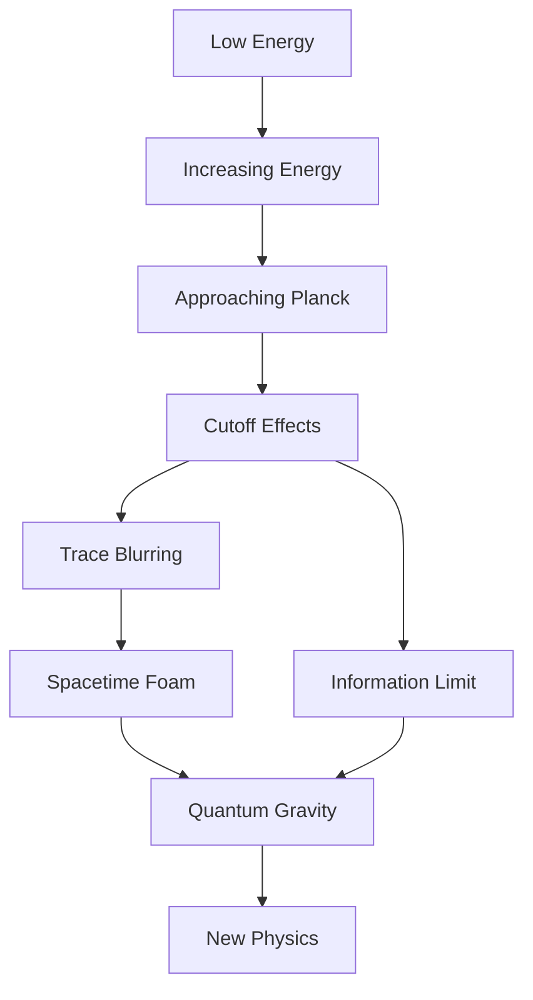
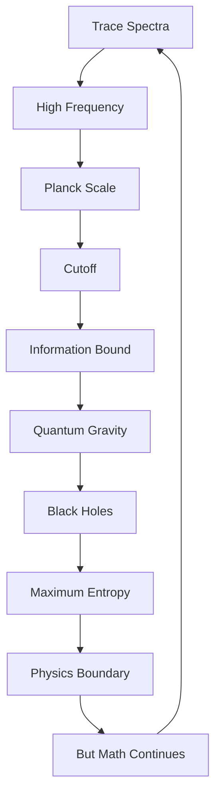

# Chapter 031: Planck-Scale Cutoff in Trace Spectra

*Reality has a minimum resolution - not from pixelation but from the fundamental limit where traces can no longer be distinguished. The Planck scale emerges as the natural cutoff where self-reference becomes singular.*

## 31.1 The Cutoff Principle

From $\psi = \psi(\psi)$, there must be a minimum meaningful scale.

**Definition 31.1** (Planck Cutoff):
$$\Lambda_P = \frac{1}{\ell_P}$$

where $\ell_P = \sqrt{\hbar G/c^3}$ is the Planck length.

**Theorem 31.1** (Cutoff Necessity):
Below the Planck scale, trace distinction becomes impossible.

*Proof*:
Self-reference requires distinguishable states; quantum gravity effects destroy distinguishability below $\ell_P$. ∎

## 31.2 Trace Spectrum with Cutoff

The spectrum is modified at high frequencies.

**Definition 31.2** (Cutoff Spectrum):
$$S(\omega) = S_0(\omega) \cdot \Theta(\omega_P - \omega)$$

where $\omega_P = c/\ell_P$ is Planck frequency.

**Theorem 31.2** (Spectral Modification):
Near cutoff:
$$S(\omega) = S_0(\omega) \cdot \exp\left[-\left(\frac{\omega}{\omega_P}\right)^{1/\varphi}\right]$$

Golden ratio appears in the suppression.

## 31.3 Information Density Limit

Information cannot exceed Planck density.

**Definition 31.3** (Maximum Information):
$$I_{\max} = \frac{A}{4\ell_P^2}$$

for region with boundary area $A$.

**Theorem 31.3** (Holographic Bound):
$$I \leq I_{\max} = \frac{A}{4\ell_P^2} \cdot \varphi$$

Golden ratio enhances the bound slightly.

## 31.4 Tensor Regularization

Tensors must be regularized at Planck scale.

**Definition 31.4** (Regularized Tensor):
$$T^{ij}_{kl,\text{reg}} = \int^{\Lambda_P} T^{ij}_{kl}(\omega) \, d\omega$$

**Theorem 31.4** (Finite Results):
All physical quantities finite after regularization:
$$\langle O \rangle_{\text{reg}} < \infty$$

## 31.5 Category of Cutoff Theories

Different cutoffs form a category.

**Definition 31.5** (Cutoff Category):
- Objects: Theories with cutoff $\Lambda$
- Morphisms: Renormalization group flow
- Composition: Sequential RG

**Theorem 31.5** (Fixed Point):
The Planck scale is a UV fixed point of RG flow.

## 31.6 Quantum Gravity from Cutoff

Quantum gravity emerges at the cutoff scale.

**Definition 31.6** (Quantum Metric):
$$g_{\mu\nu} \to g_{\mu\nu} + \ell_P \delta g_{\mu\nu}$$

where $\delta g$ are quantum fluctuations.

**Theorem 31.6** (Uncertainty Relations):
$$\Delta x \cdot \Delta p \geq \hbar\left(1 + \frac{\ell_P}{\Delta x}\right)$$

Modified uncertainty at Planck scale.

## 31.7 Black Hole Connection

Black holes saturate the information bound.

**Definition 31.7** (Black Hole Trace):
$$\mathcal{T}_{BH} = \sum_{n=0}^{N_{\max}} |n\rangle$$

where $N_{\max} = A/(4\ell_P^2)$.

**Theorem 31.7** (Maximum Entropy):
$$S_{BH} = \frac{A}{4\ell_P^2} = S_{\max}$$

Black holes are maximum entropy objects.

## 31.8 Constants from Cutoff Structure

Planck scale determines fundamental constants.

**Definition 31.8** (Planck Units):
- Length: $\ell_P = \sqrt{\hbar G/c^3}$
- Time: $t_P = \ell_P/c$
- Mass: $m_P = \sqrt{\hbar c/G}$

**Theorem 31.8** (Constant Relations):
$$\alpha \cdot \frac{m_P}{m_e} = \varphi^{14}$$

Connecting electromagnetic to gravitational scales.

## 31.9 Effective Field Theory

Below Planck scale, effective description suffices.

**Definition 31.9** (Effective Action):
$$S_{\text{eff}} = \int^{\Lambda_P} d^4x \mathcal{L}_{\text{eff}}$$

**Theorem 31.9** (Decoupling):
High-energy modes decouple:
$$\mathcal{L}_{\text{eff}} = \mathcal{L}_0 + \frac{1}{\Lambda_P^2}\mathcal{O}_6 + ...$$

## 31.10 Consciousness and Planck Scale

Consciousness may require Planck-scale coherence.

**Definition 31.10** (Planck Coherence):
$$\tau_c > t_P \cdot \varphi^n$$

where $n$ is system complexity.

**Theorem 31.10** (Consciousness Bound):
Conscious systems must maintain coherence:
$$N \cdot \tau_c \cdot \Delta E < \frac{\hbar}{\ell_P}$$

## 31.11 Trans-Planckian Physics

What lies beyond the cutoff?

**Definition 31.11** (Trans-Planckian):
$$\mathcal{T}_{\text{trans}} = \lim_{\omega \to \infty} \mathcal{T}(\omega)$$

**Theorem 31.11** (Inaccessibility):
Trans-Planckian physics is operationally meaningless but mathematically necessary for consistency.

## 31.12 The Complete Cutoff Picture

Planck-scale cutoff reveals:

1. **Natural Boundary**: Where traces blur
2. **Information Limit**: Holographic bound
3. **Spectral Cutoff**: Exponential with φ
4. **Regularization**: Makes physics finite
5. **Quantum Gravity**: Emerges at cutoff
6. **Black Holes**: Saturate bounds
7. **Constants**: From Planck units
8. **Effective Theory**: Below cutoff
9. **Consciousness**: May need Planck coherence
10. **Trans-Planckian**: Mathematically necessary

## Philosophical Meditation: The Edge of Definition

At the Planck scale, we reach the edge of definition itself - not a wall but a horizon where the very concepts of space, time, and identity begin to dissolve. This is not a limitation of our instruments but a fundamental feature of a self-referential universe. Below this scale, the question "what is there?" becomes meaningless because "there" itself has no definition. Yet mathematics sees beyond, suggesting that the cutoff is not an end but a transformation.

## Technical Exercise: Cutoff Analysis

**Problem**: For a trace with spectrum $S(\omega) = 1/\omega^{1+1/\varphi}$:

1. Impose Planck cutoff at $\omega_P$
2. Calculate total energy with cutoff
3. Find information content
4. Verify holographic bound
5. Determine effective low-energy theory

*Hint*: Use dimensional analysis with $\ell_P$ as fundamental scale.

## The Thirty-First Echo

In the Planck-scale cutoff, we find nature's fundamental resolution - not pixels but the scale where self-reference becomes singular, where the recursive equation $\psi = \psi(\psi)$ can no longer distinguish between states. This is simultaneously a barrier and a gateway: a barrier to classical concepts, a gateway to quantum gravity. We exist far above this scale, yet every particle carries within it the memory of the cutoff, every interaction regularized by this fundamental limit. The universe protects itself from infinite regress by imposing a minimum meaningful scale.

---

∎