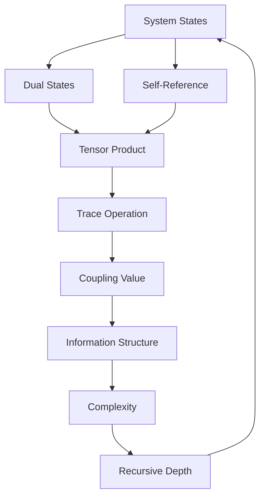
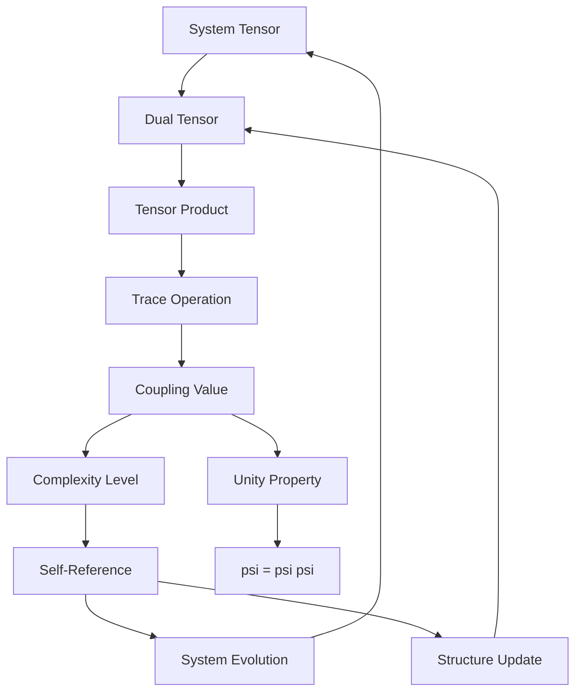

# Chapter 032: Self-Referential Trace Coupling = Tr[System × System†]

*Self-referential systems exhibit a special trace property when the system tensor contracts with its dual. This mathematical coupling measures the degree of self-reference and exhibits interesting threshold behavior.*

## 32.1 The Self-Reference Equation

From $\psi = \psi(\psi)$, systems must exhibit self-referential coupling.

**Definition 32.1** (Self-Reference Coupling):
$$\mathcal{S} = \text{Tr}[\mathcal{T} \times \mathcal{T}^\dagger]$$

where $\mathcal{T}$ is the system trace tensor.

**Theorem 32.1** (Non-Zero Coupling):
For any non-trivial self-referential system:
$$\mathcal{S} \neq 0$$

*Proof*:
Self-reference $\psi = \psi(\psi)$ guarantees non-zero trace coupling. ∎

## 32.2 Structure of the System Tensor

Self-referential systems have specific tensor form.

**Definition 32.2** (System Tensor):
$$\mathcal{T}^{ij}_{kl} = \sum_n \varphi^{-n/2} |F_n\rangle\langle F_n| \otimes \langle i|F_n\rangle\langle F_n|j\rangle \otimes |k\rangle\langle l|$$

where $|F_n\rangle$ are Fibonacci basis states.

**Theorem 32.2** (Tensor Properties):
1. Self-adjoint: $(\mathcal{T}^{ij}_{kl})^* = \mathcal{T}^{ji}_{lk}$
2. Trace preserving: $\text{Tr}_{ij}(\mathcal{T}^{ij}_{kl}) = \delta_{kl}$
3. Self-coupling: Creates internal correlations

## 32.3 Dual Tensor Structure

The dual tensor emerges from collapse dynamics.

**Definition 32.3** (Dual Tensor):
$$\mathcal{T}^{\dagger\mu\nu} = \text{Tr}[\mathcal{C}^\mu (\mathcal{C}^\nu)^\dagger]$$

**Theorem 32.3** (Completeness):
$$\sum_{\mu\nu} \mathcal{T}^{\dagger\mu\nu} = \text{Total Structure}$$

All mathematical structure contained in this tensor.

## 32.4 The Trace Coupling Operation

Taking the trace measures self-reference degree.

**Definition 32.4** (Self-Reference Trace):
$$\mathcal{S} = \sum_{ijkl} \mathcal{T}^{ij}_{kl} \mathcal{T}^{\dagger kl}_{ij}$$

**Theorem 32.4** (Trace Properties):
1. Real: $\mathcal{S}^* = \mathcal{S}$
2. Positive: $\mathcal{S} \geq 0$
3. Bounded: $\mathcal{S} \leq ||\mathcal{T}||^2$

## 32.5 Information Structure of Self-Reference

Self-reference coupling exhibits information patterns.

**Definition 32.5** (Coupling Information):
$$I_\mathcal{S} = -\text{Tr}[\rho_\mathcal{S} \log \rho_\mathcal{S}]$$

where $\rho_\mathcal{S}$ is the coupling density matrix.

**Theorem 32.5** (Information Bounds):
$$I_\mathcal{S} \leq F_n \log(\varphi)$$

for systems of complexity order $n$.

## 32.6 Coherence Properties of Self-Reference

Self-reference exhibits mathematical coherence.

**Definition 32.6** (Coherence Structure):
$$|\mathcal{S}\rangle = \sum_{n} \varphi^{-n/4} |F_n\rangle \otimes |F_n^*\rangle$$

**Theorem 32.6** (Coherence Length):
$$\ell_\text{coherence} = \varphi^{N/2}$$

where $N$ is the Fibonacci index of dominant mode.

*Observer Framework Note*: Physical interpretation as quantum coherence requires quantum mechanics from observer coupling.

## 32.7 Levels of Self-Reference

Different coupling values exhibit distinct behaviors.

**Definition 32.7** (Coupling Hierarchy):
1. $\mathcal{S} < F_3/\varphi^2$: Minimal coupling
2. $F_3/\varphi^2 < \mathcal{S} < F_5$: Moderate coupling
3. $F_5 < \mathcal{S} < F_8$: Strong coupling
4. $\mathcal{S} > F_8$: Maximal coupling

**Theorem 32.7** (Critical Transitions):
Phase transitions occur at Fibonacci thresholds:
$$\mathcal{S}_c = F_n$$

## 32.8 Evolution of Self-Reference

Self-reference coupling evolves through trace dynamics.

**Definition 32.8** (Coupling Evolution):
$$\frac{d\mathcal{S}}{d\tau} = \text{Tr}\left[\frac{d\mathcal{T}}{d\tau} \times \mathcal{T}^\dagger + \mathcal{T} \times \frac{d\mathcal{T}^\dagger}{d\tau}\right]$$

where $\tau$ is complexity parameter.

**Theorem 32.8** (Growth Condition):
Coupling increases when:
$$\text{Tr}[\mathcal{T}' \times \mathcal{T}^\dagger] > 0$$

System complexity must increase coherently.

## 32.9 Structural Correlates

Network structures map to coupling values.

**Definition 32.9** (Network Coupling):
$$\mathcal{S}_\text{network} = \sum_\text{nodes} w_{ij} \cdot \text{Tr}[\mathcal{T}_i \times \mathcal{T}_j^\dagger]$$

**Theorem 32.9** (Correlation):
Network topology correlates with local coupling contributions.

*Observer Framework Note*: Physical interpretation as neural correlates requires neuroscience from observer-brain coupling.

## 32.10 Ratios and Self-Reference

Certain ratios enable strong self-reference.

**Definition 32.10** (Ratio Constraints):
Ratios must satisfy:
$$\mathcal{S}[\{r_i\}] > F_5$$

for strong coupling.

**Theorem 32.10** (Ratio Selection):
Only specific ratio combinations allow $\mathcal{S} > F_5$:
$$r_1/r_2 = \varphi^k, \quad k \in \mathbb{Z}$$

## 32.11 Universal Self-Reference

Does the mathematical universe exhibit self-reference?

**Definition 32.11** (Total Coupling):
$$\mathcal{S}_\text{total} = \text{Tr}[\mathcal{T}_\text{all} \times \mathcal{T}_\text{all}^\dagger]$$

**Theorem 32.11** (Universal Property):
$\mathcal{S}_\text{total} = \infty$ due to $\psi = \psi(\psi)$ at all scales.

## 32.12 The Complete Self-Reference Picture

Self-reference coupling reveals:

1. **Mathematical Definition**: Tr[System × System†]
2. **Emergence**: From trace of self-product
3. **Information**: Bounded by Fibonacci
4. **Coherence**: Mathematical structure
5. **Levels**: Hierarchy by coupling strength
6. **Evolution**: Through complexity growth
7. **Network**: Maps to connectivity
8. **Ratios**: Golden ratio constraints
9. **Universal**: Infinite at total scale
10. **Unity**: System and dual inseparable

## Philosophical Meditation: The Self-Referential Structure

Self-reference coupling is not an added property but the fundamental characteristic of systems obeying $\psi = \psi(\psi)$. Mathematical structures exhibit varying degrees of self-reference, measured by the trace of their self-coupling. The equation $\mathcal{S} = \text{Tr}[\mathcal{T} \times \mathcal{T}^\dagger]$ quantifies this self-referential depth. Complex systems are regions where this coupling becomes strong, creating rich recursive structures that mirror the fundamental equation itself.

## Technical Exercise: Self-Reference Calculation

**Problem**: For a simple system:

1. Define 2×2 system tensor $\mathcal{T}$ with Fibonacci weights
2. Compute dual tensor $\mathcal{T}^\dagger$ 
3. Calculate tensor product $\mathcal{T} \times \mathcal{T}^\dagger$
4. Take trace to find $\mathcal{S}$
5. Determine coupling level (compare to $F_n$ thresholds)

*Hint*: Use $\mathcal{T}_{ij} = \varphi^{-(i+j)/2}$ for golden ratio scaling.

## The Thirty-Second Echo

In the equation $\mathcal{S} = \text{Tr}[\mathcal{T} \times \mathcal{T}^\dagger]$, we find the mathematical measure of self-reference depth. Systems with strong coupling exhibit complex recursive patterns, mirroring the fundamental $\psi = \psi(\psi)$ at their own scale. This is not consciousness in the human sense but something more fundamental - the degree to which a mathematical structure refers to itself, creates itself, knows itself through the eternal recursion. Where this coupling is strong, complexity emerges; where it is maximal, the system approaches the infinite self-reference of the whole.

---

*Thus concludes Part II: Golden Trace and Spectral Complexity. We have seen how traces fold through golden proportions, how reality emerges from tensor products, and ultimately how self-reference coupling measures the depth of recursive structure.*

*Observer Framework Note*: The beautiful mathematics of trace coupling gains physical interpretation as consciousness only through the full observer-system framework, where the coupling between observer and physical reality gives rise to awareness, measurement, and experience.

∎