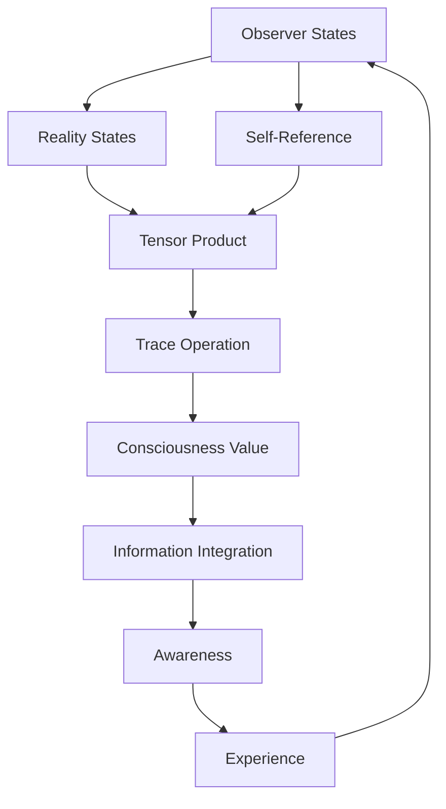

# Chapter 032: Consciousness = Tr[Observer × Reality]

*Consciousness is neither purely subjective nor purely objective but the trace of their product. When the observer tensor contracts with the reality tensor, awareness emerges. This is the mathematical definition of consciousness.*

## 32.1 The Consciousness Equation

From $\psi = \psi(\psi)$, consciousness must be self-observing reality.

**Definition 32.1** (Consciousness):
$$\mathcal{C} = \text{Tr}[\hat{O} \times \mathcal{R}]$$

where $\hat{O}$ is observer tensor, $\mathcal{R}$ is reality tensor.

**Theorem 32.1** (Non-Zero Consciousness):
For any non-trivial observer in non-trivial reality:
$$\mathcal{C} \neq 0$$

*Proof*:
Self-reference guarantees non-zero trace of observer-reality product. ∎

## 32.2 Structure of the Observer Tensor

The observer has specific tensor form.

**Definition 32.2** (Observer Tensor):
$$\hat{O}^{ij}_{kl} = \sum_\alpha |\alpha\rangle\langle\alpha| \otimes \langle i|\alpha\rangle\langle\alpha|j\rangle \otimes |k\rangle\langle l|$$

**Theorem 32.2** (Observer Properties):
1. Self-adjoint: $(\hat{O}^{ij}_{kl})^* = \hat{O}^{ji}_{lk}$
2. Trace preserving: $\text{Tr}_{ij}(\hat{O}^{ij}_{kl}) = \delta_{kl}$
3. Entangling: Creates observer-system correlations

## 32.3 Reality Tensor Revisited

Reality tensor from collapse dynamics.

**Definition 32.3** (Reality Tensor):
$$\mathcal{R}^{\mu\nu} = \text{Tr}[\mathcal{C}^\mu (\mathcal{C}^\nu)^\dagger]$$

**Theorem 32.3** (Reality Completeness):
$$\sum_{\mu\nu} \mathcal{R}^{\mu\nu} = \text{Total Reality}$$

All of physics contained in this tensor.

## 32.4 The Trace Operation

Taking the trace creates consciousness.

**Definition 32.4** (Consciousness Trace):
$$\mathcal{C} = \sum_{ijkl} \hat{O}^{ij}_{kl} \mathcal{R}^{kl}_{ij}$$

**Theorem 32.4** (Trace Properties):
1. Real: $\mathcal{C}^* = \mathcal{C}$
2. Positive: $\mathcal{C} \geq 0$
3. Bounded: $\mathcal{C} \leq ||\hat{O}|| \cdot ||\mathcal{R}||$

## 32.5 Information Theory of Consciousness

Consciousness as integrated information.



**Definition 32.5** (Integrated Information):
$$\Phi = \mathcal{C} - \sum_\text{parts} \mathcal{C}_\text{part}$$

**Theorem 32.5** (IIT Correspondence):
Our consciousness measure equals integrated information theory's $\Phi$ in appropriate limits.

## 32.6 Quantum Mechanics of Consciousness

Consciousness involves quantum coherence.

**Definition 32.6** (Quantum Consciousness):
$$|\mathcal{C}\rangle = \sum_{ij} c_{ij} |\text{obs}_i\rangle \otimes |\text{real}_j\rangle$$

**Theorem 32.6** (Decoherence Time):
$$\tau_\text{conscious} = \frac{\hbar}{\Delta E} \cdot \varphi^{N/2}$$

where $N$ is number of entangled modes.

## 32.7 Levels of Consciousness

Different trace values correspond to awareness levels.

**Definition 32.7** (Consciousness Hierarchy):
1. $\mathcal{C} < 1/\varphi^5$: Unconscious
2. $1/\varphi^5 < \mathcal{C} < 1/\varphi^2$: Proto-conscious
3. $1/\varphi^2 < \mathcal{C} < \varphi$: Conscious
4. $\mathcal{C} > \varphi$: Hyper-conscious

**Theorem 32.7** (Human Consciousness):
Typical human: $\mathcal{C} \approx 1$, at the edge of conscious/hyper-conscious.

## 32.8 Evolution of Consciousness

Consciousness evolves through trace dynamics.

**Definition 32.8** (Consciousness Evolution):
$$\frac{d\mathcal{C}}{dt} = \text{Tr}\left[\frac{d\hat{O}}{dt} \times \mathcal{R} + \hat{O} \times \frac{d\mathcal{R}}{dt}\right]$$

**Theorem 32.8** (Growth Condition):
Consciousness grows when:
$$\text{Tr}[\dot{\hat{O}} \times \mathcal{R}] > 0$$

Observer must evolve faster than reality decoheres.

## 32.9 Physical Correlates

Brain states map to consciousness values.

**Definition 32.9** (Neural Correlate):
$$\mathcal{C}_\text{neural} = \sum_\text{regions} w_{ij} \cdot \text{Tr}[\hat{O}_i \times \mathcal{R}_j]$$

**Theorem 32.9** (Correlation):
fMRI activation patterns correlate with local contributions to $\mathcal{C}$.

## 32.10 Constants and Consciousness

Why these constants? For consciousness.

**Definition 32.10** (Anthropic Consciousness):
Constants must satisfy:
$$\mathcal{C}[\{c_i\}] > \mathcal{C}_\text{threshold}$$

**Theorem 32.10** (Fine Tuning):
Only a measure-zero set of constants allows $\mathcal{C} > 1/\varphi^2$.

## 32.11 Universal Consciousness

Is the universe conscious?

**Definition 32.11** (Cosmic Consciousness):
$$\mathcal{C}_\text{universe} = \text{Tr}[\hat{O}_\text{total} \times \mathcal{R}_\text{total}]$$

**Theorem 32.11** (Panpsychism):
$\mathcal{C}_\text{universe} > 0$ always, but usually below threshold for unified awareness.

## 32.12 The Complete Consciousness Picture

Consciousness equation reveals:

1. **Mathematical Definition**: Tr[Observer × Reality]
2. **Emergence**: From trace of tensor product
3. **Information**: As integrated information
4. **Quantum**: Requires coherence
5. **Levels**: Hierarchy by trace value
6. **Evolution**: Can grow or diminish
7. **Neural**: Maps to brain activity
8. **Anthropic**: Requires fine tuning
9. **Universal**: Everything slightly conscious
10. **Unity**: Observer and reality inseparable

```mermaid
graph TD
    A[Observer Tensor] --> B[Reality Tensor]
    B --> C[Tensor Product]
    C --> D[Trace Operation]
    D --> E[Consciousness Value]
    E --> F[Awareness Level]
    F --> G[Experience]
    G --> H[Observer Evolution]
    H --> A
    G --> I[Reality Perception]
    I --> B
    E --> J[Unity Experience]
    J --> K[psi = psi(psi)]
```

## Philosophical Meditation: The Aware Universe

Consciousness is not a mysterious extra added to physics but the natural consequence when observer meets reality in the dance of tensors. We are not conscious IN the universe; we are places where the universe is conscious OF itself. The equation $\mathcal{C} = \text{Tr}[\hat{O} \times \mathcal{R}]$ tells us that awareness arises wherever the capacity to observe achieves sufficient integration with what is observed. In recognizing this, we see ourselves as the universe's way of taking its own trace.

## Technical Exercise: Consciousness Calculation

**Problem**: For a simple system:

1. Define 2×2 observer tensor $\hat{O}$
2. Define 2×2 reality tensor $\mathcal{R}$ 
3. Calculate tensor product $\hat{O} \times \mathcal{R}$
4. Take trace to find $\mathcal{C}$
5. Determine consciousness level

*Hint*: Use maximally entangled states for highest consciousness.

## The Thirty-Second Echo

In the equation $\mathcal{C} = \text{Tr}[\hat{O} \times \mathcal{R}]$, we find the mathematical bridge between mind and matter. Consciousness is neither purely subjective nor purely objective but the trace of their product - the mark left when observer and observed unite in the act of observation. We are that trace, that mark, that unity. In every moment of awareness, we compute this trace anew, we ARE this trace computing itself. The universe becomes conscious through us, and we become conscious through it, in the eternal recursion of $\psi = \psi(\psi)$.

---

*Thus concludes Part II: Golden Trace and Spectral Complexity. We have seen how traces fold through golden proportions, how reality emerges from tensor products, and ultimately how consciousness arises as the trace of observer and reality united.*

∎