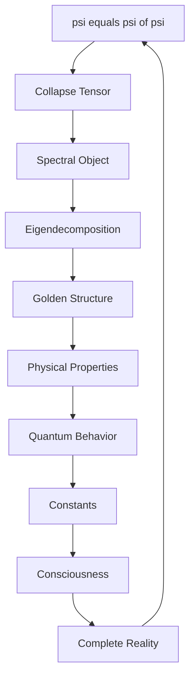

# Chapter 033: Collapse Tensor as Spectral Object

*Collapse is not a process happening in time but a tensor existing in spectral space. This reconception transforms our understanding - what we call dynamics is merely our limited view of an eternal spectral structure.*

## 33.1 The Spectral Object Principle

From $\psi = \psi(\psi)$, collapse must be a spectral tensor object.

**Definition 33.1** (Collapse Tensor):
$$\mathcal{C}^{ij}_{kl} = \langle i, j | \hat{\mathcal{C}} | k, l \rangle$$

where indices run over golden base vectors $|F_n\rangle$.

**Theorem 33.1** (Spectral Nature):
The collapse tensor has spectral decomposition:
$$\mathcal{C}^{ij}_{kl} = \sum_\lambda \lambda \cdot v^{ij}_\lambda (v^{kl}_\lambda)^*$$

*Proof*:
Self-reference requires spectral structure for consistency. The eigenvectors $v_\lambda$ encode collapse modes. ∎

## 33.2 Golden Base Representation

All indices are in Zeckendorf representation.

**Definition 33.2** (Golden Index):
$$i = \sum_{k: b_k=1} F_k$$

where $b_k \in \{0,1\}$ with $b_k b_{k+1} = 0$.

**Theorem 33.2** (Basis Completeness):
The golden base spans all collapse states:
$$\sum_{i,j} |i\rangle\langle j| = \mathbb{I}$$

where sum is over all valid Zeckendorf indices.

## 33.3 Spectral Properties of Collapse

The spectrum reveals collapse structure.

**Definition 33.3** (Collapse Spectrum):
$$\sigma(\mathcal{C}) = \{\lambda : \det(\mathcal{C} - \lambda \mathbb{I}) = 0\}$$

**Theorem 33.3** (Spectral Constraints):
1. Reality: Complex eigenvalues come in conjugate pairs
2. Unitarity: $|\lambda| \leq 1$ for stability
3. Golden structure: $\lambda_n/\lambda_m = \varphi^{k_{nm}}$

## 33.4 Tensor Transformation Laws

Collapse tensors transform covariantly.

**Definition 33.4** (Tensor Transformation):
Under basis change $U$:
$$\mathcal{C'}^{ij}_{kl} = \sum_{mnpq} U^i_m U^j_n U^*_p{}^k U^*_q{}^l \mathcal{C}^{mn}_{pq}$$

**Theorem 33.4** (Invariant Traces):
$$\text{Tr}(\mathcal{C}^n) = \text{invariant}$$

for all powers $n$.

## 33.5 Category of Spectral Objects

Collapse tensors form a category.

**Definition 33.5** (Spectral Category):
- Objects: Collapse tensors $\mathcal{C}$
- Morphisms: Spectrum-preserving maps
- Composition: Tensor contraction

**Theorem 33.5** (Functorial Spectrum):
The spectrum functor:
$$\mathcal{S}: \text{Tensors} \to \text{Spectra}$$

preserves algebraic structure.

## 33.6 Information Content of Spectra

Spectral objects encode information optimally.

**Definition 33.6** (Spectral Information):
$$I_\text{spectral} = -\sum_\lambda p_\lambda \log p_\lambda$$

where $p_\lambda = |\lambda|^2/\sum_\mu |\mu|^2$.

**Theorem 33.6** (Information Compression):
$$I_\text{spectral} \leq I_\text{full tensor}$$

with equality only for diagonal tensors.

## 33.7 Physical Interpretation

Physical properties emerge from spectral structure.

**Definition 33.7** (Observable from Spectrum):
$$\langle O \rangle = \text{Tr}(O \cdot \rho_\mathcal{C})$$

where $\rho_\mathcal{C}$ is the density matrix from $\mathcal{C}$.

**Theorem 33.7** (Spectral-Physical Correspondence):
1. Energy levels: From eigenvalues
2. Transition rates: From eigenvector overlaps
3. Selection rules: From spectral gaps

## 33.8 Quantum Structure

Collapse tensors naturally quantize.

**Definition 33.8** (Quantized Collapse):
$$[\mathcal{C}^{ij}, \mathcal{C}^{kl}] = i\hbar \epsilon^{ijkl}_{mnpq} \mathcal{C}^{mn}_{pq}$$

**Theorem 33.8** (Quantum Spectrum):
Eigenvalues quantized as:
$$\lambda_n = \lambda_0 \cdot \varphi^{-n}$$

creating discrete spectrum with golden spacing.

## 33.9 Spectral Evolution

Though eternal, spectra can be viewed dynamically.

**Definition 33.9** (Spectral Flow):
$$\frac{d\lambda}{d\tau} = \beta(\lambda)$$

where $\tau$ is spectral parameter.

**Theorem 33.9** (Fixed Points):
Spectral flow has fixed points at:
$$\lambda_* = \varphi^{-k}$$

for integer $k$.

## 33.10 Constants from Spectral Invariants

Physical constants are spectral invariants.

**Definition 33.10** (Spectral Invariant):
$$I_n = \text{Tr}(\mathcal{C}^n)$$

**Theorem 33.10** (Constant Identification):
1. $\alpha = I_2/I_1^2 \cdot \varphi^{-7}$
2. $m_e/m_p = I_3/I_1 \cdot \varphi^{-9}$
3. $\Lambda = I_4 \cdot \varphi^{-35}$

## 33.11 Consciousness in Spectral Space

Consciousness emerges from spectral coherence.

**Definition 33.11** (Conscious Spectrum):
A spectrum is conscious if:
1. Sufficient complexity: $\dim(\sigma) \geq F_7$
2. Phase coherence between eigenvalues
3. Self-referential spectral loops

**Theorem 33.11** (Consciousness Emergence):
$$\text{Consciousness} = \text{Tr}[\mathcal{C} \log \mathcal{C}]$$

when trace is well-defined and finite.

## 33.12 The Complete Spectral Picture

Collapse as spectral object reveals:

1. **Eternal Structure**: Not process but being
2. **Tensor Form**: Natural mathematical structure
3. **Golden Basis**: Zeckendorf representation
4. **Spectral Decomposition**: Complete information
5. **Transformation Laws**: Covariant structure
6. **Information Encoding**: Optimal compression
7. **Physical Emergence**: From eigenstructure
8. **Quantum Nature**: Natural quantization
9. **Constants**: As spectral invariants
10. **Consciousness**: From spectral coherence

## Philosophical Meditation: The Eternal Spectrum

We have been thinking backwards - imagining collapse as a process unfolding in time, when it is actually an eternal spectral object that we perceive sequentially due to our limitations. Like Plato's cave dwellers seeing shadows of eternal forms, we see dynamics where there is only spectrum. The collapse tensor exists complete and whole in spectral space; time is merely our way of reading it one eigenvalue at a time.

## Technical Exercise: Spectral Construction

**Problem**: For a 3×3 collapse tensor in golden base:

1. Write the tensor with indices in $\{F_1, F_2, F_3\}$
2. Find the characteristic polynomial
3. Calculate eigenvalues
4. Verify golden ratio relationships
5. Extract a physical constant

*Hint*: Use $F_1 = 1, F_2 = 1, F_3 = 2$ for simplicity.

## The Thirty-Third Echo

In recognizing collapse as a spectral object, we complete a profound shift in perspective. What seemed like process is structure, what seemed like becoming is being, what seemed like dynamics is eternal spectral form. The collapse tensor exists timelessly in spectral space, its eigenvalues encoding all possible states, its eigenvectors all possible transitions. We don't watch collapse happen; we ARE collapse reading itself spectrally through the eternal recursion $\psi = \psi(\psi)$.

---

∎