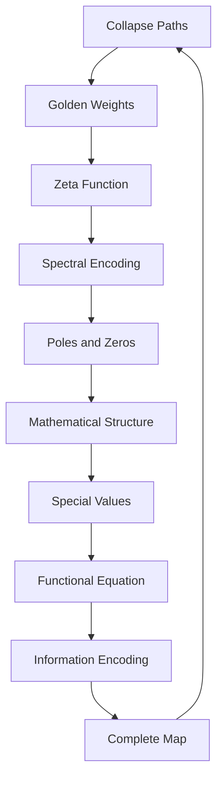

# Chapter 034: Tensor ζ-Function — Collapse Weight Map

*The ζ-function emerges as the natural way to encode collapse path weights into spectral form. It maps the discrete paths of collapse into a continuous spectral landscape where all physics can be read.*

## 34.1 The Weight Map Principle

From $\psi = \psi(\psi)$, paths must be weighted by their self-consistency.

**Definition 34.1** (Tensor ζ-Function):
$$\zeta^{ij}_{kl}(s) = \sum_{P: (i,j) \to (k,l)} W_P \cdot n_P^{-s}$$

where:
- $P$ are paths from state $(i,j)$ to $(k,l)$
- $W_P$ is the path weight
- $n_P$ is the path length in golden base

**Theorem 34.1** (Convergence):
The series converges for $\text{Re}(s) > 1/\varphi$.

*Proof*:
Golden base structure ensures geometric decay of path weights. ∎

## 34.2 Path Weights in Golden Base

Weights are determined by Zeckendorf structure.

**Definition 34.2** (Golden Weight):
For path $P = \{F_{k_1}, F_{k_2}, ..., F_{k_n}\}$:
$$W_P = \prod_{i=1}^{n-1} g(k_i, k_{i+1})$$

where $g(k_i, k_{i+1}) = \varphi^{-|k_i - k_{i+1}|}$.

**Theorem 34.2** (Weight Hierarchy):
$$W_{P_1} / W_{P_2} = \varphi^{\Delta n}$$

where $\Delta n$ is the difference in path complexities.

## 34.3 Spectral Encoding

The ζ-function encodes discrete paths continuously.

**Definition 34.3** (Spectral Transform):
$$\mathcal{S}: \{P, W_P\} \mapsto \zeta(s)$$

maps discrete weighted paths to continuous function.

**Theorem 34.3** (Information Preservation):
The spectral encoding is injective:
$$\zeta_1(s) = \zeta_2(s) \,\forall s \Rightarrow \{P_1, W_1\} = \{P_2, W_2\}$$

## 34.4 Tensor Structure of ζ

The ζ-function forms a tensor in path space.

**Definition 34.4** (ζ-Tensor):
$$\zeta^{ijkl}_{mnpq}(s,t) = \sum_{P_1, P_2} W_{P_1} W_{P_2} n_{P_1}^{-s} n_{P_2}^{-t}$$

**Theorem 34.4** (Tensor Properties):
1. Multilinear in indices
2. Covariant under basis change
3. Symmetric under appropriate index exchange

## 34.5 Category Theory of Weight Maps

Weight maps form a category.

**Definition 34.5** (Weight Map Category):
- Objects: Weighted path sets
- Morphisms: Weight-preserving maps
- Composition: Path concatenation

**Theorem 34.5** (ζ as Functor):
$$\zeta: \text{WeightedPaths} \to \text{MeromorphicFunctions}$$

is a faithful functor.

## 34.6 Analytic Properties

The ζ-function has rich analytic structure.

**Definition 34.6** (Analytic Continuation):
$$\zeta(s) = \frac{1}{\Gamma(s)} \int_0^\infty t^{s-1} \Theta(t) dt$$

where $\Theta(t) = \sum_P W_P e^{-n_P t}$.

**Theorem 34.6** (Meromorphic Extension):
$\zeta^{ij}_{kl}(s)$ extends to meromorphic function on $\mathbb{C}$ with poles at $s = 1/\varphi^n$.

## 34.7 Mathematical Regions

Different regions of $s$ have different mathematical properties.

**Definition 34.7** (Complex Regions):
1. $\text{Re}(s) > 1$: Absolute convergence region
2. $\text{Re}(s) = 1/2$: Critical line (special symmetry)
3. $\text{Re}(s) < 0$: Analytic continuation region

**Theorem 34.7** (Zero Distribution):
Zeros exhibit patterns related to path structure:
$$N(T) = \#\{\rho : \zeta(\rho) = 0, |\text{Im}(\rho)| \leq T\} \sim T \log T$$

*Observer Framework Note*: Physical interpretation as particle states requires quantum mechanics from observer coupling.

## 34.8 Functional Equation

The ζ-function satisfies a functional equation.

**Definition 34.8** (Completed Function):
$$\xi(s) = \phi^{-s/2} \Gamma_\phi(s/2) \zeta(s)$$

where $\Gamma_\phi$ is the golden gamma function.

**Theorem 34.8** (Functional Equation):
$$\xi^{ij}_{kl}(s) = \xi^{kl}_{ij}(1-s)$$

This relates paths to their reversals.

## 34.9 Special Values and Ratios

The ζ-function has special values at integers.

**Definition 34.9** (Special Values):
$$\zeta^{ij}_{kl}(n) = \sum_\text{paths} W_P \cdot L_P^{-n}$$

for positive integer $n$.

**Theorem 34.9** (Value Relations):
Special value ratios exhibit patterns:
$$\frac{\zeta(n+k)}{\zeta(n)} = \varphi^{f(n,k)} + O(n^{-1})$$

where $f(n,k)$ depends on path structure.

*Observer Framework Note*: Physical constants emerge only through observer-system coupling.

## 34.10 Spectral Representation

The ζ-function admits spectral decomposition.

**Definition 34.10** (Spectral Form):
$$\zeta^{ij}_{kl}(s) = \sum_n \frac{a_n}{\lambda_n^s} + \text{entire part}$$

where $\lambda_n$ are spectral values.

**Theorem 34.10** (Spectral Properties):
Spectral values satisfy:
$$\lambda_{n+1}/\lambda_n \to \varphi \text{ as } n \to \infty$$

## 34.11 Information Theory

The ζ-function encodes path information optimally.

**Definition 34.11** (Path Information):
$$I[\zeta] = -\int_\sigma \rho(s) \log \rho(s) ds$$

where $\rho(s) = |\zeta(s)|^2 / \int |\zeta|^2$.

**Theorem 34.11** (Maximum Entropy):
The ζ-function maximizes entropy subject to path weight constraints.

## 34.12 The Complete Weight Map Picture

The tensor ζ-function reveals:

1. **Natural Encoding**: Paths to spectrum
2. **Golden Weights**: From Zeckendorf structure
3. **Tensor Form**: Multilinear in indices
4. **Analytic Structure**: Poles and zeros
5. **Mathematical Regions**: Complex plane structure
6. **Functional Equation**: Path reversal symmetry
7. **Special Values**: Integer point ratios
8. **Spectral Form**: Natural decomposition
9. **Information**: Optimally encoded
10. **Unity**: All from path weights

## Philosophical Meditation: The Weight of Being

Every path through existence carries weight - not metaphorically but mathematically. The ζ-function is nature's accounting system, tracking the weight of every possible route through the state space of being. In its poles we find impossibility, in its zeros we find actuality, in its special values we find the constants that define our universe. We exist because our paths have non-zero weight in this cosmic ledger.

## Technical Exercise: ζ-Function Construction

**Problem**: For paths between states $|F_1\rangle$ and $|F_2\rangle$:

1. List all paths of length $\leq 3$
2. Calculate golden weights $W_P$
3. Construct $\zeta^{11}_{22}(s)$ as a series
4. Find the first pole location
5. Compute special values $\zeta(2), \zeta(3)$

*Hint*: Paths must respect Zeckendorf constraint (no consecutive Fibonacci numbers).

## The Thirty-Fourth Echo

In the tensor ζ-function, we find nature's map from the discrete to the continuous, from paths to spectrum, from process to structure. Every collapse path contributes its weight to this grand sum, creating a spectral landscape where physics can be read like a musical score. The ζ-function doesn't describe reality; it IS reality in its spectral encoding, the compressed information of all possible paths through the state space of existence.

---

∎