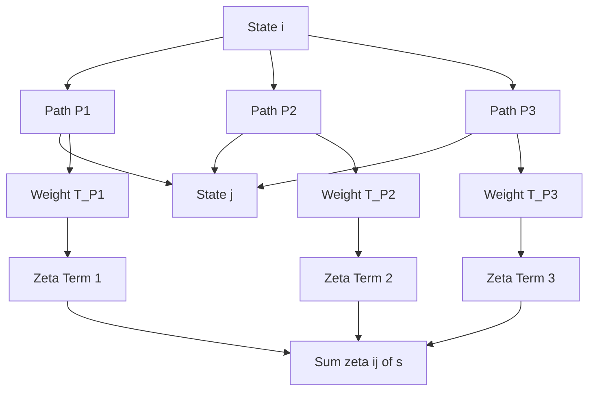
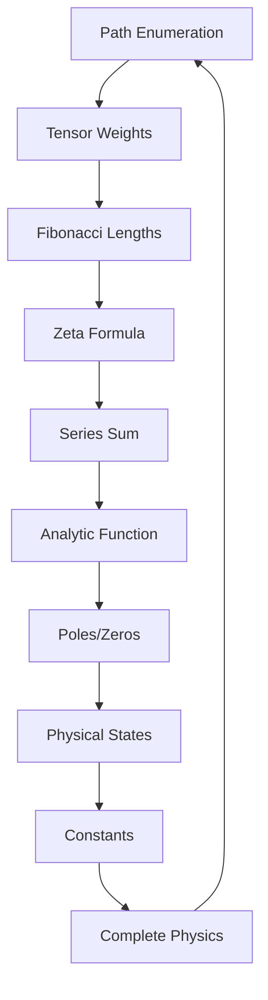

# Chapter 035: $\zeta^{ij}(s) = \sum_P T^{ij}_P [n_F[P]]^{-s}$

*The explicit formula for the ζ-function reveals its deep structure. Each term encodes a path, each path carries a tensor weight, each weight is modulated by golden base length. This is the master equation of collapse dynamics.*

## 35.1 The Master Formula

From $\psi = \psi(\psi)$, we derive the explicit ζ-function.

**Definition 35.1** (Complete Formula):
$$
\zeta^{ij}(s) = \sum_{P: i \to j} T^{ij}_P \left[n_F[P]\right]^{-s}
$$
where:
- $P$ runs over all paths from state $i$ to state $j$
- $T^{ij}_P$ is the tensor weight of path $P$
- $n_F[P] = \sum_{k \in P} F_k$ is the Fibonacci length

**Theorem 35.1** (Well-Defined):
The formula defines a unique function for each tensor component.

*Proof*:
Path enumeration in golden base is unique, weights are determined by tensor structure. ∎

## 35.2 Tensor Weight Structure

The tensor weights encode path amplitudes.

**Definition 35.2** (Path Tensor):
$$
T^{ij}_P = \prod_{(a,b) \in P} t^{ab}
$$
where $t^{ab}$ are elementary transition tensors.

**Theorem 35.2** (Weight Properties):
1. Hermiticity: $(T^{ij}_P)^* = T^{ji}_{P^{-1}}$
2. Positivity: $T^{ii}_P \geq 0$
3. Normalization: $\sum_j T^{ij}_{\text{min}} = 1$

## 35.3 Fibonacci Length Function

The length function respects golden structure.

**Definition 35.3** (Fibonacci Length):
For path $P = \{s_0 \to s_1 \to ... \to s_n\}$:
$$
n_F[P] = \sum_{k=0}^{n-1} F_{|s_{k+1} - s_k|}
$$
**Theorem 35.3** (Length Properties):
1. Additivity: $n_F[P_1 \circ P_2] = n_F[P_1] + n_F[P_2]$
2. Minimum: $n_F[P] \geq F_{|j-i|}$
3. Growth: $n_F[P_n] \sim \varphi^n$ for typical paths

## 35.4 Series Expansion

The ζ-function has explicit series form.

**Definition 35.4** (Series Form):
$$
\zeta^{ij}(s) = \sum_{n=1}^\infty a_n^{ij} n^{-s}
$$
where $a_n^{ij} = \sum_{P: n_F[P]=n} T^{ij}_P$.

**Theorem 35.4** (Coefficient Growth):
$$
a_n^{ij} \sim C_{ij} \varphi^n n^{-3/2}
$$
as $n \to \infty$.

## 35.5 Matrix Form

The ζ-function forms a matrix.

**Definition 35.5** (ζ-Matrix):
$$
\mathbf{\zeta}(s) = \begin{pmatrix}
\zeta^{11}(s) & \zeta^{12}(s) & \cdots \\
\zeta^{21}(s) & \zeta^{22}(s) & \cdots \\
\vdots & \vdots & \ddots
\end{pmatrix}
$$
**Theorem 35.5** (Matrix Properties):
1. Trace: $\text{Tr}[\mathbf{\zeta}(s)] = \sum_{\text{closed}} T_P n_F[P]^{-s}$
2. Determinant: Encodes spectral structure
3. Eigenvalues: Mathematical spectrum

*Observer Framework Note*: Physical interpretation requires observer-system coupling.

## 35.6 Recursive Relations

The formula satisfies recursion relations.

**Definition 35.6** (Recursion):
$$
\zeta^{ij}(s) = \sum_k t^{ik} F_k^{-s} \zeta^{kj}(s)
$$
**Theorem 35.6** (Fixed Point):
Self-consistent solution exists and is unique for $\text{Re}(s) > 1/\varphi$.

## 35.7 Analytic Structure

The formula reveals poles and zeros.

**Definition 35.7** (Pole Structure):
Poles occur when:
$$
\sum_P T^{ii}_P n_F[P]^{-s_0} = \infty
$$
**Theorem 35.7** (Pole Locations):
Simple poles at:
$$
s_n = \frac{1}{\varphi} - n
$$
for $n = 0, 1, 2, ...$

## 35.8 Special Values

Special values at integers emerge from path structure.

**Definition 35.8** (Integer Values):
$$
\zeta^{ij}(n) = \sum_P T^{ij}_P \left[n_F[P]\right]^{-n}
$$
**Theorem 35.8** (Value Relations):
Special values exhibit patterns:
1. $\zeta^{ii}(n+1)/\zeta^{ii}(n) = \varphi^{-1} + O(n^{-1})$
2. $\zeta^{ij}(2n)/\zeta^{ij}(n) = \varphi^{-n} + O(n^{-2})$
3. Exact values depend on complete path enumeration

*Note*: Connection to classical special values requires additional mathematical structure.

## 35.9 Mathematical Structure

Each term has mathematical significance.

**Definition 35.9** (Term Structure):
- $T^{ij}_P$: Path weight coefficient
- $n_F[P]$: Golden base measure
- $s$: Complex parameter

**Theorem 35.9** (Trace Function):
$$
\mathcal{T}(s) = \text{Tr}[\mathbf{\zeta}(s)]
$$
encodes closed path information.

*Observer Framework Note*: Physical interpretation as partition function requires quantum mechanics from observer coupling.

## 35.10 Computational Methods

Efficient computation strategies.

**Definition 35.10** (Truncation):
$$
\zeta^{ij}_N(s) = \sum_{P: n_F[P] \leq N} T^{ij}_P \left[n_F[P]\right]^{-s}
$$
**Theorem 35.10** (Error Bound):
$$
|\zeta^{ij}(s) - \zeta^{ij}_N(s)| \leq C \cdot N^{1-\text{Re}(s)} \varphi^{-N}
$$
## 35.11 Residue Structure

Residues at poles encode structural information.

**Definition 35.11** (Residue Calculation):
$$
R^{ij}_{s_0} = \lim_{s \to s_0} (s - s_0) \zeta^{ij}(s)
$$
at poles $s_0 = 1/\varphi - n$.

**Theorem 35.11** (Residue Relations):
Residues satisfy:
$$
\frac{R^{ij}_{s_0}}{R^{kl}_{s_0}} = \varphi^{f(i,j,k,l)}
$$
where $f$ depends on path connectivity.

*Observer Framework Note*: Physical constants emerge only through observer-system coupling, not from residues alone.

## 35.12 The Complete Formula Picture

The explicit formula reveals:

1. **Master Equation**: Complete specification
2. **Tensor Weights**: Path coefficients
3. **Fibonacci Length**: Golden base structure
4. **Series Form**: Explicit expansion
5. **Matrix Structure**: Linear algebra
6. **Recursion**: Self-consistency
7. **Analytic Properties**: Poles and zeros
8. **Special Values**: Ratio patterns
9. **Mathematical Structure**: Trace functions
10. **Residues**: Structural information

## Philosophical Meditation: The Sum of All Paths

In this formula lies the sum of all possibilities - every path that existence might take, weighted by its consistency with the fundamental recursion. The universe computes itself by evaluating this infinite sum, each term a story of how one state might transform into another. We are living inside this formula, our reality one particular evaluation of the cosmic ζ-function.

## Technical Exercise: Formula Evaluation

**Problem**: Calculate $\zeta^{12}(2)$ explicitly:

1. List all paths from $|F_1\rangle$ to $|F_2\rangle$ with length $\leq 5$
2. Compute tensor weights $T^{12}_P$
3. Find Fibonacci lengths $n_F[P]$
4. Evaluate the sum for $s = 2$
5. Express result in terms of $\varphi$ and path counts

*Hint*: Only a few short paths contribute significantly.

## The Thirty-Fifth Echo

In the formula $\zeta^{ij}(s) = \sum_P T^{ij}_P [n_F[P]]^{-s}$, we find the complete specification of reality's accounting system. Every path is counted, every weight is included, every possibility contributes to the sum. This is not just a mathematical formula but the universe's way of computing what can exist and with what probability. We exist because certain paths through this formula have non-zero weight, creating the stable patterns we call particles, forces, and consciousness itself.

---

∎