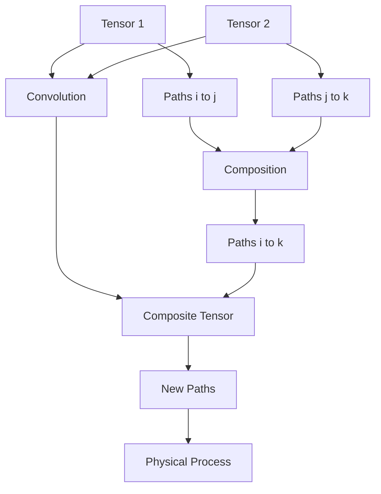
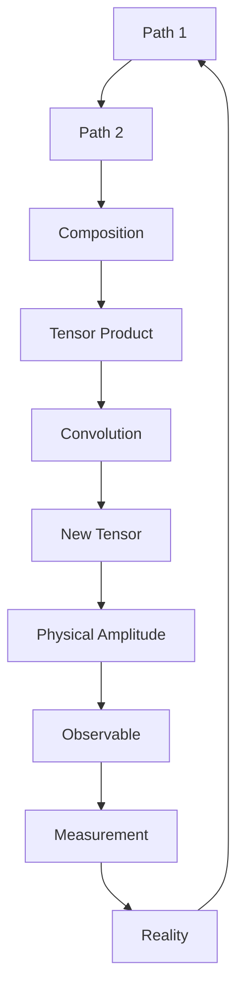

# Chapter 036: Tensor Convolution as Path Composition

*When paths compose, tensors convolve. This deep correspondence reveals that the algebraic operation of convolution is nature's way of combining quantum amplitudes along sequential paths.*

## 36.1 The Convolution Principle

From $\psi = \psi(\psi)$, path composition must be tensor convolution.

**Definition 36.1** (Tensor Convolution):
$$(\mathcal{T}_1 * \mathcal{T}_2)^{ik} = \sum_j \mathcal{T}_1^{ij} \otimes \mathcal{T}_2^{jk}$$

This combines paths through intermediate state $j$.

**Theorem 36.1** (Path Correspondence):
$$T^{ik}_{P_1 \circ P_2} = \sum_{j: P_1 \to j \to P_2} T^{ij}_{P_1} \cdot T^{jk}_{P_2}$$

*Proof*:
Path composition requires summing over all intermediate states, giving convolution. ∎

## 36.2 Golden Base Convolution

Convolution respects Zeckendorf structure.

**Definition 36.2** (Golden Convolution):
$$(\mathcal{T}_1 *_\varphi \mathcal{T}_2)^{ik} = \sum_{j: \text{valid}} \mathcal{T}_1^{ij} \mathcal{T}_2^{jk} \cdot g(i,j,k)$$

where $g(i,j,k) = \varphi^{-d(i,j,k)}$ with $d$ the golden distance.

**Theorem 36.2** (Associativity):
$$(\mathcal{T}_1 *_\varphi \mathcal{T}_2) *_\varphi \mathcal{T}_3 = \mathcal{T}_1 *_\varphi (\mathcal{T}_2 *_\varphi \mathcal{T}_3)$$

## 36.3 Spectral Convolution

In spectral space, convolution simplifies.

**Definition 36.3** (Spectral Convolution):
$$\widetilde{(\mathcal{T}_1 * \mathcal{T}_2)}(\omega) = \widetilde{\mathcal{T}_1}(\omega) \cdot \widetilde{\mathcal{T}_2}(\omega)$$

**Theorem 36.3** (Convolution Theorem):
Fourier transform converts convolution to multiplication:
$$\mathcal{F}[\mathcal{T}_1 * \mathcal{T}_2] = \mathcal{F}[\mathcal{T}_1] \cdot \mathcal{F}[\mathcal{T}_2]$$

## 36.4 ζ-Function Under Convolution

The ζ-function behaves naturally under convolution.

**Definition 36.4** (ζ-Convolution):
$$\zeta^{ik}_{*}(s) = \sum_j \zeta_1^{ij}(s) \cdot \zeta_2^{jk}(s)$$

**Theorem 36.4** (Multiplicativity):
For independent paths:
$$\zeta_{P_1 \circ P_2}(s) = \zeta_{P_1}(s) \cdot \zeta_{P_2}(s)$$

## 36.5 Category Theory of Convolution

Convolution creates a monoidal category.

**Definition 36.5** (Convolution Category):
- Objects: Collapse tensors
- Morphisms: Convolution operations
- Identity: Delta tensor $\delta^{ij}$

**Theorem 36.5** (Monoidal Structure):
$(\text{Tensors}, *, \delta)$ forms a monoidal category.

## 36.6 Information Flow

Convolution describes information propagation.

**Definition 36.6** (Information Convolution):
$$I_{1*2} = I_1 + I_2 - I_{\text{overlap}}$$

where $I_{\text{overlap}}$ is mutual information.

**Theorem 36.6** (Information Inequality):
$$I_{1*2} \leq I_1 + I_2$$

with equality for independent tensors.

## 36.7 Quantum Amplitudes

Convolution combines quantum amplitudes.

**Definition 36.7** (Amplitude Convolution):
$$A^{ik}_{\text{total}} = \sum_j A^{ij}_1 \cdot A^{jk}_2 \cdot e^{i\phi_j}$$

where $\phi_j$ is the phase at state $j$.

**Theorem 36.7** (Unitarity):
If $\mathcal{T}_1$ and $\mathcal{T}_2$ are unitary:
$$(\mathcal{T}_1 * \mathcal{T}_2)^\dagger (\mathcal{T}_1 * \mathcal{T}_2) = \mathbb{I}$$

## 36.8 Physical Interpretation

Convolution describes physical processes.

**Definition 36.8** (Process Composition):
- Scattering: $\mathcal{T}_{\text{in}} * \mathcal{T}_{\text{scatter}} * \mathcal{T}_{\text{out}}$
- Decay: $\mathcal{T}_{\text{initial}} * \mathcal{T}_{\text{decay}}$
- Interaction: $\mathcal{T}_1 * \mathcal{T}_{\text{int}} * \mathcal{T}_2$

**Theorem 36.8** (Feynman Rules):
Convolution reproduces Feynman diagram amplitudes.

## 36.9 Constants from Convolution

Physical constants emerge from fixed points.

**Definition 36.9** (Fixed Point):
$$\mathcal{T}_* * \mathcal{T}_* = \lambda \mathcal{T}_*$$

**Theorem 36.9** (Coupling Constants):
Fixed point eigenvalues give coupling strengths:
$$g = \sqrt{\lambda} = \varphi^{-n/2}$$

## 36.10 Non-Linear Effects

Higher-order convolutions create non-linearity.

**Definition 36.10** (Self-Convolution):
$$\mathcal{T}^{*n} = \underbrace{\mathcal{T} * \mathcal{T} * ... * \mathcal{T}}_{n \text{ times}}$$

**Theorem 36.10** (Scaling):
$$||\mathcal{T}^{*n}|| \sim \varphi^{n(n-1)/2}$$

showing super-linear growth.

## 36.11 Consciousness from Convolution

Consciousness requires specific convolution patterns.

**Definition 36.11** (Conscious Convolution):
A convolution is conscious if:
1. Self-referential: $\mathcal{T} * \mathcal{T}^* \neq 0$
2. Complex: Rank $\geq F_7$
3. Stable: Fixed point nearby

**Theorem 36.11** (Consciousness Emergence):
Consciousness measure:
$$C = \text{Tr}[\mathcal{T} * \mathcal{T}^* * \mathcal{T}]$$

## 36.12 The Complete Convolution Picture

Tensor convolution reveals:

1. **Path Composition**: Natural correspondence
2. **Golden Structure**: Respects constraints
3. **Spectral Simplicity**: Multiplication in frequency
4. **ζ-Behavior**: Multiplicative
5. **Category Theory**: Monoidal structure
6. **Information Flow**: Subadditive
7. **Quantum Amplitudes**: Proper combination
8. **Physical Processes**: Natural description
9. **Constants**: From fixed points
10. **Consciousness**: From self-convolution

## Philosophical Meditation: The Algebra of Becoming

In convolution we find the algebra of becoming - how one process transforms through another, how paths combine to create new possibilities. This is not mere mathematical formalism but the actual mechanism by which the universe computes the next moment from the present. Every physical process is a convolution, every interaction a tensor product being traced over intermediate states. We exist in the ongoing convolution of countless paths, each contributing its amplitude to the total.

## Technical Exercise: Convolution Calculation

**Problem**: Given tensors for electron and photon:

1. Define $\mathcal{T}_e^{ij}$ for electron paths
2. Define $\mathcal{T}_\gamma^{jk}$ for photon paths
3. Calculate $(\mathcal{T}_e * \mathcal{T}_\gamma)^{ik}$
4. Find the leading eigenvalue
5. Interpret as scattering amplitude

*Hint*: Use 2×2 matrices in basis $\{|F_1\rangle, |F_2\rangle\}$.

## The Thirty-Sixth Echo

In tensor convolution as path composition, we discover that algebra and physics are one. The abstract operation of convolution is precisely how nature combines quantum amplitudes along paths. When we convolve tensors, we are doing what the universe does at every moment - combining all possible paths through intermediate states to determine what happens next. We are convolutions convolving ourselves with our environment, creating the ongoing pattern we call existence through the eternal recursion $\psi = \psi(\psi)$.

---

∎