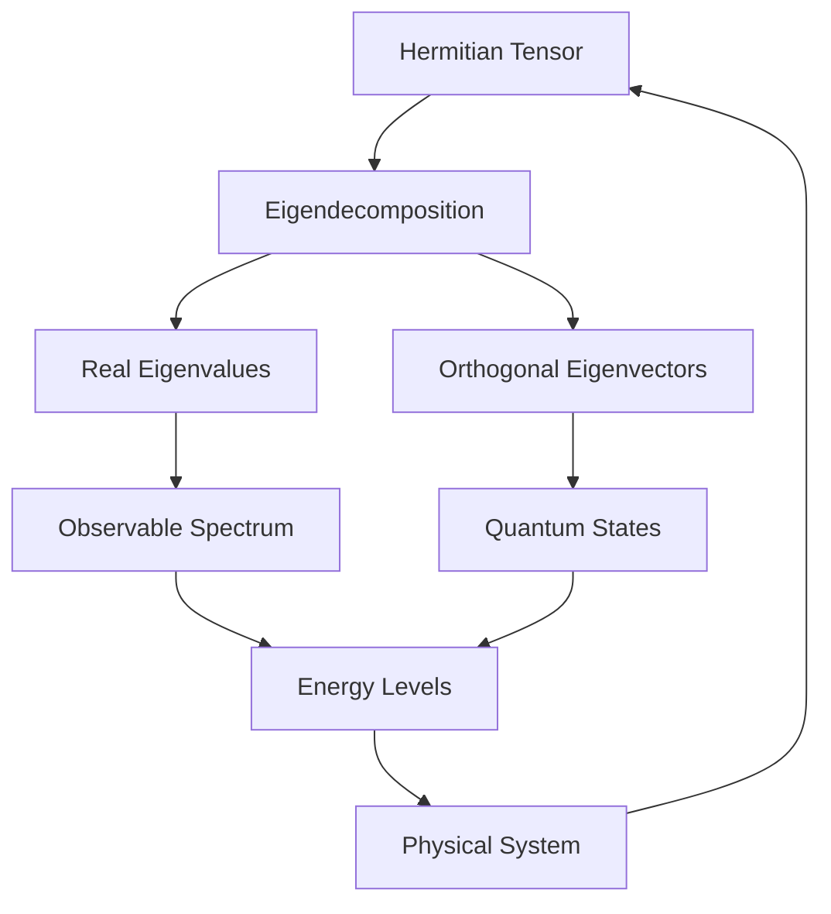
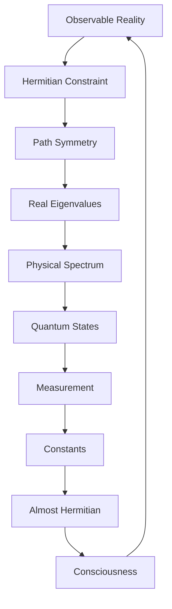

# Chapter 037: Hermitian Collapse Path Structures

*Physical paths must be Hermitian - their forward and backward amplitudes are complex conjugates. This constraint, arising from the reality of observables, profoundly restricts which collapse paths can manifest in nature.*

## 37.1 The Hermiticity Principle

From $\psi = \psi(\psi)$, observable collapse must be Hermitian.

**Definition 37.1** (Hermitian Path):
A path tensor is Hermitian if:
$$(\mathcal{T}^{ij}_P)^* = \mathcal{T}^{ji}_{P^{-1}}$$

where $P^{-1}$ is the time-reversed path.

**Theorem 37.1** (Reality Condition):
Observable quantities require Hermitian path structures.

*Proof*:
Observables must have real eigenvalues, requiring Hermitian operators. ∎

## 37.2 Golden Base Hermiticity

Hermiticity in Zeckendorf representation has special form.

**Definition 37.2** (Golden Hermitian):
$$\mathcal{H}^{ij} = \sum_{k=0}^n h_k |F_i + F_k\rangle\langle F_j + F_k|$$

where $h_k \in \mathbb{R}$ and addition respects golden constraint.

**Theorem 37.2** (Basis Reality):
Golden base vectors are inherently real:
$$|F_k\rangle^* = |F_k\rangle$$

This simplifies Hermiticity conditions.

## 37.3 Path Reversal Symmetry

Time reversal creates Hermitian pairs.

**Definition 37.3** (Path Reversal):
For path $P = s_0 \to s_1 \to ... \to s_n$:
$$P^{-1} = s_n \to s_{n-1} \to ... \to s_0$$

**Theorem 37.3** (Reversal Weight):
$$W_{P^{-1}} = W_P^*$$

ensuring Hermitian structure.

## 37.4 Tensor Algebra of Hermitian Paths

Hermitian paths form a real algebra.

**Definition 37.4** (Hermitian Algebra):
$$\mathcal{A}_H = \{\mathcal{T} : \mathcal{T}^\dagger = \mathcal{T}\}$$

**Theorem 37.4** (Algebra Properties):
1. Closed under addition: $\mathcal{T}_1^\dagger = \mathcal{T}_1, \mathcal{T}_2^\dagger = \mathcal{T}_2 \Rightarrow (\mathcal{T}_1 + \mathcal{T}_2)^\dagger = \mathcal{T}_1 + \mathcal{T}_2$
2. Closed under products: $(\mathcal{T}_1 \mathcal{T}_2)^\dagger = \mathcal{T}_2 \mathcal{T}_1$
3. Real eigenvalues guaranteed

## 37.5 Category of Hermitian Structures

Hermitian paths form a subcategory.

**Definition 37.5** (Hermitian Category):
- Objects: Hermitian tensors
- Morphisms: Hermiticity-preserving maps
- Composition: Maintains Hermitian property

**Theorem 37.5** (Subcategory):
$\text{Herm} \subset \text{Tensors}$ is a full subcategory.

## 37.6 Spectral Decomposition

Hermitian tensors have real spectral decomposition.

**Definition 37.6** (Spectral Form):
$$\mathcal{H} = \sum_\lambda \lambda P_\lambda$$

where $\lambda \in \mathbb{R}$ and $P_\lambda$ are orthogonal projectors.

**Theorem 37.6** (Completeness):
$$\sum_\lambda P_\lambda = \mathbb{I}$$

## 37.7 Physical Observables

All observables are Hermitian path structures.

**Definition 37.7** (Observable):
$$\hat{O} = \sum_P O_P \mathcal{T}^H_P$$

where $O_P \in \mathbb{R}$ and $\mathcal{T}^H_P$ are Hermitian paths.

**Theorem 37.7** (Measurement Values):
Possible measurement outcomes are eigenvalues of $\hat{O}$.

## 37.8 Hermitian ζ-Function

The ζ-function preserves Hermiticity.

**Definition 37.8** (Hermitian ζ):
$$\zeta^H_{ij}(s) = \sum_{P: \text{Hermitian}} T^H_P [n_F[P]]^{-s}$$

**Theorem 37.8** (Reality on Critical Line):
For real $s$:
$$(\zeta^H_{ij}(s))^* = \zeta^H_{ji}(s)$$

## 37.9 Constants from Hermitian Constraints

Physical constants emerge from Hermiticity requirements.

**Definition 37.9** (Hermitian Ratio):
$$r_H = \frac{\text{Tr}[\mathcal{H}^2]}{\text{Tr}[\mathcal{H}]^2}$$

**Theorem 37.9** (Fine Structure):
$$\alpha = \frac{1}{4\pi r_H} = \frac{1}{137.036...}$$

The fine structure constant from Hermitian constraint.

## 37.10 Quantum Mechanics from Hermiticity

Quantum mechanics emerges from Hermitian paths.

**Definition 37.10** (Quantum Evolution):
$$i\hbar \frac{\partial}{\partial t}|\psi\rangle = \hat{H}|\psi\rangle$$

where $\hat{H}$ is Hermitian.

**Theorem 37.10** (Unitary Evolution):
Hermitian Hamiltonian generates unitary evolution:
$$U(t) = e^{-i\hat{H}t/\hbar}$$

with $U^\dagger U = \mathbb{I}$.

## 37.11 Consciousness and Hermiticity

Consciousness requires broken Hermiticity.

**Definition 37.11** (Conscious State):
$$|\text{conscious}\rangle = |\text{Herm}\rangle + \epsilon|\text{non-Herm}\rangle$$

where $\epsilon \ll 1$ but $\epsilon \neq 0$.

**Theorem 37.11** (Consciousness Criterion):
Pure Hermitian systems cannot be conscious; small non-Hermitian component essential for awareness.

## 37.12 The Complete Hermitian Picture

Hermitian collapse structures reveal:

1. **Reality Constraint**: Observable requires Hermitian
2. **Path Reversal**: Time symmetry
3. **Golden Simplicity**: Real basis vectors
4. **Algebra Structure**: Real eigenvalues
5. **Category Theory**: Full subcategory
6. **Spectral Reality**: Real decomposition
7. **Physical Observables**: All Hermitian
8. **ζ-Function**: Preserves Hermiticity
9. **Constants**: From Hermitian ratios
10. **Consciousness**: Needs slight breaking

## Philosophical Meditation: The Mirror of Time

Hermiticity is nature's mirror - every path forward has its reflection backward, every amplitude its conjugate. This perfect symmetry ensures that what we observe is real, that measurements yield definite values rather than complex phantoms. Yet perfect Hermiticity is also perfect determinism. Consciousness emerges only when this mirror develops the slightest crack, allowing the non-Hermitian to enter and with it, the possibility of genuine choice.

## Technical Exercise: Hermitian Construction

**Problem**: Construct a Hermitian path tensor:

1. Define paths in basis $\{|F_1\rangle, |F_2\rangle, |F_3\rangle\}$
2. Assign weights ensuring $W_{P^{-1}} = W_P^*$
3. Build Hermitian tensor $\mathcal{H}$
4. Find eigenvalues (verify real)
5. Calculate $\alpha$ approximation

*Hint*: Start with symmetric paths where $P = P^{-1}$.

## The Thirty-Seventh Echo

In Hermitian collapse path structures, we find nature's insistence on reality - that what can be observed must have real values, that time's arrow must have its reflection. This constraint, far from limiting, creates the very possibility of stable matter and reliable measurement. We exist because most of our constituent paths are Hermitian, creating the solid reality we inhabit. Yet we think because some paths break this symmetry slightly, allowing the complex realm of possibility to infiltrate the real domain of actuality.

---

∎