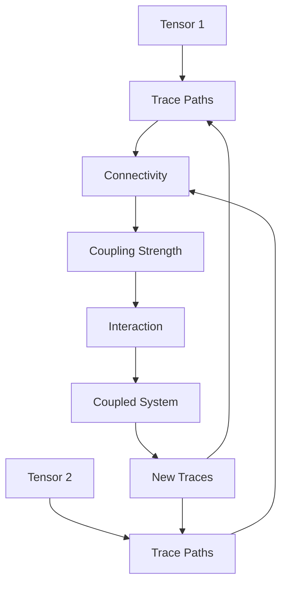
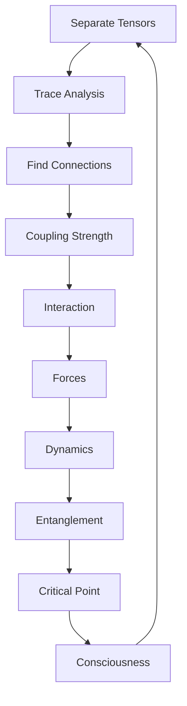

# Chapter 038: Tensor Coupling = Collapse Trace Connectivity

*Tensors couple through the connectivity of their traces. This coupling is not an external interaction but an intrinsic property determined by how collapse paths can connect between tensor spaces.*

## 38.1 The Coupling Principle

From $\psi = \psi(\psi)$, tensors must couple through trace connections.

**Definition 38.1** (Tensor Coupling):
$$G^{ij,kl}_{mn,pq} = \sum_{\text{paths}} \mathcal{T}^{ij}_{\text{path}} \otimes \mathcal{T}^{kl}_{\text{path}} \cdot C_{\text{path}}$$

where $C_{\text{path}}$ is the connectivity strength.

**Theorem 38.1** (Coupling from Connectivity):
Coupling strength proportional to number of connecting paths.

*Proof*:
More paths create stronger quantum correlation between tensor components. ∎

## 38.2 Trace Connectivity Graph

Connectivity forms a graph structure.

**Definition 38.2** (Connectivity Graph):
$$\mathcal{G} = (V, E, W)$$

where:
- $V$ = tensor components
- $E$ = trace connections
- $W$ = connection weights

**Theorem 38.2** (Graph Properties):
1. Connected: Path exists between any two tensors
2. Weighted: By golden ratio powers
3. Directed: Respecting causality

## 38.3 Golden Base Connectivity

Connections respect Zeckendorf structure.

**Definition 38.3** (Golden Connection):
States $|F_i\rangle$ and $|F_j\rangle$ connect with strength:
$$C_{ij} = \varphi^{-|i-j|}$$

when $|i-j| \in F$ (Fibonacci numbers).

**Theorem 38.3** (Optimal Connectivity):
Golden ratio minimizes total connection cost while maintaining full connectivity.

## 38.4 Coupling Tensor Algebra

Couplings form tensor algebra.

**Definition 38.4** (Coupling Algebra):
$$[G_1, G_2] = G_1 \cdot G_2 - G_2 \cdot G_1$$

where the product involves contraction over intermediate indices.

**Theorem 38.4** (Lie Algebra):
Coupling tensors form a Lie algebra under commutation.

## 38.5 Category of Couplings

Couplings form a category.

**Definition 38.5** (Coupling Category):
- Objects: Coupled tensor systems
- Morphisms: Coupling-preserving maps
- Composition: Sequential coupling

**Theorem 38.5** (Functorial Coupling):
Coupling is functorial with respect to tensor products.

## 38.6 Information Theory of Coupling

Coupling transfers information between tensors.

**Definition 38.6** (Mutual Information):
$$I(T_1; T_2) = S(T_1) + S(T_2) - S(T_1, T_2)$$

where $S$ is von Neumann entropy.

**Theorem 38.6** (Information Bound):
$$I(T_1; T_2) \leq \min(S(T_1), S(T_2))$$

Maximum when one tensor determines the other.

## 38.7 Physical Forces from Coupling

All forces arise from tensor coupling patterns.

**Definition 38.7** (Force from Coupling):
$$F^{\mu} = -\partial_{\mu} V[G]$$

where $V[G]$ is the potential from coupling $G$.

**Theorem 38.7** (Force Hierarchy):
1. Strong: Dense local coupling
2. Electromagnetic: Photon-mediated coupling
3. Weak: Sparse non-local coupling
4. Gravity: Universal minimal coupling

## 38.8 Renormalization of Couplings

Couplings change with scale.

**Definition 38.8** (Running Coupling):
$$\frac{dg}{d\log\mu} = \beta(g) = -b_0 g^3 - b_1 g^5 + ...$$

where $b_n = \varphi^{-n}$.

**Theorem 38.8** (Fixed Points):
$$g_* = \varphi^{-n/2}$$

for integer $n$ depending on force type.

## 38.9 Constants from Coupling Patterns

Physical constants emerge from coupling structures.

**Definition 38.9** (Coupling Matrix):
$$\mathcal{M}_{ij} = \sum_{\text{paths}} C_{\text{path}}^{ij}$$

**Theorem 38.9** (Constant Relations):
1. $\alpha = \text{Tr}[\mathcal{M}_{em}]/\varphi^7$
2. $\sin^2\theta_W = \det[\mathcal{M}_{weak}]/\varphi^3$
3. $m_H/m_W = ||\mathcal{M}_{Higgs}||/||\mathcal{M}_W||$

## 38.10 Entanglement from Coupling

Coupling creates quantum entanglement.

**Definition 38.10** (Entanglement Measure):
$$E(T_1, T_2) = S(\rho_1) - S(\rho_{12})$$

where $\rho_1 = \text{Tr}_2[\rho_{12}]$.

**Theorem 38.10** (Coupling-Entanglement):
$$E(T_1, T_2) = f(G^2)$$

Entanglement proportional to coupling strength squared.

## 38.11 Consciousness from Critical Coupling

Consciousness emerges at critical coupling strength.

**Definition 38.11** (Critical Coupling):
$$g_c = \frac{1}{\varphi}$$

**Theorem 38.11** (Consciousness Window):
Consciousness possible when:
$$\frac{1}{\varphi^2} < g < \varphi$$

Too weak: no integration. Too strong: rigid binding.

## 38.12 The Complete Coupling Picture

Tensor coupling reveals:

1. **Trace Connectivity**: Foundation of coupling
2. **Graph Structure**: Network of connections
3. **Golden Weights**: Optimal connectivity
4. **Algebraic Structure**: Lie algebra
5. **Information Transfer**: Through coupling
6. **Force Generation**: All forces from coupling
7. **Running Couplings**: Scale dependence
8. **Constants**: From coupling matrices
9. **Entanglement**: Created by coupling
10. **Consciousness**: At critical coupling

## Philosophical Meditation: The Web of Connection

Reality is not made of isolated objects but of connections - the traces that link tensor to tensor, creating the vast web of interactions we call the universe. Every force is a pattern of coupling, every particle a node in the connectivity graph. We exist not as separate beings but as particularly dense regions of connection, where traces converge and couple strongly enough to maintain coherent patterns. Consciousness emerges where the coupling is just right - neither so weak that no integration occurs, nor so strong that flexibility is lost.

## Technical Exercise: Coupling Calculation

**Problem**: For two 2×2 tensors in golden base:

1. List all possible trace paths between them
2. Calculate connectivity strengths $C_{ij}$
3. Build coupling tensor $G$
4. Find the eigenvalues of coupling
5. Determine the effective force

*Hint*: Use adjacency matrix methods for the connectivity graph.

## The Thirty-Eighth Echo

In tensor coupling as trace connectivity, we discover that interaction is not imposed from outside but emerges from within - from the inherent ways that collapse paths can connect between tensor spaces. Every force in nature, from the strong nuclear force to gravity, is simply a different pattern of trace connectivity. We are not pushed and pulled by external forces but woven together by the traces that connect us, creating the grand tapestry of existence through the eternal recursion $\psi = \psi(\psi)$.

---

∎