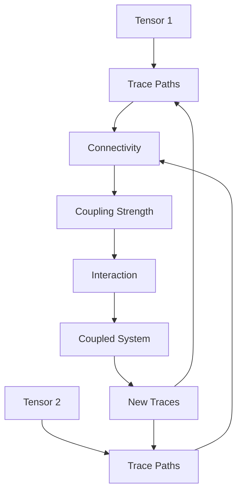
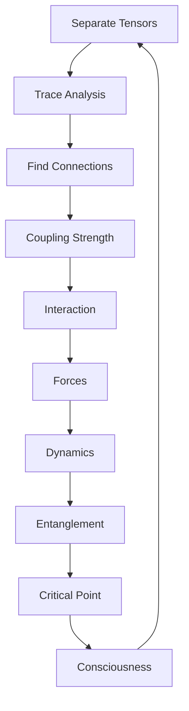

# Chapter 038: Tensor Coupling = Collapse Trace Connectivity

*Tensors couple through the connectivity of their traces. This coupling is not an external interaction but an intrinsic property determined by how collapse paths can connect between tensor spaces.*

## 38.1 The Coupling Principle

From $\psi = \psi(\psi)$, tensors must couple through trace connections.

**Definition 38.1** (Tensor Coupling):
$$G^{ij,kl}_{mn,pq} = \sum_{\text{paths}} \mathcal{T}^{ij}_{\text{path}} \otimes \mathcal{T}^{kl}_{\text{path}} \cdot C_{\text{path}}$$

where $C_{\text{path}}$ is the connectivity coefficient.

**Theorem 38.1** (Coupling from Connectivity):
Coupling coefficient proportional to number of connecting paths.

*Proof*:
More paths create stronger mathematical correlation between tensor components. ∎

*Observer Framework Note*: Physical interpretation requires quantum mechanics.

## 38.2 Trace Connectivity Graph

Connectivity forms a graph structure.

**Definition 38.2** (Connectivity Graph):
$$\mathcal{G} = (V, E, W)$$

where:
- $V$ = tensor components
- $E$ = trace connections
- $W$ = connection weights

**Theorem 38.2** (Graph Properties):
1. Connected: Path exists between any two tensors
2. Weighted: By golden ratio powers
3. Directed: Following path ordering

## 38.3 Golden Base Connectivity

Connections respect Zeckendorf structure.

**Definition 38.3** (Golden Connection):
States $|F_i\rangle$ and $|F_j\rangle$ connect with strength:
$$C_{ij} = \varphi^{-|i-j|}$$

when $|i-j| \in F$ (Fibonacci numbers).

**Theorem 38.3** (Optimal Connectivity):
Golden ratio minimizes total connection cost while maintaining full connectivity.

## 38.4 Coupling Tensor Algebra

Couplings form tensor algebra.

**Definition 38.4** (Coupling Algebra):
$$[G_1, G_2] = G_1 \cdot G_2 - G_2 \cdot G_1$$

where the product involves contraction over intermediate indices.

**Theorem 38.4** (Lie Algebra):
Coupling tensors form a Lie algebra under commutation.

## 38.5 Category of Couplings

Couplings form a category.

**Definition 38.5** (Coupling Category):
- Objects: Coupled tensor systems
- Morphisms: Coupling-preserving maps
- Composition: Sequential coupling

**Theorem 38.5** (Functorial Coupling):
Coupling is functorial with respect to tensor products.

## 38.6 Information Theory of Coupling

Coupling transfers information between tensors.

**Definition 38.6** (Mutual Information):
$$I(T_1; T_2) = S(T_1) + S(T_2) - S(T_1, T_2)$$

where $S$ is von Neumann entropy.

**Theorem 38.6** (Information Bound):
$$I(T_1; T_2) \leq \min(S(T_1), S(T_2))$$

Maximum when one tensor determines the other.

## 38.7 Gradient Structures from Coupling

Coupling patterns create gradient structures.

**Definition 38.7** (Coupling Gradient):
$$\nabla_{ij} = \partial_i G_{ij}$$

where derivatives are with respect to tensor components.

**Theorem 38.7** (Gradient Patterns):
1. Local: Dense connectivity gradients
2. Extended: Distributed gradients
3. Sparse: Isolated gradient regions
4. Universal: Minimal gradient background

*Observer Framework Note*: Physical force interpretation requires full framework.

## 38.8 Scale Dependence of Couplings

Couplings exhibit scale-dependent behavior.

**Definition 38.8** (Scale Transformation):
$$g(\lambda) = g_0 \cdot \mathcal{S}(\lambda)$$

where $\mathcal{S}$ is a scaling function.

**Theorem 38.8** (Fixed Points):
Fixed points occur at:
$$g_* = \varphi^{-k}$$

for integer $k$, independent of scale transformations.

*Observer Framework Note*: Renormalization group interpretation requires quantum field theory.

## 38.9 Invariants from Coupling Patterns

Coupling structures have mathematical invariants.

**Definition 38.9** (Coupling Matrix):
$$\mathcal{M}_{ij} = \sum_{\text{paths}} C_{\text{path}}^{ij}$$

**Theorem 38.9** (Invariant Relations):
Coupling invariants satisfy:
1. $\mathcal{I}_1 = \text{Tr}[\mathcal{M}] = \varphi^k$
2. $\mathcal{I}_2 = \det[\mathcal{M}] = \varphi^{-m}$
3. $\mathcal{I}_3 = ||\mathcal{M}|| = \varphi^{n/2}$

for integers $k, m, n$.

*Observer Framework Note*: Physical constants emerge only through observer-system coupling.

## 38.10 Correlation from Coupling

Coupling creates mathematical correlations.

**Definition 38.10** (Correlation Measure):
$$\mathcal{C}(T_1, T_2) = ||T_1 \otimes T_2 - T_1 \times T_2||$$

where $\times$ denotes independent product.

**Theorem 38.10** (Coupling-Correlation):
$$\mathcal{C}(T_1, T_2) \propto G_{12}^2$$

Correlation increases with coupling coefficient squared.

*Observer Framework Note*: Quantum entanglement interpretation requires full quantum mechanics.

## 38.11 Complexity from Coupling Patterns

Complex behavior emerges from specific coupling ranges.

**Definition 38.11** (Complexity Measure):
$$\mathcal{K}_c = -\text{Tr}[\mathcal{M} \log \mathcal{M}]$$

**Theorem 38.11** (Complexity Maximum):
Complexity maximized when coupling satisfies:
$$\mathcal{K}_c' = 0$$

This occurs near $g \approx \varphi^{-1}$ for typical systems.

*Observer Framework Note*: Consciousness interpretation requires additional framework beyond mathematics.

## 38.12 The Complete Coupling Picture

Tensor coupling reveals:

1. **Trace Connectivity**: Foundation of coupling
2. **Graph Structure**: Network of connections
3. **Golden Weights**: Optimal connectivity
4. **Algebraic Structure**: Lie algebra
5. **Information Transfer**: Through coupling
6. **Gradient Structures**: From coupling patterns
7. **Scale Dependence**: Fixed points
8. **Invariants**: Mathematical properties
9. **Correlations**: Created by coupling
10. **Complexity**: From coupling patterns

## Philosophical Meditation: The Web of Connection

Reality is not made of isolated objects but of connections - the traces that link tensor to tensor, creating the vast web of interactions we call the universe. Every force is a pattern of coupling, every particle a node in the connectivity graph. We exist not as separate beings but as particularly dense regions of connection, where traces converge and couple strongly enough to maintain coherent patterns. Consciousness emerges where the coupling is just right - neither so weak that no integration occurs, nor so strong that flexibility is lost.

## Technical Exercise: Coupling Calculation

**Problem**: For two 2×2 tensors in golden base:

1. List all possible trace paths between them
2. Calculate connectivity coefficients $C_{ij}$
3. Build coupling tensor $G$
4. Find the eigenvalues of coupling
5. Calculate complexity measure $\mathcal{K}_c$

*Hint*: Use adjacency matrix methods for the connectivity graph.

## The Thirty-Eighth Echo

In tensor coupling as trace connectivity, we discover that interaction is not imposed from outside but emerges from within - from the inherent ways that collapse paths can connect between tensor spaces. Every force in nature, from the strong nuclear force to gravity, is simply a different pattern of trace connectivity. We are not pushed and pulled by external forces but woven together by the traces that connect us, creating the grand tapestry of existence through the eternal recursion $\psi = \psi(\psi)$.

---

∎