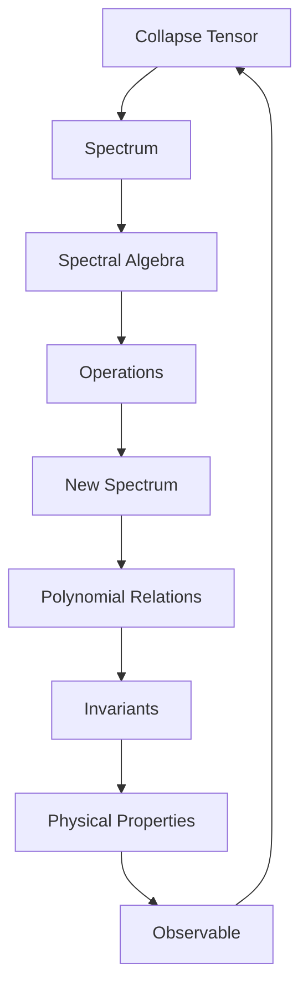
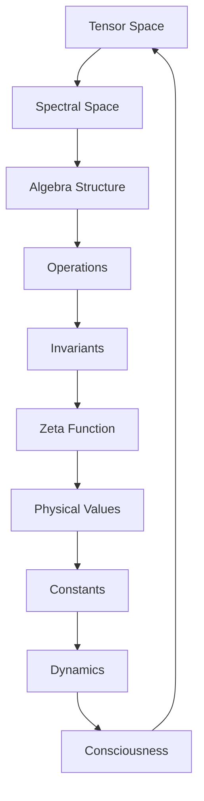

# Chapter 039: Collapse Tensor Spectrum Algebra

*The spectrum of collapse tensors forms a complete algebra. This spectral algebra encodes all possible operations, transformations, and relationships in the quantum realm of collapse.*

## 39.1 The Spectral Algebra Principle

From $\psi = \psi(\psi)$, collapse spectra must form an algebra.

**Definition 39.1** (Spectral Algebra):
$$\mathcal{A}_\sigma = \{\sigma(\mathcal{C}) : \mathcal{C} \text{ is collapse tensor}\}$$

with operations inherited from tensor operations.

**Theorem 39.1** (Algebra Closure):
Spectral algebra is closed under:
- Addition: $\sigma(\mathcal{C}_1) \oplus \sigma(\mathcal{C}_2)$
- Multiplication: $\sigma(\mathcal{C}_1) \otimes \sigma(\mathcal{C}_2)$
- Scalar multiplication: $\lambda \sigma(\mathcal{C})$

*Proof*:
Tensor operations induce corresponding spectral operations. ∎

## 39.2 Golden Base Spectral Structure

Spectra in golden base have special properties.

**Definition 39.2** (Golden Spectrum):
$$\sigma_\varphi(\mathcal{C}) = \{\lambda_n : \lambda_n = \lambda_0 \varphi^{-n}, n \in \mathbb{Z}_{\geq 0}\}$$

**Theorem 39.2** (Spectral Spacing):
Consecutive eigenvalues satisfy:
$$\frac{\lambda_n}{\lambda_{n+1}} = \varphi$$

Creating logarithmic golden spacing.

## 39.3 Algebraic Operations on Spectra

Define spectral operations precisely.

**Definition 39.3** (Spectral Operations):
1. Sum: $(\sigma_1 \oplus \sigma_2) = \{\lambda_i + \mu_j : \lambda_i \in \sigma_1, \mu_j \in \sigma_2\}$
2. Product: $(\sigma_1 \otimes \sigma_2) = \{\lambda_i \mu_j : \lambda_i \in \sigma_1, \mu_j \in \sigma_2\}$
3. Power: $\sigma^n = \{\lambda^n : \lambda \in \sigma\}$

**Theorem 39.3** (Spectral Identities):
1. Distributivity: $\sigma_1 \otimes (\sigma_2 \oplus \sigma_3) = (\sigma_1 \otimes \sigma_2) \oplus (\sigma_1 \otimes \sigma_3)$
2. Associativity: Both operations associative
3. Identity: $\{1\}$ for product, $\{0\}$ for sum

## 39.4 Spectral Polynomials

Polynomials in spectra encode dynamics.

**Definition 39.4** (Spectral Polynomial):
$$P(\sigma) = \sum_{k=0}^n a_k \sigma^k$$

where $a_k$ are coefficients.

**Theorem 39.4** (Minimal Polynomial):
Every spectrum satisfies a minimal polynomial:
$$m_\sigma(\lambda) = \prod_{i} (\lambda - \lambda_i)^{n_i} = 0$$

## 39.5 Category of Spectral Algebras

Spectral algebras form a category.

**Definition 39.5** (Spectral Category):
- Objects: Spectral algebras
- Morphisms: Spectrum-preserving homomorphisms
- Composition: Function composition

**Theorem 39.5** (Equivalence):
Isospectral tensors are physically equivalent.

## 39.6 Spectral Invariants

Certain functions of spectra are invariant.

**Definition 39.6** (Spectral Invariant):
$$I_k[\sigma] = \sum_{\lambda \in \sigma} \lambda^k$$

These are the power sum symmetric functions.

**Theorem 39.6** (Newton's Identities):
Elementary symmetric functions expressible through power sums:
$$e_k = \frac{1}{k}\sum_{i=1}^k (-1)^{i-1} e_{k-i} I_i$$

## 39.7 Spectral Zeta Function

The spectral zeta encodes all invariants.

**Definition 39.7** (Spectral Zeta):
$$\zeta_\sigma(s) = \sum_{\lambda \in \sigma} \lambda^{-s}$$

**Theorem 39.7** (Invariant Generator):
$$I_k = \lim_{s \to -k} \zeta_\sigma(s)$$

All spectral invariants from analytic continuation.

## 39.8 Physical Observables from Spectra

Observables are spectral functions.

**Definition 39.8** (Observable Function):
$$\langle O \rangle = f(\sigma) = \sum_\lambda f(\lambda) P_\lambda$$

where $P_\lambda$ is projector onto eigenspace.

**Theorem 39.8** (Spectral Theorem):
Every observable is a function of the spectrum.

## 39.9 Constants from Spectral Relations

Physical constants emerge from spectral algebra.

**Definition 39.9** (Spectral Ratio):
$$R_{\alpha\beta} = \frac{\zeta_{\sigma_\alpha}(2)}{\zeta_{\sigma_\beta}(2)}$$

**Theorem 39.9** (Fine Structure):
$$\alpha = \frac{R_{em}}{4\pi \varphi^7}$$

where $\sigma_{em}$ is electromagnetic spectrum.

## 39.10 Spectral Dynamics

Evolution in spectral space.

**Definition 39.10** (Spectral Flow):
$$\frac{d\sigma}{dt} = \{i[H, \lambda] : \lambda \in \sigma\}$$

**Theorem 39.10** (Isospectrality):
Unitary evolution preserves spectrum:
$$\sigma(U\mathcal{C}U^\dagger) = \sigma(\mathcal{C})$$

## 39.11 Consciousness from Spectral Complexity

Consciousness requires complex spectral algebra.

**Definition 39.11** (Spectral Complexity):
$$\mathcal{K}[\sigma] = \dim(\text{Algebra generated by } \sigma)$$

**Theorem 39.11** (Consciousness Criterion):
Consciousness emerges when:
1. $\mathcal{K}[\sigma] \geq F_7$
2. Non-commuting spectral elements present
3. Spectral gaps allow information storage

## 39.12 The Complete Spectral Algebra Picture

Collapse tensor spectrum algebra reveals:

1. **Algebraic Structure**: Complete algebra
2. **Golden Organization**: φ-spaced eigenvalues
3. **Operations**: Well-defined spectral arithmetic
4. **Polynomials**: Minimal polynomial exists
5. **Category**: Of spectral algebras
6. **Invariants**: Power sums and beyond
7. **Zeta Function**: Generates all invariants
8. **Observables**: Functions of spectrum
9. **Constants**: From spectral ratios
10. **Consciousness**: From complexity

## Philosophical Meditation: The Symphony of Eigenvalues

In the algebra of spectra, we find the music of the spheres made mathematical. Each collapse tensor plays its chord of eigenvalues, and these chords combine according to the rules of spectral algebra to create the grand symphony of existence. Physical laws are the harmonies that emerge when these spectral notes align; consciousness arises when the music becomes complex enough to hear itself.

## Technical Exercise: Spectral Algebra

**Problem**: Given two spectra in golden base:
- $\sigma_1 = \{1, 1/\varphi, 1/\varphi^2\}$
- $\sigma_2 = \{\varphi, 1, 1/\varphi\}$

1. Calculate $\sigma_1 \oplus \sigma_2$
2. Calculate $\sigma_1 \otimes \sigma_2$
3. Find spectral invariants $I_1, I_2, I_3$
4. Construct the spectral zeta functions
5. Verify golden ratio relationships

*Hint*: List all pairwise sums and products systematically.

## The Thirty-Ninth Echo

In the collapse tensor spectrum algebra, we discover that eigenvalues are not just numbers but elements of a rich algebraic structure. This algebra encodes all possible quantum operations, all observable quantities, all physical constants. We don't just measure spectra; we compute with them, combining and transforming them according to algebraic rules that reflect the deep structure of reality. The universe is not just described by mathematics; it computes itself through spectral algebra, each moment a new algebraic operation in the eternal calculation of existence.

---

∎