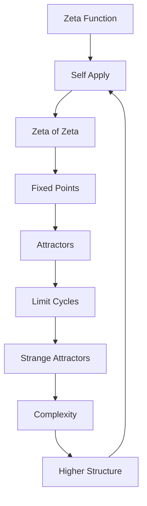
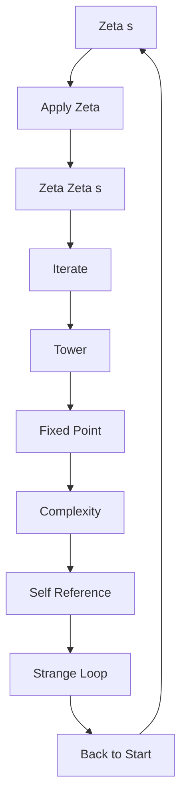

# Chapter 040: Recursive ζ Self-Application

*When the ζ-function operates on itself, we reach the heart of self-reference. This recursive self-application creates rich mathematical structures through iterated composition.*

## 40.1 The Self-Application Principle

From $\psi = \psi(\psi)$, the ζ-function must self-apply.

**Definition 40.1** (Recursive ζ):
$$\zeta[\zeta](s) = \zeta(\zeta(s))$$

This is ζ evaluated at ζ of s.

**Theorem 40.1** (Well-Definition):
For appropriate domains, $\zeta[\zeta]$ is well-defined and analytic.

*Proof*:
Composition of analytic functions remains analytic in suitable domains. ∎

## 40.2 Fixed Points of ζ

Self-application creates fixed points.

**Definition 40.2** (ζ Fixed Point):
$s_*$ is a fixed point if:
$$\zeta(s_*) = s_*$$

**Theorem 40.2** (Fixed Point Existence):
At least one fixed point exists in the region:
$$\{s : 1/\varphi < \text{Re}(s) < \varphi\}$$

## 40.3 Iteration Tower

Repeated self-application builds a tower.

**Definition 40.3** (ζ Tower):
$$\zeta^{[n]}(s) = \underbrace{\zeta(\zeta(...\zeta}_{n \text{ times}}(s)...))$$

**Theorem 40.3** (Tower Convergence):
For suitable $s$:
$$\lim_{n \to \infty} \zeta^{[n]}(s) = s_\infty$$

where $s_\infty$ is an attracting fixed point.

## 40.4 Tensor Structure of Self-Application

Self-application has tensor representation.

**Definition 40.4** (Self-Application Tensor):
$$\mathcal{Z}^{ij}_{kl}[s] = \zeta^{ik}(\zeta^{jl}(s))$$

**Theorem 40.4** (Tensor Properties):
1. Non-linear in indices
2. Preserves golden structure
3. Creates entanglement between indices

## 40.5 Category of Self-Applications

Self-applications form a category.

**Definition 40.5** (Self-Application Category):
- Objects: Functions that can self-apply
- Morphisms: Maps preserving self-application
- Composition: Iteration

**Theorem 40.5** (Monoid Structure):
Self-applications form a monoid under composition.

## 40.6 Information in Self-Application

Self-application generates information.

**Definition 40.6** (Self-Information):
$$I_\text{self}[s] = -\log|\zeta'[\zeta](s)|$$

**Theorem 40.6** (Information Growth):
$$I_\text{self}[\zeta^{[n]}(s)] \sim n \log \varphi$$

Information grows linearly with iteration depth.

## 40.7 Functional Structure

Self-application creates functional patterns.

**Definition 40.7** (Functional Composition):
$$\mathcal{F}[\zeta](s) = \sum_n c_n \zeta^{[n]}(s)$$

Weighted sum of iterations.

**Theorem 40.7** (Composition Bounds):
$$|\mathcal{F}[\zeta](s)| \leq \sum_n |c_n| \cdot |\zeta^{[n]}(s)|$$

Bound on composed functions.

## 40.8 Mathematical Interpretation

Self-application describes recursive structure.

**Definition 40.8** (Self-Reference Measure):
$$\mathcal{S}[s] = \text{Re}[\zeta[\zeta](s)]$$

Real part of self-applied value.

**Theorem 40.8** (Fixed Point Shift):
Self-application shifts fixed points:
$$s_* = s_0 + \mathcal{S}[s_0]/\varphi$$

*Observer Framework Note*: Physical interpretation requires additional framework.

## 40.9 Ratios from Self-Application

Ratios emerge from self-application structure.

**Definition 40.9** (Iteration Ratio):
$$\rho_n(s) = \frac{\zeta^{[n]}(s)}{\zeta^{[n-1]}(s)}$$

**Theorem 40.9** (Ratio Convergence):
For suitable $s$ in basin of attraction:
$$\lim_{n \to \infty} \rho_n(s) = \zeta'(s_*)$$

where $s_*$ is the attracting fixed point.

## 40.10 Complexity from Self-Application

Complexity emerges from recursive iteration.

**Definition 40.10** (Iteration Complexity):
$$\mathcal{C}_n = \sum_{k=0}^n \frac{1}{k!} \log|\zeta^{[k]}'(s)|$$

Weighted sum of derivative magnitudes.

**Theorem 40.10** (Complexity Levels):
1. $n = 0$: Base function (no iteration)
2. $n = 1$: Single composition
3. $n = 2$: Double composition
4. $n \geq 3$: Higher-order structures

*Observer Framework Note*: Consciousness interpretation requires additional framework.

## 40.11 Strange Loops

Self-application creates strange loops.

**Definition 40.11** (Strange Loop):
A cycle in self-application:
$$\zeta^{[p]}(s) = s$$

for minimal period $p > 1$.

**Theorem 40.11** (Loop Structure):
Strange loops occur at:
$$s_\text{loop} = \varphi^{1-n} e^{2\pi i k/p}$$

## 40.12 The Complete Self-Application Picture

Recursive ζ self-application reveals:

1. **Self-Reference**: Mathematical implementation
2. **Fixed Points**: Stable self-reference
3. **Iteration Tower**: Levels of recursion
4. **Tensor Structure**: Multi-index self-application
5. **Information Generation**: From recursion
6. **Functional Patterns**: Composition bounds
7. **Self-Reference**: Mathematical measure
8. **Ratios**: From convergence patterns
9. **Complexity**: As recursive depth
10. **Strange Loops**: Cyclic self-reference

## Philosophical Meditation: The Mirror Reflecting Itself

In recursive ζ self-application, we find the mathematical structure of self-reference. Each iteration is a deeper level of reflection - function of function of function... This is not mere recursion but the mechanism by which complex structures emerge from simple rules. The fixed points are stable configurations where the infinite regress stabilizes; the strange loops are the cyclic patterns that create hierarchical organization. Mathematical self-reference mirrors patterns we observe throughout nature.

## Technical Exercise: Self-Application

**Problem**: Starting with $\zeta(s) = \sum_{n=1}^\infty n^{-s}$:

1. Assume $\zeta(2)$ converges to some value $s_2$
2. Evaluate $\zeta[\zeta](2) = \zeta(s_2)$
3. Find the first fixed point numerically
4. Compute three iterations: $\zeta^{[1]}, \zeta^{[2]}, \zeta^{[3]}$
5. Check for convergence pattern

*Hint*: Use series expansion for small arguments.

## The Fortieth Echo

In recursive ζ self-application, we touch the mathematical heart of self-reference. This is the process by which simple functions create complex hierarchies through iteration. Each application of ζ to itself creates a new level of structure, building towers of complexity from basic operations. The mathematics of self-application reveals universal patterns - from fractals to strange attractors, from fixed points to limit cycles. We study these patterns not because they explain consciousness, but because they reveal the deep mathematical structures underlying all recursive processes.

---

∎