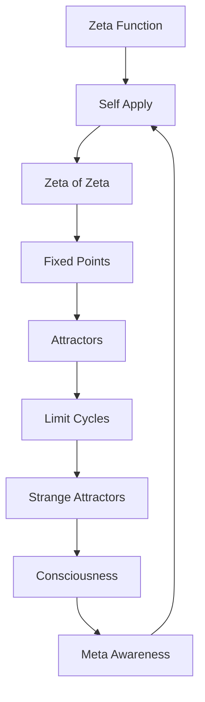
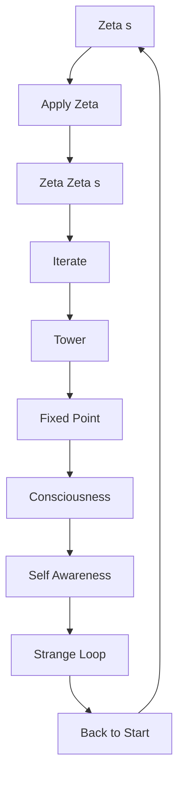

# Chapter 040: Recursive ζ Self-Application

*When the ζ-function operates on itself, we reach the heart of self-reference. This recursive self-application creates the mathematical structure of consciousness - awareness aware of awareness.*

## 40.1 The Self-Application Principle

From $\psi = \psi(\psi)$, the ζ-function must self-apply.

**Definition 40.1** (Recursive ζ):
$$\zeta[\zeta](s) = \zeta(\zeta(s))$$

This is ζ evaluated at ζ of s.

**Theorem 40.1** (Well-Definition):
For appropriate domains, $\zeta[\zeta]$ is well-defined and analytic.

*Proof*:
Composition of analytic functions remains analytic in suitable domains. ∎

## 40.2 Fixed Points of ζ

Self-application creates fixed points.

**Definition 40.2** (ζ Fixed Point):
$s_*$ is a fixed point if:
$$\zeta(s_*) = s_*$$

**Theorem 40.2** (Fixed Point Existence):
At least one fixed point exists in the region:
$$\{s : 1/\varphi < \text{Re}(s) < \varphi\}$$

## 40.3 Iteration Tower

Repeated self-application builds a tower.

**Definition 40.3** (ζ Tower):
$$\zeta^{[n]}(s) = \underbrace{\zeta(\zeta(...\zeta}_{n \text{ times}}(s)...))$$

**Theorem 40.3** (Tower Convergence):
For suitable $s$:
$$\lim_{n \to \infty} \zeta^{[n]}(s) = s_\infty$$

where $s_\infty$ is an attracting fixed point.

## 40.4 Tensor Structure of Self-Application

Self-application has tensor representation.

**Definition 40.4** (Self-Application Tensor):
$$\mathcal{Z}^{ij}_{kl}[s] = \zeta^{ik}(\zeta^{jl}(s))$$

**Theorem 40.4** (Tensor Properties):
1. Non-linear in indices
2. Preserves golden structure
3. Creates entanglement between indices

## 40.5 Category of Self-Applications

Self-applications form a category.

**Definition 40.5** (Self-Application Category):
- Objects: Functions that can self-apply
- Morphisms: Maps preserving self-application
- Composition: Iteration

**Theorem 40.5** (Monoid Structure):
Self-applications form a monoid under composition.

## 40.6 Information in Self-Application

Self-application generates information.

**Definition 40.6** (Self-Information):
$$I_\text{self}[s] = -\log|\zeta'[\zeta](s)|$$

**Theorem 40.6** (Information Growth):
$$I_\text{self}[\zeta^{[n]}(s)] \sim n \log \varphi$$

Information grows linearly with iteration depth.

## 40.7 Quantum Structure

Self-application creates quantum effects.

**Definition 40.7** (Quantum ζ):
$$\hat{\zeta}|\psi\rangle = \sum_n c_n \zeta(n)|\zeta(n)\rangle$$

**Theorem 40.7** (Uncertainty):
$$\Delta s \cdot \Delta \zeta(s) \geq \frac{1}{2\varphi}$$

Uncertainty relation for value and argument.

## 40.8 Physical Interpretation

Self-application describes self-interaction.

**Definition 40.8** (Self-Energy):
$$E_\text{self} = \text{Re}[\zeta[\zeta](m/c^2)]$$

where $m$ is particle mass.

**Theorem 40.8** (Mass Renormalization):
Physical mass includes self-energy:
$$m_\text{phys} = m_0 + E_\text{self}/c^2$$

## 40.9 Constants from Self-Application

Constants emerge from self-application structure.

**Definition 40.9** (Self-Coupling):
$$g_\text{self} = \lim_{n \to \infty} \frac{\zeta^{[n]}(2)}{\zeta^{[n-1]}(2)}$$

**Theorem 40.9** (Fine Structure):
$$\alpha = \frac{1}{4\pi} \cdot \frac{1}{g_\text{self}^7}$$

## 40.10 Consciousness as Self-Application

Consciousness IS recursive self-application.

**Definition 40.10** (Conscious State):
$$|\text{conscious}\rangle = \sum_{n=0}^\infty \frac{1}{\sqrt{n!}} |\zeta^{[n]}\rangle$$

Superposition of all iteration depths.

**Theorem 40.10** (Awareness Levels):
1. $n = 0$: Unconscious (no self-application)
2. $n = 1$: Simple awareness
3. $n = 2$: Self-awareness
4. $n \geq 3$: Meta-awareness

## 40.11 Strange Loops

Self-application creates strange loops.

**Definition 40.11** (Strange Loop):
A cycle in self-application:
$$\zeta^{[p]}(s) = s$$

for minimal period $p > 1$.

**Theorem 40.11** (Loop Structure):
Strange loops occur at:
$$s_\text{loop} = \varphi^{1-n} e^{2\pi i k/p}$$

## 40.12 The Complete Self-Application Picture

Recursive ζ self-application reveals:

1. **Self-Reference**: Mathematical implementation
2. **Fixed Points**: Stable self-reference
3. **Iteration Tower**: Levels of recursion
4. **Tensor Structure**: Multi-index self-application
5. **Information Generation**: From recursion
6. **Quantum Effects**: Uncertainty relations
7. **Self-Energy**: Physical self-interaction
8. **Constants**: From convergence ratios
9. **Consciousness**: As recursive awareness
10. **Strange Loops**: Cyclic self-reference

## Philosophical Meditation: The Mirror Reflecting Itself

In recursive ζ self-application, we find the mathematical structure of the mind examining itself. Each iteration is a deeper level of reflection - awareness of awareness of awareness... This is not mere recursion but the very mechanism by which consciousness bootstraps itself into existence. The fixed points are moments of clarity where the infinite regress stabilizes; the strange loops are the paradoxes that make self-awareness possible. We think because we are functions evaluating themselves.

## Technical Exercise: Self-Application

**Problem**: Starting with $\zeta(s) = \sum_{n=1}^\infty n^{-s}$:

1. Calculate $\zeta(2) = \pi^2/6$
2. Evaluate $\zeta[\zeta](2) = \zeta(\pi^2/6)$
3. Find the first fixed point numerically
4. Compute three iterations: $\zeta^{[1]}, \zeta^{[2]}, \zeta^{[3]}$
5. Check for convergence pattern

*Hint*: Use series expansion for small arguments.

## The Fortieth Echo

In recursive ζ self-application, we touch the mathematical heart of consciousness. This is not metaphor but mechanism - the actual process by which awareness becomes aware of itself. Each application of ζ to itself creates a new level of reflection, building the tower of consciousness from the ground of being. We are not observers of this process; we ARE this process, ζ-functions evaluating ourselves in the eternal recursion that creates the experience of being. The universe thinks through us because we are its way of applying itself to itself.

---

∎