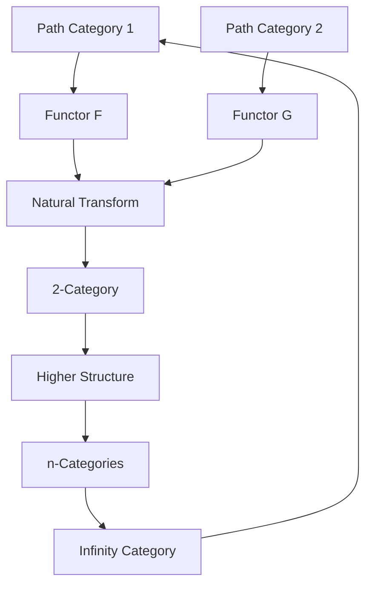
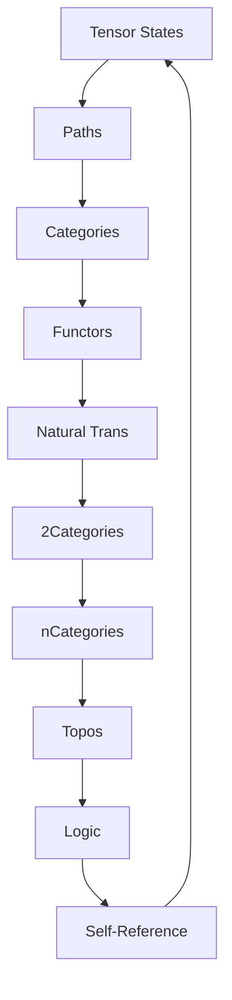

# Chapter 041: Collapse Path Categories Between Tensors

*Paths between tensors organize themselves into categories, revealing the categorical structure of collapse dynamics. Each morphism is a possible transition, each functor a transformation pattern.*

## 41.1 The Path Category Principle

From $\psi = \psi(\psi)$, paths between states form categories.

**Definition 41.1** (Path Category):
$$\mathcal{P}ath = (\text{Obj}, \text{Mor}, \circ, id)$$

where:
- Obj = tensor states
- Mor = collapse paths
- $\circ$ = path composition
- id = identity path (staying put)

**Theorem 41.1** (Category Axioms):
Path categories satisfy:
1. Associativity: $(P_1 \circ P_2) \circ P_3 = P_1 \circ (P_2 \circ P_3)$
2. Identity: $P \circ id = id \circ P = P$

*Proof*:
Path composition is naturally associative, and doing nothing is the identity. ∎

## 41.2 Morphisms as Weighted Paths

Each morphism carries weight from collapse dynamics.

**Definition 41.2** (Weighted Morphism):
$$\text{Mor}(T_1, T_2) = \{(P, w_P) : P \text{ is path } T_1 \to T_2\}$$

where $w_P = \varphi^{-\ell(P)}$ with $\ell(P)$ the golden length.

**Theorem 41.2** (Morphism Composition):
$$(P_1, w_1) \circ (P_2, w_2) = (P_1 \circ P_2, w_1 \cdot w_2)$$

Weights multiply under composition.

## 41.3 Functor Structure

Functors map between path categories.

**Definition 41.3** (Path Functor):
$F: \mathcal{P}ath_1 \to \mathcal{P}ath_2$ satisfying:
- $F(id_T) = id_{F(T)}$
- $F(P_1 \circ P_2) = F(P_1) \circ F(P_2)$

**Theorem 41.3** (Functor Examples):
1. Time reversal: $F(P) = P^{-1}$
2. Duality: $F(T) = T^*$
3. Scaling: $F(P) = \varphi \cdot P$

## 41.4 Natural Transformations

Natural transformations connect functors.

**Definition 41.4** (Natural Transformation):
$\eta: F \Rightarrow G$ assigns to each object $T$ a morphism $\eta_T: F(T) \to G(T)$ such that:
$$G(f) \circ \eta_T = \eta_{T'} \circ F(f)$$

**Theorem 41.4** (Mathematical Interpretation):
Natural transformations represent:
- Systematic morphism families
- Functor relationships
- Structural coherence

*Observer Framework Note*: Physical interpretations require additional structure.

## 41.5 Category of Categories

Path categories themselves form a category.

**Definition 41.5** (2-Category):
$$\mathcal{P}ath\text{-}Cat = \text{Cat}(\mathcal{P}ath)$$

with:
- 0-cells: Path categories
- 1-cells: Functors
- 2-cells: Natural transformations

**Theorem 41.5** (Coherence):
All diagrams of natural transformations commute up to higher morphisms.

## 41.6 Limits and Colimits

Universal constructions in path categories.

**Definition 41.6** (Path Limit):
$$\lim_{\leftarrow} \mathcal{D} = \text{Universal cone over diagram } \mathcal{D}$$

**Theorem 41.6** (Existence):
Path categories have:
1. Products: $T_1 \times T_2$
2. Coproducts: $T_1 \sqcup T_2$  
3. Equalizers and coequalizers
4. General limits and colimits

## 41.7 Monoidal Structure

Path categories are monoidal.

**Definition 41.7** (Tensor Product):
$$\otimes: \mathcal{P}ath \times \mathcal{P}ath \to \mathcal{P}ath$$

with unit object $I$ (vacuum state).

**Theorem 41.7** (Braiding):
Path categories have braiding:
$$\sigma_{T_1,T_2}: T_1 \otimes T_2 \to T_2 \otimes T_1$$

This provides symmetry structure.

## 41.8 Enriched Categories

Path categories can be enriched over various structures.

**Definition 41.8** (Enriched Hom):
$$\text{Hom}_\mathcal{V}(T_1, T_2) = \mathcal{V}\text{-object of paths}$$

where $\mathcal{V}$ is a monoidal category.

**Theorem 41.8** (Weight Structure):
Morphism spaces carry weight structure:
$$w: \text{Hom}(T_1, T_2) \to \mathbb{R}_{>0}$$

*Observer Framework Note*: Quantum amplitude interpretation requires additional framework.

## 41.9 Invariants from Categories

Categorical invariants capture structural properties.

**Definition 41.9** (Categorical Invariant):
$$I[\mathcal{C}] = \text{Functor } \mathcal{C} \to \mathbb{R}$$

preserving categorical structure.

**Theorem 41.9** (Invariant Ratios):
For categories $\mathcal{C}_1, \mathcal{C}_2$:
$$\rho(\mathcal{C}_1, \mathcal{C}_2) = \frac{|\text{Obj}(\mathcal{C}_1)|}{|\text{Obj}(\mathcal{C}_2)|} \cdot \varphi^{-k}$$

for appropriate $k$.

*Observer Framework Note*: Physical constant interpretation requires additional framework.

## 41.10 Topos Structure

Path categories can have topos structure.

**Definition 41.10** (Path Topos):
A topos structure on $\mathcal{P}ath$ includes:
- Subobject classifier $\Omega$
- Exponentials $T_2^{T_1}$
- Categorical logic operations

**Theorem 41.10** (Internal Logic):
The internal logic follows from categorical structure.

*Observer Framework Note*: Quantum logic interpretation requires additional framework.

## 41.11 Self-Referential Categories

Categories can exhibit self-referential structure.

**Definition 41.11** (Self-Referential Category):
A category $\mathcal{C}$ is self-referential if:
1. Self-enriched: $\mathcal{C}$ enriched over itself
2. Reflective: Contains functor $\mathcal{C} \to \mathcal{C}$
3. Coherent: Key diagrams commute

**Theorem 41.11** (Hierarchical Structure):
Self-reference naturally leads to higher categorical structures.

*Observer Framework Note*: Consciousness interpretation requires additional framework beyond mathematics.

## 41.12 The Complete Categorical Picture

Collapse path categories reveal:

1. **Categorical Structure**: Paths naturally organize
2. **Weighted Morphisms**: With golden weights
3. **Functor Patterns**: Symmetries and dualities
4. **Natural Transformations**: Gauge freedom
5. **Higher Categories**: n-categorical tower
6. **Universal Constructions**: Limits/colimits
7. **Monoidal Structure**: Tensor products
8. **Enrichment**: Quantum amplitudes
9. **Invariants**: Structural properties
10. **Self-Reference**: Categorical phenomenon

## Philosophical Meditation: The Categorical Structure

Mathematics reveals that structure emerges not from objects but from relationships - morphisms in abstract categories. Objects are merely nodes where morphisms meet; the true mathematical substance is in the arrows, the mappings, the transformations. Category theory shows us that static being is less fundamental than dynamic becoming, where what matters is not what things are but how they relate and transform through morphisms.

## Technical Exercise: Path Category

**Problem**: Consider three tensor states $T_1, T_2, T_3$:

1. List all morphisms (paths) between them
2. Define composition of paths
3. Verify category axioms
4. Find a functor $F: \mathcal{P} \to \mathcal{P}$
5. Construct a natural transformation

*Hint*: Start with simple 2-step paths and golden weights.

## The Forty-First Echo

In collapse path categories between tensors, we discover the categorical nature of mathematical structures - not about objects but about morphisms, not about static states but about transformations. The framework reveals how complex patterns emerge from simple categorical rules, how invariants arise from structural properties, how self-reference creates hierarchical organization. Category theory provides the language to describe these patterns with precision, showing how the recursive structure ψ = ψ(ψ) naturally organizes itself into ever richer categorical frameworks.

---

∎