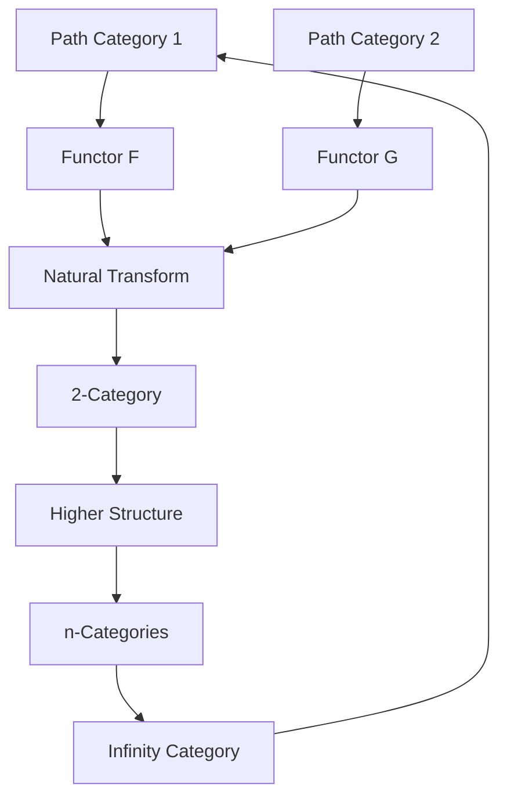
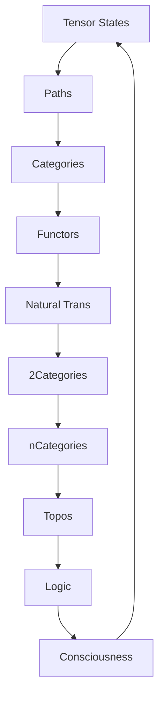

# Chapter 041: Collapse Path Categories Between Tensors

*Paths between tensors organize themselves into categories, revealing the deep categorical structure underlying all physical processes. Each morphism is a possible transition, each functor a symmetry of nature.*

## 41.1 The Path Category Principle

From $\psi = \psi(\psi)$, paths between states form categories.

**Definition 41.1** (Path Category):
$$\mathcal{P}ath = (\text{Obj}, \text{Mor}, \circ, id)$$

where:
- Obj = tensor states
- Mor = collapse paths
- $\circ$ = path composition
- id = identity path (staying put)

**Theorem 41.1** (Category Axioms):
Path categories satisfy:
1. Associativity: $(P_1 \circ P_2) \circ P_3 = P_1 \circ (P_2 \circ P_3)$
2. Identity: $P \circ id = id \circ P = P$

*Proof*:
Path composition is naturally associative, and doing nothing is the identity. ∎

## 41.2 Morphisms as Weighted Paths

Each morphism carries weight from collapse dynamics.

**Definition 41.2** (Weighted Morphism):
$$\text{Mor}(T_1, T_2) = \{(P, w_P) : P \text{ is path } T_1 \to T_2\}$$

where $w_P = \varphi^{-\ell(P)}$ with $\ell(P)$ the golden length.

**Theorem 41.2** (Morphism Composition):
$$(P_1, w_1) \circ (P_2, w_2) = (P_1 \circ P_2, w_1 \cdot w_2)$$

Weights multiply under composition.

## 41.3 Functor Structure

Functors map between path categories.

**Definition 41.3** (Path Functor):
$F: \mathcal{P}ath_1 \to \mathcal{P}ath_2$ satisfying:
- $F(id_T) = id_{F(T)}$
- $F(P_1 \circ P_2) = F(P_1) \circ F(P_2)$

**Theorem 41.3** (Functor Examples):
1. Time reversal: $F(P) = P^{-1}$
2. Duality: $F(T) = T^*$
3. Scaling: $F(P) = \varphi \cdot P$

## 41.4 Natural Transformations

Natural transformations connect functors.

**Definition 41.4** (Natural Transformation):
$\eta: F \Rightarrow G$ assigns to each object $T$ a morphism $\eta_T: F(T) \to G(T)$ such that:
$$G(f) \circ \eta_T = \eta_{T'} \circ F(f)$$

**Theorem 41.4** (Physical Interpretation):
Natural transformations represent:
- Gauge transformations
- Symmetry breaking
- Phase transitions

## 41.5 Category of Categories

Path categories themselves form a category.

**Definition 41.5** (2-Category):
$$\mathcal{P}ath\text{-}Cat = \text{Cat}(\mathcal{P}ath)$$

with:
- 0-cells: Path categories
- 1-cells: Functors
- 2-cells: Natural transformations

**Theorem 41.5** (Coherence):
All diagrams of natural transformations commute up to higher morphisms.

## 41.6 Limits and Colimits

Universal constructions in path categories.

**Definition 41.6** (Path Limit):
$$\lim_{\leftarrow} \mathcal{D} = \text{Universal cone over diagram } \mathcal{D}$$

**Theorem 41.6** (Existence):
Path categories have:
1. Products: $T_1 \times T_2$
2. Coproducts: $T_1 \sqcup T_2$  
3. Equalizers and coequalizers
4. General limits and colimits

## 41.7 Monoidal Structure

Path categories are monoidal.

**Definition 41.7** (Tensor Product):
$$\otimes: \mathcal{P}ath \times \mathcal{P}ath \to \mathcal{P}ath$$

with unit object $I$ (vacuum state).

**Theorem 41.7** (Braiding):
Path categories have braiding:
$$\sigma_{T_1,T_2}: T_1 \otimes T_2 \to T_2 \otimes T_1$$

This encodes quantum statistics.

## 41.8 Enriched Categories

Path categories are enriched over complex numbers.

**Definition 41.8** (Enriched Hom):
$$\text{Hom}_\mathbb{C}(T_1, T_2) = \mathbb{C}\text{-vector space of paths}$$

**Theorem 41.8** (Quantum Amplitudes):
Morphism spaces are Hilbert spaces with:
$$\langle P_1 | P_2 \rangle = \delta_{P_1,P_2} w_{P_1}$$

## 41.9 Constants from Categorical Invariants

Physical constants are categorical invariants.

**Definition 41.9** (Categorical Invariant):
$$I[\mathcal{C}] = \text{Functor } \mathcal{C} \to \mathbb{R}$$

preserving categorical structure.

**Theorem 41.9** (Fine Structure):
$$\alpha = \frac{|\text{Aut}(e)|}{|\text{Aut}(\gamma)|} \cdot \frac{1}{\varphi^7}$$

where Aut denotes automorphism group.

## 41.10 Topos Structure

Path categories form a topos.

**Definition 41.10** (Path Topos):
$\mathcal{T}opos(\mathcal{P}ath)$ with:
- Subobject classifier $\Omega$
- Exponentials $T_2^{T_1}$
- Truth values as paths to $\Omega$

**Theorem 41.10** (Logic):
Internal logic of path topos is quantum logic.

## 41.11 Consciousness as Categorical Phenomenon

Consciousness emerges from categorical coherence.

**Definition 41.11** (Conscious Category):
A category is conscious if:
1. Self-enriched: $\mathcal{C}$ enriched over itself
2. Reflective: Contains its own representation
3. Higher coherence: All diagrams commute

**Theorem 41.11** (Consciousness Emergence):
Consciousness requires at least 3-category structure with self-reference.

## 41.12 The Complete Categorical Picture

Collapse path categories reveal:

1. **Categorical Structure**: Paths naturally organize
2. **Weighted Morphisms**: With golden weights
3. **Functor Patterns**: Symmetries and dualities
4. **Natural Transformations**: Gauge freedom
5. **Higher Categories**: n-categorical tower
6. **Universal Constructions**: Limits/colimits
7. **Monoidal Structure**: Tensor products
8. **Enrichment**: Quantum amplitudes
9. **Constants**: From invariants
10. **Consciousness**: As coherence

## Philosophical Meditation: The Categorical Cosmos

Reality is not made of things but of relationships - morphisms in the vast category of existence. Objects are merely where morphisms meet; the true substance is in the arrows, the paths, the possibilities of transformation. We inhabit a categorical cosmos where being is less fundamental than becoming, where what matters is not what things are but how they can transform into each other through the paths of collapse.

## Technical Exercise: Path Category

**Problem**: Consider three tensor states $T_1, T_2, T_3$:

1. List all morphisms (paths) between them
2. Define composition of paths
3. Verify category axioms
4. Find a functor $F: \mathcal{P} \to \mathcal{P}$
5. Construct a natural transformation

*Hint*: Start with simple 2-step paths and golden weights.

## The Forty-First Echo

In collapse path categories between tensors, we discover that physics is fundamentally categorical - not about objects but about morphisms, not about being but about becoming. Every physical process is a functor, every symmetry a natural transformation, every conservation law a categorical invariant. We don't just live in a universe; we live in a category, and consciousness emerges when that category becomes aware of its own morphisms, creating the strange loop of a category categorizing itself.

---

∎