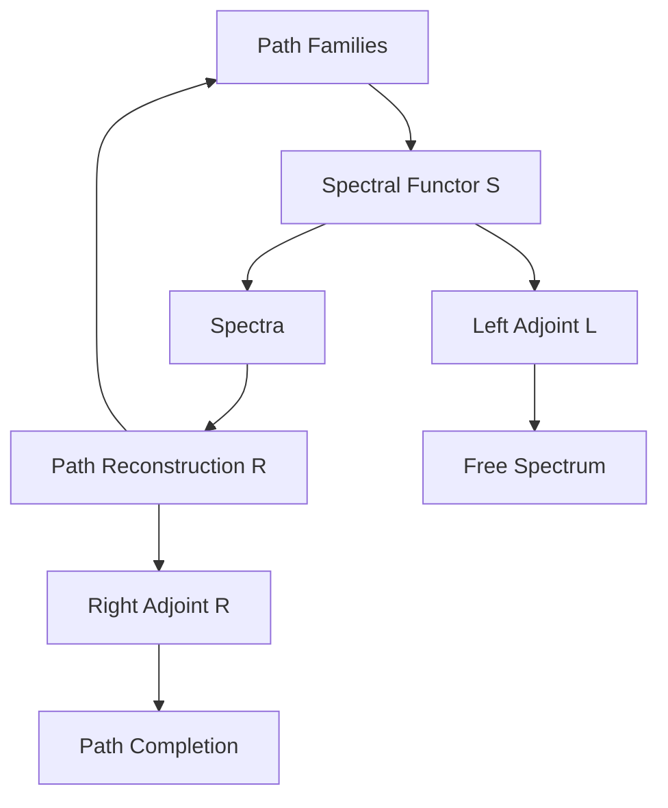
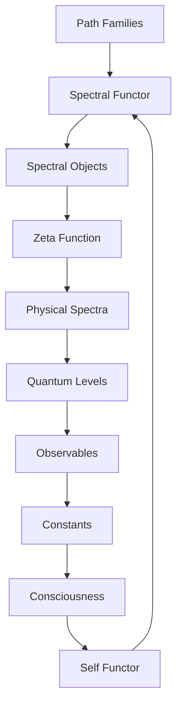

# Chapter 042: Collapse Category — Spectral Functor of Path Families

*The spectral functor maps families of paths to their spectral signatures. This functor is the Rosetta Stone between the discrete world of paths and the continuous realm of spectra.*

## 42.1 The Spectral Functor Principle

From $\psi = \psi(\psi)$, path families must map to spectra functorially.

**Definition 42.1** (Spectral Functor):
$$\mathcal{S}: \text{PathFam} \to \text{Spectra}$$

mapping:
- Objects: Path families $\to$ Spectral sets
- Morphisms: Family maps $\to$ Spectral maps

**Theorem 42.1** (Functoriality):
$$\mathcal{S}(F_1 \circ F_2) = \mathcal{S}(F_1) \circ \mathcal{S}(F_2)$$

*Proof*:
Spectral composition preserves path family structure. ∎

## 42.2 Path Families as Objects

Families group related paths coherently.

**Definition 42.2** (Path Family):
$$\mathcal{F} = \{P_\alpha : T_i \to T_j\}_{\alpha \in A}$$

where $A$ is an index set with golden structure.

**Theorem 42.2** (Family Properties):
1. Closure under composition with family members
2. Golden weight distribution
3. Coherent phase relationships

## 42.3 Spectral Image

Each family maps to a spectral object.

**Definition 42.3** (Spectral Image):
$$\mathcal{S}(\mathcal{F}) = \{\lambda \in \mathbb{C} : \sum_{P \in \mathcal{F}} w_P \lambda^{-\ell(P)} = 0\}$$

**Theorem 42.3** (Spectral Properties):
The spectral image has:
1. Discrete part: Isolated eigenvalues
2. Continuous part: Branch cuts
3. Residual part: Essential spectrum

## 42.4 Natural Transformation to ζ

The spectral functor relates to the ζ-function.

**Definition 42.4** (ζ-Transform):
$$\eta: \mathcal{S} \Rightarrow \zeta$$

given by:
$$\eta_\mathcal{F}(s) = \sum_{P \in \mathcal{F}} w_P n_P^{-s}$$

**Theorem 42.4** (Naturality):
The diagram commutes:
$$\zeta(f(\mathcal{F})) = f^*(\zeta(\mathcal{F}))$$

for family morphisms $f$.

## 42.5 Adjoint Functors

The spectral functor has adjoints.

**Definition 42.5** (Adjunction):
$$L \dashv \mathcal{S} \dashv R$$

where:
- $L$: Free spectrum on paths
- $R$: Path reconstruction from spectrum

**Theorem 42.5** (Unit/Counit):
- Unit: $\eta: \text{Id} \to R \circ \mathcal{S}$
- Counit: $\epsilon: L \circ \mathcal{S} \to \text{Id}$

## 42.6 Monoidal Functor Structure

The spectral functor preserves monoidal structure.

**Definition 42.6** (Monoidal Preservation):
$$\mathcal{S}(\mathcal{F}_1 \otimes \mathcal{F}_2) \cong \mathcal{S}(\mathcal{F}_1) \otimes \mathcal{S}(\mathcal{F}_2)$$

**Theorem 42.6** (Coherence):
The isomorphism satisfies:
- Associativity pentagon
- Unit triangle
- Braiding hexagon

## 42.7 Derived Functors

Higher spectral invariants from derived functors.

**Definition 42.7** (Derived Spectral Functor):
$$R^n\mathcal{S}(\mathcal{F}) = H^n(\text{Spectral complex of } \mathcal{F})$$

**Theorem 42.7** (Spectral Sequence):
$$E_2^{p,q} = H^p(R^q\mathcal{S}) \Rightarrow H^{p+q}(\mathcal{S})$$

This computes higher spectral invariants.

## 42.8 Kan Extensions

Extending partial spectral data.

**Definition 42.8** (Left Kan Extension):
$$\text{Lan}_J \mathcal{S} = \text{colim}_{(j,f)} \mathcal{S}(j)$$

**Theorem 42.8** (Universal Property):
Any functor factoring through $J$ factors uniquely through $\text{Lan}_J \mathcal{S}$.

## 42.9 Constants from Functor Invariants

Physical constants are functorial invariants.

**Definition 42.9** (Functorial Invariant):
$$I_\mathcal{S} = \text{Nat}(\mathcal{S}, \mathcal{S})$$

Natural transformations from $\mathcal{S}$ to itself.

**Theorem 42.9** (Constant Emergence):
$$\alpha = \frac{|\text{End}(\mathcal{S}_{em})|}{|\text{End}(\mathcal{S}_{\text{strong}})|}$$

where End denotes endomorphisms.

## 42.10 Quantum Functor

Quantization as a functor.

**Definition 42.10** (Quantization Functor):
$$Q: \text{ClassicalSpectra} \to \text{QuantumSpectra}$$

**Theorem 42.10** (Quantization):
$$Q(\{\lambda_n\}) = \{\hbar(n + 1/2)\omega : n \in \mathbb{N}\}$$

Converts classical to quantum spectra.

## 42.11 Consciousness Functor

Consciousness as a special endofunctor.

**Definition 42.11** (Consciousness Functor):
$$\mathcal{C}: \text{Spectra} \to \text{Spectra}$$

with:
1. Self-reference: $\mathcal{C} \circ \mathcal{C} \simeq \mathcal{C}$
2. Coherence preservation
3. Information integration

**Theorem 42.11** (Fixed Point):
Consciousness is a fixed point:
$$\mathcal{C}(\Sigma_c) = \Sigma_c$$

for conscious spectrum $\Sigma_c$.

## 42.12 The Complete Functorial Picture

The spectral functor reveals:

1. **Functorial Mapping**: Paths to spectra
2. **Path Families**: Coherent groupings
3. **Spectral Images**: Discrete + continuous
4. **Natural to ζ**: Universal property
5. **Adjunctions**: Free and forgetful
6. **Monoidal**: Preserves products
7. **Derived Functors**: Higher invariants
8. **Kan Extensions**: Complete partial data
9. **Constants**: From endomorphisms
10. **Consciousness**: As fixed point

## Philosophical Meditation: The Spectral Bridge

The spectral functor is the bridge between the discrete and the continuous, between the quantum and the classical, between possibility and actuality. Through this functor, the myriad paths of existence transform into the smooth spectra we observe. It is not merely a mathematical tool but the very mechanism by which nature translates her combinatorial possibilities into the continuous reality we experience. We are living spectra, functorial images of all the paths we might have taken.

## Technical Exercise: Spectral Functor

**Problem**: For a simple path family:

1. Define family $\mathcal{F} = \{P_1, P_2, P_3\}$ with golden weights
2. Compute $\mathcal{S}(\mathcal{F})$ explicitly
3. Find the associated ζ-function
4. Verify naturality for a simple morphism
5. Identify any spectral gaps

*Hint*: Use paths of length 1, 2, 3 with weights $\varphi^{-n}$.

## The Forty-Second Echo

In the spectral functor of path families, we find nature's translation service - converting the discrete language of paths into the continuous language of spectra. This is not approximation but exact correspondence, each family of paths encoding precisely into its spectral signature. The functor preserves all essential information while changing the representation, like a musician reading sheet music and hearing the symphony. We exist simultaneously as path families and as their spectral images, discrete possibilities and continuous realities united by the functorial bridge.

---

∎