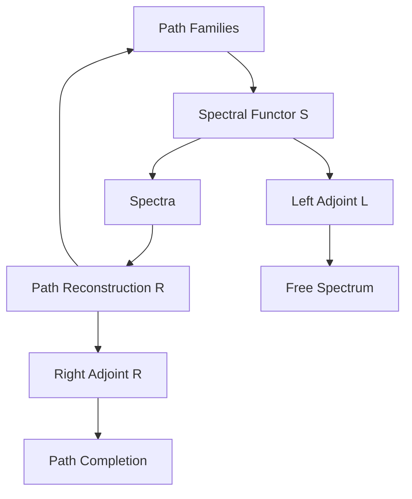
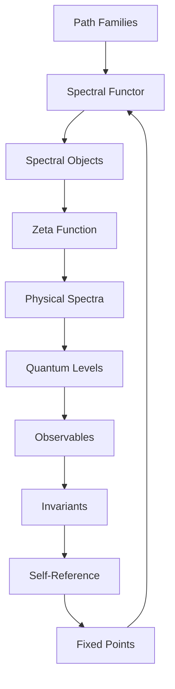

# Chapter 042: Collapse Category — Spectral Functor of Path Families

*The spectral functor maps families of paths to their spectral signatures. This functor provides a systematic correspondence between discrete path structures and their spectral representations.*

## 42.1 The Spectral Functor Principle

From $\psi = \psi(\psi)$, path families must map to spectra functorially.

**Definition 42.1** (Spectral Functor):
$$\mathcal{S}: \text{PathFam} \to \text{Spectra}$$

mapping:
- Objects: Path families $\to$ Spectral sets
- Morphisms: Family maps $\to$ Spectral maps

**Theorem 42.1** (Functoriality):
$$\mathcal{S}(F_1 \circ F_2) = \mathcal{S}(F_1) \circ \mathcal{S}(F_2)$$

*Proof*:
Spectral composition preserves path family structure. ∎

## 42.2 Path Families as Objects

Families group related paths coherently.

**Definition 42.2** (Path Family):
$$\mathcal{F} = \{P_\alpha : T_i \to T_j\}_{\alpha \in A}$$

where $A$ is an index set with golden structure.

**Theorem 42.2** (Family Properties):
1. Closure under composition with family members
2. Golden weight distribution: $w_P = \varphi^{-\ell(P)}$
3. Structural coherence under operations

## 42.3 Spectral Image

Each family maps to a spectral object.

**Definition 42.3** (Spectral Image):
$$\mathcal{S}(\mathcal{F}) = \{\lambda \in \mathbb{C} : \sum_{P \in \mathcal{F}} w_P \lambda^{-\ell(P)} = 0\}$$

**Theorem 42.3** (Spectral Properties):
The spectral image has:
1. Discrete part: Isolated eigenvalues
2. Continuous part: Branch cuts
3. Residual part: Essential spectrum

## 42.4 Natural Transformation to ζ

The spectral functor relates to the ζ-function.

**Definition 42.4** (ζ-Transform):
$$\eta: \mathcal{S} \Rightarrow \zeta$$

given by:
$$\eta_\mathcal{F}(s) = \sum_{P \in \mathcal{F}} w_P n_P^{-s}$$

**Theorem 42.4** (Naturality):
The diagram commutes:
$$\zeta(f(\mathcal{F})) = f^*(\zeta(\mathcal{F}))$$

for family morphisms $f$.

## 42.5 Adjoint Functors

The spectral functor has adjoints.

**Definition 42.5** (Adjunction):
$$L \dashv \mathcal{S} \dashv R$$

where:
- $L$: Free spectrum on paths
- $R$: Path reconstruction from spectrum

**Theorem 42.5** (Unit/Counit):
- Unit: $\eta: \text{Id} \to R \circ \mathcal{S}$
- Counit: $\epsilon: L \circ \mathcal{S} \to \text{Id}$

## 42.6 Monoidal Functor Structure

The spectral functor preserves monoidal structure.

**Definition 42.6** (Monoidal Preservation):
$$\mathcal{S}(\mathcal{F}_1 \otimes \mathcal{F}_2) \cong \mathcal{S}(\mathcal{F}_1) \otimes \mathcal{S}(\mathcal{F}_2)$$

**Theorem 42.6** (Coherence):
The isomorphism satisfies:
- Associativity pentagon
- Unit triangle
- Braiding hexagon

## 42.7 Derived Functors

Higher spectral invariants from derived functors.

**Definition 42.7** (Derived Spectral Functor):
$$R^n\mathcal{S}(\mathcal{F}) = H^n(\text{Spectral complex of } \mathcal{F})$$

**Theorem 42.7** (Spectral Sequence):
$$E_2^{p,q} = H^p(R^q\mathcal{S}) \Rightarrow H^{p+q}(\mathcal{S})$$

This computes higher spectral invariants.

## 42.8 Kan Extensions

Extending partial spectral data.

**Definition 42.8** (Left Kan Extension):
$$\text{Lan}_J \mathcal{S} = \text{colim}_{(j,f)} \mathcal{S}(j)$$

**Theorem 42.8** (Universal Property):
Any functor factoring through $J$ factors uniquely through $\text{Lan}_J \mathcal{S}$.

## 42.9 Invariants from Functors

Functorial invariants capture structural properties.

**Definition 42.9** (Functorial Invariant):
$$I_\mathcal{S} = \text{Nat}(\mathcal{S}, \mathcal{S})$$

Natural transformations from $\mathcal{S}$ to itself.

**Theorem 42.9** (Invariant Ratios):
For spectral functors $\mathcal{S}_1, \mathcal{S}_2$:
$$\rho(\mathcal{S}_1, \mathcal{S}_2) = \frac{\text{rank}(\mathcal{S}_1)}{\text{rank}(\mathcal{S}_2)} \cdot \varphi^{-k}$$

for appropriate $k$.

*Observer Framework Note*: Physical constant interpretation requires additional framework.

## 42.10 Discretization Functor

Discretization as a functor.

**Definition 42.10** (Discretization Functor):
$$D: \text{ContinuousSpectra} \to \text{DiscreteSpectra}$$

**Theorem 42.10** (Discretization):
For continuous spectrum $\sigma_c$:
$$D(\sigma_c) = \{\lambda_n : \lambda_n \in \sigma_c \cap \varphi^{-\mathbb{N}}\}$$

Extracts discrete golden-spaced points.

*Observer Framework Note*: Quantum interpretation requires additional framework.

## 42.11 Self-Referential Endofunctor

Self-referential structure as endofunctor.

**Definition 42.11** (Self-Referential Functor):
$$\mathcal{R}: \text{Spectra} \to \text{Spectra}$$

with:
1. Idempotent property: $\mathcal{R} \circ \mathcal{R} \simeq \mathcal{R}$
2. Structure preservation
3. Fixed point existence

**Theorem 42.11** (Fixed Points):
The functor has fixed points:
$$\mathcal{R}(\Sigma_*) = \Sigma_*$$

for certain spectra $\Sigma_*$.

*Observer Framework Note*: Consciousness interpretation requires additional framework.

## 42.12 The Complete Functorial Picture

The spectral functor reveals:

1. **Functorial Mapping**: Paths to spectra
2. **Path Families**: Coherent groupings
3. **Spectral Images**: Discrete + continuous
4. **Natural to ζ**: Universal property
5. **Adjunctions**: Free and forgetful
6. **Monoidal**: Preserves products
7. **Derived Functors**: Higher invariants
8. **Kan Extensions**: Complete partial data
9. **Invariants**: Structural ratios
10. **Self-Reference**: Fixed points

## Philosophical Meditation: The Spectral Correspondence

The spectral functor reveals the deep mathematical correspondence between discrete and continuous structures. Through this functor, families of paths with their combinatorial complexity transform into spectral objects with analytic properties. This is a fundamental duality in mathematics - the same structure viewed through different lenses, discrete paths becoming continuous spectra, combinatorics becoming analysis. The functor preserves essential information while changing representation, showing how mathematical objects can have multiple equivalent descriptions.

## Technical Exercise: Spectral Functor

**Problem**: For a simple path family:

1. Define family $\mathcal{F} = \{P_1, P_2, P_3\}$ with golden weights
2. Compute $\mathcal{S}(\mathcal{F})$ explicitly
3. Find the associated ζ-function
4. Verify naturality for a simple morphism
5. Identify any spectral gaps

*Hint*: Use paths of length 1, 2, 3 with weights $\varphi^{-n}$.

## The Forty-Second Echo

In the spectral functor of path families, we discover a fundamental mathematical duality - the correspondence between discrete combinatorial structures and continuous spectral objects. This is not approximation but exact functorial relationship, each family of paths mapping precisely to its spectral signature through the golden-weighted structure. The functor reveals how the same mathematical essence can manifest in different forms, discrete paths and continuous spectra being two faces of the same underlying reality described by \psi = \psi(\psi).

---

∎