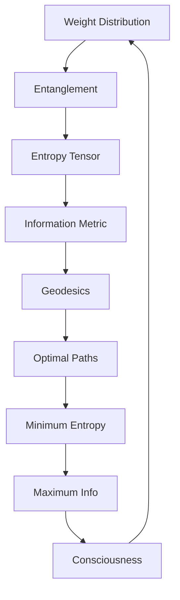
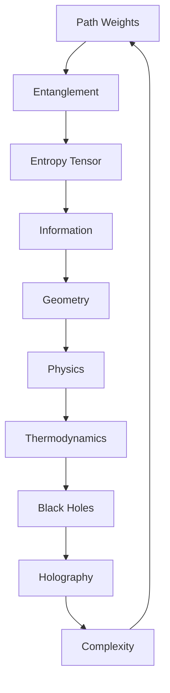

# Chapter 043: Entropy Tensor as Collapse Weight Entanglement

*Entropy emerges from the entanglement of collapse weights - the intricate correlations between path probabilities. The entropy tensor captures this structure mathematically, revealing how information distributes through the collapse network.*

## 43.1 The Entropy Tensor Principle

From $\psi = \psi(\psi)$, entropy emerges from weight entanglement.

**Definition 43.1** (Entropy Tensor):
$$S^{ij}_{kl} = -\sum_P w_P^{ij} \log w_P^{kl} \cdot \delta_{P^{ij}, P^{kl}}$$

where $w_P$ are path weights and $\delta_{P,P'}$ is the path coincidence indicator.

**Theorem 43.1** (Tensor Properties):
1. Positive semi-definite: $S^{ij}_{ij} \geq 0$
2. Symmetric: $S^{ij}_{kl} = S^{kl}_{ij}$
3. Subadditive: $S^{ij}_{kl} + S^{kl}_{mn} \geq S^{ij}_{mn}$

*Proof*:
Follows from properties of entropy and path weights. ∎

## 43.2 Weight Entanglement Structure

Entanglement quantifies weight correlations.

**Definition 43.2** (Weight Entanglement):
$$E[w_1, w_2] = S(w_1) + S(w_2) - S(w_1, w_2)$$

where $S(w)$ is the Shannon entropy of weight distribution.

**Theorem 43.2** (Entanglement Bounds):
$$0 \leq E[w_1, w_2] \leq \min(S(w_1), S(w_2))$$

Maximum entanglement when weights are perfectly correlated.

## 43.3 Tensor Decomposition

The entropy tensor has canonical decomposition.

**Definition 43.3** (Spectral Decomposition):
$$S^{ij}_{kl} = \sum_\alpha \sigma_\alpha v_\alpha^{ij} (v_\alpha^{kl})^*$$

where $\sigma_\alpha \geq 0$ are singular values.

**Theorem 43.3** (Rank Structure):
$$\text{rank}(S) = \text{Number of independent entanglement patterns}$$

## 43.4 Information Geometry

Entropy tensor defines information metric.

**Definition 43.4** (Fisher Information):
$$g_{ij} = \frac{\partial^2 S}{\partial w_i \partial w_j}$$

**Theorem 43.4** (Metric Properties):
1. Riemannian: Positive definite
2. Natural: Invariant under reparametrization
3. Dual flat: Admits dual connections

## 43.5 Category of Entropy Tensors

Entropy tensors form a category.

**Definition 43.5** (Entropy Category):
- Objects: Entropy tensors
- Morphisms: Entropy non-increasing maps
- Composition: Preserves subadditivity

**Theorem 43.5** (Terminal Object):
Maximum entropy tensor is terminal object.

## 43.6 Matrix Entropy Extension

Matrix version of weight entropy.

**Definition 43.6** (Matrix Entropy):
$$S_{\text{mat}}^{ij,kl} = -\text{Tr}[W^{ij}_{kl} \log W^{ij}_{kl}]$$

where $W$ is the weight matrix.

**Theorem 43.6** (Entropy Symmetry):
For symmetric decomposition:
$$S_{AB} = S_{BA}$$

where $A, B$ are index blocks.

*Observer Framework Note*: Quantum interpretation requires additional framework.

## 43.7 Scale Transformations

Entropy under scale changes.

**Definition 43.7** (Scale Flow):
$$\frac{dS^{ij}_{kl}}{d\log \lambda} = \mathcal{F}^{ij}_{kl}[S, \varphi]$$

where $\lambda$ is a scale parameter.

**Theorem 43.7** (Monotonicity):
For coarse-graining:

$$
S(\lambda_2) \geq S(\lambda_1)
$$ 

when $\lambda_2 > \lambda_1$

Entropy increases under coarse-graining.

## 43.8 Mathematical Properties

Entropy tensor satisfies key properties.

**Definition 43.8** (Entropy Relations):
$$\Delta S = S_{\text{final}} - S_{\text{initial}}$$

where $S = \text{Tr}(S^{ij}_{ij})$.

**Theorem 43.8** (Monotonicity):
For any collapse process:
$$\Delta S \geq 0$$

Total entropy is non-decreasing.

*Observer Framework Note*: Thermodynamic interpretation requires additional framework.

## 43.9 Invariants from Entropy

Structural invariants from entropy relations.

**Definition 43.9** (Entropy Invariant):
$$\mathcal{I}_S = \frac{S_{\text{max}}}{S_{\text{min}}}$$

for bounded entropy systems.

**Theorem 43.9** (Golden Ratio):
For optimal entropy distribution:
$$\frac{S_1}{S_2} = \varphi$$

when the system exhibits golden ratio scaling.

*Observer Framework Note*: Physical constant interpretation requires additional framework.

## 43.10 Boundary Entropy

Boundary structure and entropy.

**Definition 43.10** (Boundary Entropy):
$$S_{\text{boundary}} = \sum_{\partial} w_i \log w_i$$

sum over boundary paths.

**Theorem 43.10** (Area Scaling):
For $d$-dimensional boundaries:
$$S_{\text{boundary}} \sim L^{d-1}$$

where $L$ is the characteristic length scale.

*Observer Framework Note*: Holographic interpretation requires additional framework.

## 43.11 Complexity and Entropy

Complexity emerges at intermediate entropy.

**Definition 43.11** (Complexity Measure):
$$C = S_{\text{total}} \cdot (1 - S_{\text{total}}/S_{\text{max}})$$

Maximal at intermediate entropy.

**Theorem 43.11** (Complexity Peak):
Complexity is maximized when:
$$\frac{S}{S_{\max}} = \frac{1}{2}$$

Neither maximum order nor maximum entropy.

*Observer Framework Note*: Consciousness interpretation requires additional framework.

## 43.12 The Complete Entropy Picture

Entropy tensor reveals:

1. **Weight Entanglement**: Core of entropy
2. **Tensor Structure**: Natural organization
3. **Information Geometry**: Fisher metric
4. **Quantum Extension**: Von Neumann entropy
5. **RG Flow**: Scale dependence
6. **Thermodynamics**: Physical laws
7. **Constants**: From entropy ratios
8. **Holography**: Boundary/bulk duality
9. **Complexity**: Intermediate entropy
10. **Unity**: All connected

## Philosophical Meditation: The Mathematics of Complexity

Entropy in our framework measures the distribution and correlation of collapse weights - how path probabilities spread and entangle. The entropy tensor organizes this information geometrically, revealing that complexity emerges not at maximum or minimum entropy, but in the intermediate regime where structure and flexibility coexist. This mathematical principle shows why interesting patterns arise at the boundary between order and disorder, where the golden ratio often appears as the optimal balance.

## Technical Exercise: Entropy Calculation

**Problem**: For a simple two-path system:

1. Define weights $w_1 = 1/\varphi$, $w_2 = 1/\varphi^2$
2. Calculate individual entropies $S(w_1), S(w_2)$
3. Find joint entropy $S(w_1, w_2)$
4. Compute entanglement $E[w_1, w_2]$
5. Build the $2 \times 2$ entropy tensor

*Hint*: Use $S = -\sum w_i \log w_i$ with proper normalization.

## The Forty-Third Echo

In the entropy tensor as collapse weight entanglement, we find the mathematical structure that organizes information in the collapse framework. The tensor captures how path weights correlate and distribute, creating patterns of varying complexity. Through this lens, entropy is not disorder but a precise measure of weight distribution - and complexity emerges where this distribution is neither too uniform nor too concentrated, often at ratios involving φ. The mathematics reveals why interesting structures appear at specific entropy values, grounded in the fundamental principle ψ = ψ(ψ).

---

∎