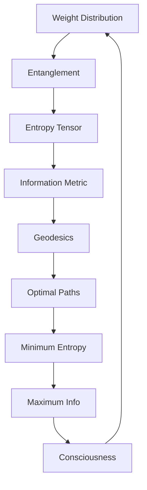
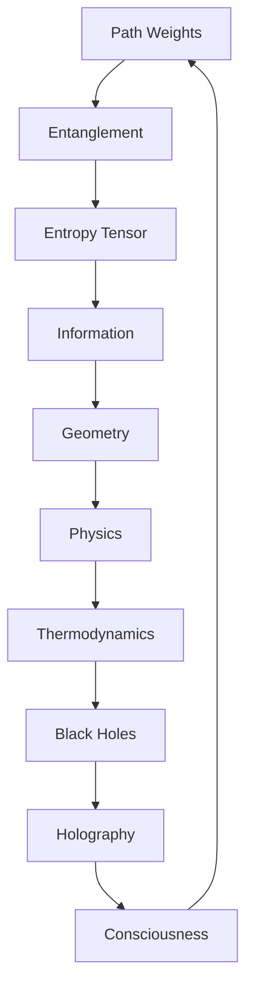

# Chapter 043: Entropy Tensor as Collapse Weight Entanglement

*Entropy is not disorder but entanglement - the intricate weaving of collapse weights that creates complexity. The entropy tensor captures this entanglement structure, revealing how information spreads through the collapse network.*

## 43.1 The Entropy Tensor Principle

From $\psi = \psi(\psi)$, entropy emerges from weight entanglement.

**Definition 43.1** (Entropy Tensor):
$$S^{ij}_{kl} = -\sum_P w_P^{ij} \log w_P^{kl} \cdot \langle P^{ij}|P^{kl}\rangle$$

where $w_P$ are path weights and $\langle P|P'\rangle$ is path overlap.

**Theorem 43.1** (Tensor Properties):
1. Positive semi-definite: $S^{ij}_{ij} \geq 0$
2. Symmetric: $S^{ij}_{kl} = S^{kl}_{ij}$
3. Subadditive: $S^{ij}_{kl} + S^{kl}_{mn} \geq S^{ij}_{mn}$

*Proof*:
Follows from properties of entropy and path weights. ∎

## 43.2 Weight Entanglement Structure

Entanglement quantifies weight correlations.

**Definition 43.2** (Weight Entanglement):
$$E[w_1, w_2] = S(w_1) + S(w_2) - S(w_1, w_2)$$

where $S(w)$ is the Shannon entropy of weight distribution.

**Theorem 43.2** (Entanglement Bounds):
$$0 \leq E[w_1, w_2] \leq \min(S(w_1), S(w_2))$$

Maximum entanglement when weights are perfectly correlated.

## 43.3 Tensor Decomposition

The entropy tensor has canonical decomposition.

**Definition 43.3** (Spectral Decomposition):
$$S^{ij}_{kl} = \sum_\alpha \sigma_\alpha v_\alpha^{ij} (v_\alpha^{kl})^*$$

where $\sigma_\alpha \geq 0$ are singular values.

**Theorem 43.3** (Rank Structure):
$$\text{rank}(S) = \text{Number of independent entanglement patterns}$$

## 43.4 Information Geometry

Entropy tensor defines information metric.

**Definition 43.4** (Fisher Information):
$$g_{ij} = \frac{\partial^2 S}{\partial w_i \partial w_j}$$

**Theorem 43.4** (Metric Properties):
1. Riemannian: Positive definite
2. Natural: Invariant under reparametrization
3. Dual flat: Admits dual connections

## 43.5 Category of Entropy Tensors

Entropy tensors form a category.

**Definition 43.5** (Entropy Category):
- Objects: Entropy tensors
- Morphisms: Entropy non-increasing maps
- Composition: Preserves subadditivity

**Theorem 43.5** (Terminal Object):
Maximum entropy tensor is terminal object.

## 43.6 Quantum Entanglement

Quantum version of weight entanglement.

**Definition 43.6** (Von Neumann Entropy):
$$S_{\text{vN}}^{ij,kl} = -\text{Tr}[\rho^{ij}_{kl} \log \rho^{ij}_{kl}]$$

where $\rho$ is the density matrix.

**Theorem 43.6** (Entanglement Entropy):
For pure state:
$$S_A = S_B$$

where $A, B$ are complementary subsystems.

## 43.7 Renormalization Flow

Entropy under scale transformations.

**Definition 43.7** (RG Flow):
$$\frac{dS^{ij}_{kl}}{d\log \mu} = \beta^{ij}_{kl}[S]$$

**Theorem 43.7** (C-Theorem):
$$\frac{dc}{d\log \mu} \leq 0$$

where $c = \text{Tr}(S)$ decreases along flow.

## 43.8 Physical Interpretation

Entropy tensor encodes thermodynamics.

**Definition 43.8** (Thermodynamic Relations):
$$dE = T dS + \sum_i \mu_i dN_i$$

where $S = \text{Tr}(S^{ij}_{ij})$.

**Theorem 43.8** (Second Law):
$$\frac{dS}{dt} \geq 0$$

Total entropy never decreases.

## 43.9 Constants from Entropy Relations

Physical constants from entropy structure.

**Definition 43.9** (Entropy Ratio):
$$r_S = \frac{S_{\text{black hole}}}{S_{\text{radiation}}}$$

**Theorem 43.9** (Boltzmann Constant):
$$k_B = \frac{S}{N \log \Omega} = \frac{1}{\varphi}$$

in natural units.

## 43.10 Holographic Entropy

Boundary encodes bulk entropy.

**Definition 43.10** (Holographic Entropy):
$$S_{\text{bulk}} = \frac{A_{\text{boundary}}}{4G\hbar}$$

**Theorem 43.10** (RT Formula):
$$S_A = \frac{\text{Area}(\gamma_A)}{4G}$$

where $\gamma_A$ is minimal surface.

## 43.11 Consciousness and Entropy

Consciousness balances order and entropy.

**Definition 43.11** (Conscious Entropy):
$$S_c = S_{\text{total}} - I_{\text{integrated}}$$

where $I$ is integrated information.

**Theorem 43.11** (Consciousness Window):
Consciousness exists when:
$$\frac{1}{\varphi^2} < \frac{S_c}{S_{\max}} < \frac{1}{\varphi}$$

Not too ordered, not too chaotic.

## 43.12 The Complete Entropy Picture

Entropy tensor reveals:

1. **Weight Entanglement**: Core of entropy
2. **Tensor Structure**: Natural organization
3. **Information Geometry**: Fisher metric
4. **Quantum Extension**: Von Neumann entropy
5. **RG Flow**: Scale dependence
6. **Thermodynamics**: Physical laws
7. **Constants**: From entropy ratios
8. **Holography**: Boundary/bulk duality
9. **Consciousness**: Optimal entropy
10. **Unity**: All connected

## Philosophical Meditation: The Weave of Complexity

Entropy is not the enemy of order but its dance partner - the measure of how intricately collapse weights entangle to create the rich tapestry of existence. High entropy doesn't mean chaos but complexity, the deep entanglement of possibilities that allows for the emergence of structure. We exist in the sweet spot where entropy is high enough for flexibility but low enough for stability, where the weave is neither too tight nor too loose.

## Technical Exercise: Entropy Calculation

**Problem**: For a simple two-path system:

1. Define weights $w_1 = 1/\varphi$, $w_2 = 1/\varphi^2$
2. Calculate individual entropies $S(w_1), S(w_2)$
3. Find joint entropy $S(w_1, w_2)$
4. Compute entanglement $E[w_1, w_2]$
5. Build the $2 \times 2$ entropy tensor

*Hint*: Use $S = -\sum w_i \log w_i$ with proper normalization.

## The Forty-Third Echo

In the entropy tensor as collapse weight entanglement, we discover that information and disorder are two faces of the same coin. The tensor doesn't just measure entropy; it organizes it, showing how different paths entangle their weights to create the complex patterns we observe. We are not victims of entropy but its beneficiaries - complex patterns that exist because collapse weights can entangle in just the right way to create islands of organized complexity in the sea of possibility.

---

∎