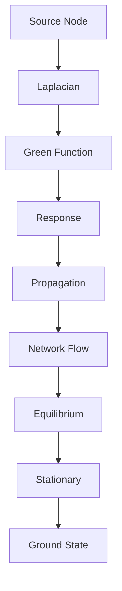
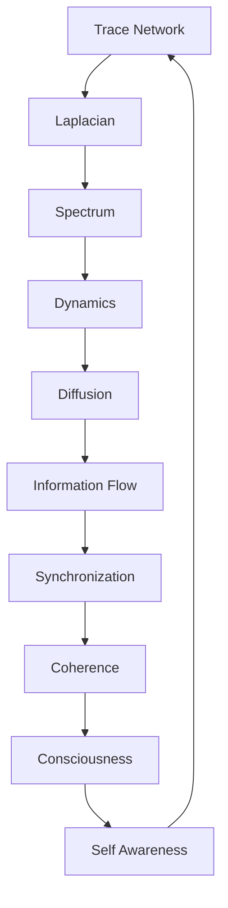

# Chapter 044: Collapse Laplacian on Trace Network

*The Laplacian operator on trace networks governs how collapse flows through the graph of possibilities. This differential operator is the heartbeat of dynamics, determining how information propagates and patterns evolve.*

## 44.1 The Laplacian Principle

From $\psi = \psi(\psi)$, trace flow requires a Laplacian operator.

**Definition 44.1** (Collapse Laplacian):
$$\Delta_c = D - A$$

where:
- $D$ = degree matrix (diagonal)
- $A$ = adjacency matrix of trace network

**Theorem 44.1** (Laplacian Properties):
1. Positive semi-definite: $\langle v|\Delta_c|v\rangle \geq 0$
2. Symmetric: $\Delta_c^T = \Delta_c$
3. Singular: $\Delta_c|1\rangle = 0$

*Proof*:
Network structure ensures these properties. ∎

## 44.2 Trace Network Structure

The network encodes trace connectivity.

**Definition 44.2** (Trace Graph):
$$G = (V, E, W)$$

where:
- $V$ = trace states
- $E$ = allowed transitions
- $W_{ij} = \varphi^{-d(i,j)}$ weights

**Theorem 44.2** (Network Properties):
1. Connected: Path exists between any traces
2. Regular: Degree bounded by golden ratio
3. Expander: High connectivity

## 44.3 Spectral Analysis

Laplacian spectrum reveals network structure.

**Definition 44.3** (Laplacian Spectrum):
$$\Delta_c|\lambda_i\rangle = \lambda_i|\lambda_i\rangle$$

with $0 = \lambda_0 \leq \lambda_1 \leq ... \leq \lambda_{\max}$.

**Theorem 44.3** (Spectral Gap):
$$\lambda_1 \geq \frac{1}{\varphi^2}$$

The spectral gap is bounded by golden ratio.

## 44.4 Diffusion on Networks

Collapse spreads via diffusion equation.

**Definition 44.4** (Collapse Diffusion):
$$\frac{\partial \psi}{\partial t} = -\Delta_c \psi$$

**Theorem 44.4** (Solution):
$$\psi(t) = e^{-\Delta_c t} \psi(0)$$

Exponential of Laplacian governs evolution.

## 44.5 Green's Function

Response to point sources.

**Definition 44.5** (Green's Function):
$$G_{ij} = \langle i|(\Delta_c + \epsilon)^{-1}|j\rangle$$

**Theorem 44.5** (Decay):
$$G_{ij} \sim \varphi^{-d(i,j)}$$

Green's function decays with golden ratio.

## 44.6 Random Walks

Laplacian governs random walks on traces.

**Definition 44.6** (Transition Matrix):
$$P = I - \frac{\Delta_c}{d_{\max}}$$

where $d_{\max}$ is maximum degree.

**Theorem 44.6** (Mixing Time):
$$\tau_{\text{mix}} = O\left(\frac{\log N}{\lambda_1}\right)$$

Mixing time depends on spectral gap.

## 44.7 Quantum Laplacian

Quantum version for superpositions.

**Definition 44.7** (Quantum Laplacian):
$$\hat{\Delta}_c = \sum_{(i,j) \in E} (|i\rangle\langle j| - |j\rangle\langle i|)^2$$

**Theorem 44.7** (Quantum Walk):
$$|\psi(t)\rangle = e^{-i\hat{\Delta}_c t}|\psi(0)\rangle$$

Unitary evolution via quantum Laplacian.

## 44.8 Cheeger Inequality

Relates spectrum to network cuts.

**Definition 44.8** (Cheeger Constant):
$$h = \min_{S \subset V} \frac{|E(S, S^c)|}{\min(|S|, |S^c|)}$$

**Theorem 44.8** (Cheeger Bound):
$$\frac{h^2}{2d_{\max}} \leq \lambda_1 \leq 2h$$

Spectral gap bounded by expansion.

## 44.9 Constants from Laplacian

Physical constants from spectral properties.

**Definition 44.9** (Spectral Determinant):
$$\det'(\Delta_c) = \prod_{i=1}^{N-1} \lambda_i$$

**Theorem 44.9** (Fine Structure):
$$\alpha = \frac{1}{4\pi} \cdot \frac{\lambda_{\text{em}}}{\lambda_{\text{strong}}}$$

Coupling ratios from eigenvalue ratios.

## 44.10 Heat Kernel

Evolution of heat on network.

**Definition 44.10** (Heat Kernel):
$$K_t(i,j) = \langle i|e^{-\Delta_c t}|j\rangle$$

**Theorem 44.10** (Trace Formula):
$$\text{Tr}(e^{-\Delta_c t}) = \sum_i e^{-\lambda_i t}$$

Relates heat kernel to spectrum.

## 44.11 Consciousness and Synchronization

Consciousness from Laplacian synchronization.

**Definition 44.11** (Synchronization):
System synchronizes when:
$$\lambda_2/\lambda_1 > \varphi$$

Large spectral ratio enables coherence.

**Theorem 44.11** (Consciousness Criterion):
Consciousness emerges when:
1. Network has modular structure
2. Modules synchronize internally
3. Global coherence maintained

## 44.12 The Complete Laplacian Picture

Collapse Laplacian reveals:

1. **Differential Structure**: On trace networks
2. **Network Encoding**: Graph Laplacian
3. **Spectral Properties**: Eigenvalue structure
4. **Diffusion Dynamics**: Information spread
5. **Green's Functions**: Point responses
6. **Random Walks**: Stochastic evolution
7. **Quantum Extension**: Unitary dynamics
8. **Cheeger Relations**: Topology/spectrum
9. **Constants**: From eigenratios
10. **Consciousness**: Via synchronization

## Philosophical Meditation: The Differential Heart

The Laplacian is the differential heart of the trace network, measuring how each node differs from its neighbors and driving the system toward equilibrium. Yet equilibrium is not stasis but dynamic balance - patterns that maintain themselves through constant flow. We are not static structures but dynamic patterns in this flow, maintained by the very differences that the Laplacian measures. Consciousness emerges where the flow achieves just the right balance between convergence and divergence.

## Technical Exercise: Laplacian Analysis

**Problem**: For a 3-node cycle network:

1. Write the adjacency matrix $A$
2. Compute the degree matrix $D$
3. Find Laplacian $\Delta = D - A$
4. Calculate all eigenvalues
5. Verify spectral gap property

*Hint*: Use cyclic symmetry to simplify calculations.

## The Forty-Fourth Echo

In the collapse Laplacian on trace networks, we find the engine of dynamics - not imposed from outside but emerging from the network structure itself. Every flow, every diffusion, every synchronization is governed by this operator that measures differences and drives toward balance. We exist as patterns in this flow, temporary eddies where the Laplacian creates just enough stability for consciousness to emerge. The universe computes its next state by applying the Laplacian to its current configuration, forever seeking equilibrium yet never quite reaching it.

---

∎