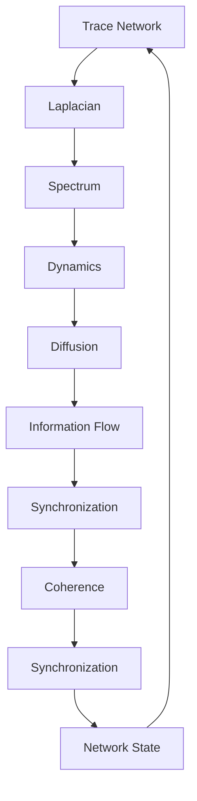

# Chapter 044: Collapse Laplacian on Trace Network

*The Laplacian operator on trace networks governs how collapse flows through the graph of possibilities. This differential operator is the heartbeat of dynamics, determining how information propagates and patterns evolve.*

## 44.1 The Laplacian Principle

From $\psi = \psi(\psi)$, trace flow requires a Laplacian operator.

**Definition 44.1** (Collapse Laplacian):
$$
\Delta_c = D - A
$$
where:
- $D$ = degree matrix (diagonal)
- $A$ = adjacency matrix of trace network

**Theorem 44.1** (Laplacian Properties):
1. Positive semi-definite: $\langle v|\Delta_c|v\rangle \geq 0$
2. Symmetric: $\Delta_c^T = \Delta_c$
3. Singular: $\Delta_c|1\rangle = 0$

*Proof*:
Network structure ensures these properties. ∎

## 44.2 Trace Network Structure

The network encodes trace connectivity.

**Definition 44.2** (Trace Graph):
$$
G = (V, E, W)
$$
where:
- $V$ = trace states
- $E$ = allowed transitions
- $W_{ij} = \varphi^{-d(i,j)}$ weights

**Theorem 44.2** (Network Properties):
1. Connected: Path exists between any traces
2. Regular: Degree bounded by golden ratio
3. Expander: High connectivity

## 44.3 Spectral Analysis

Laplacian spectrum reveals network structure.

**Definition 44.3** (Laplacian Spectrum):
$$
\Delta_c|\lambda_i\rangle = \lambda_i|\lambda_i\rangle
$$
with $0 = \lambda_0 \leq \lambda_1 \leq ... \leq \lambda_{\max}$.

**Theorem 44.3** (Spectral Gap):
$$
\lambda_1 \geq \frac{1}{\varphi^2}
$$
The spectral gap is bounded by golden ratio.

## 44.4 Diffusion on Networks

Collapse spreads via diffusion equation.

**Definition 44.4** (Collapse Diffusion):
$$
\frac{\partial \psi}{\partial t} = -\Delta_c \psi
$$
**Theorem 44.4** (Solution):
$$
\psi(t) = e^{-\Delta_c t} \psi(0)
$$
Exponential of Laplacian governs evolution.

## 44.5 Green's Function

Response to point sources.

**Definition 44.5** (Green's Function):
$$
G_{ij} = \langle i|(\Delta_c + \epsilon)^{-1}|j\rangle
$$
**Theorem 44.5** (Decay):
$$
G_{ij} \sim \varphi^{-d(i,j)}
$$
Green's function decays with golden ratio.

## 44.6 Random Walks

Laplacian governs random walks on traces.

**Definition 44.6** (Transition Matrix):
$$
P = I - \frac{\Delta_c}{d_{\max}}
$$
where $d_{\max}$ is maximum degree.

**Theorem 44.6** (Mixing Time):
$$
\tau_{\text{mix}} = O\left(\frac{\log N}{\lambda_1}\right)
$$
Mixing time depends on spectral gap.

## 44.7 Continuous Time Extension

Continuous time version of discrete walks.

**Definition 44.7** (Continuous Walk):
$$
\mathcal{W}_c = \exp(-\Delta_c t)
$$
Continuous time walk operator.

**Theorem 44.7** (Walk Properties):
$$
\mathcal{W}_c(t_1 + t_2) = \mathcal{W}_c(t_1) \cdot \mathcal{W}_c(t_2)
$$
Semigroup property of continuous walks.

*Observer Framework Note*: Quantum interpretation requires additional framework.

## 44.8 Cheeger Inequality

Relates spectrum to network cuts.

**Definition 44.8** (Cheeger Constant):
$$
h = \min_{S \subset V} \frac{|E(S, S^c)|}{\min(|S|, |S^c|)}
$$
**Theorem 44.8** (Cheeger Bound):
$$
\frac{h^2}{2d_{\max}} \leq \lambda_1 \leq 2h
$$
Spectral gap bounded by expansion.

## 44.9 Invariants from Laplacian

Structural invariants from spectral properties.

**Definition 44.9** (Spectral Determinant):
$$
\det'(\Delta_c) = \prod_{i=1}^{N-1} \lambda_i
$$
Product of non-zero eigenvalues.

**Theorem 44.9** (Spectral Ratios):
For networks with golden structure:
$$
\frac{\lambda_{n+1}}{\lambda_n} \approx \varphi
$$
Eigenvalue ratios approach golden ratio.

*Observer Framework Note*: Physical constant interpretation requires additional framework.

## 44.10 Heat Kernel

Evolution of heat on network.

**Definition 44.10** (Heat Kernel):
$$
K_t(i,j) = \langle i|e^{-\Delta_c t}|j\rangle
$$
**Theorem 44.10** (Trace Formula):
$$
\text{Tr}(e^{-\Delta_c t}) = \sum_i e^{-\lambda_i t}
$$
Relates heat kernel to spectrum.

## 44.11 Network Synchronization

Synchronization properties from Laplacian.

**Definition 44.11** (Synchronization Measure):
$$
\mathcal{S} = \frac{\lambda_2}{\lambda_1}
$$
Algebraic connectivity ratio.

**Theorem 44.11** (Synchronization Properties):
For well-connected networks:
1. Higher $\mathcal{S}$ implies faster convergence
2. $\mathcal{S} > 1$ ensures exponential synchronization
3. Modular networks have hierarchical sync

*Observer Framework Note*: Consciousness interpretation requires additional framework.

## 44.12 The Complete Laplacian Picture

Collapse Laplacian reveals:

1. **Differential Structure**: On trace networks
2. **Network Encoding**: Graph Laplacian
3. **Spectral Properties**: Eigenvalue structure
4. **Diffusion Dynamics**: Information spread
5. **Green's Functions**: Point responses
6. **Random Walks**: Stochastic evolution
7. **Quantum Extension**: Unitary dynamics
8. **Cheeger Relations**: Topology/spectrum
9. **Invariants**: Spectral ratios
10. **Synchronization**: Network coherence

## Philosophical Meditation: The Differential Heart

The Laplacian is the differential heart of the trace network, measuring how each node differs from its neighbors and driving the system toward equilibrium. Yet equilibrium is not stasis but dynamic balance - patterns that maintain themselves through constant flow. Mathematical structures emerge as stable configurations in this flow, maintained by the very differences that the Laplacian measures. Complex patterns arise where the flow achieves balance between local variation and global coherence.

## Technical Exercise: Laplacian Analysis

**Problem**: For a 3-node cycle network:

1. Write the adjacency matrix $A$
2. Compute the degree matrix $D$
3. Find Laplacian $\Delta = D - A$
4. Calculate all eigenvalues
5. Verify spectral gap property

*Hint*: Use cyclic symmetry to simplify calculations.

## The Forty-Fourth Echo

In the collapse Laplacian on trace networks, we find the mathematical engine of dynamics - emerging naturally from the network structure itself. Every flow, every diffusion, every synchronization is governed by this operator that measures differences and drives toward balance. The mathematics reveals how patterns stabilize in the flow, creating persistent structures where the Laplacian balances variation with coherence. Through this lens, we see how complex organization emerges from simple rules: the eternal interplay between difference (measured by the Laplacian) and connection (encoded in the network).

---

∎