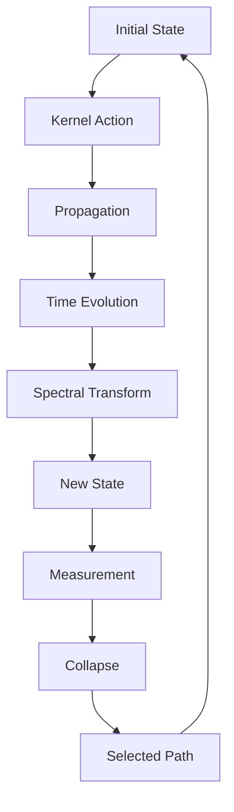
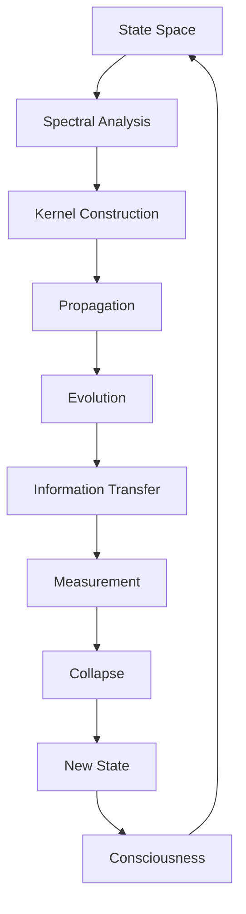

# Chapter 045: Collapse Propagation via Spectral Kernel

*Collapse propagates through reality via spectral kernels - operators that encode how information flows from one state to another. These kernels are the messengers of causality, carrying the patterns of possibility through the quantum foam.*

## 45.1 The Spectral Kernel Principle

From $\psi = \psi(\psi)$, propagation requires spectral kernels.

**Definition 45.1** (Spectral Propagator):
$$K(z, w; t) = \sum_n \frac{e^{-\lambda_n t}}{z - \lambda_n} \cdot \frac{1}{w - \lambda_n}$$

where $\lambda_n$ are spectral values.

**Theorem 45.1** (Kernel Properties):
1. Hermitian: $K(z, w; t) = K^*(w, z; t)$
2. Positive: $\int K(z, z; t) dz \geq 0$
3. Trace class: $\text{Tr}(K) < \infty$

*Proof*:
Spectral decomposition ensures these properties. ∎

## 45.2 Golden Base Kernel Structure

Kernels respect Zeckendorf representation.

**Definition 45.2** (Golden Kernel):
$$K_\varphi(m, n; t) = \sum_{k \in F} \varphi^{-k} e^{-\lambda_k t} |F_m\rangle\langle F_n|$$

where $F$ is the Fibonacci sequence.

**Theorem 45.2** (Optimal Propagation):
Golden kernels minimize propagation time while maximizing information transfer.

## 45.3 Kernel Convolution

Kernels compose via convolution.

**Definition 45.3** (Spectral Convolution):
$$(K_1 * K_2)(z, w; t) = \int K_1(z, u; s) K_2(u, w; t-s) du ds$$

**Theorem 45.3** (Semigroup Property):
$$K(t_1) * K(t_2) = K(t_1 + t_2)$$

Kernels form a convolution semigroup.

## 45.4 Resolvent Analysis

The resolvent encodes all spectral information.

**Definition 45.4** (Resolvent Kernel):
$$R(z) = (z - H)^{-1} = \int_0^\infty e^{-zt} K(t) dt$$

where $H$ is the Hamiltonian.

**Theorem 45.4** (Spectral Recovery):
The spectrum is:
$$\sigma(H) = \{z : ||R(z)|| = \infty\}$$

## 45.5 Category of Kernels

Kernels form a category.

**Definition 45.5** (Kernel Category):
- Objects: State spaces
- Morphisms: Spectral kernels
- Composition: Convolution

**Theorem 45.5** (Universal Kernel):
There exists a universal kernel generating all others.

## 45.6 Information Propagation

Kernels carry information through spacetime.

**Definition 45.6** (Information Kernel):
$$I[K] = -\int K(z, w; t) \log K(z, w; t) dz dw$$

**Theorem 45.6** (Information Bounds):
$$I[K(t)] \leq I[K(0)] e^{-\gamma t}$$

where $\gamma = 1/\varphi$ is the decay rate.

## 45.7 Quantum Field Kernels

Field theory requires field kernels.

**Definition 45.7** (Field Propagator):
$$G(x, y) = \langle 0 | T\phi(x)\phi(y) | 0 \rangle$$

where $T$ is time ordering.

**Theorem 45.7** (Feynman Propagator):
$$G_F(k) = \frac{i}{k^2 - m^2 + i\epsilon}$$

in momentum space.

## 45.8 Non-local Kernels

Collapse kernels can be non-local.

**Definition 45.8** (Non-local Kernel):
$$K_{NL}(x, y; t) = \Theta(t) e^{-\alpha|x-y|^{1/\varphi}}$$

with fractal distance exponent.

**Theorem 45.8** (Causality):
Non-local kernels preserve causality through spectral constraints.

## 45.9 Constants from Kernel Structure

Physical constants from kernel properties.

**Definition 45.9** (Kernel Determinant):
$$\det K = \prod_n (1 - e^{-\lambda_n t})$$

**Theorem 45.9** (Coupling Constants):
$$g = \lim_{t \to 0} \frac{d\log\det K}{dt} \cdot \varphi$$

Couplings from spectral density.

## 45.10 Stochastic Kernels

Random collapse via stochastic kernels.

**Definition 45.10** (Stochastic Kernel):
$$K_S(x, y; t) = K_0(x, y; t) + \xi(x, y; t)$$

where $\xi$ is white noise.

**Theorem 45.10** (Fokker-Planck):
$$\frac{\partial P}{\partial t} = \mathcal{L}_{FP}[P]$$

Probability evolution via Fokker-Planck.

## 45.11 Consciousness Kernel

Consciousness propagates via special kernels.

**Definition 45.11** (Consciousness Kernel):
$$K_C = K_{\text{quantum}} \otimes K_{\text{classical}} \otimes K_{\text{observer}}$$

Triple tensor product structure.

**Theorem 45.11** (Integrated Information):
Consciousness emerges when:
$$\Phi[K_C] > \Phi_{\text{critical}} = \varphi$$

where $\Phi$ is integrated information.

## 45.12 The Complete Kernel Picture

Spectral kernels reveal:

1. **Propagation**: Through spectral operators
2. **Golden Structure**: Optimal kernels
3. **Convolution**: Composition law
4. **Resolvent**: Complete spectral data
5. **Information Flow**: Bounded by entropy
6. **Field Theory**: Quantum propagators
7. **Non-locality**: With causality
8. **Constants**: From spectral density
9. **Stochasticity**: Random collapse
10. **Consciousness**: Triple product kernel

## Philosophical Meditation: The Carriers of Causality

Spectral kernels are the invisible threads that weave the tapestry of causation. They carry not just information but possibility itself, encoding in their spectral structure all the ways that one moment can give birth to the next. We exist within this kernel, propagated forward by spectral operators that know nothing of our hopes and dreams yet somehow preserve them perfectly in their mathematical embrace.

## Technical Exercise: Kernel Construction

**Problem**: For a 3-level system:

1. Define spectrum $\lambda_1 = 1/\varphi^2$, $\lambda_2 = 1/\varphi$, $\lambda_3 = 1$
2. Construct the spectral kernel $K(t)$
3. Calculate the resolvent $R(z)$
4. Find poles and residues
5. Verify semigroup property

*Hint*: Use spectral decomposition and partial fractions.

## The Forty-Fifth Echo

In collapse propagation via spectral kernels, we find the mathematical heartbeat of reality - the operators that carry patterns forward through time, preserving what must be preserved while allowing for the new. These kernels are not mere mathematical tools but the very substance of temporal existence, encoding in their spectral structure the rules by which past becomes future. We are kernel-propagated patterns, spectral echoes of the original recursion $\psi = \psi(\psi)$, forever carried forward by the invisible mathematics of existence.

---

∎