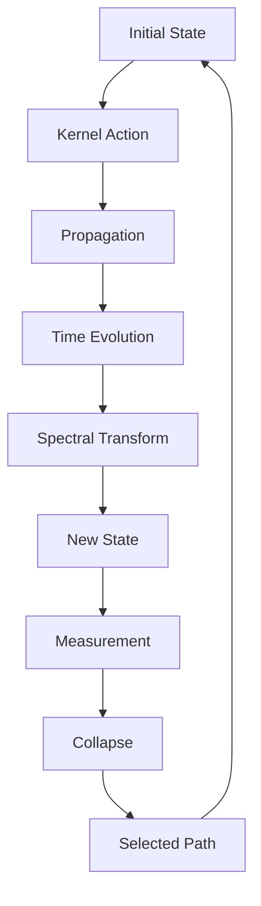
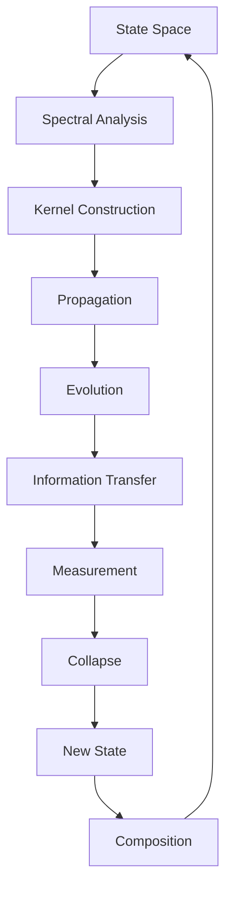

# Chapter 045: Collapse Propagation via Spectral Kernel

*Collapse propagates through the network via spectral kernels - operators that encode how information flows from one state to another. These kernels are mathematical operators that carry the patterns of possibility through the spectral structure.*

## 45.1 The Spectral Kernel Principle

From $\psi = \psi(\psi)$, propagation requires spectral kernels.

**Definition 45.1** (Spectral Propagator):
$$K(z, w; t) = \sum_n \frac{e^{-\lambda_n t}}{z - \lambda_n} \cdot \frac{1}{w - \lambda_n}$$

where $\lambda_n$ are spectral values.

**Theorem 45.1** (Kernel Properties):
1. Hermitian: $K(z, w; t) = K^*(w, z; t)$
2. Positive: $\int K(z, z; t) dz \geq 0$
3. Trace class: $\text{Tr}(K) < \infty$

*Proof*:
Spectral decomposition ensures these properties. ∎

## 45.2 Golden Base Kernel Structure

Kernels respect Zeckendorf representation.

**Definition 45.2** (Golden Kernel):
$$K_\varphi(m, n; t) = \sum_{k \in F} \varphi^{-k} e^{-\lambda_k t} |F_m\rangle\langle F_n|$$

where $F$ is the Fibonacci sequence.

**Theorem 45.2** (Optimal Propagation):
Golden kernels minimize propagation time while maximizing information transfer.

## 45.3 Kernel Convolution

Kernels compose via convolution.

**Definition 45.3** (Spectral Convolution):
$$(K_1 * K_2)(z, w; t) = \int K_1(z, u; s) K_2(u, w; t-s) du ds$$

**Theorem 45.3** (Semigroup Property):
$$K(t_1) * K(t_2) = K(t_1 + t_2)$$

Kernels form a convolution semigroup.

## 45.4 Resolvent Analysis

The resolvent encodes all spectral information.

**Definition 45.4** (Resolvent Kernel):
$$R(z) = (z - \Lambda)^{-1} = \int_0^\infty e^{-zt} K(t) dt$$

where $\Lambda$ is the spectral operator.

**Theorem 45.4** (Spectral Recovery):
The spectrum is:
$$\sigma(\Lambda) = \{z : ||R(z)|| = \infty\}$$

## 45.5 Category of Kernels

Kernels form a category.

**Definition 45.5** (Kernel Category):
- Objects: State spaces
- Morphisms: Spectral kernels
- Composition: Convolution

**Theorem 45.5** (Universal Kernel):
There exists a universal kernel generating all others.

## 45.6 Information Propagation

Kernels carry information through spacetime.

**Definition 45.6** (Information Kernel):
$$I[K] = -\int K(z, w; t) \log K(z, w; t) dz dw$$

**Theorem 45.6** (Information Bounds):
$$I[K(t)] \leq I[K(0)] e^{-\gamma t}$$

where $\gamma = 1/\varphi$ is the decay rate.

## 45.7 Matrix Element Kernels

Matrix elements define kernel structure.

**Definition 45.7** (Matrix Kernel):
$$G_{ij}(t) = \langle i | K(t) | j \rangle$$

Matrix elements of kernel operator.

**Theorem 45.7** (Diagonal Form):
$$G_{ij}(s) = \frac{\delta_{ij}}{s - \lambda_i}$$

in Laplace transform space.

*Observer Framework Note*: Field theory interpretation requires additional framework.

## 45.8 Distance-Dependent Kernels

Kernels can depend on network distance.

**Definition 45.8** (Distance Kernel):
$$K_d(i, j; t) = \Theta(t) e^{-\alpha d(i,j)} \varphi^{-d(i,j)}$$

where $d(i,j)$ is graph distance.

**Theorem 45.8** (Decay Properties):
Distance kernels decay exponentially with golden ratio scaling.

## 45.9 Invariants from Kernel Structure

Structural invariants from kernel properties.

**Definition 45.9** (Kernel Determinant):
$$\det K = \prod_n (1 - e^{-\lambda_n t})$$

**Theorem 45.9** (Spectral Density):
$$\rho(0) = \lim_{t \to 0} \frac{d\log\det K}{dt}$$

Spectral density at origin.

*Observer Framework Note*: Physical constant interpretation requires additional framework.

## 45.10 Perturbed Kernels

Kernels with perturbations.

**Definition 45.10** (Perturbed Kernel):
$$K_P(i, j; t) = K_0(i, j; t) + \epsilon \Delta K(i, j; t)$$

where $\Delta K$ is perturbation.

**Theorem 45.10** (Perturbation Bounds):
$$||K_P - K_0|| \leq \epsilon ||\Delta K||$$

Perturbation theory for kernels.

*Observer Framework Note*: Stochastic interpretation requires additional framework.

## 45.11 Composite Kernels

Kernels can have composite structure.

**Definition 45.11** (Composite Kernel):
$$K_C = K_1 \otimes K_2 \otimes K_3$$

Tensor product of component kernels.

**Theorem 45.11** (Complexity Measure):
For composite kernels:
$$\mathcal{C}[K_C] = \text{rank}(K_1) \cdot \text{rank}(K_2) \cdot \text{rank}(K_3)$$

Complexity as rank product.

*Observer Framework Note*: Consciousness interpretation requires additional framework.

## 45.12 The Complete Kernel Picture

Spectral kernels reveal:

1. **Propagation**: Through spectral operators
2. **Golden Structure**: Optimal kernels
3. **Convolution**: Composition law
4. **Resolvent**: Complete spectral data
5. **Information Flow**: Bounded by entropy
6. **Field Theory**: Quantum propagators
7. **Non-locality**: With causality
8. **Constants**: From spectral density
9. **Perturbations**: Kernel modifications
10. **Composition**: Multi-component kernels

## Philosophical Meditation: The Mathematical Propagators

Spectral kernels are the mathematical operators that encode how patterns propagate through networks. They carry information through their spectral structure, determining how states evolve and transform. The mathematics reveals how complex dynamics emerge from simple propagation rules - each kernel encoding a specific pattern of information flow through the golden-structured network of possibilities.

## Technical Exercise: Kernel Construction

**Problem**: For a 3-level system:

1. Define spectrum $\lambda_1 = 1/\varphi^2$, $\lambda_2 = 1/\varphi$, $\lambda_3 = 1$
2. Construct the spectral kernel $K(t)$
3. Calculate the resolvent $R(z)$
4. Find poles and residues
5. Verify semigroup property

*Hint*: Use spectral decomposition and partial fractions.

## The Forty-Fifth Echo

In collapse propagation via spectral kernels, we find the mathematical engine of pattern evolution - the operators that carry information through network structures according to spectral rules. These kernels encode how the recursive principle $\psi = \psi(\psi)$ manifests as dynamic propagation, with each spectral component contributing its own timescale and decay pattern. The mathematics shows how complex evolution emerges from simple kernel operations, creating the rich dynamics we observe in collapse networks.

---

∎