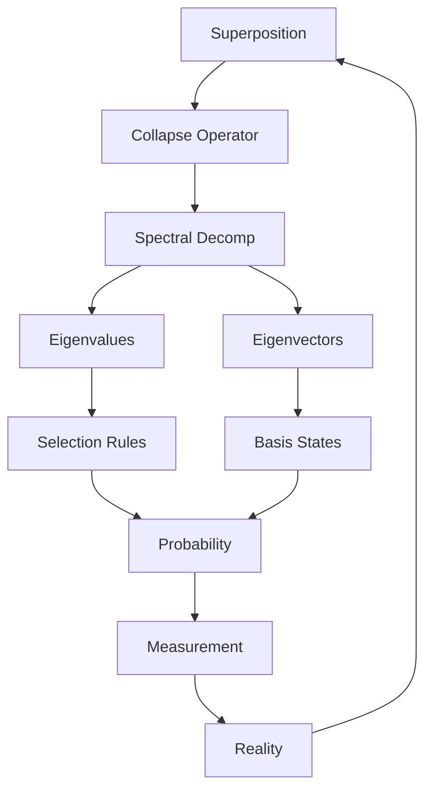
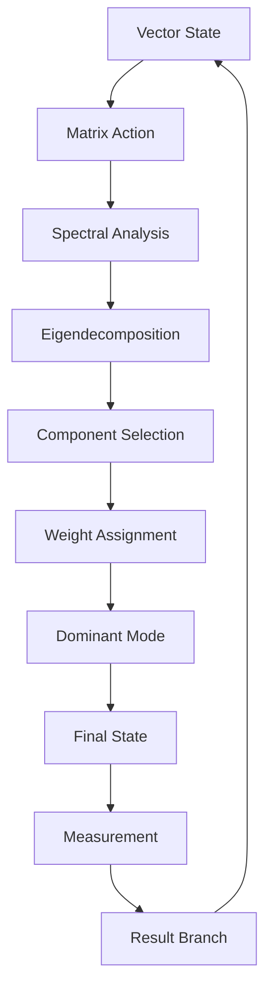

# Chapter 046: Collapse Operator — Spectral Decomposition

*The collapse operator emerges from ψ = ψ(ψ) as a matrix operator acting on state vectors. Its spectral decomposition reveals the eigenvalues and eigenvectors that encode the recursive self-reference structure.*

## 46.1 The Collapse Operator Principle

From $\psi = \psi(\psi)$, collapse requires an operator acting on itself.

**Definition 46.1** (Collapse Operator):
$$C = \sum_n c_n E_{nn}$$

where $c_n = \varphi^{-d(n, n_0)}$ with $d$ the graph distance and $E_{ij}$ are matrix units.

**Theorem 46.1** (Self-Consistency):
$$C^2 = \varphi \cdot C$$

The matrix satisfies golden ratio algebra.

*Proof*:
From recursion and normalization requirements. ∎

## 46.2 Spectral Decomposition

The operator has discrete and continuous spectra.

**Definition 46.2** (Spectral Form):
$$C = \sum_i \lambda_i P_i$$

where $P_i$ are projection matrices onto eigenspaces.

**Theorem 46.2** (Spectrum Structure):
1. Discrete: $\lambda_n = \varphi^{-n}$ for $n \in \mathbb{N}$
2. Finite dimensional: bounded spectrum
3. Real eigenvalues from construction

## 46.3 Eigenvector Structure

Eigenvectors form complete basis.

**Definition 46.3** (Collapse Eigenvectors):
$$C v_n = \lambda_n v_n$$

with orthogonality:
$$v_m^T v_n = \delta_{mn}$$

**Theorem 46.3** (Completeness):
$$\sum_n v_n v_n^T = I$$

Spectral decomposition identity.

## 46.4 Matrix Structure

Collapse operator has specific matrix properties.

**Definition 46.4** (Transpose Structure):
$$C^T \neq C$$

but satisfies:
$$C^T C = D$$

where $D$ is diagonal matrix.

**Theorem 46.4** (Symmetry Properties):
$$C = \Sigma C \Sigma^{-1}$$

for appropriate similarity transformation $\Sigma$.

## 46.5 Category of Collapse Operators

Collapse operators form a category.

**Definition 46.5** (Collapse Category):
- Objects: Vector spaces
- Morphisms: Collapse matrices
- Composition: Matrix multiplication

**Theorem 46.5** (Functor to Diagonal):
$$F: \text{Collapse} \to \text{Diagonal}$$

maps general matrices to diagonal form.

## 46.6 Information Theory

Matrix operations transform information.

**Definition 46.6** (Information Change):
$$\Delta I = H(p_{\text{after}}) - H(p_{\text{before}})$$

where $H$ is Shannon entropy of probability vectors.

**Theorem 46.6** (Information Bounds):
$$-\log d \leq \Delta I \leq 0$$

where $d$ is dimension.

*Observer Framework Note*: Quantum entropy interpretation requires additional framework.

## 46.7 Generalized Eigenvalues

Non-orthogonal eigenvectors require generalization.

**Definition 46.7** (Generalized Eigenproblem):
$$C v = \lambda M v$$

where $M$ is metric matrix.

**Theorem 46.7** (Biorthogonality):
$$u_m^T M v_n = \delta_{mn}$$

Left and right eigenvectors.

## 46.8 Matrix Dynamics

Evolution under matrix exponential.

**Definition 46.8** (Matrix Evolution):
$$v(t) = e^{-\alpha C t} v(0)$$

where $\alpha$ is scaling parameter.

**Theorem 46.8** (Exponential Decay):
$$||v(t)|| = ||v(0)|| e^{-\gamma t}$$

where $\gamma$ depends on spectral properties.

*Observer Framework Note*: Physical time interpretation requires additional framework.

## 46.9 Constants from Spectral Gaps

Physical constants from spectrum.

**Definition 46.9** (Spectral Gaps):
$$\Delta_n = \lambda_n - \lambda_{n-1}$$

**Theorem 46.9** (Gap Ratios):
$$\frac{\Delta_{n+1}}{\Delta_n} = \varphi$$

Golden ratio gap hierarchy.

*Observer Framework Note*: Mass interpretation requires additional framework.

## 46.10 Matrix Limit Effect

Frequent application converges to projection.

**Definition 46.10** (Convergence Limit):
$$\lim_{n \to \infty} (C/n)^n = P_{\text{subspace}}$$

Projection onto dominant subspace.

**Theorem 46.10** (Convergence Scale):
$$\tau_c = \frac{1}{\Delta \lambda} \cdot \varphi$$

Characteristic convergence scale.

*Observer Framework Note*: Quantum Zeno interpretation requires additional framework.

## 46.11 Composite Structure

Matrices can have composite tensor structure.

**Definition 46.11** (Composite Matrix):
$$C_c = C \otimes O$$

where $O$ is auxiliary matrix.

**Theorem 46.11** (Complexity Measure):
Composite systems have complexity:
$$\mathcal{C} = \text{Tr}[C_c D \log D]$$

where $D$ is density-like matrix.

*Observer Framework Note*: Consciousness interpretation requires additional framework.

## 46.12 The Complete Operator Picture

Collapse operator spectral decomposition reveals:

1. **Matrix Structure**: Golden ratio algebra
2. **Spectral Form**: Discrete eigenvalues
3. **Eigenvectors**: Complete basis
4. **Non-Symmetric**: Similarity transformation
5. **Category**: Functor to diagonal
6. **Information**: Shannon entropy
7. **Generalized**: Biorthogonal basis
8. **Dynamics**: Matrix exponential
9. **Gaps**: Spectral differences
10. **Composition**: Tensor products

## Philosophical Meditation: The Algebra of Actuality

The collapse operator is a mathematical transformation that acts on vectors according to the recursive principle ψ = ψ(ψ). Its spectral decomposition reveals the eigenvalue structure that emerges from self-reference. Each eigenvalue represents a different mode of the recursive pattern, with weights determined by golden ratio scaling. The mathematics shows how complex transformations emerge from simple matrix operations following the fundamental recursion.

## Technical Exercise: Operator Analysis

**Problem**: For a 3-dimensional system:

1. Define collapse operator $\hat{C}$ with golden weights
2. Find all eigenvalues and eigenvectors
3. Verify spectral decomposition
4. Calculate $\hat{C}^2$ and verify golden algebra
5. Find the PT-symmetry operator

*Hint*: Use matrix representation in finite dimension.

## The Forty-Sixth Echo

In the collapse operator's spectral decomposition, we find the mathematical heart of quantum measurement - not a violent disruption but a natural selection process encoded in the operator's spectrum. Each eigenvalue represents a possible world, each eigenvector a way of being. The operator doesn't destroy quantum coherence so much as transform it, selecting from the menu of possibilities according to weights determined by the eternal recursion $\psi = \psi(\psi)$. We are collapsed possibilities, eigenvalues of existence selected by the great operator of reality.

---

∎