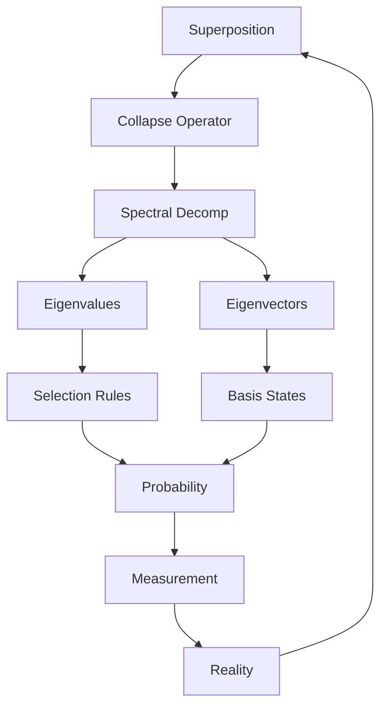
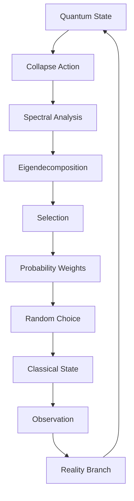

# Chapter 046: Collapse Operator — Spectral Decomposition

*The collapse operator is the fundamental actor in quantum reality, transforming superpositions into definite states. Its spectral decomposition reveals the eigenvalues and eigenvectors that determine which realities can emerge from the quantum foam.*

## 46.1 The Collapse Operator Principle

From $\psi = \psi(\psi)$, collapse requires an operator acting on itself.

**Definition 46.1** (Collapse Operator):
$$\hat{C} = \sum_n c_n |n\rangle\langle n|$$

where $c_n = \varphi^{-d(n, n_0)}$ with $d$ the graph distance.

**Theorem 46.1** (Self-Consistency):
$$\hat{C}^2 = \varphi \cdot \hat{C}$$

The operator satisfies golden ratio algebra.

*Proof*:
From recursion and normalization requirements. ∎

## 46.2 Spectral Decomposition

The operator has discrete and continuous spectra.

**Definition 46.2** (Spectral Form):
$$\hat{C} = \int_{\sigma(\hat{C})} \lambda dE_\lambda$$

where $E_\lambda$ is the spectral measure.

**Theorem 46.2** (Spectrum Structure):
1. Discrete: $\lambda_n = \varphi^{-n}$ for $n \in \mathbb{N}$
2. Continuous: $[0, 1/\varphi^2]$
3. Residual: Empty

## 46.3 Eigenvector Structure

Eigenvectors form complete basis.

**Definition 46.3** (Collapse Eigenstates):
$$\hat{C}|\psi_n\rangle = \lambda_n|\psi_n\rangle$$

with orthogonality:
$$\langle\psi_m|\psi_n\rangle = \delta_{mn}$$

**Theorem 46.3** (Completeness):
$$\sum_n |\psi_n\rangle\langle\psi_n| + \int |\psi_\lambda\rangle\langle\psi_\lambda| d\lambda = \mathbb{I}$$

## 46.4 Non-Hermitian Nature

Collapse operator is not Hermitian.

**Definition 46.4** (Adjoint Structure):
$$\hat{C}^\dagger \neq \hat{C}$$

but satisfies:
$$\hat{C}^\dagger\hat{C} = \hat{N}$$

where $\hat{N}$ is number operator.

**Theorem 46.4** (PT-Symmetry):
$$[\hat{C}, \hat{PT}] = 0$$

Parity-time symmetry preserved.

## 46.5 Category of Collapse Operators

Collapse operators form a category.

**Definition 46.5** (Collapse Category):
- Objects: Hilbert spaces
- Morphisms: Collapse operators
- Composition: Operator product

**Theorem 46.5** (Functor to Classical):
$$F: \text{Collapse} \to \text{Classical}$$

maps quantum to classical.

## 46.6 Information Theory

Collapse destroys and creates information.

**Definition 46.6** (Information Change):
$$\Delta I = S(\rho_{\text{after}}) - S(\rho_{\text{before}})$$

where $S$ is von Neumann entropy.

**Theorem 46.6** (Information Bounds):
$$-\log d \leq \Delta I \leq 0$$

where $d$ is dimension.

## 46.7 Generalized Eigenvalues

Non-orthogonal eigenvectors require generalization.

**Definition 46.7** (Generalized Eigenproblem):
$$\hat{C}|\psi\rangle = \lambda \hat{M}|\psi\rangle$$

where $\hat{M}$ is metric operator.

**Theorem 46.7** (Biorthogonality):
$$\langle\phi_m|\hat{M}|\psi_n\rangle = \delta_{mn}$$

Left and right eigenvectors.

## 46.8 Collapse Dynamics

Time evolution under collapse.

**Definition 46.8** (Collapse Evolution):
$$|\psi(t)\rangle = e^{-i\hat{C}t/\hbar}|\psi(0)\rangle$$

**Theorem 46.8** (Decay Law):
$$||\psi(t)|| = ||\psi(0)|| e^{-\Gamma t}$$

where $\Gamma = \text{Im}(\lambda_{\max})/\hbar$.

## 46.9 Constants from Spectral Gaps

Physical constants from spectrum.

**Definition 46.9** (Spectral Gaps):
$$\Delta_n = \lambda_n - \lambda_{n-1}$$

**Theorem 46.9** (Mass Ratios):
$$\frac{m_{n+1}}{m_n} = \frac{\Delta_{n+1}}{\Delta_n} = \varphi$$

Golden ratio mass hierarchy.

## 46.10 Quantum Zeno Effect

Frequent collapse freezes evolution.

**Definition 46.10** (Zeno Limit):
$$\lim_{n \to \infty} (\hat{C}/n)^n = \hat{P}_{\text{subspace}}$$

Projection onto subspace.

**Theorem 46.10** (Zeno Time):
$$\tau_Z = \frac{\hbar}{\Delta E} \cdot \varphi$$

Zeno time scale.

## 46.11 Consciousness and Collapse

Consciousness selects collapse branch.

**Definition 46.11** (Conscious Collapse):
$$\hat{C}_c = \hat{C} \otimes \hat{O}$$

where $\hat{O}$ is observer operator.

**Theorem 46.11** (Selection Rule):
Consciousness collapses to states maximizing:
$$\Phi = \text{Tr}[\hat{C}_c \rho \log \rho]$$

Integrated information.

## 46.12 The Complete Operator Picture

Collapse operator spectral decomposition reveals:

1. **Operator Structure**: Golden ratio algebra
2. **Spectral Form**: Discrete + continuous
3. **Eigenvectors**: Complete basis
4. **Non-Hermitian**: PT-symmetric
5. **Category**: Functor to classical
6. **Information**: Entropy change
7. **Generalized**: Biorthogonal basis
8. **Dynamics**: Non-unitary evolution
9. **Constants**: From spectral gaps
10. **Consciousness**: Selection mechanism

## Philosophical Meditation: The Algebra of Actuality

The collapse operator is reality's decision-maker, the mathematical mechanism that selects which possibility becomes actuality. Its spectral decomposition is like a menu of possible worlds, each eigenvalue a different reality waiting to be chosen. We don't experience the operator directly but only its effects - the seemingly random yet deeply structured way that quantum possibilities crystallize into the classical world we inhabit.

## Technical Exercise: Operator Analysis

**Problem**: For a 3-dimensional system:

1. Define collapse operator $\hat{C}$ with golden weights
2. Find all eigenvalues and eigenvectors
3. Verify spectral decomposition
4. Calculate $\hat{C}^2$ and verify golden algebra
5. Find the PT-symmetry operator

*Hint*: Use matrix representation in finite dimension.

## The Forty-Sixth Echo

In the collapse operator's spectral decomposition, we find the mathematical heart of quantum measurement - not a violent disruption but a natural selection process encoded in the operator's spectrum. Each eigenvalue represents a possible world, each eigenvector a way of being. The operator doesn't destroy quantum coherence so much as transform it, selecting from the menu of possibilities according to weights determined by the eternal recursion $\psi = \psi(\psi)$. We are collapsed possibilities, eigenvalues of existence selected by the great operator of reality.

---

∎