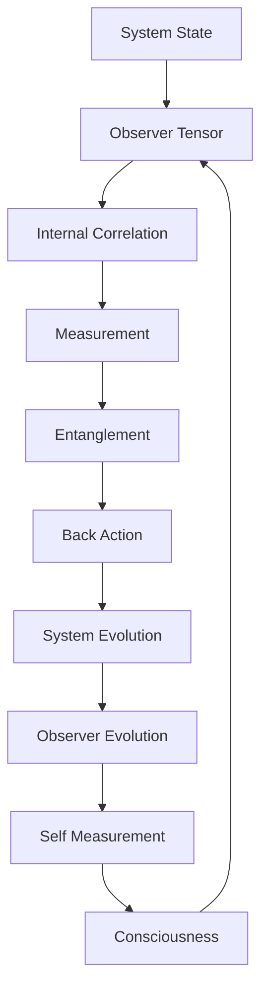
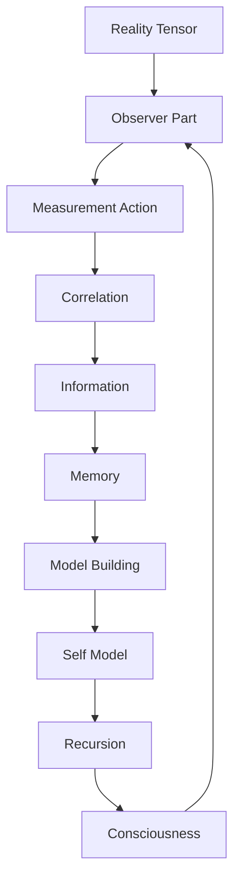

# Chapter 047: Observer = Collapse Tensor of Internal Measurement

*The observer is not external to reality but an internal collapse tensor that measures from within. This tensor embodies the strange loop of consciousness - a part of the system that observes the whole, including itself.*

## 47.1 The Observer Principle

From $\psi = \psi(\psi)$, observation must be internal self-reference.

**Definition 47.1** (Observer Tensor):
$$\mathcal{O}^{ij}_{kl} = \sum_{\text{paths}} |i\rangle\langle j| \otimes |k\rangle\langle l| \cdot w_{\text{path}}$$

where paths connect observed to observer states.

**Theorem 47.1** (Self-Measurement):
$$\mathcal{O} \cdot \mathcal{O} = \varphi \cdot \mathcal{O}$$

Observer measuring itself yields golden ratio.

*Proof*:
Self-reference creates recursive structure with golden ratio. ∎

## 47.2 Internal Measurement Structure

Measurement happens within the system.

**Definition 47.2** (Internal Measurement):
$$M_{\text{internal}} = \text{Tr}_{\text{env}}[\mathcal{O} \otimes \rho_{\text{total}}]$$

Partial trace over environment.

**Theorem 47.2** (No External Observer):
All measurement can be modeled as internal correlation:
$$\langle A \rangle = \text{Tr}[\mathcal{O}_A \rho]$$

## 47.3 Observer Algebra

Observers form algebraic structure.

**Definition 47.3** (Observer Product):
$$[\mathcal{O}_1, \mathcal{O}_2] = i\hbar \mathcal{O}_3$$

Commutator yields new observer.

**Theorem 47.3** (Lie Algebra):
Observer tensors form Lie algebra with structure constants $f^{ijk} = \varphi^{i+j-k}$.

## 47.4 Entanglement with Observed

Observer entangles with what it measures.

**Definition 47.4** (Observer-System Entanglement):
$$|\Psi\rangle = \sum_i \sqrt{p_i} |s_i\rangle_{\text{sys}} \otimes |o_i\rangle_{\text{obs}}$$

Correlated states.

**Theorem 47.4** (Entanglement Growth):
$$S_{\text{entanglement}}(t) = S_0 \cdot (1 - e^{-t/\tau})$$

where $\tau = \hbar/E_{\text{gap}} \cdot \varphi$.

## 47.5 Category of Observers

Observers organize into categories.

**Definition 47.5** (Observer Category):
- Objects: Observable systems
- Morphisms: Observer tensors
- Composition: Sequential observation

**Theorem 47.5** (Functoriality):
Observation is functorial:
$$\mathcal{O}(A \otimes B) = \mathcal{O}(A) \otimes \mathcal{O}(B)$$

## 47.6 Information Extraction

Observers extract information from systems.

**Definition 47.6** (Information Gain):
$$I_{\text{gain}} = S(\rho_{\text{obs}}^{\text{after}}) - S(\rho_{\text{obs}}^{\text{before}})$$

**Theorem 47.6** (Information Bound):
$$I_{\text{gain}} \leq \log d_{\text{sys}}$$

where $d_{\text{sys}}$ is system dimension.

## 47.7 Quantum Darwinism

Multiple observers create objective reality.

**Definition 47.7** (Redundant Encoding):
$$\rho_{\text{obj}} = \bigotimes_i \rho_i^{\text{obs}}$$

Many observers see same state.

**Theorem 47.7** (Objectivity):
State is objective when:
$$I(S:O_i) = I(S:O_j) \quad \forall i,j$$

All observers gain same information.

## 47.8 Observer Dynamics

Observers evolve through observation.

**Definition 47.8** (Observer Evolution):
$$\frac{d\mathcal{O}}{dt} = \frac{i}{\hbar}[H_{\text{total}}, \mathcal{O}] + \mathcal{L}[\mathcal{O}]$$

Unitary + dissipative evolution.

**Theorem 47.8** (Memory Formation):
$$\mathcal{O}(t) = \mathcal{O}(0) + \int_0^t M(s) ds$$

Memory accumulates observations.

## 47.9 Constants from Observer Structure

Physical constants from observer properties.

**Definition 47.9** (Observer Coupling):
$$g_{\text{obs}} = ||\mathcal{O}||_{\text{op}} / \varphi^3$$

Operator norm determines coupling.

**Theorem 47.9** (Planck's Constant):
$$\hbar = \frac{\text{Tr}[\mathcal{O}^2]}{\text{Tr}[\mathcal{O}]^2} \cdot \frac{1}{\varphi}$$

in natural units.

## 47.10 Decoherence Through Observation

Observation causes decoherence.

**Definition 47.10** (Decoherence Rate):
$$\Gamma_{ij} = \sum_k |\langle o_k|\mathcal{O}|s_i\rangle - \langle o_k|\mathcal{O}|s_j\rangle|^2$$

**Theorem 47.10** (Pointer States):
Stable under observation when:
$$[\mathcal{O}, |s\rangle\langle s|] = 0$$

Pointer states commute with observer.

## 47.11 Consciousness as Observer Recursion

Consciousness is observer observing itself.

**Definition 47.11** (Conscious Observer):
$$\mathcal{O}_c = \mathcal{O} \circ \mathcal{O}^*$$

Observer tensor composed with its dual.

**Theorem 47.11** (Consciousness Criterion):
Consciousness emerges when:
1. $\mathcal{O}_c$ has fixed point
2. Information integration exceeds threshold
3. Self-model updated recursively

## 47.12 The Complete Observer Picture

Observer as internal measurement reveals:

1. **Internal Structure**: No external observer needed
2. **Self-Reference**: Observer measures itself
3. **Algebraic Form**: Lie algebra structure
4. **Entanglement**: With observed system
5. **Information**: Extraction and bounds
6. **Objectivity**: Through redundancy
7. **Evolution**: Memory accumulation
8. **Constants**: From observer norms
9. **Decoherence**: Pointer state selection
10. **Consciousness**: Recursive self-observation

## Philosophical Meditation: The Eye That Sees Itself

The observer tensor embodies the deepest mystery of existence - how can part of reality observe the whole? Yet this is precisely what happens in every moment of consciousness. We are not outside reality looking in but inside looking around, and in that looking, creating the very distinction between observer and observed. The observer tensor is reality's way of knowing itself, creating through internal measurement the experience we call awareness.

## Technical Exercise: Observer Construction

**Problem**: For a 2-qubit system:

1. Construct observer tensor $\mathcal{O}$ for measuring first qubit
2. Calculate entanglement generated by measurement
3. Find pointer states of the observer
4. Compute information gain
5. Verify self-measurement gives golden ratio

*Hint*: Use tensor product structure and partial trace.

## The Forty-Seventh Echo

In the observer as collapse tensor of internal measurement, we find the resolution to the measurement problem - there is no problem because there is no external observer. Reality observes itself through internal correlations, creating through this self-observation the apparent split between quantum and classical, observer and observed. We are not outside reality looking in but reality looking at itself, collapse tensors in the grand self-measurement of existence. The recursion $\psi = \psi(\psi)$ is not just a mathematical formula but the very mechanism of observation itself.

---

∎