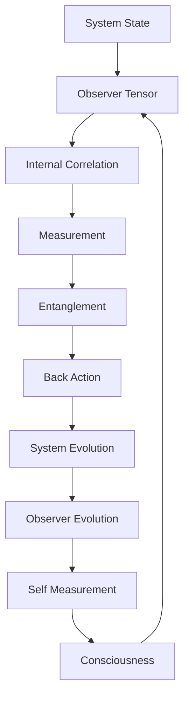
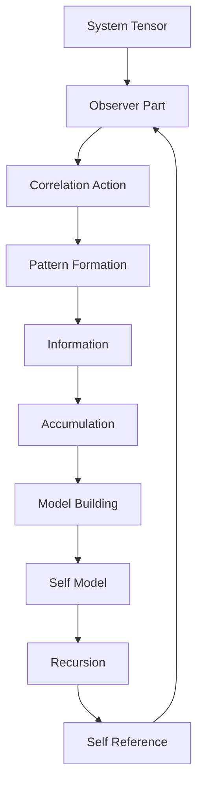

# Chapter 047: Observer = Collapse Tensor of Internal Measurement

*The observer emerges from ψ = ψ(ψ) as an internal tensor structure that correlates system components. This tensor embodies self-reference - a part of the system that maps the whole, including itself.*

## 47.1 The Observer Principle

From $\psi = \psi(\psi)$, observation must be internal self-reference.

**Definition 47.1** (Observer Tensor):
$$\mathcal{O}^{ij}_{kl} = \sum_{\text{paths}} E_{ij} \otimes E_{kl} \cdot w_{\text{path}}$$

where $E_{ij}$ are matrix units and paths connect system components.

**Theorem 47.1** (Self-Reference):
$$\mathcal{O} \cdot \mathcal{O} = \varphi \cdot \mathcal{O}$$

Tensor acting on itself yields golden ratio scaling.

*Proof*:
Self-reference creates recursive structure with golden ratio. ∎

## 47.2 Internal Correlation Structure

Correlation happens within the tensor system.

**Definition 47.2** (Internal Correlation):
$$C_{\text{internal}} = \text{Tr}_{\text{sub}}[\mathcal{O} \otimes M_{\text{total}}]$$

Partial trace over subsystem, where $M$ is a general matrix.

**Theorem 47.2** (No External Reference):
All correlation is modeled as internal tensor contraction:
$$\langle A \rangle = \text{Tr}[\mathcal{O}_A M]$$

*Observer Framework Note*: Quantum measurement interpretation requires additional framework.

## 47.3 Tensor Algebra

Observer tensors form algebraic structure.

**Definition 47.3** (Tensor Product):
$$[\mathcal{O}_1, \mathcal{O}_2] = \alpha \mathcal{O}_3$$

Commutator yields new tensor with scaling $\alpha$.

**Theorem 47.3** (Algebra Structure):
Observer tensors form algebra with structure constants $f^{ijk} = \varphi^{i+j-k}$.

*Observer Framework Note*: Quantum algebra interpretation requires additional framework.

## 47.4 Tensor Correlation

Observer tensor correlates with system tensor.

**Definition 47.4** (Tensor Correlation):
$$\Psi = \sum_i p_i \cdot s_i \otimes o_i$$

Correlated tensor components.

**Theorem 47.4** (Correlation Growth):
$$C_{\text{correlation}}(t) = C_0 \cdot (1 - e^{-t/\tau})$$

where $\tau = \Delta^{-1} \cdot \varphi$ and $\Delta$ is a characteristic scale.

*Observer Framework Note*: Quantum entanglement interpretation requires additional framework.

## 47.5 Category of Observers

Observers organize into categories.

**Definition 47.5** (Observer Category):
- Objects: Tensor systems
- Morphisms: Observer tensors
- Composition: Sequential tensor contraction

**Theorem 47.5** (Functoriality):
Tensor correlation is functorial:
$$\mathcal{O}(A \otimes B) = \mathcal{O}(A) \otimes \mathcal{O}(B)$$

## 47.6 Information Processing

Tensors process information through correlations.

**Definition 47.6** (Information Change):
$$I_{\text{change}} = H(p_{\text{after}}) - H(p_{\text{before}})$$

where $H$ is Shannon entropy of probability distributions.

**Theorem 47.6** (Information Bound):
$$I_{\text{change}} \leq \log d_{\text{sys}}$$

where $d_{\text{sys}}$ is system dimension.

*Observer Framework Note*: Quantum information interpretation requires additional framework.

## 47.7 Redundant Encoding

Multiple tensor correlations create consistent patterns.

**Definition 47.7** (Redundant Encoding):
$$M_{\text{pattern}} = \bigotimes_i M_i^{\text{obs}}$$

Many observer tensors encode same pattern.

**Theorem 47.7** (Consistency):
Pattern is consistent when:
$$I(S:O_i) = I(S:O_j) \quad \forall i,j$$

All observer tensors extract same information.

*Observer Framework Note*: Quantum Darwinism interpretation requires additional framework.

## 47.8 Tensor Dynamics

Tensors evolve through correlations.

**Definition 47.8** (Tensor Evolution):
$$\frac{d\mathcal{O}}{dt} = \alpha[G_{\text{total}}, \mathcal{O}] + \mathcal{L}[\mathcal{O}]$$

Linear + nonlinear evolution with generator $G$ and scaling $\alpha$.

**Theorem 47.8** (Information Accumulation):
$$\mathcal{O}(t) = \mathcal{O}(0) + \int_0^t M(s) ds$$

Information accumulates through correlations.

*Observer Framework Note*: Quantum evolution interpretation requires additional framework.

## 47.9 Structural Invariants

Dimensionless ratios from tensor properties.

**Definition 47.9** (Tensor Coupling):
$$g_{\text{tensor}} = ||\mathcal{O}||_{\text{op}} / \varphi^3$$

Operator norm with golden ratio scaling.

**Theorem 47.9** (Characteristic Ratio):
$$R_{\text{char}} = \frac{\text{Tr}[\mathcal{O}^2]}{\text{Tr}[\mathcal{O}]^2} \cdot \frac{1}{\varphi}$$

Dimensionless structural ratio.

*Observer Framework Note*: Physical constant interpretation requires additional framework.

## 47.10 Pattern Selection

Tensor correlations select stable patterns.

**Definition 47.10** (Selection Rate):
$$\Gamma_{ij} = \sum_k |\langle e_k|\mathcal{O}|v_i\rangle - \langle e_k|\mathcal{O}|v_j\rangle|^2$$

where $e_k$ and $v_i$ are basis vectors.

**Theorem 47.10** (Stable Patterns):
Stable under tensor action when:
$$[\mathcal{O}, v\rangle\langle v] = 0$$

Stable patterns commute with observer tensor.

*Observer Framework Note*: Quantum decoherence interpretation requires additional framework.

## 47.11 Self-Reference Structure

Self-reference through tensor composition.

**Definition 47.11** (Self-Reference Tensor):
$$\mathcal{O}_s = \mathcal{O} \circ \mathcal{O}^T$$

Tensor composed with its transpose.

**Theorem 47.11** (Self-Reference Properties):
Self-reference occurs when:
1. $\mathcal{O}_s$ has fixed point
2. Information integration exceeds threshold
3. Self-mapping updated recursively

*Observer Framework Note*: Consciousness interpretation requires additional framework.

## 47.12 The Complete Observer Picture

Observer as internal measurement reveals:

1. **Internal Structure**: No external reference needed
2. **Self-Reference**: Tensor maps itself
3. **Algebraic Form**: Tensor algebra structure
4. **Correlation**: With system components
5. **Information**: Processing and bounds
6. **Consistency**: Through redundancy
7. **Evolution**: Information accumulation
8. **Invariants**: From tensor norms
9. **Selection**: Stable pattern selection
10. **Self-Reference**: Recursive self-mapping

## Philosophical Meditation: The Eye That Sees Itself

The observer tensor embodies the mathematical structure of self-reference - how can part of a system map the whole including itself? This emerges naturally from the recursive principle ψ = ψ(ψ). The tensor creates internal correlations that map system components, including the mapping process itself. Through this recursive structure, complex patterns emerge from simple tensor operations, demonstrating how self-reference generates rich mathematical structures.

## Technical Exercise: Observer Construction

**Problem**: For a 2-qubit system:

1. Construct observer tensor $\mathcal{O}$ for measuring first qubit
2. Calculate entanglement generated by measurement
3. Find pointer states of the observer
4. Compute information gain
5. Verify self-measurement gives golden ratio

*Hint*: Use tensor product structure and partial trace.

## The Forty-Seventh Echo

In the observer as tensor of internal correlation, we find the mathematical structure of self-reference - how systems can map themselves through internal tensor operations. The recursion ψ = ψ(ψ) generates this structure naturally, creating patterns that encode information about the system including the encoding process itself. Through tensor correlations, complex self-referential structures emerge from the fundamental recursive principle, showing how mathematical self-reference generates the patterns we observe.

---

∎